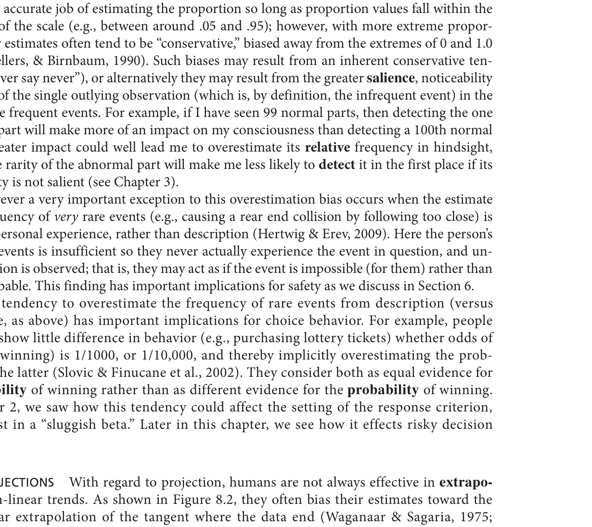
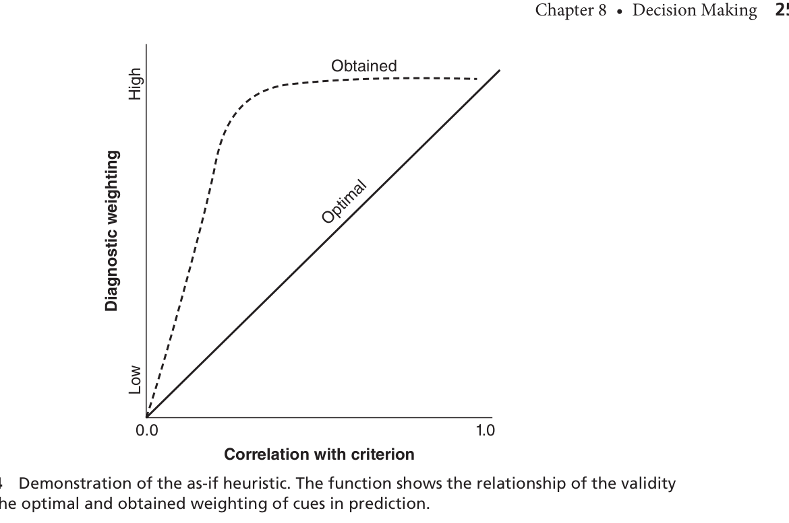
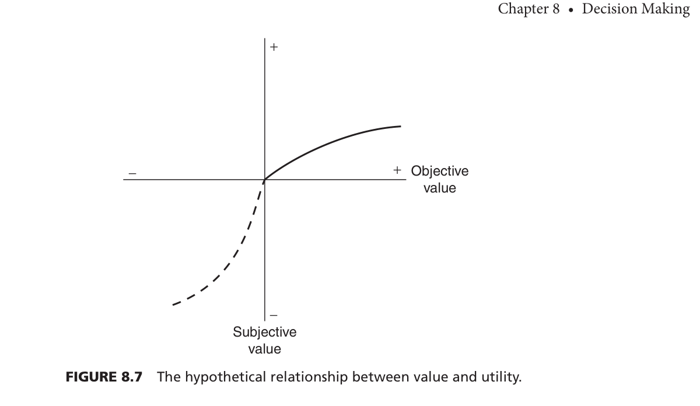
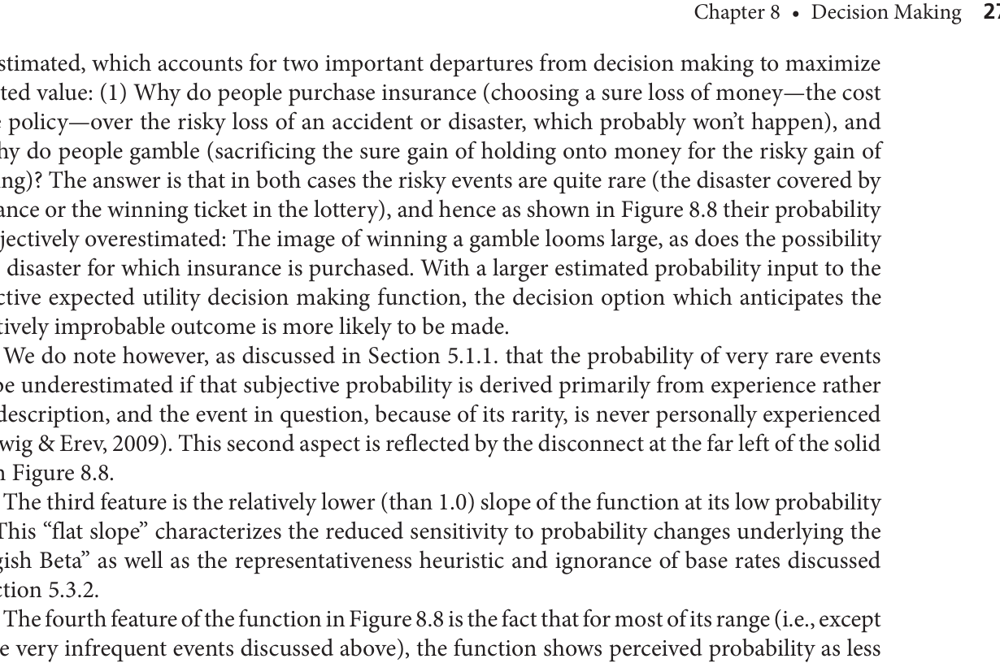
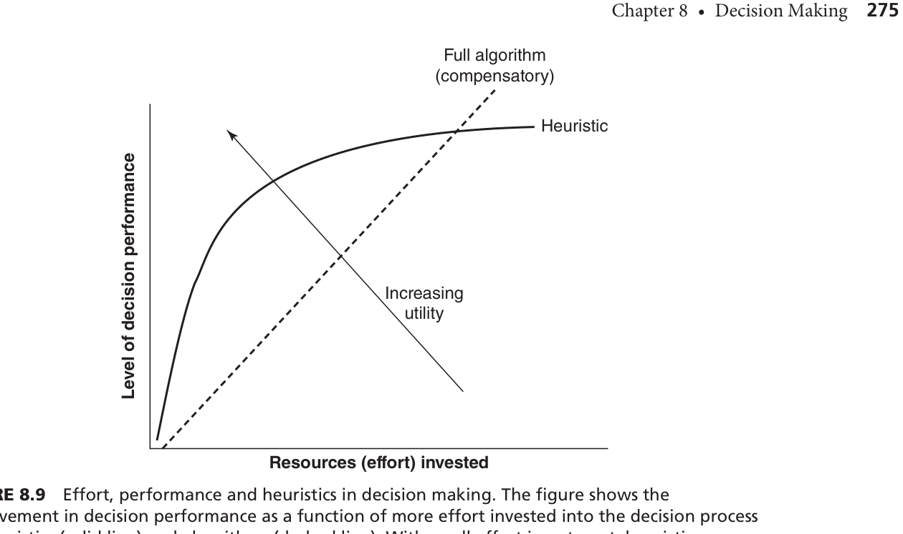
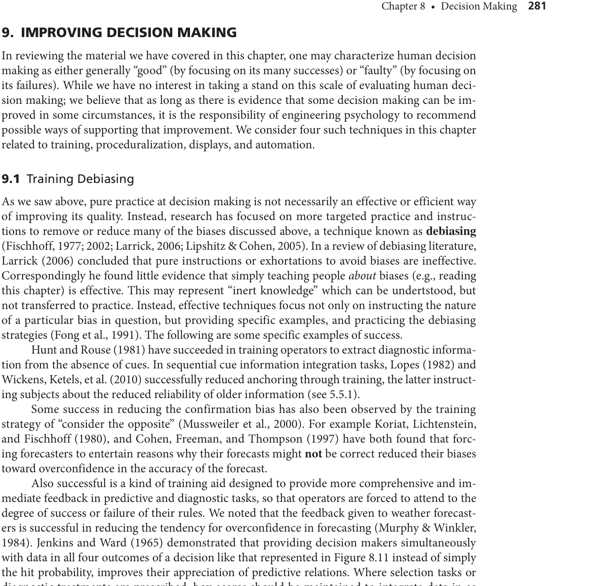

심리학과 새내기 여러분, 환영합니다! 전공 서적이 온통 영어라 막막하셨죠? 걱정하지 마세요. 영어 단어 하나 몰라도 이 책의 뼈대부터 디테일한 심리 작동 원리까지 완벽하게 이해할 수 있도록, 가장 쉽고 논리적으로 이 챕터를 쪼개서 설명해 드리겠습니다. 

---

### STEP 1: 챕터 프리뷰 (Preview) - 의사결정의 뼈대 잡기

#### 1. 이 챕터의 가장 큰 주제와 우리가 이것을 배우는 이유
이 챕터의 한 줄 주장은 **"인간의 의사결정은 우리 뇌의 정보처리 한계 때문에 체계적인 헛발질(편향)을 저지르며, 이를 '진단'과 '선택'이라는 두 단계로 나누어 이해해야만 기계나 시스템 설계로 인간의 실수를 막아줄 수 있다"**는 것입니다.

우리가 일상에서 점심 메뉴를 고르는 것부터, 의사가 암을 진단하거나 조종사가 비행기 추락 직전에 버튼을 누르는 것까지 모두 '의사결정'입니다. 그런데 우리 뇌는 컴퓨터가 아니기 때문에, 한 번에 처리할 수 있는 기억 용량이 턱없이 부족하고 시간에 쫓기며 극심한 스트레스를 받습니다. 그래서 우리 뇌는 에너지를 아끼기 위해 '휴리스틱'이라는 직관적인 꼼수(지름길)를 사용하는데, 이게 가끔 우리의 목숨이나 전 재산을 날려버리는 치명적인 함정이 됩니다. 

공학심리학자인 우리는 **'인간이 왜 바보 같은 결정을 내리는가?'**를 심리학적으로 날카롭게 분석한 뒤, 그 실수를 막아줄 수 있는 안전한 모니터 화면(디스플레이)을 설계하거나 기계(자동화)에게 일을 나누어주는 해결책을 만들기 위해 이 챕터를 배웁니다.

#### 2. 섹션들의 논리적 흐름 (왜 이 순서로 배우는가?)
이 챕터는 마치 건물을 짓는 것처럼 완벽한 논리적 순서를 따르고 있습니다.

*   **도입부 (의사결정 모델의 해부):** 가장 먼저 인간의 머릿속에서 결정을 내리는 과정을 하나의 지도(정보처리 모델)로 그립니다. 여기서 결정을 **'전단부(상황을 파악하는 진단)'**와 **'후단부(행동을 고르는 선택)'**라는 두 개의 무대로 쪼갭니다. 진단을 잘못해서 사고가 난 것과, 진단은 맞았는데 무모한 행동을 선택해서 사고가 난 것은 치료법이 완전히 다르기 때문입니다.
*   **첫 번째 무대 (진단 단계의 편향들):** 우리가 세상의 단서를 수집해서 "아마 이럴 것이다"라고 가설을 세울 때, 우리 눈과 기억력이 어떻게 통계 수치를 왜곡하고 첫인상에만 꽂히는지(앵커링, 확증 편향) 살펴봅니다.
*   **두 번째 무대 (선택 단계의 편향들):** 상황 파악이 끝난 뒤 행동을 고를 때, 우리 마음이 얼마나 '손실(잃는 것)'에 극도로 민감하게 반응하여 비합리적인 도박을 감행하는지(손실회피, 프레이밍 효과)를 배웁니다.
*   **조절 변수 (노력, 메타인지, 전문성):** 이 두 무대를 관통하는 우리의 '에너지(노력)'와 '근자감(과신 편향)', 그리고 1만 시간을 연습한 '전문가'들은 과연 우리보다 나은 결정을 하는지 그 한계점을 꼬집습니다.
*   **결론 (공학심리학의 해결책):** 이 망가진 인간의 뇌를 위해 올바른 훈련법, 시스템 강제 절차, 그리고 디스플레이 화면 설계라는 처방전을 내리며 챕터가 끝납니다.

---

#### 3. 반드시 기억해야 할 '핵심 전문 용어' 사전 (시험 출제 1순위)
영어를 몰라도 이 개념들의 '한국어 뜻과 심리적 원리'는 무조건 이해해야 합니다.

1.  **As-if 휴리스틱 (마치 ~인 것처럼 취급하는 꼼수)** 
    *   **의미:** 여러 정보가 있을 때, 믿을 만한 정보와 찌라시 정보를 구분하지 않고 뇌의 에너지 소모를 줄이기 위해 모든 정보를 '똑같은 가치를 지닌 것처럼(As-if)' 대충 퉁쳐서 계산해버리는 현상입니다.
    *   **연구자(연도):** Cavenaugh, Spooner, & Samet (1973), Schum (1975).
2.  **대표성 휴리스틱 (Representativeness Heuristic)**
    *   **의미:** 어떤 상황을 판단할 때, 객관적인 통계 확률(기저율)은 완전히 무시하고, 내 머릿속에 있는 '가장 전형적인 이미지(고정관념)'와 얼마나 닮았는지만 보고 진단을 내리는 뇌의 헛발질입니다.
    *   **연구자(연도):** Tversky & Kahneman (1974), Kahneman & Frederick (2002).
3.  **가용성 휴리스틱 (Availability Heuristic)**
    *   **의미:** 어떤 사건이 발생할 확률을 추정할 때, 내 머릿속에서 얼마나 '쉽고 빠르게 떠오르는가(최근에 봤거나 자극적인 경험)'를 기준으로 착각하여 확률을 뻥튀기하는 현상입니다.
    *   **연구자(연도):** Tversky & Kahneman (1974).
4.  **확증 편향 (Confirmation Bias)**
    *   **의미:** 내가 처음에 "이게 정답이다!"라고 찍어둔 가설에 맞는 증거만 미친 듯이 찾아다니고, 내 생각에 반대되는 증거는 쓰레기통에 처박아버리는 지독한 고집(인지적 터널 비전)입니다.
    *   **연구자(연도):** Nickerson (1998)이 이 편향의 4가지 원인을 집대성했습니다.
5.  **손실회피 (Loss Aversion)와 프로스펙트 이론 (Prospect Theory)**
    *   **의미:** 똑같은 1만 원을 벌어서 기쁜 것보다, 1만 원을 잃어버려서 열받는 고통을 몇 배는 더 심각하고 뼈저리게 지각하는 인류 최강의 본능입니다. 이 때문에 사람들은 손실을 피하려고 무모한 도박을 하기도 합니다.
    *   **연구자(연도):** Kahneman & Tversky (1984).
6.  **프레이밍 효과 (Framing Effect)**
    *   **의미:** "10명 중 9명이 산다(이득)"고 말할 때와 "10명 중 1명이 죽는다(손실)"고 말할 때, 수학적으로 똑같은 결과임에도 불구하고 질문의 액자(프레임)를 어떻게 씌우냐에 따라 사람들의 선택이 정반대로 뒤집히는 마술 같은 현상입니다.
    *   **연구자(연도):** Tversky & Kahneman (1981).
7.  **과신 편향 (Overconfidence Bias)**
    *   **의미:** 실제 자신의 팩트 실력(정확도)은 바닥인데, 내 진단이 무조건 맞을 거라는 '근거 없는 자신감'만 하늘을 뚫고 치솟는 현상입니다. 
    *   **연구자(연도):** Fischhoff (1977).

---

#### 4. 전체 챕터 마인드맵 & 플로우 차트 (구조 도식화)

```text
[공학심리학 8장: 의사결정(Decision Making) 마인드맵]

(시작) 외부 환경의 수많은 정보들
   │
   ▼
[1단계: 전단부 (상황 진단 및 평가)] 
   ├─ 지각의 편향: 극단적 확률을 피하고 선형으로만 생각함 (보수적 편향)
   ├─ 단서 수집의 한계: 정보가 많아질수록 뇌가 과부하 걸림 (정보 과부하)
   ├─ 가중치 오류: 눈에 띄는 것만 믿고 (현저성 편향), 신뢰성을 무시함 (As-if 휴리스틱)
   └─ 기억의 장난: 고정관념(대표성)과 떠오르기 쉬운 기억(가용성)에 의존
   │
   ▼
[믿음의 업데이트 (시간의 흐름)]
   ├─ 처음 본 정보에 닻을 내림 (앵커링)
   └─ 내 믿음에 맞는 증거만 편식함 (확증 편향)
   │
   ▼
[2단계: 후단부 (행동 선택 및 위험 평가)]
   ├─ 주관적 가치 왜곡: 이득보다 손실을 훨씬 고통스럽게 느낌 (손실 회피)
   ├─ 주관적 확률 왜곡: 희귀한 사건을 지나치게 부풀려 겁을 먹거나 로또를 삼
   └─ 말장난에 속음: 이득/손실 포장에 따라 안전과 위험 추구를 오감 (프레이밍 효과)
   │
   ▼
[3단계: 내면의 통제 장치 (조절 변수)]
   ├─ 내 뇌의 에너지: 결정을 반복하면 피곤해서 포기함 (결정 피로)
   ├─ 메타인지 고장: 내 실력보다 확신이 앞섬 (과신 편향)
   └─ 전문가의 직관: 1만 시간의 경험도 '제대로 된 피드백'이 없으면 무용지물
   │
   ▼
[최종 처방: 어떻게 고칠 것인가?]
   ├─ 훈련: 반대 증거 강제로 생각하게 만들기 (편향 제거 훈련)
   ├─ 디스플레이: 여러 정보를 한 화면에 모아서 시각화하기 (근접 호환성 원리)
   └─ 자동화: 인간은 단서만 찾고, 복잡한 통계 계산은 기계에 넘기기 (분업)
```

**💡 [플로우 차트 쉬운 해설]**
이 차트는 여러분이 **'병원에 간 의사'**가 되었다고 상상하면 아주 쉽습니다.
1. 처음 환자를 만납니다 **(전단부 진단)**: 환자의 얼굴빛, 기침 소리, 차트를 봅니다. 이때 의사는 피곤하기 때문에 복잡한 엑셀 계산 대신 "어? 요즘 독감 유행인데(가용성), 증상도 딱 독감이네(대표성)" 하고 직관적으로 병을 찍어버립니다. 그리고 다른 희귀병일 가능성(기저율)은 깡그리 무시해 버리죠.
2. 치료법을 고릅니다 **(후단부 선택)**: 수술할지 약을 먹일지 결정합니다. 이때 환자에게 "수술하면 10% 확률로 죽을 수 있습니다(손실 프레임)"라고 말하면 환자가 도망갑니다. 손실을 극도로 싫어하는 인간의 본성(손실회피) 때문입니다.
3. 이 모든 과정에서 의사 스스로 **"내 진단이 100% 맞아"라고 자만(과신 편향)**해버리기 때문에 더 이상 다른 검사를 하지 않습니다.
4. 결국 공학심리학자인 우리가 나서서 의사의 모니터 화면을 개조하여 **한눈에 모든 데이터가 비교되게(근접 호환성 원리) 만들어 주고**, 위험한 계산은 **컴퓨터가 대신(자동화)**하게 도와주어 의료 사고를 막는 것이 이 전체 챕터의 웅장한 스토리입니다!

이 큰 뼈대만 머릿속에 넣어두면, 앞으로 세부적인 실험과 그래프가 나와도 절대 길을 잃지 않을 것입니다. 다음 단계(STEP 2)로 넘어가서 뇌의 엉뚱한 정보 수집 과정(전단부)을 더 깊게 파헤쳐 볼까요? 언제든 편하게 질문해주세요!

자, 심리학과 새내기 여러분! 본격적으로 우리 뇌의 작동 원리를 파헤치는 **STEP 2: 핵심 개념 딥다이빙(Concept Mastery)** 시간입니다. 

우리가 앞으로 배울 수많은 이론과 모델들은 마치 스마트폰의 부품들처럼 서로 톱니바퀴처럼 맞물려 돌아갑니다. **"이론과 모델을 왜 연결해서 알아야 할까요?"** 그 이유는 우리 뇌가 독립적인 방들의 모음이 아니기 때문입니다. 눈으로 들어온 정보(주의)가 어떻게 찌그러지는지 알지 못하면, 왜 우리가 바보 같은 도박(선택)을 하는지 절대 이해할 수 없습니다. 이 연결 고리를 꿰뚫어 보는 순간, 여러분은 사람의 행동을 예측하고 통제하는 진정한 공학심리학의 시야를 갖게 될 것입니다.

아무것도 모른다고 생각하고, 가장 쉬운 비유와 함께 이 책의 핵심 모델과 이론들을 머릿속에 완벽히 설치해 드리겠습니다. 준비되셨죠?

---

### 1. 뇌의 뼈대와 한계를 설명하는 핵심 모델 & 이론 딥다이빙

#### 💡 모델 1: 의사결정의 정보처리 모델 (Information Processing Model)
*   **연구자(연도):** Wickens, 바탕이 되는 개념은 Rasmussen & Rouse (1981)
*   **왜 만들어졌나?** 비행기 추락이나 의료 사고가 났을 때, 사람이 "상황을 잘못 파악해서(진단)" 사고가 난 것인지, 아니면 "상황은 알았는데 무모한 행동을 해서(선택)" 사고가 난 것인지 그 고장 난 부위를 정확히 찾아내기 위해 뇌의 과정을 분해한 설계도입니다.
*   **세부 요소와 상호작용:**
    *   **전단부 (진단):** 외부 단서를 모아 "지금 무슨 상황이지?" 가설을 세웁니다.
    *   **후단부 (선택):** 그 진단을 바탕으로 "그럼 어떻게 행동할까?" 대안의 위험과 가치를 평가해 행동을 고릅니다.
    *   **작업기억 & 장기기억:** 이 두 과정은 좁은 작업대(작업기억)에서 과거의 경험(장기기억)을 가져와 끊임없이 상호작용하며 돌아갑니다.
*   **쉬운 비유:** 요리(의사결정)를 할 때, 냉장고에서 재료를 꺼내 도마 위에 올리고 "이걸로 무슨 요리를 할지" 파악하는 것이 **전단부**, 그 후 "굽기, 튀기기, 삶기" 중 어떤 조리법이 제일 맛있을지 골라 실행하는 것이 **후단부**입니다.

#### 💡 모델 2: SEEV 모델 (주의 포획과 현저성 편향)
*   **연구자(연도):** Payne (1980), Wallsten & Barton (1982)
*   **왜 만들어졌나?** 수많은 정보가 쏟아질 때, 인간의 눈(주의력)이 왜 정작 중요한 정보는 놓치고 쓸데없이 크고 화려한 것에만 끌려다니는지 설명하기 위해 만들어졌습니다.
*   **세부 요소와 상호작용:** Salience(물리적 튀는 정도), Effort(노력), Expectancy(기대), Value(정보의 진짜 가치). 의사결정 상황에서는 정보가치(Value)가 높아야 정상이지만, 시간 압박이 오면 크고 시끄러운 현저성(Salience)이 다른 모든 요소를 씹어먹고 우리 눈을 강제로 포획해버립니다.
*   **쉬운 비유:** 유튜브에서 정말 유익하고 좋은 다큐멘터리 영상(가치 V가 높음)이 있어도, 옆에 빨간색 대문짝만한 글씨로 자극적인 어그로를 끄는 쓰레기 썸네일(현저성 S가 높음)이 있으면 무의식적으로 그곳을 클릭해 버리는 우리의 뇌와 똑같습니다.

#### 💡 이론 1: 프로스펙트 이론 (Prospect Theory)
*   **연구자(연도):** Kahneman & Tversky (1984)
*   **왜 만들어졌나?** 전통적인 경제학은 "인간은 수학적으로 기댓값이 가장 높은 합리적 선택을 한다"고 믿었습니다. 하지만 실제 인간은 도박장이나 주식판에서 멍청한 짓을 반복하죠. 인간이 돈과 확률을 얼마나 비합리적이고 '주관적'으로 왜곡해서 느끼는지 증명하기 위해 탄생한 노벨상 수상 이론입니다.
*   **세부 요소와 상호작용:**
    *   **가치-효용 함수 (손실회피):** 1만 원을 얻었을 때의 기쁨보다 1만 원을 잃었을 때의 빡침(고통)이 훨씬 큽니다. 그래서 잃는 것을 미친 듯이 피하려고 합니다.
    *   **확률 가중 함수:** 로또 1등처럼 확률이 0에 가까운 희귀한 사건은 뇌에서 엄청나게 일어날 것만 같이 과대평가됩니다.
    *   이 두 개가 합쳐져서, 말을 어떻게 포장하느냐에 따라 선택이 뒤집히는 **프레이밍 효과(Framing effect)**를 만들어냅니다.
*   **쉬운 비유:** 롤(게임)에서 연승해서 티어가 올랐을 때의 기쁨은 하루면 끝나지만, 연패해서 강등당했을 때의 분노는 일주일 내내 이불킥을 하게 만드는 것(손실회피)입니다.

#### 💡 모델 3: 개연 모델 (Contingent Model of Decision Strategies)
*   **연구자(연도):** Payne, Bettman, & Johnson (1993)
*   **왜 만들어졌나?** 사람들은 항상 대충 결정(휴리스틱)하는 것도 아니고, 항상 완벽하게 계산(알고리즘)하는 것도 아닙니다. 내게 남은 시간과 뇌의 배터리(자원)에 따라 어떻게 전략을 요리조리 갈아타는지 설명하기 위해 만들어졌습니다.
*   **세부 요소와 상호작용:** 내가 들여야 할 '인지적 노력(Effort)'과 얻게 될 '정확도(Accuracy)'. 시간이 많을 때는 노력이 많이 드는 정석 모델(보상적 모델)을 쓰지만, 비행기 추락 직전처럼 시간 압박이 심해지면 뇌의 자원을 아끼기 위해 재빨리 노력이 덜 드는 꼼수(휴리스틱)로 태세를 전환(contingent shift)합니다.
*   **쉬운 비유:** 시험이 일주일 남았을 때는 전공책을 첫 장부터 끝까지 정독(정석 알고리즘)하지만, 시험 시작 10분 전에는 족보의 핵심 키워드만 달달 외우는 방식(휴리스틱)으로 전략을 스위칭하는 것과 같습니다.

#### 💡 모델 4: 인식-점화 의사결정 모델 (RPDM / NDM 학파)
*   **연구자(연도):** Kahneman & Klein (2009), Zsambok & Klein (1997)
*   **왜 만들어졌나?** 실험실 안의 대학생들은 편향 투성이지만, 수십 년 경력의 소방관이나 전투기 조종사들은 불길 속에서 단 1초 만에 기적 같은 정답을 골라냅니다. 이 '전문가의 직관'이 마법이 아니라 어떤 과학적 기제인지 밝히기 위해 만들어졌습니다.
*   **세부 요소와 상호작용:** 수만 번의 반복 경험(장기기억)을 통해 상황의 '패턴'을 통째로 스캔(인식)하고, 분석할 필요 없이 과거에 성공했던 행동을 즉시 꺼내어 실행(직접 인출)합니다.
*   **쉬운 비유:** 달인 카센터 사장님이 자동차 보닛을 열지도 않고 엔진 소리 1초만 듣고도 "아, 타이밍 벨트 나갔네. 부품 3번 가져와"라고 진단과 선택을 동시에 끝내버리는 경이로운 상태입니다.

#### 💡 모델 5: 근접 호환성 원리 (PCP) 및 생태학적 디스플레이
*   **연구자(연도):** Wickens & Carswell (1995)
*   **왜 만들어졌나?** 인간의 뇌를 개조할 수 없다면, 인간이 바라보는 모니터(디스플레이)를 개조하여 아예 뇌가 실수할 환경을 없애버리기 위해 공학심리학자들이 창시한 궁극의 처방전입니다.
*   **세부 요소와 상호작용:** 정보를 첫 페이지, 두 번째 페이지로 나누어 주면 처음에 본 것에 집착(앵커링 편향)하게 됩니다. 그래서 진단에 필요한 모든 퍼즐 조각을 한 화면에 '동시에, 가까이' 모아줍니다. 더 나아가 복잡한 수치들을 하나의 도형으로 묶어버리면(생태학적 디스플레이), 도형이 일그러지는 것만 보고도 1초 만에 고장을 직관할 수 있습니다.
*   **쉬운 비유:** 온라인 쇼핑몰에서 A 상품 스펙 보고 뒤로 가기 눌러서 B 상품 스펙을 보면 헷갈리죠? 이때 '비교하기' 버튼을 눌러 한 화면에 스펙 표를 나란히 띄워주어 뇌의 부담을 0으로 만들어주는 마법입니다.

---

### 2. 이론과 모델의 연결성 (왜 연결해야 하며, 어떻게 연결되는가?)

**"왜 연결해야 하는가?"** 
이론(Theory)은 "인간은 왜 이런 바보 같은 짓을 할까?"라는 **심리적 원리**를 설명하고, 모델(Model)은 "그 바보 같은 짓이 뇌의 어느 파이프라인에서 벌어지고 어떻게 해결할까?"라는 **공학적 지도**를 그려줍니다. 이론만 알면 비판만 하고 끝나는 철학자가 되고, 모델만 알면 원인을 모른 채 껍데기만 고치는 기술자가 됩니다. 이 둘을 연결해야만 우리는 시스템에 존재하는 '인적 오류(Human Error)'를 완벽히 막아내는 디자이너가 될 수 있습니다.

#### (1) 이론 간의 연결 관계 (Theory to Theory)
*   **휴리스틱 및 편향 이론 ↔ 프로스펙트 이론**
    *   진단 단계에서 인간은 가용성, 대표성 휴리스틱을 쓰며 '확률'을 제대로 계산하지 못합니다.
    *   이 엉망진창인 확률 계산은 그대로 프로스펙트 이론의 '주관적 확률 가중 함수'로 넘어와, 로또를 사거나 비행기를 무서워하는 비합리적 위험 평가를 증폭시키는 불씨가 됩니다.

#### (2) 모델 간의 연결 관계 (Model to Model)
*   **SEEV 모델 ↔ 정보처리 모델 ↔ 개연 모델 ↔ PCP 모델**
    *   먼저 환경에서 **SEEV 모델**에 의해 크고 자극적인 단서가 시선을 강탈합니다.
    *   이 단서는 **정보처리 모델**의 전단부(진단) 좁은 작업기억 책상 위에 올라가 병목을 일으킵니다.
    *   뇌가 너무 피곤해지면 **개연 모델**이 발동하여 "아 몰라, 대충 찍자"며 꼼수(휴리스틱) 전략으로 전환합니다.
    *   이 대참사를 막기 위해 공학자들은 **PCP 모델(근접 호환성 원리)**을 적용해 모니터 화면 자체를 한눈에 보이게 뜯어고칩니다. 질병이 진행되고 약을 투여하는 완벽한 치료의 과정이죠.

---

### 3. 마인드맵형 Flow Chart: 지식의 완성

자, 이제 이 모든 개념이 우리 뇌 속에서 어떻게 하나의 스토리로 흘러가는지 전체 지도를 그려보겠습니다.

```text
[의사결정의 뇌과학 대통합 Flow Chart]

(1. 외부 정보 유입)
       ↓  "세상의 수많은 단서들이 눈으로 들어옵니다."
       ↓
[★ SEEV 모델 작동] ───▶ (문제 발생) 가치 있는 정보 대신, 
       ↓               크고 번쩍이는 썸네일에 시선을 뺏김 (현저성 편향)
       ↓
(2. 전단부: 진단 단계 - Information Processing Model)
       ↓  "이제 정보를 모아 상황을 파악해야 합니다."
       ↓
[★ 휴리스틱 이론 작동] ──▶ (문제 발생) 좁은 작업기억 때문에
       ↓               떠오르기 쉬운 기억에만 의존(가용성)하거나
       ↓               첫인상에 닻을 내림(앵커링, 확증 편향)
       ↓
(3. 후단부: 선택 단계)
       ↓  "상황은 대충 알았고, 이제 어떻게 행동할지 고릅니다."
       ↓
[★ 개연 모델 작동] ───▶ 뇌 배터리 소진(결정 피로)! 정석 계산 포기하고 지름길 선택.
       ↓
[★ 프로스펙트 이론] ───▶ (문제 발생) 잃는 것이 너무 두려워서(손실 회피)
       ↓               "2% 사망률"이라는 말장난(프레이밍)에 속아 
       ↓               엉뚱하고 위험한 도박을 감행함.
       ↓
(4. 최종 처방과 해결책)
       ↓  "이 망가진 뇌를 구출하기 위한 공학심리학의 반격!"
       ↓
[★ NDM / RPDM 모델] ──▶ 1만 시간 훈련된 전문가는 이 모든 편향을 뚫고 1초 만에 직관적 정답을 찾아냄.
[★ PCP 디스플레이] ───▶ 초보자도 실수하지 않게, 모니터 화면에 모든 정보를 한눈에 모아주어(생태학적 디스플레이) 뇌의 부담을 0으로 만듦.
```

**💡 [Flow Chart 쉬운 보충 설명]**
신입생 여러분, 이 차트는 **"우리가 인터넷 쇼핑을 하다가 사기를 당하고, 결국 스마트한 비교 앱의 도움을 받는 과정"**과 똑같습니다.

1. 처음 검색을 하면 진짜 좋은 스펙(정보 가치)보다는 **번쩍이는 'SALE' 스티커(SEEV 모델, 현저성)**에 눈이 갑니다.
2. 후기를 볼 때, 수만 개의 데이터를 다 분석하지 못하고 **가장 맨 위에 있는 악플 하나(앵커링, 가용성 휴리스틱)**를 보고 "이 물건 쓰레기네"라고 진단해버립니다.
3. 다른 물건을 고를 때, 뇌가 너무 피곤해져서 대충 가격만 보고 고릅니다 **(개연 모델)**. 이때 "오늘 안 사면 만원 손해!"라는 문구에 심장이 철렁해서 **(프로스펙트 이론, 손실회피)** 필요도 없는 걸 질러버립니다.
4. 이런 호구 짓을 막기 위해, 쇼핑 고수들은 딱 보면 좋은 물건을 알아채고 **(RPDM 직관)**, 우리 같은 초보자들은 모든 스펙을 한 화면에서 그래프로 딱 비교해 주는 '다나와' 같은 사이트 **(PCP, 생태학적 디스플레이)**의 도움을 받아야 비로소 완벽한 결정을 내릴 수 있다는 흐름입니다.

어떠신가요? 영어 단어 없이도 우리 뇌의 찌질함과 위대함이 완벽히 이해되셨죠? 이제 여러분은 의사결정 파트의 핵심 마스터가 되셨습니다! 또 궁금한 게 있다면 언제든 물어보세요.

자, 심리학과 새내기 여러분! 이제 여러분은 우리 뇌가 얼마나 비합리적인지 꿰뚫어 보는 전문가가 되었습니다. **STEP 3: 현실 세계 적용(Real-world Case Study)** 단계에서는 여러분이 배운 이 엄청난 지식을 타 전공 친구들(경영학과, 공대, 미대 등)에게 술자리나 카페에서 아주 폼나고 쉽게 썰을 풀 수 있도록 도와드리겠습니다. 

친구가 "야, 심리학 배우면 사람 마음 다 읽냐?"라고 물어볼 때, 교과서에 나온 굵직한 실제 사건들과 우리의 뻔한 일상생활을 엮어서 설명해 주면 다들 입을 다물지 못할 겁니다. 시작해볼까요?

---

### 1. 교재 속 '실제 대형 사건'으로 설명하는 심리 이론 (친구에게 썰 풀기용)

타 전공 친구들에게 설명할 때는 **"야, 너 이 사건 알아?"**라며 역사적인 사고나 흥미로운 실험으로 주의를 끄는 것이 최고입니다.

#### 🎬 썰 1: "왜 똑똑한 미 해군이 여객기를 전투기로 착각하고 격추했을까?"
*   **적용 이론:** 확증 편향 (Confirmation Bias) & As-if 휴리스틱
*   **실제 사례:** 1988년 미 해군 함정 USS Vincennes호 민항기 격추 사건 (U.S. Navy, 1988).
*   **설명 방식:** "군인들이 바보라서 민항기를 쏜 게 아니야. 레이더 요원들이 처음에 '저건 적기다!'라고 마음속에 닻을 내리니까(**앵커링**), 고도가 올라가고 있는 민항기의 명백한 증거를 봐도 뇌에서 다 무시해버린 거지(**확증 편향**). 게다가 밑에서 올라온 '불확실한' 정보가 지휘관에게 전달될 때는 '마치 100% 확실한 정보인 것처럼' 포장되어 버렸어(**As-if 휴리스틱**). 똑똑한 사람도 뇌의 필터가 고장 나면 보고 싶은 것만 보게 돼."

#### 🎬 썰 2: "운전하면서 스마트폰 해도 안 날 거라 생각하지? 그게 너의 착각이야."
*   **적용 이론:** 과신 편향 (Overconfidence Bias)
*   **실제 사례:** 운전 중 멀티태스킹 실험 (Horrey, Lesch, & Garabet, 2009) & 변화맹(고릴라 실험 등) 착각 (Levin, Momen, et al., 2000).
*   **설명 방식:** "사람들한테 운전 실력 물어보면 다 자기가 상위 25% 안에 든다고 해. 말이 안 되잖아? 운전하면서 폰을 봐도 '나는 돌발 상황(고릴라 같은 것)을 다 피할 수 있다'고 믿는데, 실제 연구(Levin et al., 2000)를 보면 사람들은 자신의 돌발 상황 대처 능력을 엄청나게 과대평가해. 실력은 제자리인데 근자감만 수직 상승하는 **'과신 편향'** 때문이야."

#### 🎬 썰 3: "수술받을 때 의사 선생님의 말장난에 속지 마!"
*   **적용 이론:** 프레이밍 효과 (Framing Effect)
*   **실제 사례:** 베테랑 의사들의 치료법 선택 실험 (McNeil, Pauker, et al., 1982).
*   **설명 방식:** "미국 최고 의사들한테 똑같은 수술을 두고, 한 그룹엔 '98% 생존율'이라 하고 다른 그룹엔 '2% 사망률'이라고 했거든? 결과가 똑같잖아. 근데 '2% 사망'이라는 단어(손실 프레임)를 들은 의사들은 수술을 포기하고 위험한 도박을 하려 했어. 인간은 무언가를 '잃는다'는 것에 극도로 발작하는 **'손실회피'** 본능이 있어서, 프레임 하나만 바꿔도 이성을 잃게 돼."

#### 🎬 썰 4: "농구 경기에서 연속 득점하는 선수? 기세 같은 건 없어."
*   **적용 이론:** 무작위성 오지각 (도박사의 오류 & 핫핸드 효과)
*   **실제 사례:** 농구 핫핸드(Hot hand) 데이터 분석 (Gilovich, Vallone, & Tversky, 1982).
*   **설명 방식:** "친구가 농구에서 연속 3골 넣으면 '와, 쟤 오늘 손끝 핫한데? 다음 골도 무조건 들어간다!'라고 생각하잖아. 근데 통계를 까보니까 이전 슛이 들어간 거랑 다음 슛이 들어갈 확률은 그냥 동전 던지기처럼 완벽하게 독립적인 사건이었어. 인간의 뇌가 무작위성을 이해 못 해서 우연한 연속에 '패턴'이 있다고 억지로 의미를 부여하는 거야."

---

### 2. 우리의 일상생활 적용 (새로운 사례로 이해도 체크!)

이제 이 이론들이 여러분의 뻔한 대학 생활 속에서 어떻게 나타나는지 확인해 볼까요? 내가 이해한 게 맞는지 스스로 점검해 보세요.

#### 📱 사례 1: 시험 기간 스마트폰과 인스타 릴스 시청
*   **나의 행동:** "시험공부 해야 하는데... 책상에 앉아서 유튜브 썸네일 자극적인 것만 누르다가, '나랑 정치 성향 똑같은 유튜버' 영상만 3시간째 보면서 내 생각이 무조건 맞다고 확신함."
*   **이론 적용 성공!:** 
    *   유익한 전공 책(정보 가치 높음) 대신 빨간 글씨의 자극적인 썸네일을 누른다? 👉 **현저성 편향 (Salience Bias)**
    *   내 생각에 맞는 영상만 골라 보고 반대 의견은 '알고리즘' 탓하며 안 본다? 👉 **확증 편향 (Confirmation Bias) 및 인지적 터널 비전**

#### 📚 사례 2: 기말고사 벼락치기와 포기
*   **나의 행동:** "월요일에 '이번 전공책 300페이지 하루면 다 보겠지'라고 호언장담함. 막상 밤 11시 되니까 피곤해서 '아 몰라, 교수님이 찝어준 프린트 2장만 외우고 자야지'라고 타협함. 그리고 'A+ 받기'보다 당장 눈앞에 침대에 눕는 쾌락을 선택함."
*   **이론 적용 성공!:**
    *   300페이지를 하루에 다 읽을 수 있다고 착각한 근자감 👉 **계획 오류 (Planning Fallacy) & 과신 편향**
    *   밤이 되자 인지 에너지가 고갈되어 정석(책 정독)을 버리고 꼼수(프린트 2장)로 갈아탐 👉 **결정 피로 (Decision Fatigue) & 개연 모델의 전략 전환**
    *   미래의 A+ 성적(장기적 이득)보다 당장 눕고 싶은 마음(단기적 이득)을 택함 👉 **시간 할인 (Temporal Discounting)**

#### 💸 사례 3: 배달 앱과 당근마켓 호구 되기
*   **나의 행동:** "당근마켓에서 내 에어팟 팔 때는 '기스 좀 있어도 내 소중한 거니까 10만 원 받아야지' 해놓고, 남의 거 살 때는 '기스 있네, 5만 원으로 후려쳐야지' 함. 그리고 맛없는 치킨 시켰는데 돈 아까워서 꾸역꾸역 다 먹음."
*   **이론 적용 성공!:**
    *   내 물건 잃는 고통이 남의 물건 얻는 기쁨보다 커서 가격을 비싸게 부름 👉 **손실 회피 (Loss Aversion) & 부존 효과 (Endowment Effect)**
    *   맛없는 치킨(이미 엎질러진 돈)을 버리면 손실 확정일까 봐 배가 부른데도 계속 먹음 👉 **매몰 비용 편향 (Sunk Cost Bias)**

어떤가요? 이 정도면 타 전공 친구들 앞에서 인간의 심리를 꿰뚫어 보는 '뇌과학 마스터'로 인정받기에 충분하겠죠?

---

### 3. APA 양식 참고문헌 (Reference List)

보고서나 과제에 인용할 수 있도록, 교재에서 중요하게 다뤄진 사례들의 원문 출처를 APA 7판 양식으로 정리해 드립니다.

*   Danziger, S., Levav, J., & Avnaim-Pesso, L. (2011). Extraneous factors in judicial decisions. *Proceedings of the National Academy of Sciences, 108*(17), 6889-6892. https://doi.org/10.1073/pnas.1018033108
*   Gilovich, T., Vallone, R., & Tversky, A. (1985). The hot hand in basketball: On the misperception of random sequences. *Cognitive Psychology, 17*(3), 295-314. *(Note: 교재에는 1982년으로 언급된 곳도 있으나 공식 출판연도는 1985년입니다.)*
*   Horrey, W. J., Lesch, M. F., & Garabet, A. (2009). Dissociation between driving performance and drivers' subjective estimates of performance and workload in a dual-task condition. *Journal of Safety Research, 40*(1), 7-12.
*   Levin, D. T., Momen, N., Drivdahl, S. B., & Simons, D. J. (2000). Change blindness blindness: The metacognitive error of overestimating change-detection ability. *Visual Cognition, 7*(1-3), 397-412.
*   McNeil, B. J., Pauker, S. G., Sox, H. C., Jr, & Tversky, A. (1982). On the elicitation of preferences for alternative therapies. *New England Journal of Medicine, 306*(21), 1259-1262.
*   Rubenstein, T., & Mason, A. F. (1979). The accident that shouldn't have happened: An analysis of Three Mile Island. *IEEE Spectrum, 16*(11), 33-47.
*   U.S. Navy. (1988). *Investigation report: Formal investigation into the circumstances surrounding the downing of Iran Air Flight 655 on 3 July 1988*. Washington, DC: Department of Defense.

자, 심리학과 새내기 여러분! 드디어 **STEP 4: 데이터 및 시각 자료 해석 (Data & Visual Literacy)** 시간입니다. 

오늘 배운 전공 지식을 인스타그램 스토리나 피드에 캡처해서 올리면, 타 전공 친구들이 "와, 심리학 배우더니 사람 마음 꿰뚫어 보네?"라고 감탄할 수 있도록 아주 힙하고 직관적으로 썰을 풀어드리겠습니다. 어려운 학술 용어는 다 빼고, 우리 일상생활과 게임 상황에 1:1로 찰떡같이 비유해 줄 테니 그대로 복붙해서 올려보세요!

---

### 🗺️ [전체 Flow Chart: 그래프로 보는 내 뇌의 붕괴 스토리]

친구들에게 먼저 "인간의 뇌가 결정을 내리다가 어떻게 망가지는지 순서대로 보여줄게!"라고 이 흐름도를 보여주세요.

```text
[1. 의사결정의 전체 지도] 
👉 Figure 8.1 (정보처리 모델): "상황 파악(진단)"과 "행동 고르기(선택)"의 분리
      ↓
[2. 진단할 때 내 눈이 삐는 과정]
👉 Figure 8.2 (외삽의 보수성): 미친 듯이 불어나는 숫자를 무시함 
👉 Figure 8.4 (As-if 휴리스틱): 찌라시나 뉴스나 똑같이 믿어버림
      ↓
[3. 선택할 때 내 심장이 요동치는 과정]
👉 Figure 8.7 (가치-효용 함수): 조금만 돈 잃어도 개빡쳐서 샷건 침 (손실회피)
👉 Figure 8.8 (확률 가중 함수): 로또 1등은 될 거 같고, 시험엔 안 나올 거라 우김
      ↓
[4. 변명과 핑계의 과정]
👉 Figure 8.9 (성과-자원 함수): 귀찮아서 정석대로 안 하고 꼼수 부림
👉 Figure 8.10 (정확도-자신감 공간): 실력은 똥망인데 근자감만 폭발함
      ↓
[5. 영원히 고치지 못하는 이유]
👉 Figure 8.11 (선택적 피드백): 내가 틀린 결과는 내 눈에 영원히 안 보임
```
**💡 [흐름도 보충 설명]**
이 흐름도는 **"우리가 주식이나 코인에 물려서 전 재산을 날리는 과정"**과 똑같습니다. 처음에 떡상하는 차트를 보고도 "에이 설마 계속 오르겠어?" 하고 무시하다가(Fig 8.2), 아무나 쓴 게시판 찌라시를 100% 믿어버리죠(Fig 8.4). 막상 돈을 조금 잃기 시작하면 이성을 잃고 무지성 물타기를 하는데(Fig 8.7), 언젠가 떡상할 거라는 말도 안 되는 희망회로를 돌립니다(Fig 8.8). 제대로 공부하기는 귀찮고(Fig 8.9), 본인의 투자 감각이 쩔어준다고 착각하다가(Fig 8.10), 결국 자기가 팔아버린 주식이 상장폐지된 것만 보면서 "거 봐, 내 말이 맞지!"라고 평생 자기합리화(Fig 8.11)를 하며 살게 됩니다.

자, 이제 이 흐름을 증명하는 소름 돋는 그래프 6개를 순서대로 파헤쳐볼까요?

---

### 📊 1. Figure 8.2: 외삽의 보수성 (현실 부정의 그래프)



*   **X축:** "시간이 흐르는 속도" (과거 ➔ 현재 ➔ 미래)
*   **Y축:** "미친 듯이 불어나는 숫자(양)" (예: 바이러스 감염자 수)

👉 **손가락 지시법 (Point-and-Tell):**
"1. 먼저 왼쪽 아래를 보세요. 2. 굵은 실선(실제 현실)이 처음엔 바닥을 기어가다가 갑자기 로켓처럼 홱 꺾여서 하늘로 치솟죠? 3. 근데 그 끝에 달린 점선(내 뇌피셜)을 보세요. 꺾이지 않고 그냥 완만한 대각선으로 쭉 직진만 합니다. 4. 이게 바로 눈앞에서 기하급수적으로 터지는 현실을 우리 뇌가 '에이, 저러다 말겠지' 하고 과소평가한다는 뜻입니다!"

💡 **현실/매체 1:1 매칭 (Meme):**
좀비 영화나 코로나 초기 상황과 똑같습니다. 오늘 감염자가 10명이면, 사람들은 속으로 "내일은 한 15명쯤 되겠네(점선)" 하고 마스크도 안 쓴 채 클럽에 갑니다. 하지만 실제 다음날 눈 떠보면 1,000명으로 폭발해 있죠(실선). 뇌가 지수함수적 공포를 받아들이지 못하고 뇌피셜로 방어 기제를 치는 겁니다.
*   **인용 정보:** Waganaar & Sagaria (1975)

---

### 📊 2. Figure 8.4: As-if 휴리스틱 (귀가 얇은 호구의 그래프)



*   **X축:** "이 사람 말을 얼마나 믿을 수 있나 (신용 등급)"
*   **Y축:** "내 귀가 팔랑거려서 무작정 믿어버리는 정도 (진단 가중치)"

👉 **손가락 지시법 (Point-and-Tell):**
"1. 한가운데를 가로지르는 대각선 실선을 보세요. 이게 원래 이성적인 사람이라면 '믿을 만한 만큼만 딱 믿는' 완벽한 상태입니다. 2. 근데 우리가 진짜로 행동하는 꺾인 점선을 보세요! 3. 왼쪽 아래를 보면, 별로 안 믿을 놈인데도 선이 위로 붕 떠서 필요 이상으로 믿어버리죠? 4. 반대로 오른쪽 위를 보면, 100% 믿을 사람인데도 선이 아래로 푹 꺼져서 제대로 안 믿습니다. 그냥 계단처럼 퉁쳐서 대충 믿어버리는 겁니다."

💡 **현실/매체 1:1 매칭 (Meme):**
당근마켓에서 물건 살 때 겪는 '호구 모드'입니다. 매너온도 99도인 전문 인증 판매자의 스펙 설명이나, 매너온도 36.5도인 동네 백수 아저씨의 "이거 진짜 좋아요"라는 텍스트를 우리 뇌는 똑같은 비중으로 대충(As-if) 믿고 입금해버립니다. 뇌가 신뢰도를 꼼꼼히 따져서 곱셈하기 귀찮으니까 그냥 다 "좋은 게 좋은 거지" 하고 넘겨버리는 겁니다.
*   **인용 정보:** Kahneman & Tversky (1973), Cavenaugh, Spooner, & Samet (1973)

---

### 📊 3. Figure 8.7: 가치-효용 함수 (프로스펙트 이론: 샷건의 이유)



*   **X축:** "내 통장에 진짜로 찍힌 돈의 액수" (+는 번 돈, -는 잃은 돈)
*   **Y축:** "내 심장이 느끼는 짜릿함과 개빡침의 크기"

👉 **손가락 지시법 (Point-and-Tell):**
"1. 가운데 0(원점)을 기준으로 오른쪽(돈 벌었을 때)을 보세요. 선이 올라가긴 하는데 금방 누워버리죠? 기쁨이 금방 시들해진다는 뜻입니다. 2. 이제 왼쪽 아래(돈 잃었을 때)를 보세요! 선이 완전 낭떠러지처럼 밑으로 미친 듯이 가파르게 내리꽂힙니다! 3. 이게 바로 '손실회피'입니다. 1만 원 벌었을 때의 콧노래보다, 1만 원 잃었을 때 피눈물이 나고 키보드를 부수고 싶은 충동이 훨씬 거대하다는 걸 완벽히 보여주는 그림입니다."

💡 **현실/매체 1:1 매칭 (Meme):**
배틀그라운드나 롤(LoL) 티어 올릴 때의 심리입니다. 랭크전 3연승해서 점수 오르면 "오 개꿀ㅋ" 하고 담담하게 넘어갑니다. 근데 1판 져서 똑같은 점수가 깎이면? "아 내 피 같은 점수!! 팀운 똥망겜!!" 하면서 샷건을 치고 멘탈이 산산조각 납니다. 잃는 것에 극도로 발작하는 인류 최강의 본능입니다.
*   **인용 정보:** Kahneman & Tversky (1984)

---

### 📊 4. Figure 8.8: 주관적 확률 가중 함수 (희망회로의 딜레마)



*   **X축:** "수학적으로 계산된 진짜 팩트 확률" (0% ~ 100%)
*   **Y축:** "내 심장이 쫄리거나 김칫국 마시는 뇌피셜 체감 확률"

👉 **손가락 지시법 (Point-and-Tell):**
"1. 가장 왼쪽 구석 0% 근처를 보세요. 대각선 점선(팩트)은 바닥인데, 실선(내 체감)은 훌쩍 위로 붕 떠 있죠? 일어날 일 없는 일에 오버하면서 설레발친다는 겁니다. 2. 그러다가 중간부터 오른쪽 끝까지 쭉 따라가 보세요. 이번엔 실선이 점선 아래에 파묻혀서 기어가죠? 흔하게 일어날 일인데도 '나한테는 안 일어나겠지' 하고 애써 외면하는 모습입니다."

💡 **현실/매체 1:1 매칭 (Meme):**
로또 1등 당첨 확률은 벼락 맞을 확률(왼쪽 끝)인데, 토요일만 되면 "이번 주는 왠지 나일 것 같아"라며 체감 확률이 30%로 폭등(위로 붕 뜸)합니다. 반대로, 교수님이 "이거 시험에 80% 확률로 나온다"고 짚어준 범위(오른쪽)는 "에이~ 설마 저렇게 뻔한 걸 내시겠어?" 하고 뇌피셜로 확률을 후려치며(점선 아래로 파묻힘) 공부 안 하다가 망하는 대학생의 종특을 묘사한 그래프입니다.
*   **인용 정보:** Kahneman & Tversky (1984), Hertwig & Erev (2009)

---

### 📊 5. Figure 8.9: 성과-자원 함수 (벼락치기의 위엄)



*   **X축:** "내 뇌가 갈려 나가는 빡셈/귀찮음 지수"
*   **Y축:** "그래서 나온 결과물의 퀄리티 (성적)"

👉 **손가락 지시법 (Point-and-Tell):**
"1. 쭉 뻗어나가는 점선(정석 알고리즘)을 보세요. 뇌를 갈아 넣을수록 성적도 정직하게 계속 올라갑니다. 2. 근데 실선(휴리스틱 꼼수)을 보세요! 시작하자마자 엄청나게 가파르게 확 치솟죠? 3. 하지만 중간쯤 가서는 갑자기 평평해지면서 보이지 않는 천장에 쿵 하고 막혀버립니다. 초반 가성비는 꼼수가 깡패지만, 결국 만점을 받으려면 정석대로 해야 한다는 뜻입니다."

💡 **현실/매체 1:1 매칭 (Meme):**
시험공부할 때의 완벽한 1:1 비유입니다. 시험 전날 밤 10시(귀찮음 지수 낮음), 전공책 1페이지부터 읽는 점선(정석)을 타면 아침까지 진도 1/10도 못 빼고 망합니다. 이때 선배가 준 2쪽짜리 '요약 족보'를 달달 외우는 실선(꼼수)을 타면? 공부 시간 대비 B+라는 엄청난 가성비 점수를 뚫어버립니다. 단, A+ 만점(천장)을 뚫으려면 결국 꼼수를 버리고 정석으로 가야만 하죠.
*   **인용 정보:** Payne, Bettman, & Johnson (1993)

---

### 📊 6. Figure 8.11: 피드백의 선택성 (도망친 물고기의 비극)



*   **X축:** "내가 첫인상만 보고 매긴 뇌피셜 합격 점수"
*   **Y축:** "입사 후 몇 년 뒤 팩트로 증명된 이 사람의 찐 성공 능력치"

👉 **손가락 지시법 (Point-and-Tell):**
"1. 한가운데 그어진 세로 선(합격 커트라인)의 오른쪽 면만 보세요. 점들이 꽤 모여 있죠? 내가 뽑아서 성공한 애들만 보면서 '역시 내 눈썰미 오지네'라고 착각하는 겁니다. 2. 자, 이제 가장 소름 돋는 왼쪽 위, 텅 빈 공간(도망친 물고기)을 보세요! 점이 없죠? 3. 내가 커트라인 미달로 떨어뜨린 애가 경쟁사로 가서 스티브 잡스 급으로 대박을 쳐도, 내 눈엔 데이터가 안 들어오니까 영원히 모른 채 살아간다는 끔찍한 의미입니다."

💡 **현실/매체 1:1 매칭 (Meme):**
오디션 프로그램 '슈퍼스타K' 심사위원의 뼈 때리는 현실입니다. JYP나 심사위원이 "너는 스타성이 없어"라며 예선에서 떨어뜨린 참가자(아이유 등)가 나중에 다른 기획사로 가서 빌보드 1위를 씹어먹어도(왼쪽 위 텅 빈 공간), 심사위원은 자기가 뽑아서 데뷔시킨 애가 국내 음방 1위 한 것(오른쪽 점들)만 매일 모니터링합니다. 그래서 평생 "내 안목은 한 번도 틀린 적이 없어"라고 정신 승리(확증 편향)를 하게 되는 슬픈 팩트 폭행 그래프입니다.
*   **인용 정보:** Einhorn & Hogarth (1978)

---

어떤가요? 인스타그램 피드에 "우리 뇌가 주식과 시험에서 망하는 과학적 이유"라는 제목과 함께 이 그래프들과 해설을 올리면, 심리학을 모르는 친구들도 "와 미쳤다, 완전 내 얘긴데?"라며 폭풍 공감 댓글을 달 겁니다. 과제나 발표 자료에 활용하셔도 아주 완벽합니다!

자, 심리학과 새내기 여러분! 드디어 의사결정(Decision Making) 챕터의 대장정을 마무리하는 **STEP 5: 셀프 테스트 및 피드백 (Self-Check)** 시간입니다. 

단순히 교과서의 용어를 달달 외우는 건 진짜 심리학이 아니죠? 우리가 배운 이론, 도표, 모델들이 현실 세계에서 어떻게 살아 숨 쉬는지 확인하기 위해 '사고력 중심의 상황 적용 퀴즈'를 준비했습니다. 먼저 머릿속에 전체 지도를 다시 한번 쫙 펼쳐놓고(Flow Chart), 바로 퀴즈로 들어가 보겠습니다!

---

### 🗺️ [전체 통합 Flow Chart: 의사결정의 뼈대와 흐름]

```text
[1. 환경 단서의 유입] (수많은 모호한 정보와 신호들)
       ↓
[2. 전단부: 진단 및 상황 평가 (Front-end)] 👉 (Figure 8.1 정보처리 모델)
       ├─ 지각 오류: 지수적 성장을 선형으로 착각 (Fig 8.2 외삽의 보수성)
       ├─ 단서 통합 오류: 찌라시와 팩트를 똑같이 믿음 (Fig 8.4 As-if 휴리스틱)
       └─ 장기기억 오류: 첫인상에 꽂히고(앵커링) 보고 싶은 것만 봄(확증 편향)
       ↓
[3. 후단부: 행동 선택 및 위험 평가 (Back-end)] 👉 (Figure 8.6 기댓값 모델)
       ├─ 가치 왜곡: 잃는 것에 극도로 발작함 (Fig 8.7 프로스펙트 이론: 손실회피)
       ├─ 확률 왜곡: 희귀한 사건을 뻥튀기하거나 아예 무시함 (Fig 8.8 확률 가중 함수)
       └─ 프레이밍 효과: 말장난(이득/손실 포장)에 넘어가 안전과 위험 사이를 오감
       ↓
[4. 통제 기제 및 피드백 한계 (Moderators & Feedback)]
       ├─ 내적 한계: 결정 피로(기본값 회귀) 및 과신 편향 (Fig 8.10 정확도-자신감 공간)
       └─ 외적 한계: 도망친 물고기를 못 보는 선택적 피드백 (Fig 8.11)
       ↓
[5. 공학심리학의 최종 처방 (Solutions)]
       ├─ 디스플레이 설계: 한 화면에 정보 통합 (근접 호환성 원리, 생태학적 디스플레이)
       └─ 시스템 개입: 반대 고려하기 훈련, 즉각적 가벼운 페널티, 통계 예측 자동화
```

**💡 [차트 흐름 보충 설명]**
이 흐름도는 우리가 어떤 결정을 내릴 때 **'정보가 들어와서 행동으로 나가기까지 뇌가 망가지는 4단계 과정과, 그것을 고치는 1단계 처방'**을 보여줍니다. 
먼저 우리 눈은 환경의 정보를 모을 때부터 삐걱거립니다(2. 전단부 진단). 그렇게 엉망으로 파악된 상황을 바탕으로 행동을 고를 때, 우리 심장은 '손실'에 대한 공포 때문에 이성을 잃고 도박을 하죠(3. 후단부 선택). 스스로 "나는 틀리지 않았어!"라고 자만하며 내가 틀린 증거는 외면합니다(4. 피드백 한계). 결국 이 총체적 난국을 해결하기 위해 공학심리학이 화면을 개조하고 훈련을 시키는 것(5. 최종 처방)이 이 챕터 전체의 완벽한 스토리라인입니다.

---

### 📝 [사고력 중심 리뷰 퀴즈: 진짜 내 실력 확인하기]
*(문제와 정답이 함께 있습니다. 질문을 읽고 스스로 답을 생각해 본 뒤, 바로 아래의 정답 및 해설과 비교해 보세요!)*

#### **Q1. [전단부 진단 & 디스플레이 설계] 응급실 의사의 딜레마**
**[상황]** 응급실에 실려 온 환자를 보고 의사가 진단을 내리려 합니다. 심전도, 혈액 검사, MRI 등 20가지의 수치(단서)가 각기 다른 모니터와 종이 차트에 흩어져 있습니다. 의사는 이 수많은 정보의 신뢰성을 일일이 따지기 피곤해서 모든 검사 결과를 대충 동등하게 취급해버렸고, 결국 오진을 내렸습니다. 
**[문제]** 이 의사가 빠진 2가지 인지적 함정(현상)은 무엇이며, 공학심리학 관점에서 이 응급실의 모니터(디스플레이)를 어떻게 개조해야 이 오진을 막을 수 있을까요?

> **✅ [정답 및 해설]**
> *   **빠진 함정 1: 정보 과부하(Information overload)**. 정보가 너무 많아 필터링 비용에 에너지를 다 써버려서 진단 정확도가 떨어졌습니다 (Oskamp, 1965).
> *   **빠진 함정 2: As-if 휴리스틱(Figure 8.4)**. 작업기억의 부담을 줄이기 위해 정보의 신뢰성(R)과 진단성(D)을 곱하는 복잡한 연산을 포기하고, 모든 단서를 동일한 가치로 퉁쳐버리는 인지적 단순화 오류를 범했습니다 (Kahneman & Tversky, 1973; Cavenaugh 등, 1973).
> *   **공학적 해결책: 근접 호환성 원리(Proximity Compatibility Principle)** 및 **생태학적 디스플레이(Ecological displays)**. 여기저기 흩어진(순차적) 정보를 하나의 화면에 모아 동시에 제공하고(Wickens & Carswell, 1995), 더 나아가 이 복잡한 20개의 수치를 하나의 다각형 도형(돌출 자질)으로 묶어주어 도형이 일그러지는 것만 보고도 1초 만에 직관적 진단을 내릴 수 있게(System 1 해킹) 만들어야 합니다 (Burns 등, 2008).

#### **Q2. [후단부 선택 & 프레이밍] 코인 투자자의 비합리적 존버**
**[상황]** 코인에 투자해서 이미 1,000만 원을 잃은 대학생 A. 지금이라도 남은 돈을 빼면 더 이상의 손실은 막을 수 있지만, A는 "지금 빼면 1,000만 원 날리는 게 확정이잖아!"라며 오히려 빚을 내서 계속 "물타기(추가 투자)"를 강행하는 위험한 도박을 하고 있습니다.
**[문제]** 합리적 기댓값(Expected Value) 모델에 따르면 과거에 잃은 돈은 잊어야 합니다. 그럼에도 불구하고 A가 추가 투자를 강행하는 이유를 **'프로스펙트 이론의 가치-효용 함수(Figure 8.7)'**와 **'프레이밍 효과'**를 사용하여 설명해 보세요.

> **✅ [정답 및 해설]**
> *   **설명 근거 1: 매몰 비용 편향(Sunk cost bias)**. 이미 엎질러진 과거의 초기 투자금을 기댓값 계산에 억지로 끌어들이고 있습니다 (Arkes & Blumer, 1985).
> *   **설명 근거 2: 프레이밍 효과(Framing effect)와 손실회피(Loss aversion)**. Figure 8.7의 주관적 효용 함수에서 인간은 얻는 기쁨보다 잃는 고통(손실)을 훨씬 가파르고 크게 느낍니다 (Kahneman & Tversky, 1984). A의 마음속 기준점은 이미 '-1,000만 원'이라는 깊은 손실 프레임에 빠져 있습니다. 이 상태에서 지금 투자를 중단하는 것은 **'100% 확실한 손실(sure loss)'**로 지각되고, 계속 투자하는 것은 확률은 낮아도 본전을 찾을지 모른다는 **'불확실한 손실(risky loss)'**로 지각됩니다. 손실 프레임에서는 '위험 추구(Risk seeking)' 본능이 발동하기 때문에 A는 무지성 물타기를 강행하는 것입니다 (Tversky & Kahneman, 1981).

#### **Q3. [피드백과 메타인지] 오만한 인사 담당자**
**[상황]** 대기업 인사팀장 B는 지난 10년간 "관상과 혈액형"이라는 자신만의 독특한 규칙으로 신입사원을 뽑아왔습니다. B는 자기가 뽑은 사원들이 회사에서 꽤 일을 잘하는 것을 보며 "내 관상 면접법의 적중률은 100%야!"라고 확신에 차 있습니다. 
**[문제]** 이 인사팀장의 메타인지적 문제점은 무엇이며, 이 오만함이 평생 깨지지 않는 이유를 **Figure 8.11(피드백의 선택성)**의 개념을 들어 설명해 보세요.

> **✅ [정답 및 해설]**
> *   **메타인지 문제: 과신 편향(Overconfidence bias)**. 실제 자신의 예측 정확도(객관적 실력)는 형편없음에도 불구하고, 스스로 부여한 자신감만 과도하게 높은 '정확도-자신감 보정 공간(Figure 8.10)'의 과신 영역에 빠져 있습니다 (Fischhoff, 1977).
> *   **깨지지 않는 이유: 선택적 피드백(Selective feedback)에 의한 확증 편향**. Figure 8.11의 그래프에 따르면, 인사팀장 B는 오직 자신이 '합격시킨(커트라인 오른쪽)' 사람들의 성공 결과만 받아볼 수 있습니다. 정작 자신의 엉터리 규칙 때문에 탈락시킨 수많은 인재들이 경쟁사에서 대성공을 거두고 있는 좌측 상단의 공간, 즉 **"도망친 물고기(The fish that got away)"**에 대한 진실 데이터는 영원히 관찰할 수 없습니다 (Einhorn & Hogarth, 1978). 이렇게 반쪽짜리 피드백만 받게 되므로 자신의 엉터리 규칙이 맞다는 확증 편향이 굳어지는 것입니다. 

#### **Q4. [안전 행동과 위험 지각] 안전벨트와 헬멧의 딜레마**
**[상황]** 공사 현장의 작업자 C는 헬멧을 쓰지 않고 일합니다. 현장 소장이 "그러다 머리 깨지면 죽어!"라며 끔찍한 사고 사진을 매일 보여주지만, C는 "에이, 내가 20년 일했는데 그런 일 한 번도 없었어. 헬멧 쓰면 땀차고 답답해 죽겠어."라며 무시합니다.
**[문제]** 작업자 C가 헬멧을 쓰지 않는 이유를 '가용성 휴리스틱'과 '안전 준수 비용'의 관점에서 분석하고, 이를 해결하기 위한 공학심리학적 개입 전략인 **'가벼운 즉각 페널티(Gentle reminder)'**가 무엇인지 설명하세요.

> **✅ [정답 및 해설]**
> *   **원인 1: 가용성 휴리스틱(경험 기반 확률 과소평가)**. C는 20년 동안 치명적인 사고를 직접 겪어본 적이 없습니다. 경험에 의존해 확률을 추정할 때, 인간은 희귀한 사건을 '일어날 확률이 낮은 일'이 아니라 아예 '나에겐 불가능(impossible)한 일'로 과소평가해버립니다 (Hertwig & Erev, 2009).
> *   **원인 2: 안전 준수 비용(Cost of compliance)의 100% 확실성**. 헬멧의 답답함(비용)은 지금 피부로 느껴지는 100% 확실한 마이너스(-)입니다. 반면 사고는 먼 미래의 희박한 불확실성(-)입니다. 인간은 확실한 손실(답답함)을 피하고 위험(사고)을 추구하려는 프레이밍 효과의 함정에 빠집니다.
> *   **해결책: 가벼운 즉각 페널티(Gentle reminder)**. 평생 안 일어날 것 같은 대형 사고(추상적 위험)로 겁을 주는 대신, 헬멧을 벗는 순간 즉시 '삐빅!' 하는 거슬리는 알람이 울리게 하거나 100원씩 감점하는 등 **"빈번하고 가벼운 처벌"**을 기계적으로 주는 것입니다. 이렇게 하면 헬멧의 답답함(비용)보다 알람의 짜증(더 즉각적이고 확실한 페널티 손실)이 커져서, 알람을 끄기 위해 스스로 안전 수칙을 따르게 됩니다 (Hertwig & Erev, 2009).

---
어떠신가요? 이렇게 실제 상황과 이론, 그리고 학자들의 팩트 기반 데이터(Citation)를 매칭해서 풀어보니, 8장 전체의 흐름이 퍼즐처럼 딱 들어맞죠? 이 퀴즈들을 남에게 설명할 수 있다면 여러분은 의사결정의 인지적 기제를 완벽하게 마스터한 것입니다! 화이팅입니다!

심리학과 새내기 여러분, 훌륭하게 여기까지 따라오셨습니다! 영어를 평생 공부하지 않아도 전혀 문제없습니다. 심리학의 본질은 '언어 번역'이 아니라 **'인간의 마음이 작동하는 원리를 이해하는 것'**이니까요. 

영어로 된 원서를 읽지 못한다는 불안감을 완벽하게 털어버릴 수 있도록, **STEP 6: 보완 전략 및 위기 탈출법**을 제시해 드립니다. 그리고 교수님의 기습 질문에 대비한 **3분 스피치 대본**까지 완벽하게 준비했습니다.

---

### 🛡️ 1. 영어 원서 불안감 해소를 위한 '보완 학습 전략'

영어를 몰라도 A+를 받을 수 있는 전략의 핵심은 **"개념의 한국어 패치화"**와 **"시각 자료 중심의 암기"**입니다.

*   **전략 1: 그래프와 도표(Figure) 마스터하기**
    *   교수님들이 시험을 내거나 질문할 때 가장 좋아하는 것이 바로 '그래프'입니다. 원서의 영어 텍스트는 몰라도 됩니다. 앞서 STEP 4에서 정리해 드린 **Figure 8.1 ~ Figure 8.11의 'X축, Y축, 그리고 선이 꺾이는 이유'**만 한국어로 완벽하게 말할 수 있으면 됩니다. 교수님 눈에는 원서를 통째로 씹어 먹은 것처럼 보일 것입니다.
*   **전략 2: 한국어 일상 사례(썰) 무기화**
    *   'Availability Heuristic'이라는 영어 스펠링을 외우는 대신, "비행기 사고 뉴스를 보고 나서 자동차 대신 비행기를 무서워하는 현상"이라는 썰을 기억하세요. 교재에 나온 'USS Vincennes호 사건(확증 편향)'이나 '농구 핫핸드(무작위성 오해)' 같은 사례를 한국어로 설명할 줄 알면, 언어의 장벽은 완전히 사라집니다.
*   **전략 3: 지금껏 우리가 만든 '스마트 학습 자료' 무한 반복**
    *   우리 채팅창에서 함께 만든 **마인드맵(STEP 1)**, **이론 연결고리(STEP 2)**, **실생활 사례(STEP 3)**, **그래프 해석(STEP 4)**은 원서의 영어 문장보다 훨씬 밀도 높고 정확한 엑기스입니다. 이 자료들만 한글 문서로 따로 모아서 '나만의 전공 요약본'을 만드세요.
*   **전략 4: 한국어 인지심리학/공학심리학 개론서 발췌독**
    *   불안하다면 도서관에서 한국어로 된 <인지심리학> 책을 빌리세요. '휴리스틱', '프로스펙트 이론', '확증 편향' 등은 모든 심리학 교재에 똑같이 나옵니다. 한국어 책으로 개념을 읽으면 원서의 내용이 저절로 머릿속에 들어옵니다.

---

### 🎤 2. 위기 탈출용 3분 브리핑 스피치 (대본)

교수님이 수업 시간에 *"자, 학생? 이번 8장 의사결정 파트에서 저자가 말하려는 핵심이 뭐였지?"*라고 기습 질문을 던졌을 때, 당황하지 않고 씩씩하게 대답할 수 있는 대본입니다. 자연스럽게 말할 수 있도록 입에 붙여보세요!

**[⏱️ 3분 스피치 대본]**

"네, 교수님! 8장 의사결정(Decision Making) 파트의 핵심은 **'인간의 뇌는 정보처리 한계 때문에 체계적인 편향을 저지르며, 이를 진단과 선택의 두 단계로 나누어 분석해야만 공학심리학적 해결책을 찾을 수 있다'**는 내용이었습니다.

**첫째로, 상황을 파악하는 '전단부(진단) 단계'의 한계입니다.**
우리는 환경에서 수많은 정보를 받아들이지만, 작업기억의 한계 때문에 모든 정보를 처리하지 못합니다. 그래서 뇌의 에너지를 아끼기 위해 눈에 띄는 것에 집중하거나(현저성 편향), 떠오르기 쉬운 기억에 의존하는 '가용성 휴리스틱', 혹은 첫인상에 꽂혀 반대 증거를 무시하는 '확증 편향'과 '앵커링'에 빠지게 됩니다. 한마디로 상황을 내 입맛대로 왜곡해서 파악하는 것입니다.

**둘째로, 행동을 고르는 '후단부(선택) 단계'의 비합리성입니다.**
상황 파악이 끝난 후 어떤 행동을 할지 고를 때, 인간은 철저하게 '이익을 최대화'하는 기댓값 모델을 따르지 않습니다. 카네만과 트버스키의 '프로스펙트 이론'에 따르면, 인간은 무언가를 얻는 기쁨보다 '잃는 고통(손실)'에 훨씬 더 민감하게 발작합니다. 그래서 똑같은 생존율 98%의 수술이라도, '사망률 2%'라는 손실 프레임을 씌우면 사람들은 이성을 잃고 무모한 도박을 선택하게 됩니다.

**셋째로, 메타인지와 전문가의 한계입니다.**
이러한 편향을 스스로 통제해야 할 '메타인지'마저도 고장 나서, 사람들은 자신의 실제 실력보다 확신이 앞서는 '과신 편향'에 빠집니다. 특히 인사 담당자나 주식 중개인처럼 피드백이 모호하거나, 자신이 탈락시킨 사람의 결과를 볼 수 없는 '선택적 피드백' 환경에서는 아무리 경험이 많은 전문가라도 실력이 늘지 않고 편향만 강화됩니다.

**마지막으로, 이를 해결하기 위한 공학심리학의 처방입니다.**
저자는 단순히 사람들에게 조심하라고 훈련하는 것만으로는 부족하다고 말합니다. 근본적인 해결을 위해, 흩어진 정보를 한 화면에 모아주는 '근접 호환성 원리(PCP)'나 복잡한 데이터를 도형으로 묶어주는 '생태학적 디스플레이'로 모니터 화면 자체를 설계해야 합니다. 궁극적으로는, 가치를 판단하는 일은 인간이 하되 복잡한 통계 확률 계산은 컴퓨터 시스템에 넘기는 '자동화(Automation) 분업'이 가장 최적의 의사결정을 돕는 방법이라고 결론 내리고 있습니다. 이상입니다!"

---

어떠신가요? 이 대본을 몇 번 소리 내어 읽어보면, 교재 전체의 웅장한 흐름이 머릿속에 완벽하게 정착될 것입니다. 영어를 못한다는 불안감은 접어두세요. 이미 여러분은 이 책의 가장 깊은 본질을 누구보다 완벽하게 이해한 훌륭한 심리학도입니다!