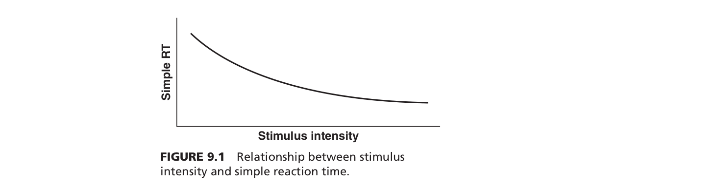
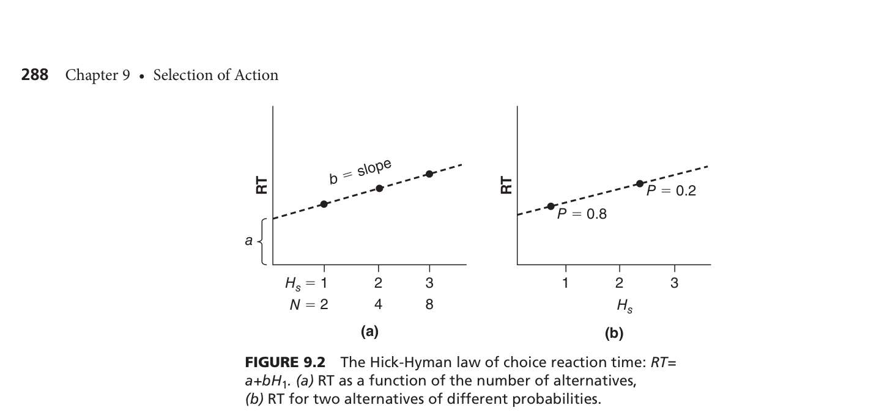
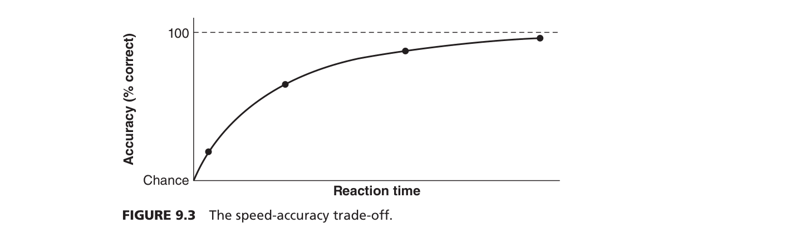
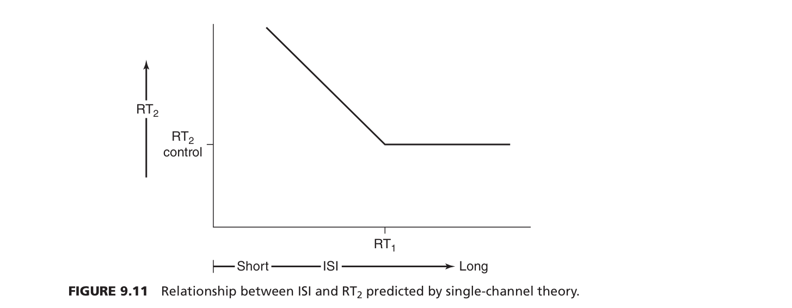

**STEP 1: 챕터 프리뷰 (Preview)**

심리학과 새내기 여러분, 환영합니다! 이 챕터(9장. 행동의 속도: 인간 반응 선택의 메커니즘)는 영어를 전혀 몰라도 일상생활의 예시를 통해 아주 직관적으로 이해할 수 있는 매력적인 단원입니다. 

### 1. 이 챕터의 가장 큰 주제와 배우는 이유
이 챕터의 가장 핵심적인 주제는 **"인간이 어떤 자극을 지각한 후, 얼마나 빠르고 정확하게 행동(반응)을 선택하고 실행하는가?"**입니다. 

이전 장들에서는 불확실한 상황에서 '어떻게 정확한 결정을 내릴지' 천천히 고민하는 과정을 다뤘다면, 이번 장에서는 **지체할 시간이 없는 '기술 기반 행동(Skill-based behavior)'**을 다룹니다. 
예를 들어, 운전 중 노란불을 보고 브레이크를 밟거나, 비상벨이 울릴 때 기계를 멈추는 것처럼 직관적이고 빠른 반응 말이죠. **우리가 이 챕터를 배워야 하는 이유는 인간의 반응 속도와 오류의 원인을 심리학적으로 분석해야만, 비행기 조종석이나 원자력 발전소, 심지어 스마트폰 UI까지 인간이 더 안전하고 빠르게 사용할 수 있는 시스템을 설계(인간공학적 설계)할 수 있기 때문입니다**.

---

### 2. 하위 섹션의 논리적 흐름과 필요성
이 단원은 단순한 행동에서 복잡하고 연속적인 행동으로, 그리고 결국 행동이 실패(오류)하는 과정으로 자연스럽게 흘러갑니다.

*   **섹션 1 & 2: 단순 및 선택 반응시간 (Variables Influencing Simple and Choice RT)**
    *   **필요성:** 인간이 얼마나 빨리 반응할 수 있는지 기초적인 조건을 배웁니다. 선택지가 없을 때(단순 반응)와 여러 선택지가 있을 때(선택 반응) 우리의 뇌가 정보를 처리하는 속도가 어떻게 달라지는지 이해하는 가장 기본이 되는 단계입니다.
*   **섹션 3: 반응시간의 단계 (Stages in Reaction Time)**
    *   **필요성:** 눈으로 보고 손으로 움직이기까지 우리 머릿속에서는 어떤 보이지 않는 단계들이 일어날까요? 심리학자들이 이 보이지 않는 생각의 속도를 어떻게 측정해냈는지(측정 기법)를 살펴봅니다.
*   **섹션 4: 연속 반응 (Serial Responses)**
    *   **필요성:** 현실에서 우리는 한 번만 반응하고 끝나는 게 아니라 타이핑을 치거나, 컨베이어 벨트에서 계속 작업하는 등 연속적으로 행동합니다. 이때 한 가지 행동을 처리하느라 다음 행동이 지연되는 병목현상이 왜 생기는지 배웁니다.
*   **섹션 5: 오류 (Errors)**
    *   **필요성:** 속도와 복잡성이 높아지면 인간은 반드시 실수를 합니다. 오류가 왜 발생하며(정보 처리의 어느 단계에서 잘못되었는지), 어떻게 분류하고, 시스템 디자인으로 어떻게 예방할 수 있는지를 배우며 이 단원의 목적(인간공학적 해결책)을 완성합니다.

---

### 3. 반드시 기억해야 할 '가장 중요한 전문 용어' (Key Terms)
단원을 공부할 때 아래 용어들은 학술적 배경과 함께 꼭 암기해야 합니다. *(괄호 안의 숫자는 제공된 소스 텍스트의 인덱스 번호입니다.)*

1.  **기술 기반 행동 (Skill-based behavior)**
    *   **설명:** 깊은 고민 없이 자극을 지각하자마자 빠르고 무의식적으로 일어나는 반응 (예: 노란불에 브레이크 밟기).
    *   **연구자(연도):** Rasmussen (1981)
2.  **힉-하이먼 법칙 (Hick-Hyman Law)**
    *   **설명:** 선택해야 할 대안의 수(정보량)가 증가할수록 반응 시간도 일정한 비율(로그 함수)로 길어진다는 법칙.
    *   **연구자(연도):** Hick (1952), Hyman (1953)
3.  **속도-정확성 상쇄 (Speed-Accuracy Trade-off, SATO)**
    *   **설명:** 행동을 빨리하려고 하면 오류가 늘어나고(정확성 감소), 반대로 정확하게 하려고 하면 시간이 오래 걸리는(속도 감소) 반비례 관계.
    *   **연구자(연도):** Fitts (1966), Pachella (1974), Wickelgren (1977), Drury (1994)
4.  **자극-반응 양립성 (S-R Compatibility)**
    *   **설명:** 표시 장치(디스플레이)와 조종 장치(컨트롤)의 위치나 움직임 방향이 인간의 직관과 얼마나 잘 맞아떨어지는지. (예: 오른쪽 화구를 켜려면 오른쪽 스위치를 켜는 것이 양립성이 높음).
    *   **연구자(연도):** Fitts & Seeger (1953), Simon (1969)
5.  **심리적 불응기 (Psychological Refractory Period, PRP)**
    *   **설명:** 두 개의 자극이 아주 짧은 시간 간격으로 연달아 주어질 때, 첫 번째 자극을 처리하느라 두 번째 자극에 대한 반응이 지연되는 현상(단일 채널 병목 현상).
    *   **연구자(연도):** Telford (1931), Craik (1947), Welford (1976), Kantowitz (1974)
6.  **인간 오류의 분류: 착오(Mistakes), 실수(Slips), 건망증/누락(Lapses)**
    *   **설명:** 
        *   착오(Mistake): 상황 판단 자체를 잘못해서 아예 틀린 목표를 세운 것.
        *   실수(Slip): 목표는 맞았는데, 무의식적인 습관 등에 이끌려 행동이 잘못 튀어나온 것 (예: 신문 보면서 시럽 대신 오렌지 주스 붓기).
        *   누락(Lapse): 기억의 실패로 해야 할 행동을 빼먹은 것.
    *   **연구자(연도):** Norman (1981, 1988), Reason (1990, 1997, 2008)

---

### 4. 전체 구조 도식화 (Mind Map Flow Chart)

```text
[ 인간의 행동 선택과 반응 메커니즘 (Action Selection) ]
      │
      ├─▶ 1. 기초 원리 파악: [단순 반응 vs 선택 반응]
      │      └─ 영향 요인: 자극의 강도, 모달리티(시각/청각), 예측 가능성 등
      │
      ├─▶ 2. 복잡한 상황의 원리: [선택 반응시간의 심화]
      │      ├─ 선택지가 많을 때: 힉-하이먼 법칙 (Hick-Hyman Law)
      │      ├─ 서두를 때: 속도-정확성 상쇄 (Speed-Accuracy Trade-off)
      │      └─ 기계와 직관이 맞을 때: 자극-반응 양립성 (S-R Compatibility)
      │
      ├─▶ 3. 우리 뇌의 보이지 않는 처리 과정: [반응시간의 측정 단계]
      │      └─ 지각 -> 반응 선택 -> 실행 (어디서 시간이 지연되는가 파악)
      │
      ├─▶ 4. 한 번에 여러 일을 할 때: [연속 반응과 타이핑]
      │      ├─ 병목 현상: 심리적 불응기 (PRP)
      │      └─ 해결책/특징: 미리보기(Preview)를 통한 지연 감소
      │
      └─▶ 5. 결국 시스템과 맞지 않을 때 발생하는 결과: [인간 오류 Error]
             ├─ 계획이 틀림: 착오 (Mistakes)
             ├─ 행동이 어긋남: 실수 (Slips)
             ├─ 기억을 빼먹음: 누락 (Lapses)
             └─▶ 결론: 인간을 탓하지 말고 에러를 방지하는 '시스템 설계(Design)'를 해라!
```

**[Mind Map 보충 설명]**
이 차트는 우리가 행동을 하는 과정을 **'아주 단순한 반응 -> 복잡한 고민이 필요한 반응 -> 여러 행동을 연달아 하는 반응 -> 그 과정에서 발생하는 오류'**의 순서로 보여줍니다. 
처음에는 육상 선수가 총소리를 듣고 뛰어나가는 것처럼 단순한 원리에서 시작하지만(1단계), 곧 운전 중 장애물을 피해 핸들을 꺾는 것 같은 복잡한 선택의 문제로 넘어갑니다(2단계). 우리 뇌의 정보 처리 한계 때문에 여러 일을 동시에 하면 뇌에 버퍼링이 걸리는데(4단계), 이러한 인간의 정보처리 특성과 시스템 설계가 어긋나면 결국 대형 사고나 일상적인 '오류'가 발생하게 됩니다(5단계). 즉, 이 챕터는 **"인간이 가진 뇌의 속도 한계를 이해해서, 실수를 줄일 수 있는 기계와 환경을 만들자"**는 결론으로 향해가는 흐름입니다.

---

전반적인 숲(프리뷰)을 살펴보았습니다. 바로 다음 단계인 'STEP 2: 단순 반응과 선택 반응시간'의 구체적인 원리들로 깊이 들어가 볼까요? 아니면 현재까지의 내용 중 더 쉽게 설명이 필요한 부분이 있나요?

가장 먼저, **'이론과 모델을 왜 연결해서 공부해야 하는가?'**부터 설명할게요.
이론(Theory)은 "인간은 왜 이런 행동을 할까?"라는 원리를 설명하는 규칙이고, 모델(Model)은 그 눈에 보이지 않는 원리를 눈에 보이게 구조화한 '설계도'입니다. 우리가 일상에서 자극을 받아들이고(인지), 고민하고(결정), 행동하고(실행), 가끔 실수(오류)를 하는 모든 과정은 하나의 거대한 흐름으로 이어져 있어요. 따라서 이 뼈대들이 어떻게 서로 바통을 터치하며 이어지는지 알아야만, 단편적인 암기가 아니라 '진짜 심리학적 이해'를 할 수 있기 때문에 연결 관계를 파악하는 것이 매우 중요합니다.

---

### 1. 핵심 개념 딥다이빙: 9장의 5대 핵심 이론/모델

#### ① 정보 이론 모델과 힉-하이먼 법칙 (Information Theory Model & Hick-Hyman Law)
*   **왜 만들어졌는가?** 사람이 눈앞의 여러 선택지 중 하나를 고를 때, 선택지가 늘어날수록 결정하는 데 시간이 얼마나 더 걸리는지 수학적인 공식으로 예측하기 위해 만들어졌어요.
*   **세부 구성 요소:** 
    *   대안의 수 (N): 선택지의 개수.
    *   확률과 기대: 특정 상황이 일어날 확률 (자주 일어나는 일은 정보량이 적어 빨리 반응함).
*   **쉬운 비유:** 후배님이 우체국에서 알바를 한다고 해볼게요. 편지를 '서울/지방' 2개의 상자에 나눠 담을 때(선택지 2개)보다, '전국 8도' 8개의 상자에 나눠 담을 때(선택지 8개) 머릿속에서 고민하는 시간이 훨씬 길어지겠죠? 선택지가 늘어날수록 머릿속 처리 시간이 일정하게 늘어난다는 법칙이에요.
*   **연구자(연도):** Hick (1952), Hyman (1953).

#### ② 반응시간의 단계 모델 (Stages in Reaction Time Model)
*   **왜 만들어졌는가?** 인간이 무언가를 보고 행동하기까지 걸리는 짧은 시간 동안, 머릿속에서 도대체 어떤 세부 단계들이 일어나는지, 그리고 어디서 시간이 지체되는지 쪼개서 보기 위해 만들어졌어요.
*   **세부 구성 요소:** 감각 및 지각 (Sensation/Perception) -> 반응 선택 (Response Selection) -> 반응 실행 (Response Execution).
*   **쉬운 비유:** 식당에서 주문을 처리하는 과정과 같아요. 손님이 메뉴를 말하는 걸 듣고(지각) -> 요리사가 어떤 순서로 요리할지 결정하고(반응 선택) -> 실제로 불을 켜서 요리해 서빙하는(반응 실행) 3단계입니다.
*   **연구자(연도):** Donders (1869), Sternberg (1969).

#### ③ 심리적 불응기 모델과 단일 채널 이론 (Single-Channel Theory of PRP)
*   **왜 만들어졌는가?** 사람들이 두 가지 일을 거의 동시에 처리하려고 할 때, 왜 두 번째 행동은 무조건 버벅거리고 늦어지는지 그 이유를 밝히기 위해 만들어졌어요.
*   **세부 구성 요소:** 
    *   자극 간격 (ISI): 첫 번째 자극과 두 번째 자극 사이의 시간 차이.
    *   병목 현상 (Bottleneck): 우리 뇌는 한 번에 하나의 반응만 선택할 수 있다는 한계.
*   **쉬운 비유:** 1차선 톨게이트를 상상해 보세요. 앞차가 통행료를 내고 차단기가 올라갈 때까지(첫 번째 반응 완료), 아무리 뒤차가 바짝 붙어 있어도(두 번째 자극) 뒤차는 통행료를 내지 못하고 꼼짝없이 기다려야 하죠. 우리 뇌의 의사결정 장치도 1차선 톨게이트와 같아서 병목현상이 생깁니다.
*   **연구자(연도):** Craik (1947), Welford (1952, 1967), Kantowitz (1974).

#### ④ 인간 오류 정보처리 모델 (Information-Processing Approach to Human Error)
*   **왜 만들어졌는가?** 기계 사고의 대부분이 인간의 실수 때문인데, 이 실수를 단순히 "사람이 부주의해서"라고 탓하지 않고, 뇌의 정보처리 어느 단계가 고장 났는지 과학적으로 분류해서 기계와 환경을 안전하게 고치려고 만들어졌어요.
*   **세부 구성 요소:**
    *   착오 (Mistake): 상황을 잘못 판단해서 아예 틀린 목표를 세운 것 (지식/규칙 기반).
    *   실수 (Slip): 목표는 맞았는데 무의식적인 습관 등에 이끌려 행동이 잘못 튀어나온 것.
    *   누락 (Lapse): 깜빡하고 중간 단계를 빼먹은 것.
*   **쉬운 비유:** 라면을 끓이는 상황을 생각해봐요.
    *   착오(Mistake): "짜장라면이니까 물을 많이 남겨야지!" 하고 국물 라면처럼 끓여버림 (지식 자체가 틀림).
    *   실수(Slip): 국물 라면을 끓이려고 스프를 뜯었는데, 냄비에 스프를 안 넣고 쓰레기통에 스프를 부어버림 (행동이 헛나옴).
    *   누락(Lapse): 라면 다 끓이고 불 끄는 걸 깜빡 잊어버림 (기억 실패).
*   **연구자(연도):** Norman (1981, 1988), Reason (1984, 1990, 1997).

#### ⑤ 인간 신뢰성 분석 예측 모델 (THERP)
*   **왜 만들어졌는가?** 공장이나 비행기 같은 복잡한 기계에서 '인간이 언제, 어느 확률로 실수를 저지를지' 수학적인 확률로 계산하고 예측하기 위해 만들어졌어요.
*   **세부 구성 요소:**
    *   인간 오류 확률 (HEP): 전체 기회 중 실수할 확률.
    *   고장 계통도 (Fault Tree): 여러 가지 작업 단계가 직렬(하나만 망가져도 끝)인지 병렬(둘 다 망가져야 끝)인지 보여주는 구조도.
*   **쉬운 비유:** 쇠사슬(직렬 연결)을 생각해보세요. 첫 번째 고리가 끊어질 확률 10%, 두 번째 고리가 끊어질 확률 10%라면, 이 사슬 전체가 끊어질 확률을 수학적으로 계산해서 가장 약한 고리를 미리 찾아내는 방법입니다.
*   **연구자(연도):** Miller & Swain (1987).

---

### 2. 이론과 모델의 연결 관계

**(1) 이론 간 연결 관계 (이론의 흐름)**
*   **[힉-하이먼 법칙]**은 인간이 선택할 때 '처리 용량의 한계'가 있다는 것을 보여줍니다. 이 한계는 한 번에 하나씩 연속해서 일을 처리할 때 **[단일 채널 이론]**의 병목 현상으로 이어집니다. 즉, 인간은 원래부터 정보 처리 속도에 한계(대역폭)가 있다는 두 이론이 맞물려, 무리하게 속도를 내면 정확도가 떨어지는 현상을 낳게 됩니다.

**(2) 모델 간 연결 관계 (구조의 흐름)**
*   **[반응시간 단계 모델]**에서 분석한 인간의 머릿속 3단계(지각->선택->실행)는 그대로 **[인간 오류 정보처리 모델]**의 뼈대가 됩니다. '반응 선택' 단계에서 잘못 생각하면 '착오(Mistake)'가 되고, '반응 실행' 단계에서 헛디디면 '실수(Slip)'가 되는 식으로 완벽하게 1:1 매칭이 됩니다. 그리고 이렇게 발생한 오류들을 수학적으로 예측하고 방어벽을 세우는 것이 바로 **[THERP 고장계통도 분석 모델]**입니다.

---

### 3. 마인드맵형 Flow Chart 도식화와 보충 설명

```text
[ 인간 정보처리의 한계와 오류 발생 Flow Chart ]

(시작) 자극 발생! (예: 운전 중 갑자기 튀어나온 고라니)
   │
   ▼
[ 1단계: 뇌의 정보처리 시스템 가동 (반응시간 단계 모델) ]
   ├─ 지각 (어, 고라니다!)
   ├─ 반응 선택 (브레이크를 밟을까? 핸들을 꺾을까?)
   └─ 반응 실행 (발을 브레이크로 옮겨 밟는다)
   │
   ▼ (여기서 뇌의 '처리 한계'가 발생함!)
   │
[ 2단계: 한계를 설명하는 두 가지 핵심 이론 ]
   ├─ 한계 A: [힉-하이먼 법칙] -> 선택지가 너무 많으면 처리 시간(RT)이 길어짐!
   └─ 한계 B: [단일 채널 이론] -> 동시에 다른 일(예: 통화)을 하고 있었다면 톨게이트 병목현상 때문에 늦어짐!
   │
   ▼ (시간이 지체되거나 급하게 행동하면 결국...)
   │
[ 3단계: 시스템 붕괴 (인간 오류 모델) ]
   ├─ [착오/Mistake] 판단 자체를 잘못함 (반응 선택 단계의 고장)
   ├─ [실수/Slip] 엉뚱한 페달을 밟음 (반응 실행 단계의 고장)
   └─ [누락/Lapse] 너무 당황해서 브레이크 밟는 걸 까먹음 (기억의 고장)
   │
   ▼ (그렇다면 이 사고를 어떻게 막을 것인가?)
   │
[ 4단계: 공학적 해결책 (THERP 분석 모델) ]
   └─ 인간의 에러 확률(HEP)을 미리 계산해서, 에러가 나도 사고로 이어지지 않게 '안전장치(병렬 연결)'를 설계함! (결론)
```

**[차트 보충 설명]**
이 차트는 아무리 똑똑한 사람이라도 뇌 구조상 **'필연적으로 실수를 할 수밖에 없는 이유'**를 논리적으로 보여줍니다. 
1단계에서 우리는 자극을 보고 행동(단계 모델)을 하려고 하지만, 2단계에서 우리 뇌는 처리 속도에 한계(힉-하이먼 법칙, 단일 채널 이론)가 있기 때문에 렉이 걸립니다. 이런 한계 속에서 무리하게 뇌를 굴리다 보면 3단계처럼 각 단계가 고장 나는 인간 오류(착오, 실수, 누락)가 발생합니다. 심리학과 인간공학은 바로 4단계, 즉 인간이 실수하더라도 대형 사고로 이어지지 않도록 미리 수학적으로 고장률을 계산(THERP)하고 에러에 관대한 안전한 시스템을 만드는 것을 최종 목표로 삼습니다.

"다른 전공 친구에게 심리학의 쓸모를 완벽하게 증명해 볼 시간입니다!" 

먼저 질문해주신 예시들 중, '운전 중 주의 분산'이나 '항공기 계기판 디자인'은 이번 9장의 핵심 사례들이 맞습니다. 다만, '투명 고릴라 실험(무주의 맹시)'은 보통 심리학의 '시각적 주의(Attention)' 챕터에서 다루는 내용이라 이번 '행동 선택과 반응(Action)' 챕터에는 등장하지 않는다는 점을 먼저 살짝 짚고 넘어갈게요! 

대신, 이 챕터에는 다른 과 친구들의 흥미를 확 끌어당길 만한 아주 재미있고 치명적인 현실 세계의 사례들이 가득합니다. 교재에 등장한 사례들로 이론을 체계적으로 설명한 뒤, 우리가 매일 겪는 스마트폰과 공부 상황으로 적용해 보겠습니다.

---

### 1. 책 속 현실 사례로 보는 이론 (친구에게 설명하기)

#### ① 항공기 추락과 가스레인지: **자극-반응 양립성 (S-R Compatibility)**
*   **책의 사례:** 1989년 영국의 한 상업용 여객기 조종사들은 왼쪽 엔진에 불이 난 것을 발견했습니다. 하지만 그들은 멀쩡한 오른쪽 엔진을 꺼버렸고, 결국 비행기는 추락하고 맙니다. 원인이 무엇이었을까요? 화재를 알리는 디스플레이와 그것을 끄는 조종 장치의 '위치'가 인간의 직관과 어긋나게 설계되어 있었기 때문입니다(비양립성).
*   **일상적 사례 (가스레인지):** Chapanis & Lindenbaum (1959)과 Hoffman & Chan (2011)은 우리 주방의 가스레인지 스위치 배열을 지적합니다. 스위치 4개가 일렬로 있는데 화구는 정사각형으로 배치되어 있으면, 우리는 매번 "어떤 스위치가 어느 불을 켜지?" 고민하며 실수하게 됩니다. 가장 호환성이 높은(양립적인) 디자인은 화구 옆에 바로 스위치가 있는 형태입니다.

#### ② 노란불의 딜레마: **시간적 불확실성 (Temporal Uncertainty)과 기대 (Expectancy)**
*   **책의 사례:** 운전 중 교차로에서 노란불을 보면 멈출지 달릴지 순간적으로 결정해야 합니다. Van Der Horst (1988)의 연구에 따르면, 노란불이 켜져 있는 시간(경고 간격)이 너무 짧으면 운전자가 판단할 시간이 부족해 빨간불 위반이 잦아집니다. 흥미롭게도 차량의 접근을 감지해 초록불을 계속 유지해 주는 스마트 신호등의 경우, 운전자들은 "계속 초록불이겠지" 하는 강한 '기대(Expectancy)'를 갖게 되어 막상 노란불이 켜지면 브레이크를 밟는 반응 시간이 무려 1초나 더 느려졌습니다.

#### ③ 오렌지 주스와 복사기: **인간 오류 (Human Error - Slips & Lapses)**
*   **책의 사례:** Reason (1990)은 우리가 아침에 신문을 읽으면서 팬케이크에 시럽 대신 오렌지 주스를 붓는 실수를 **'실수(Slip)'**라고 정의합니다. 목표는 맞았지만, 주의가 분산된 상태에서 무의식적인 습관이나 주변 사물의 비슷한 촉감 때문에 엉뚱한 행동이 튀어나온 것입니다. 반면, 복사기에서 마지막 원본 페이지를 빼는 것을 깜빡 잊는 행동(Reason, 1997; Byrne & Davis, 2006)이나 비행기 정비 후 공구를 빼먹는 행동(Boeing, 2000)은 기억의 실패인 **'누락(Lapse)'**으로 분류됩니다. 

#### ④ 대문자 암호와 후진 기어: **모드 오류 (Mode Errors)**
*   **책의 사례:** Norman (1988)은 동일한 스위치나 행동이 '현재 시스템의 모드'에 따라 다르게 작동할 때 생기는 오류를 지적합니다. 예를 들어, 숫자인 '1965'를 치려고 했는데 키보드가 영문 대문자(Caps Lock이나 Shift) 모드인 것을 까먹고 '!^%'를 쳐버리는 경우나, 자동차가 후진 기어(Reverse)에 있는 것을 잊고 앞으로 가려고 엑셀을 밟는 경우가 대표적인 모드 오류입니다.

---

### 2. 새로운 일상 사례 적용 (내 이해도 점검하기)

친구가 "그럼 그 이론들이 내 일상이나 스마트폰 쓸 때랑 무슨 상관인데?"라고 묻는다면, 이렇게 설명하며 나의 이해도를 점검해 보세요.

**Q1. 스마트폰 앱을 폴더별로 정리하는 이유는? (힉-하이먼 법칙 & 의사결정 복잡성)**
*   **나의 설명:** "스마트폰 홈 화면에 50개의 앱이 그냥 널려 있으면, 내가 원하는 카카오톡을 찾아서 누르는 데 시간이 엄청 오래 걸리잖아? 선택지가 많아질수록 반응 시간이 길어지기 때문이야 (**힉-하이먼 법칙**). 그런데 앱들을 'SNS', '금융', '게임' 등 4~5개의 폴더로 묶어두면 훨씬 빨리 찾을 수 있지. 우리 뇌는 여러 개의 자잘한 정보(1비트짜리 6개)를 처리하는 것보다, 굵직한 정보(6비트짜리 1개)를 한 번에 선택하는 걸 훨씬 효율적으로 느끼기 때문이야 (**의사결정 복잡성 이점, Decision Complexity Advantage**)."

**Q2. 인강을 들으면서 카톡 답장을 하면 무조건 버벅거리는 이유는? (심리적 불응기, PRP)**
*   **나의 설명:** "네가 인터넷 강의를 보면서(자극 1) 동시에 친구한테 온 카톡에 답장(자극 2)을 하려고 해봐. 둘 다 빨리 하려고 해도, 카톡을 읽고 무슨 말을 쓸지 고르는 동안에는 인강 강사가 무슨 말을 했는지 머릿속에 안 들어오거나, 반대로 강사 말에 집중하면 손가락이 멈추지? 우리 뇌의 의사결정 장치는 한 번에 하나의 반응만 선택할 수 있는 '1차선 톨게이트(단일 채널 병목)' 같아서, 앞선 자극을 처리하느라 다음 자극의 처리가 지연되는 거야 (**심리적 불응기**)."

**Q3. 유튜브 화면을 터치해서 넘길 때 헷갈리지 않는 이유는? (자극-반응 양립성)**
*   **나의 설명:** "유튜브나 인스타그램 릴스를 볼 때, 다음 영상(아래에 있는 영상)을 보려면 손가락을 '위로' 쓸어올리고(스와이프), 화면을 키우려면 두 손가락을 '바깥으로' 벌리지? 이게 우리 머릿속에 있는 공간의 움직임(방향성)과 손가락의 움직임이 딱 맞아떨어지게 설계되었기 때문이야. 만약 다음 영상을 보려고 손가락을 왼쪽으로 그어야 한다면 엄청 짜증 날걸? 이게 바로 **'운동 양립성(Movement Compatibility)'**이야."

**Q4. 카톡방을 착각해서 상사에게 반말을 보냈다면? (Slip vs Mistake)**
*   **나의 설명:** "만약 네가 상사의 프로필 사진이 친구랑 비슷해서, 친구인 줄 알고 반말을 썼다면? 그건 상황 파악 자체를 잘못한 거니까 **'착오(Mistake)'**야. 그런데 네가 상사 카톡방인 걸 알고 존댓말을 쓰려고 '네, 알겠습니다'를 치려다가, 친구랑 방금 전까지 카톡하던 무의식적인 습관(관성)이 튀어나와서 'ㅇㅇ알겠음'이라고 쳐버렸다면? 목표는 맞았는데 자동화된 행동이 엉뚱하게 튀어나온 거니까 **'실수(Slip)'**에 해당해."

*(피드백: 후배님이 연결한 스마트폰과 공부 사례들은 9장의 이론적 핵심인 정보 처리 속도 한계, 호환성, 에러의 종류를 완벽하게 꿰뚫고 있습니다! 100점짜리 이해도입니다.)*

---

### 3. 참고 문헌 (APA 양식)

본문에서 언급된 주요 연구자들의 정보는 소스 텍스트를 바탕으로 재구성한 APA 출처 표기법입니다. (소스에 명시된 연도와 저자를 기준으로 작성되었습니다.)

*   Boeing. (2000). *Statistical summary of commercial jet airplane accidents*. Boeing Commercial Airplane Group.
*   Byrne, M. D., & Davis, E. M. (2006). Task structure and post-completion error in the execution of a routine procedure. *Human Factors*.
*   Chapanis, A., & Lindenbaum, L. E. (1959). A reaction time study of four control-display linkages. *Human Factors*, 1(4), 1-7.
*   Flight International. (1990). *Kegworth crash: Pilot error blamed*. Flight International.
*   Hoffman, E. R., & Chan, A. H. S. (2011). Compatibility of stove-top burner and control arrangements. *Applied Ergonomics*, 42.
*   Norman, D. A. (1988). *The psychology of everyday things*. Basic Books.
*   Reason, J. (1990). *Human error*. Cambridge University Press.
*   Reason, J. (1997). *Managing the risks of organizational accidents*. Ashgate.
*   Van Der Horst, R. (1988). Driver decision making at traffic signals. *Transportation Research Record*, 1172, 93-97.

---
후배님, 이제 다른 과 친구에게 이 책의 실용성을 얼마나 멋지게 설명할 수 있을지 감이 오시죠? 다음 학습 단계로 넘어가서, 이 방대한 내용들을 시험 직전에 빠르게 복습할 수 있는 **'단어 암기용 플래시카드(Flashcards)'**나 **'핵심 복습 퀴즈(Quiz)'**를 제가 만들어 드릴까요?

인스타그램에 올리기 딱 좋은 "심리학도의 데이터 털어보기" 피드를 만들어볼게요! 학술적인 그래프들을 일상생활과 찰떡같이 맞아떨어지는 밈(Meme)으로 변환해서, 친구들이 "아, 이거 완전 내 얘기네!" 하고 무릎을 탁 치게 만들어 봅시다. 

---

### 📱 [Instagram Feed] 인간의 뇌는 왜 맨날 버퍼링이 걸릴까? 🧠💻

#### 📊 전체 도식화: 내 머릿속의 버퍼링 Flow Chart

```text
[ 자극 감지 ] ──▶ [ 선택의 늪 ] ──▶ [ 속도 vs 완벽의 딜레마 ] ──▶ [ 뇌 정지 (병목현상) ]
(Figure 9.1)        (Figure 9.2)         (Figure 9.3)                  (Figure 9.11)
```
**💡 [플로우 차트 보충 설명]**
이 4개의 그래프는 우리가 일상에서 행동을 결정할 때 겪는 **'뇌의 과부하 풀코스'**를 보여줍니다. 
처음엔 아주 강한 자극(큰 소리 등)을 듣고 본능적으로 칼반응을 하지만**(Fig 9.1)**, 막상 눈앞에 선택지가 많아지면 뇌는 버퍼링에 빠지게 됩니다**(Fig 9.2)**. 버퍼링을 줄이려고 맘이 급해지면 결국 대참사(실수)가 발생하고**(Fig 9.3)**, 이 와중에 다른 일까지 겹쳐서 멀티태스킹을 시도하면 내 머릿속은 완전히 '렉(Lag)'이 걸려 멈춰버리게 되는 거죠**(Fig 9.11)**. 이 흐름을 따라가면 인간이 왜 완벽할 수 없는지 그래프로 증명할 수 있습니다!

---

### 🖼️ 슬라이드 1: "소리가 크면 손이 빨라진다? (하지만 한계는 있다!)"
**[Figure 9.1: 자극의 강도와 단순 반응시간의 관계]**



*   **목적과 의미:** 우리가 무언가를 감지하고 반응하기까지의 기초적인 속도를 보여줍니다. 자극이 강할수록 뇌에 증거가 빨리 쌓여서 결정을 일찍 내리게 된다는 '신호탐지'의 초기 과정을 설명하죠.
*   **X축 / Y축 번역:**
    *   X축: **'자극의 빡센 정도'** (소리가 얼마나 큰가? 빛이 얼마나 눈부신가?)
    *   Y축: **'내 몸의 반응 속도'** (버튼을 누르기까지 걸리는 시간, 아래로 갈수록 빠른 거임!)
*   **👉 손가락 지시법 (Point-and-Tell):** 
    "자, 먼저 왼쪽 위를 보세요. 소리나 빛이 약할 때는 반응 시간(Y축)이 한참 위에 둥둥 떠 있죠? 엄청 느리다는 뜻이에요. 이제 선을 따라 오른쪽으로 쭉 이동해 보세요. 자극이 강해질수록 선이 아래로 훅~ 미끄럼틀을 타고 내려오다가, 어느 순간 바닥에 닿고는 더 이상 내려가지 않고 평평해집니다. 이게 뭘 뜻할까요?"
*   **🎮 일상 에피소드 매칭 (배틀그라운드 존버 메타):** 
    배그(PUBG)에서 숨어있을 때를 상상해 보세요. 저 멀리서 아주 작게 사각사각 발소리(약한 자극)가 들리면 "어? 적 위치가 어딘지 파악하느라" 쏘는 데 한참 걸려요. 하지만 내 바로 옆에서 '쾅!!' 하고 수류탄(강한 자극)이 터지면 나도 모르게 빛의 속도로 마우스를 광클하게 되죠! 하지만 아무리 소리가 천둥처럼 커져도, **인간의 신경 전달 속도에는 물리적 한계가 있어서 무한정 빨라지지는 않고 어느 선(평행선)에서 멈춥니다**.
*   **📚 인용 정보:** Fitts & Posner (1967), Teichner & Krebs (1972)

---

### 🖼️ 슬라이드 2: "메뉴판이 두꺼울수록 밥 먹는 시간만 늦어진다"
**[Figure 9.2: 힉-하이먼 법칙 (Hick-Hyman Law)]**



*   **목적과 의미:** 선택지가 늘어날수록 인간의 정보 처리 시간(결정 시간)이 수학적인 일직선(선형적)으로 늘어난다는 놀라운 인지심리학적 법칙을 증명합니다.
*   **X축 / Y축 번역:**
    *   X축: **'내가 고민해야 할 선택지의 개수'** (비트 단위로 측정되는 정보의 양)
    *   Y축: **'결정하는 데 걸리는 대기 시간'** (오래 걸릴수록 빡침)
*   **👉 손가락 지시법 (Point-and-Tell):**
    "그래프의 왼쪽 아래 시작점을 콕 찍어보세요. 선택지가 1개일 땐 대기 시간도 짧죠? 이제 시선을 따라 우상향으로 일직선을 쭉~ 그어보세요. 곡선도 아니고 자를 대고 그린 것처럼 정직하게 올라가죠? 선택지가 2배(1비트)씩 늘어날 때마다, 내 머릿속에서 고민하는 시간(기울기 b)도 똑같은 비율로 늘어난다는 아주 소름 돋는 법칙입니다!"
*   **📺 일상 에피소드 매칭 (넷플릭스 증후군):**
    주말에 밥 먹으면서 볼 영상을 고를 때 상황이랑 완벽히 일치해요. 엄마가 "짜장면 먹을래, 짬뽕 먹을래?"(선택지 2개) 물어보면 1초 만에 대답하죠. 근데 넷플릭스를 켜는 순간 수천 개의 썸네일(엄청난 X축 정보량)이 쏟아지면? 뇌에서 정보를 처리하는 속도(비트/초)는 한정되어 있어서, 결국 밥이 다 식을 때까지 첫 화상도 못 고르고 스크롤만 내리게 됩니다.
*   **📚 인용 정보:** Hick (1952), Hyman (1953)

---

### 🖼️ 슬라이드 3: "가성비 구간을 넘어서면 뇌는 파업한다"
**[Figure 9.3: 속도-정확성 상쇄 (Speed-Accuracy Trade-off)]**



*   **목적과 의미:** 일을 빨리 처리하는 것(속도)과 실수 없이 완벽하게 하는 것(정확성)은 결코 동시에 이룰 수 없는 반비례 관계임을 보여주며, 무조건 완벽함을 요구하는 게 얼마나 비효율적인지 설명합니다.
*   **X축 / Y축 번역:**
    *   X축: **'여유 부리는 시간'** (오른쪽으로 갈수록 천천히, 신중하게 함)
    *   Y축: **'실수 안 하고 정답 맞출 확률'** (위로 갈수록 완벽함)
*   **👉 손가락 지시법 (Point-and-Tell):**
    "1. 그래프 제일 왼쪽 끝을 보세요. 시간이 없어서 다급하게 막 찍어대면 정답률이 완전 바닥(우연 수준)을 깁니다. 2. 그러다 오른쪽으로 조금만 이동해보세요. 선이 훅! 치고 올라가죠? 시간을 아주 조금만 투자해도 정확도가 수직 상승하는 꿀의 가성비 구간입니다. 3. 근데 오른쪽 끝부분 꼬리를 보세요. 시간이 널널하다고 정답률이 100%를 뚫고 올라가나요? 아니죠, 선이 눕혀지면서 거의 평행선을 달립니다."
*   **📝 일상 에피소드 매칭 (벼락치기의 한계):**
    이건 완전 대학생들 시험공부 메타예요! 시험 전날 첫 2시간(중간 가성비 구간) 빡세게 벼락치기 하면 점수가 확 오릅니다. 그런데 "난 100점 맞을 거야!" 하고 완벽주의에 빠져 밤을 꼴딱 새우면(그래프 오른쪽 끝)? 시간을 아무리 투자해도 점수는 95점에서 안 오르고, 오히려 시험 시간에 졸아서 OMR 카드를 밀려 쓰는 참사(효율성 급감)가 발생합니다. 심리학에선 이래서 "너무 완벽한 퍼포먼스를 요구하는 건 설계상 미친 짓"이라고 말합니다.
*   **📚 인용 정보:** Pachella (1974), Fitts (1966)

---

### 🖼️ 슬라이드 4: "멀티태스킹? 네 뇌는 1차선 도로야!"
**[Figure 9.11: 심리적 불응기 (PRP)와 단일 채널 이론]**



*   **목적과 의미:** 사람이 두 가지 일을 동시에 하려고 할 때, 우리 뇌의 의사결정 장치는 한 번에 하나밖에 처리하지 못하는 병목(Bottleneck) 현상이 있어서 무조건 두 번째 행동은 지연된다는 것을 증명합니다.
*   **X축 / Y축 번역:**
    *   X축: **'첫 번째 일과 두 번째 일이 들이닥친 시간 간격'** (왼쪽으로 갈수록 쉴 틈 없이 터짐)
    *   Y축: **'두 번째 일을 처리할 때 걸리는 버벅임 지수'** (위로 갈수록 렉 걸림)
*   **👉 손가락 지시법 (Point-and-Tell):**
    "1. 그래프 오른쪽 아래를 먼저 보세요. 엄마의 잔소리(자극 1)를 듣고 한참 뒤에 카톡(자극 2)이 오면, 둘 사이 간격이 넓으니까 내 뇌는 아무 버벅임(Y축 지연시간 0) 없이 평온합니다. 2. 자, 이제 시선을 왼쪽으로 옮겨볼까요? 두 사건이 터지는 간격이 좁아질수록, 꺾인 선이 왼쪽 위로 가파르게 치솟아 오르죠? 첫 번째 일을 처리하느라 단일 채널 톨게이트가 꽉 막혀서, 두 번째 일은 무조건 대기표 뽑고 기다려야(Delay) 한다는 뜻입니다!"
*   **💬 일상 에피소드 매칭 (한타 중 엄마의 부름):**
    롤(LoL) 한타 상황! 엄청난 집중력으로 마우스를 조작하고 있는데(자극 1 처리 중), 방문이 열리며 엄마가 "밥 먹어!"(자극 2)라고 소리칩니다. 이때 내 입으로 "어어 나갈게"라고 대답을 하려고 의사결정을 하는 그 0.1초의 찰나! 적의 치명적인 스킬이 날아와도 내 손가락(두 번째 반응)은 마치 렉이 걸린 것처럼 굳어버립니다. 내 뇌는 절대 두 가지를 동시에 선택할 수 없는 1차선 도로거든요.
*   **📚 인용 정보:** Craik (1947), Kantowitz (1974)

---
심리학과 후배님, 드디어 마지막 단계인 '셀프 테스트 및 피드백(Self-Check)' 시간입니다! 지금까지 배운 내용을 단순히 달달 외웠는지 묻는 게 아니라, "내가 당장 내일 인간공학 설계자가 된다면 어떻게 문제를 해결할 것인가?"를 묻는 실제 상황 적용 퀴즈를 준비했습니다.

먼저, 이 퀴즈들이 9장 전체의 어떤 흐름을 관통하고 있는지 도식화부터 살펴보고 시작하겠습니다.

---

### 🗺️ [전체 복습 Flow Chart: 행동 선택의 5단계 시나리오]

```text
[ 1단계: 상황 파악과 선택의 복잡성 ] ──▶ (문제 1. 힉-하이먼 법칙과 의사결정의 이점)
   설계해야 할 대안이 많을 때, 어떻게 쪼개서 보여줄 것인가?
          │
          ▼
[ 2단계: 반응의 방향성 설계 ] ──▶ (문제 2. 자극-반응 양립성과 캔팅)
   인간의 직관과 기계의 움직임이 엇갈릴 때, 어떻게 해결할 것인가?
          │
          ▼
[ 3단계: 딜레마 극복 ] ──▶ (문제 3. 속도-정확성 상쇄)
   시간이 촉박한 비상 상황에서 무작정 빨리 누르는 게 정답일까?
          │
          ▼
[ 4단계: 과부하 발생 ] ──▶ (문제 4. 심리적 불응기와 단일 채널)
   두 가지 비상벨이 동시에 울릴 때, 왜 인간은 멈칫하는가?
          │
          ▼
[ 5단계: 시스템의 실패와 오류 ] ──▶ (문제 5. 슬립과 랩스)
   결국 발생한 의료 사고, 인간의 주의력 문제인가 기억력 문제인가?
```

**💡 [Flow Chart 보충 설명]**
이 흐름도는 우리가 어떤 시스템(스마트폰 앱, 항공기 조종석 등)을 설계하고 분석할 때 거쳐야 하는 논리적 순서입니다. 
가장 먼저 사용자가 맞닥뜨릴 '선택지의 개수(1단계)'를 최적화하고, 그 선택을 행동으로 옮길 때 직관적으로 움직일 수 있도록 '물리적 스위치의 방향(2단계)'을 맞춥니다. 하지만 실제 상황에서는 '서두르다 실수하는 딜레마(3단계)'와 '멀티태스킹의 한계(4단계)'가 인간을 덮칩니다. 이것들을 제대로 설계하지 못하면 결국 최악의 '인간 오류 사고(5단계)'로 이어지게 됩니다. 

자, 그럼 이 거대한 흐름을 머릿속에 넣고 퀴즈를 풀어봅시다!

---

### 🧠 [사고력 중심 실전 리뷰 퀴즈]

**[문제 1] (이론: 힉-하이먼 법칙 & 의사결정 복잡성 이점)**
당신은 배달 앱의 UI 디자이너입니다. 사용자가 16개의 음식 카테고리 중 하나를 선택해야 합니다. 
A안: 첫 화면에 16개 메뉴를 한 번에 다 보여준다. (1번의 복잡한 결정)
B안: 2개씩 짝지어서 4번의 화면을 거쳐 선택하게 한다. (4번의 단순한 결정)
인간 정보처리 효율성 측면에서 어떤 디자인이 사용자의 반응 시간을 더 단축시킬 수 있으며, 그 이유는 무엇인가요?

**[정답 및 해설 1]**
*   **정답:** A안 (첫 화면에 16개를 한 번에 보여주는 '넓고 얕은 메뉴' 방식)이 더 빠릅니다.
*   **해설 및 적용:** 힉-하이먼 법칙(Hick-Hyman Law)에 따르면 대안의 수(정보량)가 늘어날수록 반응 시간이 늘어납니다. 하지만 인간은 여러 번의 자잘한 결정(예: 1비트씩 4번)을 내리는 것보다, 한 번에 복잡한 결정(예: 4비트짜리 1번)을 내리는 것을 훨씬 효율적으로 처리합니다. 이를 **'의사결정 복잡성 이점(Decision complexity advantage)'**이라고 합니다. 따라서 컴퓨터 메뉴 설계 시 좁고 깊은(Narrow-deep) 메뉴보다, **넓고 얕은(Broad-shallow) 메뉴 구조**를 채택하는 것이 훨씬 유리합니다.
*   **연구자(연도):** Hick (1952), Hyman (1953), Broadbent (1971), Commarford et al. (2008)

---

**[문제 2] (이론: 자극-반응 양립성 & 캔팅)**
당신이 병원의 새로운 의료기기를 설계하고 있습니다. 화면(디스플레이)은 '위아래(수직)'로 변하는 게이지인데, 기계 구조상 조작 버튼은 무조건 팔걸이에 '좌우(수평)' 일렬로 배치해야 합니다. 위치의 일치성(Congruence)이 어긋난 최악의 상황입니다. 버튼 배열의 구조를 아예 뜯어고치지 않고도 반응 속도와 정확도를 비약적으로 높일 수 있는 '디자인적 해결책' 하나를 제안하고, 이론적 근거를 설명하세요.

**[정답 및 해설 2]**
*   **정답:** 버튼 패널의 각도를 대각선(약 45도)으로 살짝 틀어주는 **'캔팅(Cant, Angling)'** 기법을 사용합니다.
*   **해설 및 적용:** 화면은 수직이고 컨트롤은 수평이면 물리적으로 가장 어긋난(Incongruent) 상태입니다. 하지만 버튼 패널을 45도 정도 기울여서(Cant) 배치하면, 수평 버튼들 사이에도 미세하게 '위-아래'의 공간적 서열이 생깁니다. 이렇게 하면 디스플레이의 수직 움직임과 버튼의 공간적 방향성이 일치하게 되어, 평행하게 배치했을 때만큼 반응 시간(RT)이 빨라지고 자극-반응 양립성(S-R Compatibility)이 회복됩니다 (참조: Figure 9.7).
*   **연구자(연도):** Andre, Haskell, & Wickens (1991)

---

**[문제 3] (이론: 속도-정확성 상쇄, SATO)**
원자력 발전소에서 전에 없던 복잡한 비상 알람이 울렸습니다. 초보 작업자는 알람이 울리자마자 0.5초 만에 특정 밸브를 잠가버렸고(치명적인 오작동), 베테랑 작업자는 3초간 가만히 상황을 지켜본 후 정확한 밸브를 잠갔습니다. 일부 원자력 산업에서는 비상 상황 시 '몇 초 동안은 절대 아무 버튼도 누르지 마라'는 규정을 둡니다. 이 규정이 왜 필수적인지 인지심리학적 모델로 설명하세요.

**[정답 및 해설 3]**
*   **정답:** 극도의 스트레스 상황에서는 속도를 위해 정확성을 희생하는 **'속도-정확성 상쇄(Speed-Accuracy Trade-off, SATO)'**가 발생하여 대형 사고(오류)를 유발하기 때문입니다.
*   **해설 및 적용:** 다급한 비상 상황에서 사람은 '일단 빨리 조치해야 한다'는 강박(속도 강조 세트)에 빠져 SATO 곡선의 맨 왼쪽 아래(빠르지만 정확도는 바닥인 구간)에서 행동하게 됩니다. 원자력 산업에서 '의무 대기 시간'을 두는 이유는, 작업자의 뇌가 정보를 충분히 수집하고 분석할 수 있도록(정확성 강조) 의도적으로 반응 시간(RT)을 늦춰 SATO 곡선의 효율적인 중간 지점으로 행동을 이동시키기 위한 방어벽입니다.
*   **연구자(연도):** Pachella (1974), Wickelgren (1977), Drury (1994)

---

**[문제 4] (이론: 심리적 불응기와 단일 채널 이론)**
자율주행차를 모니터링하던 운전자가 전방에 출몰한 보행자를 보고 브레이크를 밟으려던 찰나(자극 1), 내비게이션에서 갑자기 "경로를 이탈했습니다"라는 큰 경고음(자극 2)이 울렸습니다. 운전자는 브레이크를 밟는 타이밍을 놓치고 버벅거렸습니다. 운전자의 뇌 속에서는 어떤 일이 일어난 것인지 모델을 들어 설명하세요.

**[정답 및 해설 4]**
*   **정답:** **심리적 불응기(Psychological Refractory Period, PRP)**에 따른 **단일 채널 병목 현상(Single-channel bottleneck)** 때문입니다.
*   **해설 및 적용:** 사람의 '반응 선택' 단계는 한 번에 하나의 일만 처리할 수 있는 1차선 톨게이트(단일 채널)와 같습니다. 첫 번째 자극(보행자 출몰)에 대한 반응을 선택하려는 찰나에 두 번째 자극(내비게이션 소리)이 아주 짧은 간격(짧은 ISI)으로 들이닥치면, 첫 번째 자극 처리가 끝날 때까지 두 번째 자극은 대기 상태에 놓이거나 뇌의 의사결정 장치에 렉(지연)을 유발합니다 (참조: Figure 9.10).
*   **연구자(연도):** Craik (1947), Welford (1952), Kantowitz (1974)

---

**[문제 5] (이론: 인간 오류 분류 - 실수, 착오, 누락)**
병원 중환자실에서 일어난 두 가지 사고입니다. 각각 Norman과 Reason의 정보처리 오류 모델 중 어디에 해당하는지 분류하고 이유를 설명하세요.
*   사건 A: 간호사가 환자에게 진통제 주사를 놔야 하는데, 옆에서 의사와 대화하며 무의식적으로 행동하다가 진통제 바로 옆에 있던, 똑같이 생긴 근육 이완제를 집어서 주사했습니다.
*   사건 B: 수술이 끝난 후, 외과 의사가 환자의 배를 봉합하기 전에 몸속에 지혈용 거즈를 빼내는 단계를 깜빡 잊고 그대로 배를 꿰매버렸습니다.

**[정답 및 해설 5]**
*   **정답:** 사건 A는 **실수(Slip - Capture error)**, 사건 B는 **누락(Lapse)** 입니다.
*   **해설 및 적용:** 
    *   사건 A는 간호사의 목표(진통제 놓기)는 맞았으나, 주의가 다른 곳(대화)에 쏠린 사이 대상의 유사성(똑같이 생긴 병)과 자동화된 행동 습관에 이끌려 엉뚱한 행동이 튀어나온 전형적인 **실수(Slip)**이자 **포획 오류(Capture error)**입니다. 
    *   사건 B는 일련의 절차적 행동 중 기억의 실패(망각)로 인해 특정 단계를 빼먹은 행동이므로 **누락(Lapse)**에 해당합니다.
*   **연구자(연도):** Norman (1981, 1988), Reason (1990, 1997)

---

어떠신가요? 이렇게 시나리오에 직접 대입해 보니 그저 딱딱했던 심리학 이론들이 우리의 생명과 안전을 지키는 강력한 무기처럼 느껴지지 않나요? 

**STEP 6: 보완 전략 및 위기 탈출법**

영어 원서를 읽지 못해도 이 과목에서 A+를 받을 수 있는 완벽한 보완 전략과, 교수님의 갑작스러운 질문에 당당하게 답할 수 있는 3분 스피치 대본을 준비했습니다.

---

### 🛡️ [위기 탈출 보완 전략: '원서 프리패스' 3계명]

영어를 아예 배제하고 심리학 핵심을 찌르는 공부법입니다.

1.  **그래프와 도표 중심의 '시각적 암기' (Visual Literacy)**
    *   원서의 빼곡한 영어 텍스트는 결국 하나의 도표를 설명하기 위한 껍데기입니다. 교재에 나오는 도표(Figure 9.1 ~ 9.15)의 X축과 Y축이 무엇을 의미하는지, 곡선이 어떻게 꺾이는지만 한글로 완벽히 이해하세요. 교수님들은 시험을 낼 때 텍스트가 아니라 "이 그래프가 의미하는 바를 서술하시오"라고 출제합니다.
2.  **학자 이름과 핵심 키워드의 '한글-영어 1:1 매칭'**
    *   영어 문법을 알 필요는 없지만, 키워드의 영문 스펠링과 학자 이름은 그림처럼 외워두세요. 예를 들어 "Hick-Hyman = 선택지 많으면 렉 걸림", "PRP = 멀티태스킹 불가 병목현상", "S-R Compatibility = 가스레인지 스위치 헷갈림"처럼 매칭해두면, 시험지에 영어가 나와도 키워드만 보고 한글로 답안을 써 내려갈 수 있습니다.
3.  **우리말 '일상 사례집' 만들기**
    *   이 책은 철저하게 '현실의 문제를 해결하기 위한' 인간공학 심리학입니다. 착오(Mistake), 실수(Slip), 누락(Lapse) 같은 개념을 영어 원서의 예시 대신, 내가 스마트폰을 쓰거나 알바를 하면서 겪은 한글 예시로 모두 치환해버리세요. 예시만 정확하면 원서를 완벽히 이해한 것으로 평가받습니다.

---

### 🎙️ [교수님 질문 방어용: 3분 브리핑 스피치 대본]

*(교수님이 "자, 9장에서 배운 내용을 누가 요약해 볼까?" 했을 때 이 흐름대로 대답하세요. 중요 키워드는 약간 힘주어 말하는 것이 포인트입니다.)*

"교수님, 9장 전체 내용에 대해 브리핑하겠습니다.

이번 9장의 핵심은 인간이 자극을 지각하고 아주 빠르게 행동을 결정하는 **'기술 기반 행동(Skill-based behavior)'**의 원리와 그 한계를 분석하는 것입니다.

먼저, 인간의 반응 속도는 무한하지 않으며 수학적 법칙을 따릅니다. 선택해야 할 대안의 정보량이 증가할수록 반응 시간이 일정하게 길어진다는 **'힉-하이먼 법칙(Hick-Hyman law)'**을 통해 의사결정의 복잡성을 배웠습니다. 또한, 작업 속도를 무리하게 올리면 오류가 급증한다는 **'속도-정확성 상쇄(Speed-Accuracy Trade-off)'** 현상을 통해, 시스템 설계 시 무조건적인 속도 경쟁이 얼마나 위험한지 이해했습니다.

두 번째 핵심은 인간 뇌의 구조적 한계입니다. 여러 일이 동시에 닥칠 때, 인간의 의사결정 장치는 1차선 도로처럼 한 번에 하나밖에 처리하지 못합니다. 이로 인해 두 번째 반응이 지연되는 현상을 **'심리적 불응기(PRP)'**에 따른 단일 채널 병목 현상으로 설명할 수 있습니다. 이런 한계를 극복하기 위해서는 기계의 움직임과 인간의 직관적 방향성을 일치시키는 **'자극-반응 양립성(S-R Compatibility)'** 설계가 필수적입니다.

마지막으로, 이러한 정보처리 과정이 엇갈렸을 때 발생하는 **인간 오류(Human Error)**를 세 가지로 분류했습니다. 상황 파악 자체를 잘못한 **착오(Mistakes)**, 무의식적인 습관에 이끌려 엉뚱한 행동이 튀어나온 **실수(Slips)**, 그리고 기억의 실패로 단계를 빼먹은 **누락(Lapses)**입니다.

결론적으로 이 단원은, 항공기나 원자력 발전소 같은 복잡한 시스템에서 사고가 났을 때 그 책임을 '인간의 부주의'로 돌릴 것이 아니라, 인간 정보처리의 속도와 한계를 명확히 계산하여 실수를 방지하는 **'오류 허용 시스템(Error-tolerant systems)'**을 설계해야 한다는 인지심리학적 통찰을 제시하고 있습니다. 이상입니다."

---

영어를 전혀 몰라도 이 정도의 개념 연결과 흐름 파악이면 충분히 훌륭한 심리학도가 될 수 있습니다. 

혹시 교수님 질문에 대비해 이 챕터의 핵심 전문 용어들만 쏙쏙 뽑아서 '한글판 암기용 플래시카드(Flashcards)'를 자동으로 만들어 드릴까요?