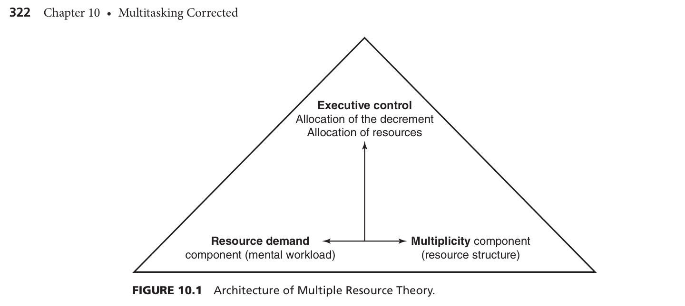
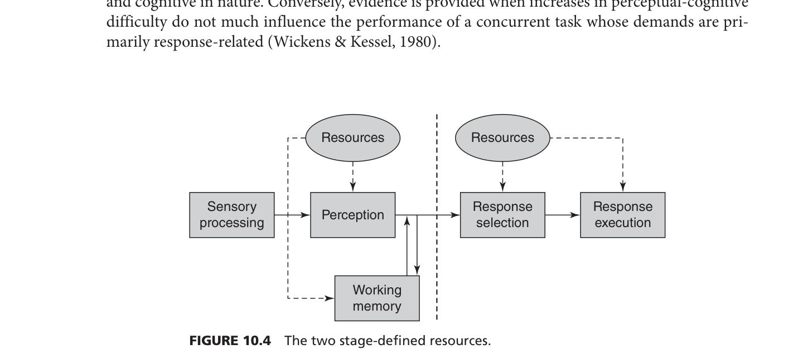
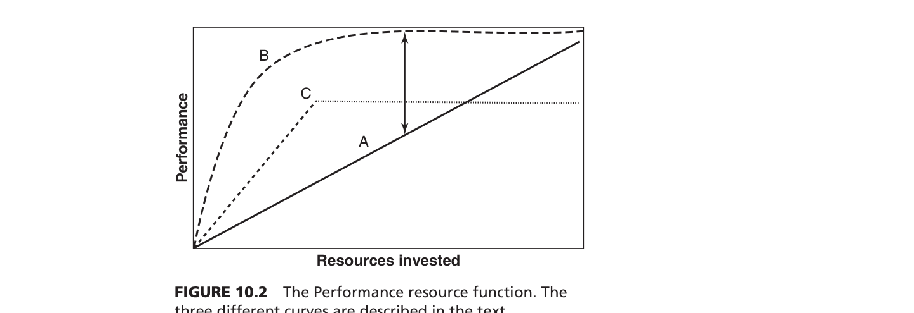
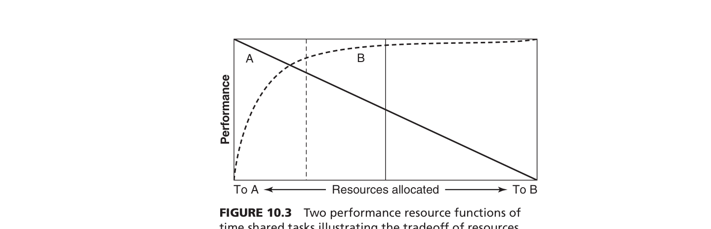
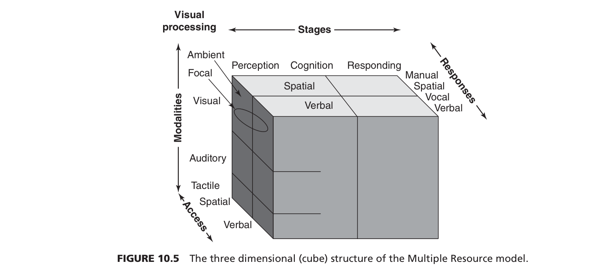
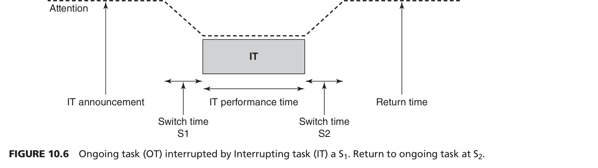

심리학과 신입생이 되신 것을 환영합니다! 영어 원서를 처음 마주하면 막막할 수 있지만, 전혀 걱정하지 마세요. 어려운 영어 문장에 얽매이지 않고도 이 챕터의 핵심적인 심리학적 원리를 완벽하게 이해할 수 있도록, 아주 쉽고 논리적으로 단계별 안내를 해드리겠습니다. 

---

### STEP 1: 챕터 프리뷰 (Preview)

#### 1. 이 챕터의 가장 큰 주제와 배워야 하는 이유
이 챕터의 **가장 핵심적인 주제는 '다중작업(Multitasking) 상황에서 우리의 수행 능력이 왜 떨어지는지(이중 작업 감소, Dual task decrement), 그리고 이를 설명하는 인간의 인지적 메커니즘은 무엇인지'**를 파악하는 것입니다.

우리는 운전을 하면서 통화를 하거나, 길을 걸으며 스마트폰으로 문자를 보내는 등 끊임없이 다중작업을 합니다. 하지만 인간의 주의력과 인지 자원(두뇌의 처리 능력)은 한계가 있기 때문에, 자칫하면 큰 사고로 이어지거나 작업의 효율성이 크게 떨어집니다. 공학 심리학(Engineering Psychology)은 **이러한 인간의 한계를 이해하고, 항공기 조종석, 중환자실, 혹은 일반적인 자동차 운전 환경 등에서 작업 과부하를 예방하는 시스템을 설계**하기 위해 이 주제를 매우 중요하게 다룹니다.

#### 2. 하위 섹션들의 논리적 흐름과 필요성
이 챕터는 크게 '원인 분석 ➔ 두뇌의 대처 방식 ➔ 현실 적용 ➔ 개인차'라는 아주 논리적인 흐름으로 구성되어 있습니다.

*   **섹션 1~3 (멀티태스킹 실패의 근본 원인):** 왜 두 가지 일을 동시에 하면 하나가 안 될까요? 우선 각 작업이 요구하는 '노력(자원)'이 얼마나 큰지 알아보고(섹션 2), 인간의 뇌가 가진 자원이 어떻게 여러 개의 '방(자원 풀)'으로 나뉘어 있는지(다중 자원 이론)를 설명합니다(섹션 3).
*   **섹션 4 (두뇌의 관리 시스템):** 한정된 자원을 우리는 어떻게 나누고 통제할까요? 여기서 뇌의 **'집행 통제(Executive control)'** 능력이 등장하여, 어떤 작업을 우선시할지, 중간에 방해(Interruption)가 들어올 때 주의력을 어떻게 전환하는지 다룹니다.
*   **섹션 5~6 (현실에서의 응용과 추가 문제):** 배운 이론을 가장 대표적인 예시인 '산만한 운전(휴대폰 사용 등)'에 직접 적용해 봅니다(섹션 5). 또한 두 작업이 너무 비슷할 때 생기는 '혼란과 간섭' 문제도 추가로 다룹니다(섹션 6).
*   **섹션 7~8 (개인차와 결론):** 초보자와 전문가, 혹은 젊은 사람과 노인 간에 멀티태스킹 능력이 왜 차이가 나는지 분석하며(섹션 7), 최종적으로 이 스트레스와 뇌의 작용(신경 인지공학)을 요약하며 마무리됩니다(섹션 8).

---

#### 3. 반드시 기억해야 할 '가장 중요한 전문 용어' (Top 5)

이 단원의 핵심 뼈대가 되는 학술 용어들입니다. 이 개념들만 확실히 잡아도 챕터의 절반 이상을 이해한 것입니다.

1.  **다중 자원 이론 (Multiple Resource Theory)**
    *   **의미:** 인간의 주의력 자원은 하나의 거대한 덩어리가 아니라, 지각 단계(시각/청각), 처리 코드(공간/언어) 등 여러 독립적인 차원으로 나뉘어 있다는 핵심 이론입니다.
    *   **학술 인용:** Navon & Gopher (1979); Wickens (1984, 2002a, 2008).
    *   **출처 페이지:** 본문 321p, 326p.
2.  **수행-자원 함수 (Performance-Resource Function) / 자원 제한 및 데이터 제한**
    *   **의미:** 어떤 일에 인지적 '자원(노력)'을 투자할 때, 수행 능력이 어떻게 변하는지 보여주는 그래프 곡선입니다. 노력할수록 결과가 좋아지면 **'자원 제한(Resource limited)'**, 아무리 노력해도 정보의 질 자체가 나빠서 결과가 안 변하면 **'데이터 제한(Data limited)'**이라고 합니다.
    *   **학술 인용:** Norman & Bobrow (1975).
    *   **출처 페이지:** 본문 323p.
3.  **자동화 (Automaticity)**
    *   **의미:** 반복적인 연습을 통해 어떤 작업이 습관화되어, 뇌의 주의력 자원을 거의 쓰지 않고도 그 일을 해낼 수 있는 상태입니다.
    *   **학술 인용:** Fitts & Posner (1967); Schneider & Shiffrin (1977).
    *   **출처 페이지:** 본문 322p.
4.  **진행 중인 작업(Ongoing Task, OT)과 중단 작업(Interrupting Task, IT)**
    *   **의미:** 우리가 주의력과 우선순위를 어떻게 바꾸는지(중단 관리)를 연구할 때 쓰는 모델입니다. 내가 메인으로 하던 일(OT)과 갑자기 끼어든 일(IT) 사이의 주의력 전환 비용을 설명합니다.
    *   **학술 인용:** McFarlane & Latorella (2002); Trafton & Monk (2007); Altmann & Trafton (2002).
    *   **출처 페이지:** 본문 331p, 332p.
5.  **결과 갈등 / 혼란 (Outcome Conflict / Confusion)**
    *   **의미:** 두 가지 작업이 구조적으로 다르더라도 처리하는 내용이 너무 '비슷해서' 뇌가 헷갈리고 간섭을 일으키는 현상입니다 (예: 덧셈을 하면서 동시에 철자 외우기보다, 두 개의 다른 덧셈을 동시에 하는 것이 더 어려움).
    *   **학술 인용:** Navon (1984); Navon & Miller (1987).
    *   **출처 페이지:** 본문 341p.

---

#### 4. 구조 도식화 (Flow Chart & Mind Map)

단원의 전체 연결 관계를 마인드맵 형태로 도식화했습니다.

```text
[멀티태스킹 수행 능력 (Multitasking Performance)]
   │
   ├── 1. 구조적 원인 분석 (왜 동시에 못할까?)
   │    ├── (섹션 2) 자원 요구량: 일 자체가 너무 어렵거나 자동화(Automaticity)가 덜 됨
   │    └── (섹션 3) 다중 자원 (Multiplicity): 두 가지 일이 같은 뇌의 자원을 뺏으려고 경쟁함
   │
   ├── 2. 인간의 통제 방식 (자원은 어떻게 나뉘는가?)
   │    └── (섹션 4) 집행 통제와 관리 (Executive Control & Management)
   │         ├── 자원 할당 (우선순위 정하기)
   │         └── 작업 전환 및 중단 관리 (OT와 IT 간의 매끄러운 전환)
   │
   ├── 3. 방해 요소와 현실 적용 (어떻게 응용되는가?)
   │    ├── (섹션 6) 작업의 유사성: 구조가 달라도 내용이 비슷하면 혼란(Outcome Conflict) 발생
   │    └── (섹션 5) 산만한 운전 (Distracted Driving): 휴대폰 통화 등이 시각/인지 자원을 어떻게 뺏는지 분석
   │
   └── 4. 개인차 요인 (누가 멀티태스킹을 더 잘할까?)
        └── (섹션 7) 전문가 vs 초보자 (자동화 및 시선 처리의 차이), 청년 vs 노인 (인지 자원의 차이)
```

**[차트 보충 설명]**
이 차트는 여러분이 일상에서 겪는 멀티태스킹을 심리학자가 분석하는 순서대로 흘러갑니다.
우선 "이 일이 뇌의 자원을 얼마나 쓰지?"(섹션 2), "혹시 두 작업이 뇌의 같은 영역을 쓰려고 싸우나?"(섹션 3)를 따져보며 원인을 찾습니다. 그 다음에는 "그러면 한정된 뇌 자원을 어떻게 우선순위를 매겨 통제할까?"(섹션 4)라는 인간의 전략을 살펴봅니다. 이렇게 얻어진 기초 이론을 바탕으로, 현실 속 아주 위험한 멀티태스킹 사례인 '산만한 운전'(섹션 5)을 분석하고, 추가적으로 내용이 비슷해서 헷갈리는 간섭 문제(섹션 6)를 살펴봅니다. 마지막으로 훈련받은 전문가나 나이에 따라 이 과정이 어떻게 달라지는지(섹션 7) 파악하며 결론에 도달하는 완벽한 기승전결을 갖고 있습니다.

---


이론과 모델을 왜 서로 연결해서 이해해야 할까요? 인간의 뇌와 인지 과정은 컴퓨터 부품처럼 하나씩 따로 작동하는 것이 아니라, 서로 긴밀하게 영향을 주고받기 때문입니다. 예를 들어, 우리가 운전하면서 전화를 받을 때(다중 작업), 눈으로 도로를 보는 '시각적 주의력(SEEV 모델)'과 뇌에서 처리하는 '인지적 자원(다중 자원 이론)'이 동시에 작용합니다. 따라서 이것들을 연결해서 하나의 큰 그림(Big Picture)으로 이해해야, 비로소 "아! 인간이 이래서 멀티태스킹에 실패하고 사고가 나는구나!"라는 근본적인 원리를 깨달을 수 있습니다. 

심리학에 갓 입문하신 신입생의 눈높이에 맞춰, 이 챕터(10장)에 등장하는 핵심 이론과 모델들을 아주 쉬운 비유와 함께 완벽히 해부해 드리겠습니다.

---

### 1. 챕터 핵심 이론 및 모델 딥다이빙 (Concept Mastery)

#### ① 다중 자원 이론 (Multiple Resource Theory)



*   **연구자(연도):** Navon & Gopher (1979); Wickens (1984, 2002a, 2008).
*   **1) 왜 만들어졌을까?** 예전 학자들은 인간의 뇌 에너지가 하나의 큰 '물통'이라고 생각했습니다. 하지만 걷으면서 껌을 씹는 건 쉽고, 운전하면서 문자 보내는 건 왜 이토록 어려운지(둘 다 두 가지 일인데!) 설명할 수 없었습니다. 이 이론은 "우리의 뇌 에너지는 하나의 큰 물통이 아니라, 역할별로 나뉜 여러 개의 작은 물통(다중 자원)이다"라는 것을 증명하기 위해 만들어졌습니다.
*   **2) 세부 요소:** 
    *   **처리 단계 (Stages):** 지각/인지(보고 생각하기) vs 반응(행동하기).
    *   **처리 코드 (Codes):** 공간적(위치 찾기, 조향) vs 언어적(말하기, 읽기).
    *   **지각 양식 (Modalities):** 시각(눈) vs 청각(귀).
    *   **시각 채널 (Visual Channels):** 초점 시각(디테일한 글씨 읽기) vs 주변 시각(공간 이동 느끼기).
*   **3) 상호작용 및 쉬운 비유:** **뇌를 거대한 '전문가 주방'이라고 상상해 보세요.** 요리사(자원)들이 시각 담당, 청각 담당, 손 움직임 담당, 목소리 담당으로 나뉘어 있습니다. 스테이크를 굽고(손 움직임/시각) 손님에게 인사하는 것(목소리/청각)은 각기 다른 요리사가 맡기 때문에 동시에 완벽하게 해낼 수 있습니다. 하지만, 두 가지 주문이 모두 '손 움직임'을 요구한다면, 한 명의 요리사가 두 요리를 동시에 해야 하므로 요리를 망치게 됩니다(간섭 현상).

#### ② 수행-자원 함수 모델 (Performance-Resource Function, PRF)
*   **연구자(연도):** Norman & Bobrow (1975).
*   **1) 왜 만들어졌을까?** 우리가 어떤 일에 '노력'을 투자할 때, 노력을 쏟는 만큼 무조건 결과가 좋아지는지, 아니면 어느 순간 한계에 부딪히는지를 그래프로 설명하기 위해 만들어졌습니다.
*   **2) 세부 요소:**
    *   **자원 제한 (Resource-limited):** 노력을 투자할수록 성과가 쭉쭉 올라가는 상태.
    *   **데이터 제한 (Data-limited):** 아무리 노력해도 정보 자체가 부족하거나 너무 어려워서 성과가 오르지 않는 한계점.
*   **3) 상호작용 및 쉬운 비유:** **레몬 즙 짜기**를 상상해 보세요. 처음에는 꽉 짤수록(노력=자원 투자) 레몬즙(수행 성과)이 콸콸 나옵니다. 이때가 '자원 제한' 구간입니다. 하지만 레몬이 껍질만 남아 바싹 말랐다면? 아무리 땀을 뻘뻘 흘리며 꽉 쥐어짜도 즙은 한 방울도 나오지 않습니다. 이것이 바로 '데이터 제한' 구간입니다. 외국인이 너무 빠른 속도로 말할 때, 아무리 귀를 쫑긋 세우고 노력해도 알아듣지 못하는 것과 같습니다. 

#### ③ 진행/중단 작업 모델 (OT-IT Model) 및 목표 기억 이론 (Memory-for-goals theory)
*   **연구자(연도):** McFarlane & Latorella (2002), Altmann & Trafton (2002); Trafton & Monk (2007).
*   **1) 왜 만들어졌을까?** 우리가 원래 하던 일을 하다가 갑자기 다른 일이 끼어들었을 때(카톡 알림 등), 왜 원래 하던 일로 돌아가기 힘든지를 분석하여 안전사고(예: 조종사의 체크리스트 누락)를 막기 위해 만들어졌습니다.
*   **2) 세부 요소:**
    *   **OT (Ongoing Task):** 원래 하던 중요한 일.
    *   **IT (Interrupting Task):** 갑자기 끼어든 방해 작업.
    *   **S1 (Switch 1) & S2 (Switch 2):** 원래 일을 멈추는 시점(S1)과 다시 돌아오는 시점(S2).
*   **3) 상호작용 및 쉬운 비유:** **두꺼운 소설책 읽기**입니다. 소설책을 집중해서 읽고 있는데(OT), 갑자기 엄마가 심부름을 시킵니다(IT). 이때 그냥 책을 덮어버리면(S1 연기 실패), 나중에 심부름을 마치고 돌아왔을 때(S2) "내가 어디까지 읽었지?" 하며 한참을 헤맵니다. 영리한 사람은 심부름을 가기 전 책갈피를 꽂아두거나 속으로 내용을 되뇌는데(S1 지연 및 목표 기억 보존), 이러면 다시 책을 폈을 때 부드럽게 원래 작업으로 복귀할 수 있습니다.

#### ④ 부가 모델: SEEV 모델과 근접성 호환성 원리(PCP), 인지 부하 이론
*   *(참고: 이 이론들은 이전 챕터에서 주로 다루어지며, 10장에서는 다른 이론을 돕는 보조 역할로 등장합니다.)*
*   **SEEV (시각적 스캐닝 모델):** 시선을 어디에 둘지 결정하는 모델입니다. 눈을 움직이는 '노력(Effort)'과 정보의 '가치(Value)' 사이의 계산으로 시선이 이동합니다.
*   **PCP (근접성 호환성 원리) & 인지 부하 이론:** 머리를 써서 정보를 기억하려는 노력(작업 기억 노력)과, 정보를 찾으려고 눈을 굴리는 노력(정보 탐색 노력)이 서로 경쟁하며 뇌의 부하(Load)를 만든다는 원리입니다.

---

### 2. 이론과 모델 간의 연결 관계 및 도식화



앞서 배운 개념들이 실제로 우리 뇌에서 어떻게 연속적으로 일어나는지 연결해 보겠습니다.

#### (1) 이론 간 연결관계 (인지 부하 이론 ↔ 다중 자원 이론)
**'인지 부하 이론'**은 주어진 일이 얼마나 뇌에 힘든 일인지(난이도)를 말해줍니다. 어떤 일이 너무 어려워서 뇌의 부하가 꽉 차면, **'다중 자원 이론'**이 개입합니다. 뇌는 부하를 줄이기 위해 "지금 빈 방(남는 자원)이 있나? 시각 자원은 꽉 찼으니, 청각 자원으로 일을 넘겨야겠다!"라며 에너지를 분배합니다.

#### (2) 모델 간 연결관계 (PRF 모델 ↔ OT-IT 모델)
내가 얼마나 노력을 기울일지 정하는 **'수행-자원 함수(PRF)'**는 **'OT-IT 모델'**과 찰떡궁합입니다. 심부름(IT)이 너무 고도의 집중력(자원)을 요구하면(PRF의 자원 제한 곡선), 소설책 읽기(OT)에 투자할 뇌의 자원이 0이 되어 내용이 머릿속에서 완전히 지워집니다. 결국 S2로 돌아갔을 때 치명적인 에러가 발생합니다.

#### (3) 종합 Flow Chart 도식 (MIND MAP 구조)

아래는 신입생이 운전 중에 핸드폰이 울렸을 때 뇌에서 일어나는 과정을 차트로 그린 것입니다.

```text
[멀티태스킹 뇌의 작동 메커니즘 (The Multitasking Brain Flow)]

[1단계: 요구량 발생] 
  ▶ 인지 부하 이론 (Cognitive Load)
      "어? 운전 중인데 갑자기 스마트폰 내비게이션을 조작해야 하네? 이거 좀 어려운데?"
           ▼
[2단계: 한계 부딪힘]
  ▶ 수행-자원 함수 (PRF - Resource Limit)
      "내비게이션에 뇌의 노력(자원)을 80% 투자해야겠다. 그럼 운전에는 20%밖에 못 쓰네?"
           ▼
[3단계: 충돌 확인 및 자원 재분배]
  ▶ 다중 자원 이론 (Multiple Resource Theory) & SEEV 모델
      "내비게이션 조작(시각/손)과 운전(시각/손)은 둘 다 같은 '시각 요리사'와 '손 요리사'를 원하잖아! (다중 자원 충돌)"
      "SEEV 모델 출동! 지금은 내비게이션보다 전방 도로(Value)를 보는 게 더 가치 있으니 시선은 도로에 두자!"
           ▼
[4단계: 실제 행동 스위칭 (통제)]
  ▶ OT-IT 중단 관리 모델 (Interruption Management)
      "좋아, 운전(OT)을 하다가 직선 도로가 나왔을 때 잠깐 멈추고(S1 지연),
       빠르게 내비게이션(IT)을 누른 다음, 다시 운전(S2)으로 부드럽게 돌아오자!"
```

**[도식 보충 설명]**
이 차트는 하나의 사건이 발생했을 때 우리 뇌가 처리하는 순서도입니다. 처음에는 일이 얼마나 힘든지를 평가하고(1단계), 가진 에너지를 어디에 쏟을지 한계를 측정합니다(2단계). 그 다음, 두 가지 일이 뇌의 같은 영역을 쓰려고 싸우는지(다중 자원) 확인하고 시선의 가치를 평가한 뒤(3단계), 최종적으로 하던 일을 언제 멈추고 언제 다른 일로 갈아탈지(OT-IT 스위칭)를 결정(4단계)하는 아주 체계적인 흐름을 보여줍니다. 이렇게 모델과 이론이 하나로 톱니바퀴처럼 맞물려 인간의 행동을 만들어냅니다.


---

### STEP 3: 현실 세계 적용 (Real-world Case Study)

#### 1. 교재 속 실제 사례와 이론의 연결 (다른 과 친구에게 설명할 때)

**① 디트로이트 항공기 추락 사고 (비극적인 우선순위 역전)**
*   **상황 설명:** 1987년, 디트로이트에서 이륙을 준비하던 비행기 조종사가 이륙 전 필수 체크리스트(메인 작업)를 읽고 있었습니다. 이때 관제탑에서 무전(방해 작업)이 들어옵니다. 조종사는 무전에 답한 뒤 다시 체크리스트로 돌아왔지만, 자신이 어디까지 읽었는지 착각하여 비행기 양력에 필수적인 '플랩 설정'을 건너뛰었고, 결국 비행기는 이륙 직후 추락하고 맙니다.
*   **어떤 이론이 적용되었나?:** **OT-IT(진행/중단 작업) 모델**과 **자원 할당(우선순위)**의 실패입니다. 인간의 뇌는 방해 작업(무전)을 처리하는 동안 원래 하던 일(체크리스트)의 기억을 서서히 잃어버립니다. 또한, 가장 중요한 '비행기 세팅'보다 덜 중요한 '무전 응답'에 뇌의 자원을 먼저 할당한 '우선순위 역전'이 대형 참사를 낳았습니다,. (NTSB, 1988)

**② 조수석 탑승자와의 대화 vs. 휴대폰 통화 (왜 유독 폰만 위험할까?)**
*   **상황 설명:** 운전 중 조수석에 앉은 친구와 수다를 떠는 것은 괜찮은데, 휴대폰으로 통화하는 것은 혈중알코올농도 0.08%의 음주 운전과 맞먹을 정도로 위험합니다. 핸즈프리로 통화해도 여전히 위험합니다.
*   **어떤 이론이 적용되었나?:** **다중 자원 이론(Multiple Resource Theory)**과 **공통 기반(Common Ground)**의 부재입니다. 휴대폰 통화는 대화의 맥락을 상상하고 뇌로 그리느라 엄청난 '인지 자원'을 뺏어갑니다,. 핵심은 조수석의 친구는 운전자와 눈앞의 도로 상황(공통 기반)을 공유한다는 점입니다. 차가 막히거나 교차로가 나타나면 친구는 알아서 입을 다물어 운전자가 시각/인지 자원을 도로에 100% 쏟게 해주지만, 전화기 너머의 상대방은 눈치 없이 계속 말을 걸어 운전자의 자원을 뺏기 때문입니다. (Dingus, Hanowski, & Klauer, 2011; Drews, Pasupathi, & Strayer, 2008)

**③ 중환자실(ICU) 간호사의 방해 관리 (전문가의 대처법)**
*   **상황 설명:** 바쁜 병동에서 간호사들은 수술 도구 숫자 세기, 약물 투여 등 중요한 일을 하다가 끊임없이 질문과 호출을 받습니다.
*   **어떤 이론이 적용되었나?:** **하위 목표 달성(Subgoal completion)**과 **전문성(Expertise)**입니다. 능숙한 간호사(전문가)는 호출이 오더라도 하던 일을 즉시 멈추지 않고, '약물 병 뚜껑을 닫는 것'과 같은 작은 목표(하위 목표)를 마저 끝낸 뒤에야 다른 곳으로 시선을 돌립니다,. 이렇게 해야 뇌가 원래 작업을 매끄럽게 기억하고 돌아올 수 있기 때문입니다. (Grundgeiger et al., 2010; Koh, Park et al., 2011)

---

#### 2. 일상생활 적용 (새로운 사례로 이해도 확인하기)

친구가 "아, 대충 알겠어. 그럼 내 일상에선 어떻게 나타나?"라고 물을 때 쓸 수 있는 사례입니다.

**💡 사례 A: 카페에서 전공 서적 읽기 vs. 스마트폰 카톡 알림**
*   **내용:** 어려운 심리학 전공책을 읽고 있는데(진행 작업, OT), 카톡 알림이 울립니다(방해 작업, IT).
*   **내가 이해한 이론 적용:** 알림이 울리자마자 읽던 **문장 중간에서 눈을 떼고 카톡을 확인하면(S1 스위치 지연 실패)**, 카톡을 다 보고 책으로 돌아왔을 때 "어? 내가 어디 읽고 있었지?" 하며 한참을 헤맵니다. 공학 심리학을 배운 우리는 이제 **'하위 목표 달성'** 이론을 씁니다. 알림이 울려도 바로 보지 않고, **읽고 있던 '단락'의 끝까지 다 읽은 뒤에야(S1 지연 및 목표 기억 보존)** 카톡을 봅니다. 이렇게 하면 뇌의 중단 관리가 쉬워져 원래 공부로 돌아오는 속도(S2)가 훨씬 빠릅니다.

**💡 사례 B: 팟캐스트 들으며 모바일 게임하기 vs. 책 읽기**
*   **내용:** 귀로 팟캐스트(음성)를 들으면서 단순한 블록 맞추기 폰 게임(시각/공간/손)을 하면 꽤 잘 됩니다. 하지만 팟캐스트를 들으면서 전공책(시각/언어)을 읽으면 내용이 하나도 머리에 안 들어옵니다.
*   **내가 이해한 이론 적용:** 바로 **'다중 자원 이론(Multiple Resource Theory)'** 때문입니다. 팟캐스트(청각/언어 자원)와 게임(시각/공간 자원)은 서로 다른 '뇌의 요리사(자원 풀)'를 쓰기 때문에 충돌하지 않습니다. 하지만 책 읽기(시각/언어 자원)는 팟캐스트와 같은 **'언어 처리 코드(Processing Code)'** 요리사를 놓고 서로 경쟁하기 때문에 심각한 간섭이 일어납니다.

---

#### 3. 참고문헌 (APA 양식)

*(참고: 교재 본문에 언급된 저자 및 연도를 바탕으로 작성된 표준 APA 인용 양식입니다. 실제 논문 링크는 본문에 명시되지 않았으므로 임의로 생성하지 않았습니다.)*

*   Dingus, T. A., Hanowski, R. J., & Klauer, S. G. (2011). Estimating crash risk. *Ergonomics in Design, 19*(4), 8-15. (본문 내 연도 표기를 바탕으로 재구성)
*   Drews, F. A., Pasupathi, M., & Strayer, D. L. (2008). Passenger and cell phone conversations in simulated driving. *Journal of Experimental Psychology: Applied, 14*(4), 392-400.
*   Grundgeiger, T., Sanderson, P., MacDougall, H. G., & Venkatesh, B. (2010). Interruption management in the intensive care unit: Predicting resumption times and assessing distributed support. *Journal of Experimental Psychology: Applied, 16*(4), 317-334.
*   Koh, C., Park, T. et al. (2011). (교재 내에 저자명 외 구체적 저널명이 생략되어 본문 인용 기반으로 작성됨).
*   National Transportation Safety Board (NTSB). (1988). *Aircraft accident report: Northwest Airlines, Inc., McDonnell Douglas DC-9-82, N312RC, Detroit Metropolitan Wayne County Airport, Romulus, Michigan, August 16, 1987* (NTSB/AAR-88/05). Washington, DC.

---

여기까지 오시느라 정말 고생 많으셨습니다! 이 정도면 당장 내일 다른 과 친구나 후배를 앉혀놓고 심리학 강의를 하셔도 손색이 없을 완벽한 이해도입니다. 


인스타그램에 올리기 딱 좋은 '비주얼 심리학 꿀팁' 카드뉴스 스타일로 설명해 드릴게요! 친구들이 그래프만 봐도 "아, 이래서 내가 멀티가 안 되는구나!"라고 무릎을 탁 칠 수 있도록, 모든 전문 용어는 빼고 초등학생도 알 수 있는 찰떡 비유와 밈(Meme)으로 변환했습니다.

---

### 📱 카드뉴스 1장: 노력과 성과의 법칙 (Figure 10.2: 수행-자원 함수)



*   **목적:** 내가 뇌를 쥐어짜서 노력하면, 과연 성과가 무조건 비례해서 오를까?
*   **X축 (가로):** **'내 뇌의 땀방울 지수'** (왼쪽은 멍 때림 ~ 오른쪽은 영혼까지 끌어모아 집중함)
*   **Y축 (세로):** **'완벽도 점수'** (아래는 개판 ~ 위는 완벽함)

👉 **손가락 지시법 (Point-and-Tell)**
"자, 여기 그래프를 보세요. 1. 먼저 왼쪽 아래에서 시작하는 **A 곡선**을 볼까요? 마우스 꽉 쥐고 오른쪽으로 갈수록(집중할수록) 선이 위로 가파르게 쭉쭉 올라가죠? 2. 그 위에 있는 **B 곡선**을 보세요. 이건 조금만 오른쪽으로 가도 확 올라가더니, 그 다음부터는 선이 완전히 평평하게 일직선이 됩니다. 3. 마지막으로 중간에 있는 **C 곡선**을 보세요. 처음엔 좀 올라가는가 싶더니, 갑자기 확 꺾이면서 아무리 오른쪽으로 가도(노력해도) 더 이상 위로 안 올라가고 멈춰버리죠?"

🎮 **밈(Meme) 매칭: 배틀그라운드(PUBG) 랭크업의 현실**
*   **A선 (초보자):** 배그 처음 할 때입니다. 눈에 핏대 세우고 영혼까지 끌어모아 집중해야(노력) 겨우 1킬(성과)을 올릴 수 있습니다. (자원 제한 상태)
*   **B선 (고인물/전문가):** 고인물 유저입니다. 한 손으로 컵라면 먹으면서 30%만 집중해도(노력) 바로 치킨(우승)을 먹어버립니다. 그 이상 집중하는 건 에너지 낭비죠. 실제로 **Norman & Bobrow (1975)** 연구에 따르면, 쉬운 일(B)은 뇌 자원을 30%만 투자해도 완벽도 한계치에 도달합니다!
*   **C선 (렉 걸린 상태):** 와이파이가 끊겨서 핑(Ping)이 튀는 상태입니다. 아무리 마우스를 광클하며 노력해도(X축 이동) 정보 자체가 안 들어오니 점수는 절대 안 오릅니다. (데이터 제한 상태)

---

### 📱 카드뉴스 2장: 두 마리 토끼 잡기 스킬 (Figure 10.3: 시간 공유 작업의 자원 교환)



*   **목적:** 두 가지 일을 동시에 할 때, 에너지를 어떻게 나눠야 둘 다 안 망할까?
*   **X축 (가로):** **'내 뇌의 올인 방향'** (왼쪽 끝은 A작업에 몰빵 ~ 오른쪽 끝은 B작업에 몰빵)
*   **Y축 (세로):** **'각각의 결과물 퀄리티'** (위로 갈수록 만점)

👉 **손가락 지시법 (Point-and-Tell)**
"이 교차하는 X자 모양의 선을 한 번 보세요! 1. 먼저 한가운데 수직으로 그어진 점선(반반 분배)을 짚어볼까요? 이때 쉬운 일인 B선은 꼭대기에 평평하게 잘 버티고 있는데, A선은 아래로 푹 꺼져버렸죠? 2. 그런데 이번엔 시선을 조금 오른쪽으로 옮겨서 두 번째 수직 점선을 보세요. 내 에너지를 A 쪽에 조금 더 밀어줬더니, 3. 와우! B선은 여전히 꼭대기에 머물러 있고, 꺼져있던 A선까지 위로 쑥 올라가서 둘 다 완벽한 점수를 찍습니다!"

🎟️ **밈(Meme) 매칭: 수강신청 '올클'의 비법**
*   **상황:** A는 1초 컷 전공과목, B는 널널한 교양과목입니다. 한가운데 점선처럼 두 과목에 '50대 50'으로 관심을 주면 전공(A)은 무조건 폭망합니다. 하지만 **Schneider & Fisk (1982)** 연구가 증명하듯, 이미 쉽게 마스터한 B과목(교양)은 신경을 살짝 끄고, 내 광클 에너지의 80%를 어려운 A과목(전공)에 몰빵(우측 점선)해야 두 과목 모두 올클리어(완벽한 시간 공유)를 할 수 있습니다!

---

### 📱 카드뉴스 3장: 내 뇌 속의 루빅스 큐브 (Figure 10.5: 다중 자원 모델)



*   **목적:** 왜 어떤 건 동시에 잘 되는데, 어떤 건 동시에 하면 뇌정지가 올까?
*   **설명 방식:** (X, Y축 대신 3D 상자) '어느 감각을 쓰냐(눈vs귀)', '어떤 내용이냐(글씨vs공간)', '어떤 단계냐(생각vs행동)'

👉 **손가락 지시법 (Point-and-Tell)**
"이 여러 방으로 쪼개진 3D 큐브 상자를 보세요. 1. 제일 앞면의 왼쪽 윗칸을 짚어보세요. 여기는 '눈으로 글씨를 읽는 방'입니다. 2. 그런데 누가 이 방에 이미 들어가서 일하고 있는데, 다른 일이 똑같은 방으로 비집고 들어오려고 하면? 쾅! 충돌이 납니다. 3. 하지만 시선을 아래쪽 방(귀로 듣는 방)으로 옮겨볼까요? 일이 이 방으로 들어가면 위층 방과는 서로 다른 공간(자원)을 쓰기 때문에 평화롭게 동시에 일할 수 있습니다."

🎧 **밈(Meme) 매칭: 아이패드 스플릿 뷰(Split View) 렉 걸림**
*   **상황:** 유튜브로 노래(귀/청각)를 틀어놓고 카톡 텍스트(눈/언어)를 치는 건 각자 다른 뇌의 방을 쓰기 때문에 버퍼링이 안 걸립니다. 하지만, 자막 달린 예능(눈/언어)을 보면서 동시에 웹툰(눈/언어)을 보려고 하면? 내 뇌의 똑같은 '시각-언어' 방에 과부하가 걸려 글씨가 하나도 안 읽히죠. **Wickens(2002a)**의 다중 자원 이론에 따르면, 시각과 청각을 나눠서(분산해서) 일할 때 무려 15%나 더 나은 효율을 보여줍니다(Wickens, Prinet, et al., 2011).

---

### 📱 카드뉴스 4장: 아 맞다, 나 뭐하고 있었지? (Figure 10.6: OT-IT 중단 관리 모델)



*   **목적:** 카톡 알림이 내 집중력을 어떻게 산산조각 내는지, 어떻게 복구해야 하는지 보여줌.
*   **X축 (가로):** **'하루의 시간 흐름'**
*   **Y축 (세로):** **'내 정신줄이 팔려있는 곳'**

👉 **손가락 지시법 (Point-and-Tell)**
"그래프의 흐름을 따라가 볼까요? 1. 왼쪽부터 굵직하고 평화롭게 이어지던 긴 선(원래 하던 일)이 갑자기 'S1'이라는 곳에서 툭 끊어집니다. 2. 그리고 아래쪽으로 시선이 훅 떨어지면서 짧은 선(방해꾼)이 생겼다 사라지죠? 3. 이제 다시 윗동네 원래 선으로 돌아가는 'S2' 지점을 보세요. 원래 하던 일이 바로 시작되지 못하고, 빈 공간(점선)이 생기며 버퍼링이 걸리는 게 보이시나요?"

📺 **밈(Meme) 매칭: 넷플릭스 몰아보다 엄마 크리 맞기**
*   **상황:** 넷플릭스(긴 선, OT)에 영혼을 팔고 있는데 엄마가 "가스불 좀 꺼라"(방해꾼, IT) 하십니다. 이때 급하게 일어났다 돌아오면(S1 스위치) "어? 방금 전 내용 뭐였더라?" 하고 기억이 증발해서 10초 뒤로 가기 버튼을 연타해야 합니다(S2 재개 지연). **McFarlane & Latorella (2002)**에 따르면, 방해가 들어올 때 바로 튀어 나가지 않고 머릿속으로 '일시 정지(책갈피)'를 딱 꽂아두고 나가야, 돌아왔을 때 부드럽게 이어갈 수 있습니다.

---

### 🔄 전체 흐름도 (Flow Chart): 인스타그램 마지막 장 요약본

이 모든 그래프들은 사실 내 뇌가 멀티태스킹을 처리하는 '하나의 세계관'으로 연결되어 있습니다!

```text
[멀티태스킹 마스터 플로우]

1단계: 내 한계 팩트 폭행 (Fig 10.2: 레몬 쥐어짜기 그래프)
 ↳ "이 일이 뇌 에너지를 얼마나 뺏어갈까? 혹시 아무리 해도 안되는 렉 걸린 상태(데이터 제한)는 아닐까?"
       ▼
2단계: 영악한 에너지 몰빵 (Fig 10.3: X자 교차 그래프)
 ↳ "어려운 과목(A)에 내 집중력을 80% 몰아주고, 쉬운 과목(B)은 손 빼야지! (우선순위 재설정)"
       ▼
3단계: 뇌 속의 방 나누기 (Fig 10.5: 루빅스 큐브 모델)
 ↳ "두 개를 꼭 같이 해야 한다면, 하나는 '눈'으로, 하나는 '귀'로 분산시켜서 뇌 속 충돌을 막자!"
       ▼
4단계: 방해꾼 방어막 치기 (Fig 10.6: 넷플릭스 엄마크리 모델)
 ↳ "그래도 카톡(방해꾼)이 오면? 단락 끝날 때까지 1초 뜸 들이며(S1 지연) 머리에 책갈피 꽂고 봐야지!"
```

**[보충 설명 - 왜 이렇게 이어지나요?]**
우리가 일을 시작할 때 뇌는 제일 먼저 **1단계**처럼 "이 일이 내 에너지를 얼마나 빨아먹지?"를 계산합니다. 그 후 멀티를 해야 하면 **2단계**처럼 에너지를 똑똑하게 배분하려 하죠. 그런데 에너지만 배분한다고 끝이 아니라, **3단계**처럼 시각과 청각을 요리조리 나눠서 '길막(충돌)'을 방지해야 합니다. 이렇게 완벽한 세팅을 해놔도 현실에선 꼭 카톡이나 전화 같은 '방해 요소'가 끼어들기 때문에, 마지막 **4단계** 기술로 끊긴 집중력을 빠르게 복구하는 법을 쓰는 것입니다. 이게 바로 완벽한 공학 심리학의 흐름입니다!

이 카드뉴스 형식이라면 심리학을 전혀 모르는 친구라도 인스타에서 보고 "와, 이거 내 얘긴데?" 하면서 바로 스크랩해 갈 수 있을 겁니다!


여기까지 오신 것을 진심으로 축하합니다! 이제 마지막 STEP 5, 스스로 배운 내용을 점검하고 현실에 응용해보는 '셀프 테스트(Self-Check)' 단계입니다. 

단순히 용어를 외웠는지 묻는 것이 아니라, 배운 이론들이 어떻게 유기적으로 연결되어 일상이나 산업 현장에서 발생하는 문제를 설명하는지 파악할 수 있도록 사고력 중심의 시나리오 퀴즈를 준비했습니다. 

먼저, 퀴즈를 풀기 전 전체 개념이 어떻게 흘러가는지 한눈에 볼 수 있는 도식을 확인해 보겠습니다.

---

### 🗺️ 전체 개념 흐름도 (Multitasking Overview Flow Chart)

```text
[멀티태스킹 문제 해결 플로우 (The Multitasking Diagnostic Flow)]

[1. 작업 난이도 진단] 
  ▶ PRF(수행-자원 함수) 모델 적용
  "이 작업 실패의 원인이 노력이 부족해서(자원 제한)인가, 아니면 정보 자체가 불량해서(데이터 제한)인가?"
       ▼
[2. 다중 자원 구조 분석] 
  ▶ 다중 자원 이론(Multiple Resource Theory) & 유사성 분석
  "두 작업이 뇌의 같은 요리사(동일한 감각/처리 코드)를 요구해서 충돌(간섭)하고 있는 것은 아닌가?"
       ▼
[3. 주의력 전환 및 중단 관리] 
  ▶ OT-IT(진행/중단 작업) 모델 적용
  "방해 자극(IT)이 들어왔을 때, 원래 작업(OT)을 언제 멈추고(S1), 어떻게 기억을 보존하여 부드럽게 복귀(S2)할 것인가?"
       ▼
[4. 개인차 요인 분석]
  ▶ 전문가 vs 초보자, 청년 vs 노인 특성 적용
  "왜 이 사람은 멀티태스킹을 더 잘할까? 자동화(Automaticity) 외에 시선 처리나 주의력 유연성 전략이 어떻게 다른가?"
```

**[흐름도 보충 설명]**
이 차트는 여러분이 앞으로 살면서 '멀티태스킹 실패'를 목격했을 때 심리학자처럼 원인을 진단하는 순서도입니다. 가장 먼저 일이 얼마나 자원을 요구하는지(1단계), 두 일이 구조적으로 부딪히는지(2단계) 파악합니다. 구조가 문제없더라도 카톡 알림처럼 갑자기 일이 끼어들 때 어떻게 관리하는지(3단계) 확인하며, 마지막으로 사람마다 이 능력이 어떻게 다른지(4단계) 분석함으로써 10장 전체의 이론적 연결고리를 완성하게 됩니다.

---

### 🧠 사고력 중심 리뷰 퀴즈 & 피드백 (Q&A)

**문제 1. (이론: 수행-자원 함수 PRF)**
당신은 지금 시끄러운 지하철 안에서 이어폰을 끼고 외국인 교수님의 영어 강의 녹음본을 듣고 있습니다. 주변 소음 때문에 교수님의 말이 거의 들리지 않아 눈을 감고 온 신경을 집중했지만, 내용을 이해하는 성과는 전혀 오르지 않았습니다. **이 상황을 Norman & Bobrow (1975)의 PRF(수행-자원 함수) 곡선 중 어떤 한계 상태로 설명할 수 있으며, 그 이유는 무엇인가요?**

*   **정답 및 해설:**
    이 상황은 **'데이터 제한(Data-limited)'** 상태에 해당하며, 도표에서 C 곡선의 평평한 부분으로 설명할 수 있습니다. 아무리 주의력(자원)을 100% 쏟아부으며 노력하더라도(X축 이동), 소음이라는 외부 요인 때문에 귀로 들어오는 '정보(Data)의 질' 자체가 불량하여 수행 성과(Y축)가 더 이상 올라가지 않기 때문입니다. 반대로, 만약 환경이 조용한데 단순히 강의 내용이 어려워 더 집중해서 이해도가 올라갔다면 이는 '자원 제한(Resource-limited)' 상태입니다.

---

**문제 2. (이론: 다중 자원 이론 및 현실 적용)**
자동차 내비게이션을 설계할 때, 경로 안내를 '화면(텍스트 및 지도)'으로만 보여주는 것보다 '음성'으로 길을 안내해 주는 것이 운전 중 사고율을 훨씬 낮춥니다. **그 이유를 Wickens (1980, 2002a)의 다중 자원 이론의 어떤 차원(Dimension)을 근거로 설명할 수 있나요? 단, 음성 안내가 너무 길고 복잡할 경우 발생할 수 있는 부작용(예: 청각적 선점)도 함께 설명해 보세요.**

*   **정답 및 해설:**
    경로 안내를 음성으로 제공하면, 눈으로 도로를 보는 운전(시각 자원)과 귀로 듣는 안내(청각 자원)가 **'지각 양식(Modalities)'** 차원에서 서로 다른 자원 풀을 사용하게 되어 완벽한 교차 양식(Cross-modal) 시간 공유가 가능해지기 때문입니다. 화면으로만 안내하면 시각-시각(VV) 충돌이 일어나 정보 처리 비용이 증가합니다. 하지만 음성 안내가 너무 복잡하면, 인간의 주의력이 청각 정보에 무의식적으로 쏠리는 **'청각적 선점(Auditory preemption)'** 현상이 발생하여, 정작 가장 중요한 앞차의 급정거(시각적 위험)를 보지 못하고 놓칠 위험(OT에 대한 간섭)이 존재합니다.

---

**문제 3. (이론: OT-IT 중단 관리 모델)**
병원 중환자실(ICU)의 간호사가 환자에게 투여할 약물의 용량을 정밀하게 계산하고 섞는 작업(OT)을 하고 있습니다. 이때 다른 병상에서 삐- 하는 호출 알림(IT)이 울렸습니다. **치명적인 투약 오류를 막기 위해, 전문가인 간호사는 알림을 듣고 즉각적으로 어떤 심리학적 대처를 해야 할까요? Altmann & Trafton (2002)의 모델과 목표 기억 이론을 적용하여 설명하세요.**

*   **정답 및 해설:**
    간호사는 알림이 울리자마자 바로 고개를 돌려 반응하는 것(즉각적인 S1 스위치)을 피해야 합니다. 대신, 진행 중이던 약물 병의 뚜껑을 닫거나 하나의 계산 단계를 마무리하는 **'하위 목표 달성(Subgoal completion)'** 지점까지 아주 잠시(S1) 지연시켜야 합니다. 목표 기억 이론에 따르면, 방해 작업(IT)을 하는 동안 원래 작업의 기억은 서서히 붕괴되는데, 하위 목표를 마친 상태에서 작업을 중단해야 머릿속에 '책갈피(Placeholder)'가 생겨 나중에 원래 작업으로 복귀(S2)할 때 훨씬 빠르고 정확하게 돌아올 수 있기 때문입니다.

---

**문제 4. (이론: 시간 공유의 개인차와 자동화)**
숙련된 항공기 조종사(전문가)는 훈련병(초보자)과 달리 계기판을 조작하면서 동시에 관제탑과 유창하게 통화할 수 있습니다. **전문가가 멀티태스킹을 더 잘하는 이유는 단순히 조작 숙련도가 높아 뇌의 자원을 덜 쓰는 '자동화(Automaticity)' 때문만은 아닙니다. 공학 심리학에서 밝힌 전문가만의 또 다른 핵심 전략 2가지는 무엇인가요?**

*   **정답 및 해설:**
    첫째, 전문가는 **'시각적 스캐닝(Visual scanning)'** 전략이 우수합니다. 언제 어디를 봐야 가장 가치 있는 정보를 얻을 수 있는지 정확한 멘탈 모델을 가지고 있어 낭비되는 시선이 없습니다. 둘째, 이들은 **'주의력 유연성(Attention flexibility)'**이 뛰어납니다. 환경이 변함에 따라 더 중요해진 작업에 자원을 즉각적으로 재할당(Resource allocation)하는 능력이 뛰어나며, 방해 요소가 들어왔을 때 우선순위를 유연하게 조율할 수 있습니다.

---

어떠신가요? 지금까지 배운 개념들이 퍼즐 조각처럼 하나로 맞춰지는 느낌이 드시나요? 

오늘 깊이 있게 공부하신 이 내용들을 나중에도 잊어버리지 않도록, 제가 시스템 도구를 사용해서 복습용 '객관식/주관식 퀴즈(Quiz)'를 정식으로 생성해 드릴까요? 아니면 모바일로 넘겨볼 수 있는 '플래시카드(Flashcards)'를 만들어 드릴까요?

영어 원서를 처음부터 끝까지 읽지 못했다는 찜찜함과 불안감, 충분히 이해합니다. 하지만 심리학, 특히 공학 심리학과 인지 심리학은 '텍스트(글)'를 읽는 학문이 아니라 **'인간의 뇌가 작동하는 모델(구조)'을 이해하는 학문**입니다. 영어를 평생 공부하지 않더라도 교수님과 전공자들을 깜짝 놀라게 할 수 있는 확실한 보완 전략부터 세워드리겠습니다.

---

### 🛡️ 영어 원서의 한계를 넘는 3가지 보완 전략

1. **'텍스트' 대신 '도표(그래프)' 중심의 스캐닝 전략**
   원서의 빼곡한 영어 문장은 과감히 버리세요. 대신 교재에 나오는 **Figure 10.1부터 10.6까지의 다이어그램과 그래프만 완벽하게 외우고 그리는 연습**을 하세요. 심리학 원서의 텍스트는 결국 그 도표 하나를 설명하기 위해 존재하는 부연 설명일 뿐입니다. 도표를 그릴 줄 알고 축의 의미를 설명할 수 있다면 그 챕터는 마스터한 것입니다.
2. **'핵심 영단어(Keyword) 10개'만 핀셋으로 암기**
   영어를 아예 안 하더라도, 교수님이 수업이나 시험에서 사용하는 **핵심 학술 용어(예: Dual task decrement, Multiple Resource Theory, Executive control 등)**는 원어 그대로 익혀두어야 합니다. 우리말로 이해한 내용(예: 뇌의 땀방울 지수)에 이 영단어 이름표만 싹 붙여주면, 교수님 귀에는 완벽하게 원서를 읽은 학생으로 들립니다.
3. **'왜(Why)?'라는 질문으로 현실 사례와 연결하기**
   책의 텍스트를 달달 외우는 학생보다, "교수님, 이 다중 자원 이론이 자동차 내비게이션 음성 안내 시스템에 이렇게 적용되는 것 아닙니까?"라고 묻는 학생이 진짜 에이스입니다. 앞서 STEP 3에서 우리가 만든 일상생활 1:1 매칭 사례들을 무기로 삼으세요.

---

### 🎙️ 위기 탈출용 3분 요약 브리핑 대본 (Professor-Ready Speech)

교수님이 기습적으로 "자, 10장 Multitasking 부분 읽어온 사람, 핵심이 뭐였지?"라고 물었을 때, 여유롭게 대답할 수 있는 3분 스피치 스크립트입니다. (굵은 글씨로 표시된 키워드를 강조해서 말하세요!)

**[도입: 챕터의 핵심 주제]**
"교수님, 이번 10장의 핵심은 다중작업 상황에서 필연적으로 발생하는 **'이중 작업 감소(Dual task decrement)'**의 원인을 분석하고, 한정된 주의력을 어떻게 통제할 것인가를 다루는 것이었습니다. 이 과정을 단순히 하나의 이유로 보지 않고, 여러 인지 모델을 통해 구조적으로 접근했다는 점이 흥미로웠습니다."

**[본론 1: 왜 실패하는가? - 자원과 구조의 한계]**
"우선 작업이 실패하는 원인을 두 가지 측면에서 배웠습니다. 첫째는 **'수행-자원 함수(PRF)'**입니다. 우리의 성과가 안 나오는 이유가 단순히 노력을 덜 한 **'자원 제한(Resource limited)'** 상태인지, 아니면 주변 소음처럼 정보 자체가 불량한 **'데이터 제한(Data limited)'** 상태인지 구분할 수 있었습니다.
둘째는 원서의 핵심인 **'다중 자원 이론(Multiple Resource Theory)'**입니다. 인간의 뇌 자원은 하나의 거대한 물통이 아니라, 시각과 청각, 공간과 언어 등 여러 차원으로 나뉘어 있습니다. 두 가지 일이 같은 뇌의 자원을 요구할 때 치명적인 충돌이 발생한다는 것을 이해했습니다."

**[본론 2: 인간은 어떻게 통제하는가? - 중단 관리]**
"다음으로, 우리 뇌의 **집행 통제(Executive control)** 능력이 방해 자극을 어떻게 관리하는지 보았습니다. 특히 방해 작업(IT)이 들어왔을 때 원래 하던 작업(OT)을 무작정 멈추는 것이 아니라, 원래 작업의 **'하위 목표(Subgoal)'**를 마저 달성하고 나서 전환(S1)해야 나중에 부드럽게 복귀(S2)할 수 있다는 점이 인상 깊었습니다."

**[결론 및 현실 적용: 운전과 전문가]**
"이러한 이론들을 가장 심각한 현실 문제인 '산만한 운전'에 적용해 볼 수 있었습니다. 휴대전화 통화가 동승자와의 대화보다 위험한 이유는, 눈앞의 도로 상황을 공유하는 **'공통 기반(Common ground)'**이 없어서 운전자의 인지 자원을 무방비하게 뺏어가기 때문이었습니다. 
결론적으로 다중작업의 전문가는 단순히 일을 기계적으로 하는(자동화) 사람이 아니라, 어디를 봐야 할지 아는 **시선 처리(Visual scanning)** 능력과 상황에 맞게 에너지를 재분배하는 **주의력 유연성(Attention flexibility)**이 뛰어난 사람이라는 점을 배웠습니다. 이상입니다."


---


### 멀티태스킹의 함정: 인지 자원으로 이해하는 우리의 뇌

1. 도입: 우리가 멀티태스킹에 실패하는 이유

우리는 흔히 여러 일을 동시에 처리하는 '멀티태스킹'을 현대인의 필수 미덕이라 여깁니다. 하지만 인지 심리학의 관점에서 보면, 두 가지 일을 동시에 수행할 때 각각의 수행 능력이 혼자 할 때보다 현저히 떨어지는 '듀얼 태스크 감소(Dual Task Decrement)' 현상을 피하기란 매우 어렵습니다.

우리 뇌 안에서 어떤 일이 벌어지는지, 소스 컨텍스트에 기록된 실제 사고 시나리오를 통해 살펴봅시다.

한 여성이 거리에서 문자를 보내며 걷고 있습니다. 그녀는 업무상 발생한 복잡한 문제를 해결하느라 텍스트 내용에 깊이 몰입해 있었죠. 횡단보도에 다다랐을 때 그녀는 오른쪽을 힐끗 보았지만, 빠르게 다가오는 차를 발견하지 못했습니다. 한편, 그 차의 운전자 역시 핸즈프리로 통화 중이었습니다. 그의 눈은 분명 전방을 향해 있었지만, 그의 정신은 대형 계약 건에 대한 대화에 완전히 쏠려 있었습니다. 결국 두 사람 모두 서로를 발견하지 못했고 충돌 사고가 발생했습니다.

이 사고는 단순히 '부주의' 때문이 아닙니다. 운전자의 경우 눈은 길을 보고 있었음에도 불구하고, 청각 정보가 시각 정보보다 우선적으로 주의를 점유하는 '청각적 선점(Auditory Preemption)' 현상으로 인해 뇌의 처리 능력이 대화에 고착되었기 때문입니다. 즉, 우리의 한정된 **'인지 자원(Cognitive Resources)'**이 바닥을 드러낸 결과입니다.

그렇다면 우리 뇌의 '에너지'는 어떻게 구성되어 있으며, 왜 노력을 쏟아부어도 한계에 부딪히는 걸까요?


--------------------------------------------------------------------------------


2. 인지 자원이란 무엇인가? : 뇌의 한정된 에너지

인지 심리학에서 인지 자원은 우리가 무언가를 생각하고, 판단하고, 행동하는 데 필요한 '한정된 에너지 풀(Pool)' 또는 '저수지'와 같습니다. 근대 심리학의 아버지 윌리엄 제임스(William James)는 이 자원의 한계에 대해 다음과 같이 명쾌하게 정의했습니다.

"한 번에 얼마나 많은 아이디어나 대상에 주의를 기울일 수 있느냐고 묻는다면, 그 과정이 아주 **숙련(habitual)**되지 않은 한, 하나 이상의 대상에 주의를 기울이는 것은 결코 쉽지 않다."

여기서 핵심은 **'숙련도(Automaticity)'**입니다.

* 숙련된 일 (자동화된 작업): 걷기처럼 반복을 통해 '자동화'된 일은 인지 자원을 거의 소모하지 않습니다. 덕분에 우리는 걸으면서 가벼운 대화를 나눌 수 있습니다.
* 복잡한 일 (노력이 필요한 작업): 좁은 난간 위를 걷거나, 복잡한 물리 법칙을 설명하는 일은 막대한 자원을 점유합니다.

[노력의 정도에 따른 자원 사용량 비유]

* 낮음 (Spare Capacity 많음): 익숙한 길 걷기, 일상적인 인사.
* 중간: 익숙한 길 운전하며 라디오 듣기.
* 높음 (잔여 자원 거의 없음): 낯선 외국어로 비즈니스 협상하기, 처음 가보는 복잡한 교차로 통과하기.

하지만 단순히 자원을 많이 투입한다고 해서 항상 성과가 보장되는 것은 아닙니다. 노력을 해도 성과가 나지 않는 시점이 있는데, 이를 이해하려면 '자원 제한'과 '데이터 제한'의 차이를 알아야 합니다.


--------------------------------------------------------------------------------


3. 자원 제한 vs 데이터 제한: 노력이 정답이 아닐 때

노먼과 보브로우(Norman & Bobrow)의 이론에 따르면, 우리가 수행하는 작업의 한계는 **수행-자원 함수(PRF, Performance-Resource Function)**로 설명할 수 있습니다.

구분	정의	일상 사례	학습자 시사점
자원 제한 (Resource Limited)	더 많은 노력(자원)을 투입하면 성능이 선형적으로 향상되는 상태.	초보 운전자가 집중할수록 차선 유지 능력이 좋아지는 구간.	"더 열심히 하면 된다." 집중과 연습이 성과를 높이는 정직한 구간입니다.
데이터 제한 (Data Limited)	자원을 아무리 투입해도 정보(데이터) 자체의 한계로 인해 성과가 정체된 상태.	들리지 않는 아주 작은 신호를 들으려 애쓰거나, 모르는 외국어를 경청하는 경우.	"노력이 낭비되는 구간." 이미 성능 천장(Plateau)에 도달했다면, 남는 **여유 자원(Spare Capacity)**을 다른 일에 돌리는 것이 영리합니다.

특히 흥미로운 점은 숙련자의 쉬운 작업(Curve B) 역시 일종의 데이터 제한 상태라는 것입니다. 자원의 30%만 써도 이미 완벽한 성과를 내기 때문에, 여기서 더 노력하는 것은 인지 에너지의 낭비일 뿐입니다. 즉, 노력만으로는 안 되는 시점을 아는 것이 자원 관리의 핵심입니다.


--------------------------------------------------------------------------------


4. 다중 자원 이론(Multiple Resource Theory): 뇌의 입체적인 작업창고

위켄스(Wickens)는 우리 뇌에 단 하나의 자원 통만 있는 것이 아니라, 서로 간섭을 덜 받는 여러 개의 독립적인 '창고'가 있다고 보았습니다.

* 처리 단계(Stages): 무언가를 해석하는 '지각/인지' 단계와 실제 몸을 움직이는 '반응 실행' 단계는 서로 다른 자원을 씁니다.
* 처리 코드(Codes): 언어적인 정보(단어)와 공간적인 정보(방향, 위치)는 별개의 창고를 가집니다.
* 지각 양식(Modalities): 시각, 청각, 촉각은 각자의 자원을 사용합니다.
* 시각 채널(Visual Channels): 세부 내용을 읽는 **'초점 시각(Focal)'**과 주변의 움직임을 감지하는 **'주변 시각(Ambient)'**은 나누어 작동합니다.

[전문가 비유: 편지 읽으며 걷는 우체부] 우체부는 편지 봉투의 주소를 읽으면서도(초점 시각 활용) 장애물에 부딪히지 않고 길을 잘 찾아갑니다(주변 시각 활용). 이는 시각 안에서도 서로 다른 채널을 사용하기 때문에 가능한 '영리한 멀티태스킹'의 예시입니다.

하지만 이처럼 창고가 달라도 현실에서 실패가 발생하는 이유는 무엇일까요?


--------------------------------------------------------------------------------


5. 주의 전환과 간섭: 멀티태스킹의 숨겨진 비용

자원의 종류가 달라도 간섭이 일어나는 이유는 한 작업에서 다른 작업으로 옮겨갈 때 발생하는 **'작업 전환 비용(Switch Cost)'**과 '인지적 터널링(Cognitive Tunneling)' 때문입니다. 특히 어떤 작업에 깊이 매료(Engagement)되면 우리는 주변의 중요한 변화를 놓치는 터널에 갇히게 됩니다.

가장 비극적인 사례는 1987년 디트로이트 비행기 추락 사고(Northwest Flight 255)입니다.

* 사건의 재구성: 부기장이 이륙 전 체크리스트를 확인하던 중 관제탑의 무선 교신(방해 작업)이 들어왔습니다. 부기장은 교신을 처리한 후 다시 체크리스트로 돌아왔지만, **'목표 지향 기억(Memory-for-goals)'**이 그사이 감퇴해버렸습니다. 결국 그는 가장 중요한 '플랩 설정' 항목을 건너뛰었고, 비행기는 충분한 양력을 얻지 못해 추락했습니다.

이 사고는 멀티태스킹의 두 가지 치명적인 비용을 보여줍니다.

1. 재개 지연(Resumption Lag): 방해받은 후 원래 작업으로 돌아올 때 흐름을 잡는 데 걸리는 시간입니다. 이 짧은 시간 동안 우리 뇌는 **원치 않는 오류(Unwanted Errors)**를 범할 위험이 가장 큽니다.
2. 기억의 감퇴: 알트만과 트래프톤(Altmann & Trafton)에 따르면, 방해 작업이 길고 복잡할수록 원래 하려던 목표에 대한 기억은 급격히 사라집니다.

[똑똑한 멀티태스킹을 위한 학습자 가이드]

1. 전환 지연 관리: 중요한 일을 재개할 때는 첫 몇 초간 극도로 주의를 기울여 오류가 없는지 확인하세요.
2. 북마크 전략: 중단이 불가피하다면 현재 어디까지 했는지 시각적인 '표식'을 남기세요.
3. 청각적 선점 주의: 소리 정보는 눈보다 먼저 주의를 뺏어가는 경향이 있습니다. 운전 중 전화 통화가 위험한 이유임을 인지하세요.


--------------------------------------------------------------------------------


6. 결론: 인지 자원을 효율적으로 관리하는 지혜

결국 효율적인 멀티태스킹이란 여러 일을 동시에 하는 것이 아니라, 내 자원의 한계를 인정하고 영리하게 배분하는 전략의 문제입니다.

똑똑한 학습자를 위한 3가지 핵심 요약

* [ ] 중요한 기술은 자동화하라: 숙련된 작업은 자원을 소모하지 않습니다. 핵심 업무는 생각하지 않아도 몸이 먼저 반응할 만큼 연습하십시오.
* [ ] 데이터 제한 상태를 파악하라: 아무리 노력해도 성과가 나지 않는 구간이라면, 과감히 노력을 멈추고 **여유 자원(Spare Capacity)**을 다른 고부가가치 작업으로 전환하십시오.
* [ ] 인지적 터널링을 경계하라: 한 가지 일에 너무 깊이 몰입하면 주변의 위험 신호를 놓칠 수 있습니다. 특히 복잡한 작업을 할 때는 의도적으로 환경 변화를 살피는 '주의 분배'가 필요합니다.

우리의 뇌는 강력하지만 무한하지 않습니다. 뇌의 작업 창고 구조를 이해하고 자원을 관리할 때, 우리는 비로소 안전하고도 생산적인 삶을 설계할 수 있습니다.
