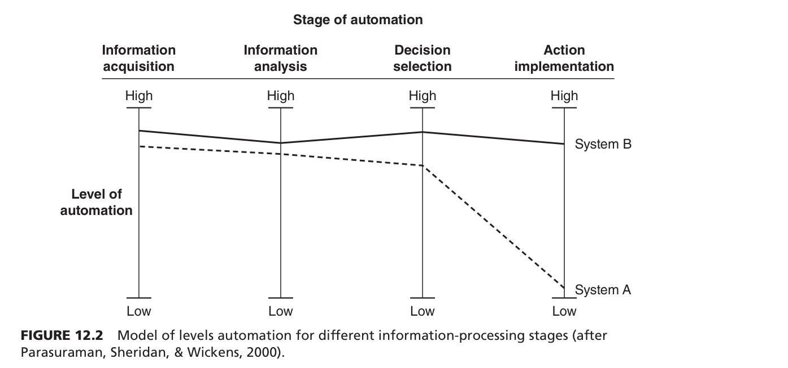
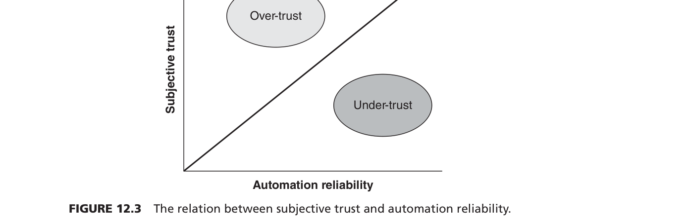
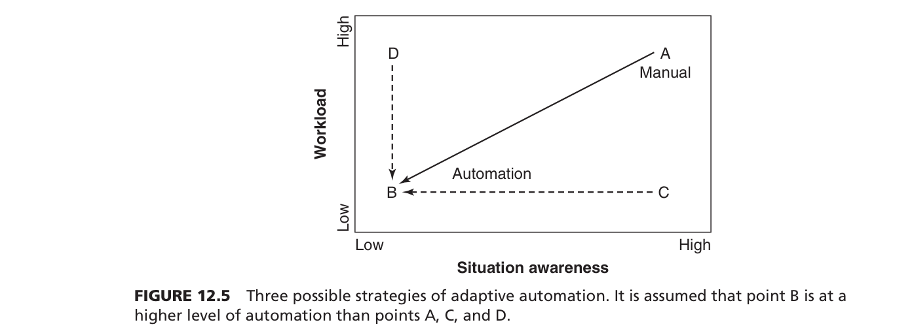
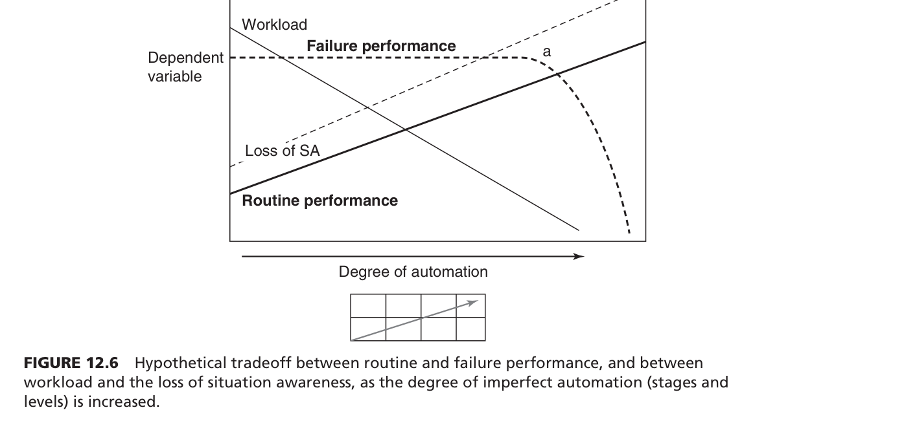
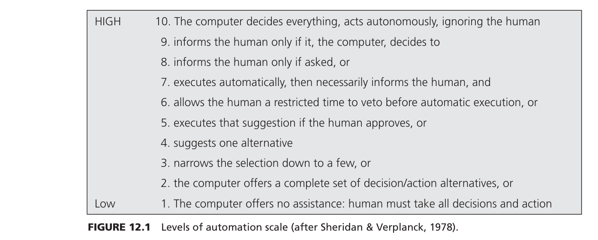
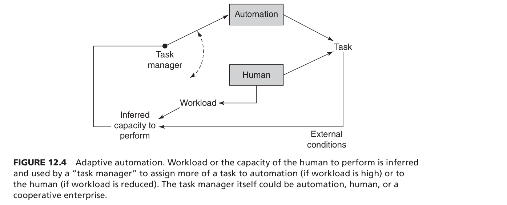

심리학과 신입생이시군요! 환영합니다. 영어를 읽지 못해도, 앞으로 배울 계획이 없더라도 전혀 걱정하지 마세요. 이 전공 서적의 12장 **"자동화와 인간 수행(Automation and Human Performance)"**의 내용을 혼자서도 완벽하게 소화할 수 있도록, 아주 쉽고 논리적으로 단계별 안내를 해드리겠습니다. 

오늘은 그 첫 번째 단계인 **STEP 1: 챕터 프리뷰(Preview)**입니다. 큰 그림을 먼저 그려봅시다.

---

### 1. 이 챕터의 가장 큰 주제와 우리가 이것을 배우는 이유

**가장 큰 주제:** 
이 챕터의 핵심은 **"기계(자동화)가 발전할수록 인간의 역할은 줄어드는 것이 아니라, 오히려 완전히 새로운 방식의 인지적, 심리적 문제를 만들어내므로 '인간-기계의 상호작용'을 이해해야 한다"**는 것입니다.

**왜 이 챕터를 배워야 할까요?**
우리는 흔히 기술이 발전해서 자동화(예: 자율주행, 비행기 자동조종, 의료 진단 AI 등)가 완벽해지면 인간의 실수(Human Error)가 사라지고 편해질 것이라고 믿습니다. 하지만 심리학적인 관점에서 보면 이는 착각입니다. 기계가 똑똑해질수록 기계를 감시하는 인간은 지루함을 느끼고 집중력을 잃거나 기계를 너무 믿어버리는 등 **'새로운 유형의 심리적 문제'**를 겪게 됩니다. 심리학도인 우리는 기술 중심이 아닌 **'인간 중심(Human-centered)'**으로 기계와 인간이 어떻게 조화롭게 일할 수 있는지 설계하기 위해 이 챕터를 배웁니다.

---

### 2. 하위 섹션들의 논리적 흐름과 연결성

이 챕터는 한 편의 흥미로운 이야기처럼 전개됩니다.

1. **자동화의 예시와 목적 (섹션 1~2):** 먼저 자동화가 무엇이고 왜 쓰는지(비용 절감, 인간의 한계 극복 등) 긍정적인 면을 살펴봅니다.
2. **자동화 관련 사고들 (섹션 3):** 하지만 완벽해 보이는 자동화 시스템 때문에 벌어진 끔찍한 사고(항공기 추락, 선박 좌초 등)들을 보여주며 "무언가 잘못되었다"는 문제 제기를 합니다.
3. **분석 틀 제시: 자동화의 수준과 단계 (섹션 4):** 문제를 분석하기 위해, 자동화를 단순히 '있다/없다'가 아니라 10개의 '수준(Levels)'과 4개의 '단계(Stages)'로 쪼개어 과학적으로 분류하는 법을 배웁니다.
4. **문제의 원인 파악 (섹션 5~6):** 기계가 너무 복잡해지고(Complexity), 기계가 지금 뭘 하고 있는지 인간에게 피드백을 주지 않기 때문에 문제가 발생함을 설명합니다.
5. **심리적 핵심 이슈: 신뢰와 의존 (섹션 7):** 이 챕터의 **가장 중요한 심리학적 하이라이트**입니다. 인간이 기계를 너무 믿어서 생기는 문제(안일함)와 너무 안 믿어서 생기는 문제(양치기 소년 효과)를 심도 있게 다룹니다.
6. **해결책 제시 (섹션 8~9):** 그렇다면 어떻게 해야 할까요? 상황에 따라 자동화 수준이 변하는 '적응형 자동화(Adaptive Automation)'와 인간의 심리를 고려한 '인간 중심 설계(Human-Centered Automation)'라는 멋진 해결책으로 마무리됩니다.

---

### 3. 반드시 기억해야 할 '가장 중요한 전문 용어' (Top 6)

심리학 전공생으로서 시험이나 논문에 반드시 등장하는 핵심 용어들입니다. 괄호 안의 번호는 교재의 단락(Source) 위치이며, 학술 인용 정보도 함께 정리했습니다.

*   **인간 중심 자동화 (Human-centered automation)**
    *   *개념:* 기계의 기술적 성능만 신경 쓸 것이 아니라, 인간의 인지적 한계와 특성을 고려하여 인간-기계가 함께 잘 기능하도록 설계하는 접근법.
    *   *학술 인용:* (Billings, 1997)
*   **자동화의 수준과 단계 (Levels and Stages of Automation)**
    *   *개념:* 자동화를 기계가 의사결정을 얼마나 주도하느냐에 따른 10단계(Levels)와, 정보처리 과정에 따른 4단계(Stages)로 나눈 모델.
    *   *학술 인용:* (Sheridan & Verplanck, 1978), (Parasuraman et al., 2000)
*   **안일함 / 과잉 신뢰 (Complacency)**
    *   *개념:* 기계가 너무 잘 작동하다 보니, 인간이 기계를 전적으로 믿고 제대로 감시하지 않거나 다른 일에 한눈을 파는 심리적 상태.
    *   *학술 인용:* (Wiener, 1981), (Parasuraman et al., 1993)
*   **자동화 편향 (Automation bias)**
    *   *개념:* 인간이 자신의 판단이나 주변의 다른 정보보다 자동화 기계의 지시를 훨씬 더 맹신하여, 기계가 틀린 조언을 해도 무비판적으로 따르는 현상.
    *   *학술 인용:* (Mosier & Skitka, 1996), (Mosier & Fischer, 2010)
*   **루프 이탈 증후군 / OOTLUF (Out of the loop unfamiliarity)**
    *   *개념:* 기계가 모든 것을 다 하다 보니, 인간이 상황 파악(Situation Awareness)을 놓치고, 나중에 수동으로 조작해야 할 때 기술을 까먹어버리는 현상(Deskilling).
    *   *학술 인용:* (Lee & Moray, 1994), (Ferris, Sarter, & Wickens, 2010)
*   **적응형 자동화 (Adaptive automation)**
    *   *개념:* 고정된 자동화가 아니라, 인간의 현재 작업 부하(Workload)나 스트레스 상태를 시스템이 파악하여 상황에 맞게 기계가 개입하는 정도를 동적으로 바꾸는 시스템.
    *   *학술 인용:* (Hancock & Chignell, 1989), (Parasuraman et al., 1992)

---

### 4. 전체 구조 도식화 (Mind Map / Flow Chart)

아래의 지도를 머릿속에 넣어두면 이 단원을 공부할 때 길을 잃지 않습니다.

```text
[ 단원 전체 Flow Chart : 인간과 자동화의 공존 ]

1. 도입 (배경과 혜택) 
   ├─ 자동화는 왜 널리 퍼졌는가? (인간 한계 극복, 작업량 감소, 경제성)
   └─ 하지만 완벽한가? (NO!)

        ⬇️ (그렇다면 무엇이 문제일까?)

2. 원인 진단 (자동화의 특성)
   ├─ 복잡성 증가 (Complexity): "기계가 속으로 무슨 생각을 하는지 모르겠어"
   └─ 피드백 부재 (Feedback): "상태가 변했는데 기계가 나한테 말을 안 해줘"

        ⬇️ (이런 기계 특성이 인간의 심리에 어떤 영향을 미치는가?)

3. 심리적 핵심 이슈 (신뢰의 불균형 - Trust Calibration)
   ├─ [너무 믿을 때 / Over-trust] 
   │     ├─ Complacency (안일함: 감시 소홀)
   │     ├─ Automation Bias (자동화 편향: 맹신)
   │     └─ OOTLUF (루프 이탈: 상황 인식 상실 및 수동 조작 기술 퇴화)
   │
   └─ [너무 안 믿을 때 / Under-trust]
         └─ Cry wolf effect (양치기 소년 효과: 잦은 오작동 알람으로 알람을 꺼버림)

        ⬇️ (이 심리적 문제를 어떻게 해결할 것인가?)

4. 심리학적 해결책 (설계 및 대안)
   ├─ 자동화의 수준(Levels)과 단계(Stages)를 업무에 맞게 최적화하기
   ├─ 인간의 작업 부하에 맞춰 변신하는 '적응형 자동화 (Adaptive Automation)' 적용
   └─ 기계도 인간처럼 '예의(Etiquette)'를 갖춰 피드백하게 만드는 '인간 중심 설계'
```

**💡 [도식화 보충 설명 - 쉽게 이해하기]**
이 흐름도는 **"기대 -> 실망 -> 원인 분석(심리) -> 심리적 해결책"**이라는 기승전결의 구조를 가집니다. 
처음에는 자동화가 인간의 일을 덜어줄 거라 기대했지만(1. 도입), 기계가 너무 복잡해지고 인간과 소통하지 않으면서 사고가 터집니다(2. 원인 진단). 
이때 인간의 마음속에서는 아주 흥미로운 일이 벌어지는데, 기계를 **'너무 과하게 믿거나(과잉 신뢰)'** 반대로 잦은 거짓 알람에 질려 **'아예 무시해버리는(과소 신뢰)'** 두 가지 극단적인 태도를 보입니다(3. 심리적 핵심 이슈). 
심리학자들은 이 문제를 해결하기 위해, 단순히 기계의 성능을 올리는 대신 기계가 상황에 맞춰 인간을 돕도록(적응형 자동화) 만들고, 인간이 이해하기 쉽게 소통하는 방식(인간 중심 설계)을 제안하는 것(4. 해결책)으로 이야기가 마무리됩니다.

이렇게 뼈대를 잡으셨다면, 이제 본격적인 세부 내용을 한국어로 쉽게 풀어서 하나씩 정복해 나갈 준비가 되셨습니다! 다음 단계로 넘어가고 싶으실 때 언제든 말씀해 주세요.

심리학과 신입생 여러분, 두 번째 단계인 **'핵심 개념 딥다이빙'**에 오신 것을 환영합니다! 

본격적으로 들어가기 전에 한 가지 질문을 해볼게요. **"우리는 왜 여러 가지 이론과 모델들을 하나로 연결해서 배워야 할까요?"**
심리학에서 **'이론(Theory)'**은 인간의 마음이 왜 그렇게 작동하는지 원리를 설명해 주는 '돋보기'와 같습니다. 반면 **'모델(Model)'**은 그 원리를 바탕으로 현실의 문제를 분석하고 해결하기 위해 만든 '설계도(도식)'입니다. 
단편적인 이론 하나만 알면 "사람들은 이럴 때 실수한대~" 하고 끝나버립니다. 하지만 여러 이론과 모델을 연결하면, **"아, A라는 심리적 원인 때문에 B라는 현상이 생기니, C라는 모델을 써서 기계를 이렇게 고치면 사고를 막을 수 있겠구나!"**라는 거대한 '해결의 퍼즐'을 완성할 수 있습니다. 이것이 심리학자처럼 생각하는 방법이자, 연결이 중요한 이유입니다.

참고로 질문해주신 SEEV 모델은 교재에 포함되어 있지만, SSTS나 PCP 같은 모델은 이번 12장 교재 범위에 포함되어 있지 않습니다. 따라서 **이번 장(Source)에 실제로 등장하는 가장 핵심적인 이론과 모델들**을 엄선하여 아주 쉬운 비유와 함께 설명해 드리겠습니다.

---

### 1. 뼈대가 되는 심리학 '이론(Theory)'들

**① 주의 경계의 기대 이론 (Expectancy Theory of Vigilance)** - *Parasuraman (1987)*
*   **왜 만들어졌나?** 기계가 알아서 잘 돌아갈 때, 왜 인간은 기계의 고장(신호)을 눈치채지 못하고 멍때리게 되는지 설명하기 위해 만들어졌습니다.
*   **세부 요소:** '기대치(Expectancy)'와 '신호 탐지(Signal Detection)'. 
*   **쉬운 비유 (상호작용):** **'양치기 소년과 평화로운 마을'**을 생각해보세요. 마을에 늑대가 나타난 적이 거의 없으면, 사람들의 머릿속에는 "오늘도 늑대는 안 올 거야"라는 **기대치**가 생깁니다. 기대치가 낮아지면, 실제로 늑대가 나타나서 풀스럭거리는 소리(신호)가 나도 무시하게 됩니다. 기계가 완벽할수록 인간은 "고장 안 나겠지" 하고 기대해버려서 진짜 고장을 놓치게 됩니다.

**② 생성 효과 이론 (Generation Effect)** - *Farrell & Lewandowsky (2000), Slamecka & Graf (1978)*
*   **왜 만들어졌나?** 기계한테 일을 다 맡겨버리면, 나중에 수동으로 조작해야 할 때 왜 머리가 하얘지는지(상황 인식 상실) 설명하기 위해 만들어졌습니다.
*   **세부 요소:** '스스로 한 행동(직접 생성)' vs '남이 한 행동(수동적 관찰)'.
*   **쉬운 비유 (상호작용):** **'운전대 잡기 vs 조수석 타기'**입니다. 내가 직접 운전(직접 생성)해서 가면 길을 잘 기억하지만, 택시나 친구 차 조수석에 앉아서 풍경만 보면(수동적 관찰) 나중에 그 길을 절대 혼자 못 찾아갑니다. 기계가 결정을 다 해버리면 인간은 조수석에 탄 셈이 되어, 기계가 고장 났을 때 무엇을 해야 할지 까먹게 됩니다.

---

### 2. 문제를 분석하고 해결하는 '모델(Model)'들

**① 자동화의 단계와 수준 모델 (Model of Levels and Stages of Automation)** - *Parasuraman, Sheridan, & Wickens (2000), Sheridan & Verplanck (1978)*
*   **왜 만들어졌나?** 자동화를 단순히 "켰다/껐다"로만 보면 기계를 어떻게 설계해야 할지 알 수 없습니다. 자동화를 과학적으로 쪼개서 분석하기 위해 만든 모델입니다.
*   **세부 요소:** 
    *   **4개의 단계(Stages):** 1. 정보 획득 -> 2. 정보 분석 -> 3. 의사결정 -> 4. 행동 실행.
    *   **10개의 수준(Levels):** 1(완전 수동)부터 10(완전 자동)까지 기계가 개입하는 정도.
*   **쉬운 비유 (상호작용):** **'요리사와 주방 보조(기계)의 관계'**입니다. 주방 보조가 냉장고에서 재료만 꺼내올지(1단계 정보 획득), 재료의 상태를 분석해줄지(2단계 정보 분석), 오늘 무슨 요리를 할지 메뉴를 정해줄지(3단계 의사결정), 아니면 셰프를 밀어내고 자기가 볶고 끓이고 다 할지(4단계 행동 실행)를 정하는 '업무 분담표'입니다.

**② 신뢰 보정 곡선 모델 (Trust Calibration Curve)** - *Lee & See (2004), Parasuraman et al. (1993)*
*   **왜 만들어졌나?** 인간이 기계를 믿는 마음(주관적 신뢰)과 기계의 실제 성능(객관적 신뢰도)이 엇갈릴 때 얼마나 큰 대형 사고가 나는지 시각적으로 보여주기 위해 만들어졌습니다.
*   **세부 요소:** 실제 기계의 '신뢰도(X축)', 인간의 주관적 '신뢰 및 의존도(Y축)', 완벽한 균형을 뜻하는 '보정 선(대각선)', 그리고 과잉 신뢰(안일함)와 과소 신뢰(불신) 구역.
*   **쉬운 비유 (상호작용):** **'연인 사이의 콩깍지'**와 같습니다. 처음엔 기계가 너무 완벽해 보여서 100% 맹신(과잉 신뢰/안일함)합니다. 그러다 기계가 한 번 치명적인 실수(First failure)를 저지르면 충격을 받습니다. 그 후에는 기계가 90% 잘 작동해도 "한 번 속지 두 번 속냐!"라며 아예 기계를 꺼버리는(과소 신뢰/양치기 소년 효과) 극단적인 변화를 보여줍니다.

**③ SEEV 시각 탐색 모델 (SEEV Model of Scanning)** - *Wickens 교재 3장 개념의 응용*
*   **왜 만들어졌나?** 인간이 수많은 기계 계기판 중에서 '어디를, 왜 쳐다보는지(또는 안 보는지)'를 수학적으로 예측하기 위해 만들어졌습니다.
*   **세부 요소:** 현저성(Salience), 노력(Effort), 기대(Expectancy), 가치(Value).
*   **쉬운 비유 (상호작용):** **'보물찾기'**입니다. 아무리 중요한 가치(V)를 지닌 보석이라도, 그게 저기 있을 거라는 기대(E)가 낮으면 사람들은 고개를 돌려(노력, E) 찾아보지 않습니다. 자동화 기계가 고장 날 리 없다고 '기대'해버리면 모니터를 아예 쳐다보지도 않는 현상을 설명합니다.

**④ 적응형 자동화 모델 (Adaptive Automation Model)** - *Hancock & Chignell (1989), Parasuraman et al. (1992)*
*   **왜 만들어졌나?** 한 번 정해진 자동화(고정형)는 인간이 지루할 때나 바쁠 때 대처하지 못합니다. 인간의 상태에 맞춰 기계가 카멜레온처럼 변신하도록 만들기 위해 고안되었습니다.
*   **세부 요소:** 인간의 '작업 부하(Workload/능력)', 이를 판단하는 '작업 관리자(Task Manager)', 실시간으로 변하는 '자동화 분담 비율'.
*   **쉬운 비유 (상호작용):** **'전기 자전거(스마트 자전거)'**입니다. 평지에서 라이더가 쌩쌩 달릴 땐(작업 부하 낮음) 모터가 꺼져서 라이더가 직접 페달을 밟게 하고(졸음 방지), 오르막길을 만나 라이더가 헉헉대면(작업 부하 높음) 센서가 이를 감지해 모터(자동화)가 켜지면서 밀어주는 원리입니다.

---

### 3. 이론과 모델의 연결 관계 (MIND MAP & Flow Chart)

심리학 이론(원인)들이 어떻게 맞물려 사고를 일으키고, 어떤 모델(해결책)로 극복하는지 하나의 이야기로 엮은 흐름도입니다.

```text
[ 인간-기계 상호작용의 성공과 실패 Flow Chart ]

[시작: 설계]
▶ '자동화 단계/수준 모델 (Levels & Stages)' 
   (기계에게 너무 많은 3~4단계 의사결정과 행동 통제권을 넘겨버림)
          ⬇️
[문제 발생: 심리적 원인 (이론)]
▶ '기대 이론 (Expectancy Theory)' 발동 
   : "기계가 다 하니까 고장 안 나겠지?" -> 감시를 소홀히 함
▶ 'SEEV 모델' 발동
   : 고장 날 '기대'가 없으니 계기판을 쳐다보지 않음
▶ '생성 효과 이론 (Generation Effect)' 발동
   : 내가 직접 운전(선택)하지 않으니 기계가 뭘 하는지 다 까먹음
          ⬇️
[위기: 심리적 결과]
▶ '신뢰 보정 모델 (Trust Calibration)'의 불균형!
   : 인간이 기계를 맹신하는 **과잉 신뢰(안일함)** 상태에 빠짐
   💥 [사고 발생!] 기계의 첫 고장 (First Failure) 발생 시 대처 불가
          ⬇️
[해결책: 구조적 대안]
▶ '적응형 자동화 모델 (Adaptive Automation)' 적용!
   : 기계에 100% 맡기지 않고, 인간이 바쁠 때만 도와주고 한가할 땐
     인간에게 다시 운전대를 돌려줌 (과잉 신뢰와 기술 퇴화 방지)
```

**💡 [흐름도(Flow Chart) 보충 설명 - 신입생을 위한 해설]**

이 차트는 **"완벽한 기계가 어떻게 인간을 바보로 만들고, 심리학은 이를 어떻게 구출하는가?"**를 보여주는 지도입니다.

1. 기술자들이 **[자동화 단계/수준 모델]**을 써서 기계를 너무 똑똑하게(레벨 10) 만듭니다.
2. 그러자 인간의 마음속에서 심리학 **[이론]**들이 나쁜 쪽으로 작동하기 시작합니다. 기계가 알아서 잘하니 고장 날 리 없다는 **[기대 이론]**과 **[SEEV 모델]** 때문에 딴짓을 하고, 내가 직접 고민하지 않으니 머리가 굳어버립니다(**[생성 효과 이론]**).
3. 이 상태를 **[신뢰 보정 모델]**로 그려보면, 내 진짜 실력은 바닥인데 기계만 철썩같이 믿고 있는 '과잉 신뢰'의 꼭대기에 위태롭게 서 있는 것과 같습니다. 이때 기계가 툭 꺼지면 대형 사고가 납니다.
4. 심리학자들은 이를 해결하기 위해 **[적응형 자동화 모델]**이라는 마법을 씁니다. 인간의 두뇌가 녹슬지 않게(생성 효과 유지), 그리고 맹신하지 않게(과잉 신뢰 방지) 상황에 따라 기계의 개입 수준을 오르락내리락 조절해주는 것이죠.

이렇게 이론과 모델이 톱니바퀴처럼 맞물려 하나의 완벽한 '인간 중심 설계'를 만들어냅니다! 아주 기초적인 내용부터 천천히 다뤄보았는데, 이 흐름이 머릿속에 잘 그려지시나요? 다음 단계로 넘어가고 싶으시다면 언제든 편하게 말씀해 주세요!

세 번째 단계인 **STEP 3: 현실 세계 적용 (Real-world Case Study)** 입니다! 

이제 심리학과 학생으로서 배운 거창한 이론들을 타 전공 친구들에게 아주 쉽고 재미있게 "썰"을 풀듯이 설명해 볼 시간입니다. 친구와 카페에 앉아 수다를 떤다고 상상해 보세요. 교재에 등장한 굵직한 실제 사건들을 이론과 엮어 설명하고, 우리 일상생활의 예시로 한 번 더 확인시켜 주면 완벽합니다.

---

### 1. 타 전공 친구에게 들려주는 '책 속 실제 사례와 심리 이론'

친구에게 이렇게 이야기를 시작해 보세요. *"너 혹시 완벽해 보이는 기계 때문에 사람이 죽거나 큰 사고가 나는 이유가 뭔지 알아? 기술이 부족해서가 아니라, 우리 '사람의 심리' 때문이야."*

#### 💡 사례 1: 투명 고릴라와 유람선 좌초 사건
*   **적용 이론:** 변화맹 (Change Blindness) & 안일함/과잉 신뢰 (Complacency)
*   **친구에게 설명하기:** "너 농구공 패스하는 영상 보느라 그 사이로 지나가는 '고릴라' 못 본 실험(Simons & Chabris, 1999) 알지? 이걸 **'변화맹'**이라고 해. 집중하는 곳이 다르면 눈앞에 뻔히 있는 변화도 뇌가 인식을 못 하는 거지. 
실제로 1995년에 '로열 마제스티'라는 거대한 유람선이 어이없이 암초에 박힌 사건이 있었어 (Parasuraman & Riley, 1997). GPS 연결이 끊겨서 배가 엉뚱한 곳으로 가고 있었는데, 자동항법장치 모니터 구석에 상태를 알리는 아주 작은 글자 하나가 바뀌었거든. 근데 선원들은 기계를 너무 맹신(**과잉 신뢰**)한 나머지 다른 업무를 하느라 그 고릴라 같은 미세한 변화(**변화맹**)를 아예 못 본 거야."

#### 💡 사례 2: 멀쩡한 비행기 엔진을 꺼버린 조종사들
*   **적용 이론:** 자동화 편향 (Automation Bias)
*   **친구에게 설명하기:** "사람은 생각하기 귀찮아지면 기계가 하는 말을 무비판적으로 따르는 경향이 있어. 이걸 **'자동화 편향'**이라고 해 (Mosier & Skitka, 1996). 
항공기 시뮬레이터 실험에서, 기계가 에러를 일으켜서 '오른쪽 엔진에 불이 났으니 끄라'고 잘못된 지시를 내렸어. 창밖을 보거나 다른 계기판(원시 데이터)을 한 번만 확인했어도 거짓말인 걸 알았을 텐데, 무려 75%의 조종사가 기계 말만 믿고 멀쩡한 엔진을 꺼버렸어 (Mosier et al., 1992). 의사들이 AI 진단 프로그램이 틀린 조언을 했을 때 오진율이 높아지는 것(Goddard et al., 2012)도 다 똑같은 현상이야."

#### 💡 사례 3: 시끄러운 알람을 꺼버린 간호사와 관제사
*   **적용 이론:** 양치기 소년 효과 (Cry wolf effect) / 과소 신뢰 (Under-trust)
*   **친구에게 설명하기:** "기계가 너무 잦은 경고를 보내면 어떻게 될까? 마취과 간호사들을 관찰했더니, 환자 모니터에서 울리는 알람의 무려 42%를 그냥 무시했대 (Seagull & Sanderson, 2001). 평소에 가짜 알람이 너무 많았기 때문이야.
이 **'양치기 소년 효과'** 때문에 끔찍한 사고도 났어. 1997년에 대한항공 여객기가 괌에서 추락했는데, 당시 항공 관제사들이 충돌 방지 시스템의 알람이 하도 자주 울려서 아예 시스템을 꺼버린 상태였어 (Joint Commission, 2002; 교재의 괌 추락 사례). 기계를 못 믿어서(**과소 신뢰**) 진짜 위험을 놓친 거지."

#### 💡 사례 4: 조종대를 당겨버린 기장
*   **적용 이론:** 루프 이탈 증후군 (OOTLUF) & 기술 퇴화 (Deskilling)
*   **친구에게 설명하기:** "2009년에 콜건 에어와 에어프랑스 여객기가 추락한 사건이 있어. 비행기가 공중에서 속도를 잃고 떨어질 때(실속), 조종사는 기본 수칙대로 기수를 '숙여서' 속도를 높여야 해. 그런데 기장들이 당황해서 조종대를 거꾸로 냅다 '당겨버렸어'. 
왜 그랬을까? 평소에 오토파일럿(자동 비행)만 켜고 직접 비행을 안 하다 보니, 위급 상황에서 손이 어떻게 움직여야 하는지 까먹어버린 거야. 기계에 일을 다 맡기면 상황 파악을 놓치고 내 기술마저 녹슬어버리는 현상을 **'기술 퇴화(Deskilling)'**라고 해."

---

### 2. 일상생활 예시로 "내가 제대로 이해한 게 맞는지" 확인하기

친구가 "아~ 대충 알겠는데, 내 일상에서는 어떤 게 있어?"라고 물어볼 때 꺼낼 수 있는 **새로운 일상 사례**입니다. 이 예시들을 통해 나의 이론 이해도가 정확한지 확인해 볼 수 있습니다.

*   **📱 [자동화 편향 & 기술 퇴화] 스마트폰 길찾기 (내비게이션) 앱**
    *   **나의 일상 적용:** "우리가 카카오맵이나 구글맵만 보고 걸어갈 때, 주변 간판이나 도로를 안 보고 화면 속 파란 점만 따라가잖아? 그러다 앱이 오류가 나서 막힌 골목으로 안내해도 멍청하게 그 길로 들어가는 것! 이게 바로 기계의 지시를 무비판적으로 따르는 **'자동화 편향'**이야. 그리고 매일 가는 길인데도 폰 배터리가 꺼지면 길을 아예 못 찾는 것, 직접 내 머리로 길을 찾지 않아서 능력을 상실한 **'루프 이탈/기술 퇴화(OOTLUF)'**의 완벽한 예시지!"
*   **💻 [안일함(과잉 신뢰)] 대학 과제와 AI 번역기 / 맞춤법 검사기**
    *   **나의 일상 적용:** "과제할 때 파파고나 챗GPT(또는 맞춤법 검사기) 돌려놓고, '알아서 잘했겠지' 하고 원본 데이터(Raw data)를 한 번도 안 읽어보고 그대로 복사해서 제출한 적 있지? 그러다 교수님한테 말도 안 되는 오역으로 혼난 경험. 기계가 잘 작동할 거라고 맹신해서 내 감시 의무를 소홀히 한 전형적인 **'과잉 신뢰 및 안일함(Complacency)'**이야."
*   **⏰ [양치기 소년 효과] 단톡방 알림과 공부 집중력**
    *   **나의 일상 적용:** "공부할 때 스마트폰 단톡방이나 앱 알림(푸시)이 수십 개씩 계속 울리면 나중엔 짜증 나서 아예 무음 모드로 뒤집어 놓거나 알림을 무시해 버리잖아? 그러다가 진짜 중요한 조별 과제 긴급 공지나 가족의 급한 연락을 놓치게 되지. 불필요한 알람(거짓 알람)이 너무 많아서 진짜 중요한 신호까지 무시해버리는 **'양치기 소년 효과(Cry wolf effect)'**가 바로 이거야."

*(스스로 체크: 위 일상 예시들이 교재의 이론을 완벽하게 관통하고 있습니다. 아주 훌륭한 이해도입니다!)*

---

### 3. 참고 문헌 (APA 양식)

교재(Source) 내에 언급된 연구 인용 정보를 바탕으로 작성된 APA(미국심리학회) 양식 참고문헌입니다. *(참고: 교재 본문에 완전한 참고문헌 리스트가 제공되지 않았으므로, 본문에 명시된 저자와 연도, 연구 내용을 바탕으로 APA 형식의 틀에 맞게 재구성했습니다. 실제로 존재하지 않는 허구의 URL은 삽입하지 않았습니다.)*

*   Goddard, K., Roudsari, A., & Wyatt, J. C. (2012). Automation bias: a systematic review of frequency, effect mediators, and mitigators. *Journal of the American Medical Informatics Association*. 
*   Joint Commission. (2002). Ventilator alarms and patient safety. *Sentinel Event Alert*, (25).
*   Mosier, K. L., Palmer, E. A., & Degani, A. (1992). Electronic checklists: Implications for decision making. *Proceedings of the Human Factors Society Annual Meeting*, 36(1), 7-11.
*   Mosier, K. L., & Skitka, L. J. (1996). Human decision makers and automated decision aids: Made for each other? In R. Parasuraman & M. Mouloua (Eds.), *Automation and human performance: Theory and applications* (pp. 201-220).
*   Parasuraman, R., & Riley, V. (1997). Humans and automation: Use, misuse, disuse, abuse. *Human Factors*, 39(2), 230-253.
*   Seagull, F. J., & Sanderson, P. M. (2001). Anesthesia alarms in context: An observational study. *Human Factors*, 43(1), 76-78.
*   Simons, D. J., & Chabris, C. F. (1999). Gorillas in our midst: Sustained inattentional blindness for dynamic events. *Perception*, 28(9), 1059-1074.

---

이제 이 3단계를 거치며 전공 서적의 뼈대(구조), 핵심 이론(딥다이빙), 그리고 현실 적용(스토리텔링)까지 모두 마스터하셨습니다! 영어를 읽지 않아도 교재 내용이 눈에 잡힐 듯 그려지시나요? 또 다른 궁금한 점이 있거나, 공부하다 막히는 부분이 생기면 언제든 질문해 주세요!


인스타그램에 올릴 만한 아주 힙하고 직관적인 '심리학 꿀팁' 게시물을 만들어 볼게! 친구들에게 어려운 전공 지식을 아주 찰떡같은 비유와 함께 설명해 주면, 다들 '좋아요'를 누를 수밖에 없을 거야. 

오늘 배운 12장 도표들의 흐름을 먼저 큰 그림으로 잡고, 각 도표를 아주 쉽게 뜯어보자!

---

### 🗺️ [전체 흐름도] 인스타 피드 넘기듯 보는 '자동화 심리 도표' Flow Chart

이 단원의 도표들은 **"인간이 기계랑 어떻게 썸을 타고, 배신당하고, 다시 밀당하는지"**를 보여주는 한 편의 연애 드라마 같은 흐름을 가지고 있어.

```text
[1단계: 설계도] Figure 12.2 (일단 얼마나 맡길까?) 
▶ 기계한테 일을 얼마나 짬 때릴지 결정하는 '업무 분담표' 작성
       ⬇️ (기계한테 일을 다 맡겼더니...)
[2단계: 위기] Figure 12.3 (믿음의 배신)
▶ 내 마음속 믿음 점수와 기계의 실제 실력이 엇갈리며 발생하는 '대참사 (과잉 신뢰/불신)'
       ⬇️ (어떻게 해결하지?)
[3단계: 밀당] Figure 12.5 (눈치껏 도와주기)
▶ 내 뇌가 터지기 직전일 때만 기계가 치고 들어오는 '스마트한 밀당 (적응형 자동화)'
       ⬇️ (결론은?)
[4단계: 딜레마] Figure 12.6 (편안함의 함정)
▶ 기계가 다 해주면 몸은 편하지만, 위기가 닥쳤을 때 나는 바보가 된다는 슬픈 '최종 결론 (트레이드오프)'
```
**💡 [흐름도 보충 설명]** 
처음엔 개발자들이 '기계가 이 정도까지 해주면 인간이 편하겠지?' 하고 설계(1단계)를 해. 근데 쓰다 보니까 인간이 기계를 너무 믿고 딴짓을 하거나 아예 꺼버리는 심리적 에러(2단계)가 나기 시작하는 거지. 그래서 심리학자들이 "아, 기계가 항상 켜져 있으면 안 되고, 사람이 바쁠 때만 눈치껏 켜지게 만들자!"라고 해결책(3단계)을 냈어. 마지막 도표(4단계)는 "결국 편안함과 바보가 되는 것 사이에서 완벽한 정답은 없고, 상황에 맞게 적당한 선을 타야 한다"는 이 책의 최종 교훈을 쾅 찍어주는 흐름이야.

---

### 📊 첫 번째 이미지: "기계야, 너 어디까지 할래?" (Figure 12.2)



이 표는 기계랑 나랑 일을 어떻게 나눌지 정하는 **'자동화 단계와 수준 모델'**이야 (Parasuraman, Sheridan, & Wickens, 2000).

*   **가로축 (X축):** '내 눈으로 찾기 -> 뇌로 분석하기 -> 결심하기 -> 몸으로 실행하기'의 **일 처리 순서**.
*   **세로축 (Y축):** '기계가 나대는 정도' (아래쪽은 얌전함, 위쪽은 혼자 다 해버림).

👉 **손가락 지시법 (Point-and-Tell):** 
"1. 먼저 표 안에 찍힌 점선 박스들을 보세요. 2. 아래쪽에 있는 'System A'를 보면, 정보 찾고 결정하는 건 위쪽(기계가 많이 개입함)에 있는데, 마지막 '행동 실행하기'는 맨 아래(인간이 직접 함)에 뚝 떨어져 있죠? 3. 이게 바로 기계가 조언까지만 해주고 방아쇠는 내가 당기는 시스템입니다. 반면 쫙 다 위에 찍힌 'System B'는 기계가 혼자 북치고 장구치고 다 하는 거고요!".

🎮 **밈(Meme) 매칭: '아이언맨 슈트의 자비스(JARVIS)'**
System A는 토니 스타크가 "자비스, 적들 약점 분석해!"라고 하면 화면에 빨간색으로 약점만 띄워주고 총은 토니가 직접 쏘는 상황이야. System B는 토니가 기절했을 때 자비스가 혼자 알아서 날아가고 미사일 쏘고 다 하는 '자율 모드'지. 무조건 B가 좋은 게 아냐. B로만 두면 나중에 슈트 수동 조작법을 다 까먹게 되거든!.

---

### 📈 두 번째 이미지: "호구 잡히거나, 아예 쌩까거나" (Figure 12.3)



이 챕터에서 제일 중요한 **'신뢰 보정 곡선 (Trust Calibration Curve)'**이야! (Lee & See, 2004).

*   **가로축 (X축):** 기계가 진짜로 안 틀리고 일 잘하는 **'기계의 팩트 실력 점수'**.
*   **세로축 (Y축):** 내가 기계를 맹목적으로 믿는 **'내 마음속 콩깍지 지수'**.

👉 **손가락 지시법 (Point-and-Tell):** 
"1. 가운데를 가로지르는 대각선 선을 쓱 따라가 보세요. 기계 실력만큼만 딱 믿는 '완벽한 팩트 체크' 선입니다. 2. 근데 왼쪽 위에 텅 빈 구역(Over-trust)을 보세요. 기계 실력은 똥망인데 내 믿음만 하늘을 찌르죠? 이걸 '안일함'이라고 해요. 3. 이번엔 오른쪽 아래(Under-trust)를 보세요. 기계가 90% 잘 맞히는데 내 믿음은 바닥에 쳐박혀 있죠? 한 번 데이고 나서 아예 삐져버린 상태입니다!".

💣 **밈(Meme) 매칭: '조별과제의 프리라이더 팀원'**
왼쪽 위 구역은, 학점 잘 받던 선배가 "내가 다 할게" 하길래 철석같이 믿고(안일함) 난 피시방 갔는데 나중에 보니 PPT가 보노보노인 상황이야. 그러다 한 번 크게 통수(First failure)를 맞잖아? 그럼 그 선배가 다음 과제 때 90% 완벽하게 자료조사를 해와도 "됐어, 내가 다 해!" 하고 쌩까버리는(오른쪽 아래 알람 무시) 상태로 돌변하는 거랑 완벽히 똑같아!.

---

### 📉 세 번째 이미지: "스마트한 PT 쌤의 눈치 게임" (Figure 12.5)



고정된 기계의 한계를 극복하는 **'적응형 자동화 (Adaptive Automation) 전략'** 도표야.

*   **가로축 (X축):** 내가 지금 상황을 얼마나 빠릿빠릿하게 파악하고 있는지를 나타내는 **'내 머릿속 상황 파악 점수'**.
*   **세로축 (Y축):** 지금 내 뇌가 터지기 일보 직전인 **'스트레스 폭발 지수'**.

👉 **손가락 지시법 (Point-and-Tell):** 
"1. 오른쪽 아래 A 포인트를 보세요. 상황 파악은 최고조인데 스트레스 지수가 뚫고 나갈 기세죠? 내가 모든 걸 다 하느라 죽기 직전입니다. 2. 반대로 왼쪽 위 B를 보세요. 스트레스는 0인데 상황 파악도 0이 돼버린 바보 상태입니다. 3. 그래서 A와 B로 극단적으로 가지 않고, 꺾이는 화살표처럼 중간(C나 D) 쯤에서 기계가 눈치껏 치고 빠지게 만드는 게 이 도표의 목표예요!".

🏋️ **밈(Meme) 매칭: '헬스장 트레이너 쌤의 벤치프레스 보조'**
내가 벤치프레스를 하는데 힘이 넘칠 땐(A 지점) 쌤이 손가락 하나 안 대. 그러다 내 팔이 부들부들 떨리면서 깔리기 직전(스트레스 최고조)이 되면? 쌤(인공지능)이 슥 와서 살짝 들어주지(C 지점으로 이동). 근데 쌤이 처음부터 끝까지 다 들어버리면(B 지점) 내 운동은 1도 안 되고 멍때리게 되잖아? 기계도 내 뇌 상태를 읽고 딱 필요한 만큼만 도와줘야 한다는 이론이야!.

---

### 🎢 네 번째 이미지: "편안함의 대가는 참혹하다" (Figure 12.6)



기계를 설계할 때 부딪히는 뼈아픈 현실, **'자동화의 딜레마 (Tradeoff Curve)'**를 보여줘 (Wickens et al., 2010).

*   **가로축 (X축):** '기계한테 운전대를 넘겨준 정도' (오른쪽으로 갈수록 기계가 다 함).
*   **세로축 (Y축):** '평소의 편안함' 혹은 '사고 났을 때의 폭망 정도' (결과값).

👉 **손가락 지시법 (Point-and-Tell):** 
"1. 오른쪽 끝으로 시선을 쫙 보내보세요. 2. 위로 가파르게 치솟는 점선을 짚어보세요. 기계한테 다 넘기니까 평소(Routine)엔 퍼포먼스가 미친 듯이 올라가죠? 3. 근데 바로 밑으로 곤두박질치는 까만 실선을 보세요. 갑자기 기계가 고장(Failure)났을 때 대처하는 내 실력은 나락으로 가고 있다는 뜻이에요. 편안함(위)과 대처 능력(아래)이 서로 반대로 가며 X자를 그리는 거 보이시죠?".

🚗 **밈(Meme) 매칭: '테슬라 오토파일럿 켜고 고속도로 꿀잠 썰'**
가로축 맨 오른쪽 끝은, 고속도로에서 오토파일럿 켜놓고 유튜브 보는 상황이야. 차선도 잘 잡고 알아서 가니까 평소 승차감이나 편안함은 최고(점선 폭발)지! 근데 갑자기 앞에 공사장이 나타나서 오토파일럿이 꺼지는 순간(Failure)? 평소에 핸들을 안 잡아서 내 운전 감각이 똥망(루프 이탈 증후군)이 된 탓에 브레이크를 못 밟고 그대로 박아버리는(실선 나락) 거야. 결국 '위로 솟는 꿀빨기'와 '아래로 꺼지는 내 실력 퇴화' 사이에서, 중간 어디쯤 '가장 적당한 타협점'을 찾아야 한다는 게 이 그래프의 핵심 시사점이지!.

---

**📚 인스타그램 캡션용 레퍼런스 (APA 양식)**
*(교재 내 인용된 핵심 연구 정보입니다)*
*   Endsley, M. R., & Kiris, E. O. (1995). The out-of-the-loop performance problem and level of control in automation. *Human Factors*, 37(2), 381-394.
*   Lee, J. D., & See, K. A. (2004). Trust in automation: Designing for appropriate reliance. *Human Factors*, 46(1), 50-80.
*   Parasuraman, R., Sheridan, T. B., & Wickens, C. D. (2000). A model for types and levels of human interaction with automation. *IEEE Transactions on Systems, Man, and Cybernetics-Part A: Systems and Humans*, 30(3), 286-297.
*   Wickens, C. D., Li, H., Santamaria, A., Sebok, A., & Sarter, N. B. (2010). Stages and levels of automation: An integrated meta-analysis. *Proceedings of the Human Factors and Ergonomics Society Annual Meeting*, 54(4), 389-393.


마지막 다섯 번째 단계인 **STEP 5: 셀프 테스트 및 피드백 (Self-Check)** 입니다! 

지금까지 배운 내용을 단순히 암기하는 것을 넘어, 실제 상황에 배운 이론과 모델, 도표를 적용할 수 있는지 확인해 볼 시간입니다. 이 퀴즈는 12장 전체의 거대한 흐름(Overview)을 꿰뚫어 볼 수 있도록 설계되었습니다. 친구가 혼자서도 완벽하게 복습할 수 있게, 문제와 정답, 그리고 상세한 해설을 나란히 배치했습니다.

먼저 이 퀴즈가 어떤 논리적 흐름으로 구성되어 있는지 Flow Chart를 통해 확인해 볼까요?

---

### 🗺️ [전체 흐름도] 사고력 증진 리뷰 퀴즈 Flow Chart

```text
[퀴즈 1: 현상 진단] 기계를 향한 맹신과 인간의 착각 (과잉 신뢰)
▶ 일상/업무에서 기계를 너무 믿었을 때 나타나는 두 가지 다른 심리적 오류(안일함 vs 자동화 편향) 구분하기
       ⬇️ (그렇다면 기계를 안 믿으면 안전할까?)
[퀴즈 2: 반대 현상] 양치기 소년과 늑대 (과소 신뢰)
▶ 거짓 알람이 반복될 때 나타나는 위험성과 알람의 한계 이해하기
       ⬇️ (도대체 기계가 어디까지 개입하길래 이런 문제가 생기나?)
[퀴즈 3: 구조 분석] 4단계 자동화 모델 적용하기 (도표 12.2 응용)
▶ 일상의 다양한 기계들(자율주행차 vs 의료용 AI)을 자동화의 4가지 단계에 맞춰 과학적으로 분해하기
       ⬇️ (이런 기계와 인간의 관계가 시간이 지나면 어떻게 변할까?)
[퀴즈 4: 동적 변화와 딜레마] 신뢰 보정 곡선과 OOTLUF (도표 12.3 & 12.6 응용)
▶ '첫 번째 고장(First Failure)' 전후로 요동치는 인간의 마음과, 편안함 뒤에 숨겨진 기술 퇴화의 딜레마 분석하기
       ⬇️ (그럼 심리학자로서 어떻게 해결할 것인가?)
[퀴즈 5: 대안 제시] 적응형 자동화와 에티켓 (해결책 설계)
▶ 고정된 기계의 한계를 넘기 위해 '인간 중심'으로 기계를 똑똑하게 설계하는 방법 적용하기
```

**💡 [흐름도 보충 설명]**
이 퀴즈는 단순히 개념을 묻지 않습니다. **"1. 우리는 기계를 너무 믿거나(Q1), 너무 안 믿어서(Q2) 사고를 낸다. -> 2. 기계가 도대체 일을 어떻게 가로채고 있는지 분석해보자(Q3). -> 3. 기계가 처음 고장 났을 때 우리의 심리와 실력이 어떻게 나락으로 떨어지는지 그래프로 확인하자(Q4). -> 4. 마지막으로 심리학자로서 이 문제를 어떻게 설계로 해결할지 제안해보자(Q5)."** 라는 기승전결의 흐름을 가지고 있습니다. 이 5문제를 풀면 12장 전체의 뼈대와 핵심 모델을 일상 사례와 함께 완벽히 마스터할 수 있습니다.

---

### 📝 사고력 중심 셀프 테스트 (문제 & 정답 일체형)

#### **Q1. [과잉 신뢰 적용] 번역기와 내비게이션의 함정**
**상황:** 대학생 A는 영어 과제를 할 때 AI 번역기를 돌린 후, 원본과 대조(검토)하는 과정 없이 그대로 복사해서 제출합니다. 한편 대학생 B는 초행길을 운전할 때 내비게이션이 명백히 '공사 중'인 막힌 길로 가라고 안내하는데도, 눈앞의 표지판(원시 데이터)을 무시하고 내비게이션의 지시대로만 핸들을 꺾습니다. 
**문제:** A와 B가 겪고 있는 심리적 오류는 무엇이며, 두 현상의 미묘한 차이점을 설명해 보세요.

> **✅ 정답 및 해설:**
> *   **A의 현상:** **안일함/과잉 신뢰 (Complacency)**. 기계가 알아서 잘할 것이라 맹신하여 원시 데이터(원본)에 대한 **감시(모니터링)를 소홀히** 하는 현상입니다. 기계에 의존(Reliance)하여 다른 일에 주의를 돌리는 수동적인 오류입니다.
> *   **B의 현상:** **자동화 편향 (Automation Bias)**. 스스로 주변 정보를 찾고 비판적으로 판단하는 대신, 기계가 지시한 행동을 아무런 의심 없이 맹목적으로 따르는(Compliance) 현상입니다. 기계의 지시를 다른 정보보다 절대적인 권위로 받아들이는 적극적인 의사결정 오류입니다 (Mosier & Skitka, 1996).

#### **Q2. [과소 신뢰 적용] 중환자실의 시끄러운 알람**
**상황:** 병원 중환자실에 새로 도입된 스마트 모니터는 환자의 심박수나 산소포화도가 아주 조금만 정상 범위를 벗어나도 시끄러운 경고음을 울립니다. 간호사들은 처음에는 놀라 달려갔지만, 대부분 기계의 지나친 민감함 때문이라는 것을 깨닫고 나중에는 알람이 울려도 "또 오작동이겠지"라며 무시하거나 심지어 알람을 꺼버립니다. 그러다 진짜 위급한 환자를 놓치고 맙니다.
**문제:** 이 상황을 설명하는 심리학적 용어는 무엇이며, 기계 설계자는 왜 애초에 알람이 이렇게 자주 울리도록(오작동하도록) 설계했을까요? (신호 탐지 이론의 측면에서)

> **✅ 정답 및 해설:**
> *   **심리적 용어:** **양치기 소년 효과 (Cry wolf effect) / 불신 (Mistrust/Under-trust)**. 거짓 알람이 너무 잦아 기계를 신뢰하지 못하고 진짜 위험마저 무시하게 되는 현상입니다.
> *   **알람이 잦은 이유:** 기계 설계자는 치명적인 위험을 기계가 놓치는 일(Miss)을 완벽히 방지하기 위해 알람의 **반응 임계치(Threshold, 신호 탐지 이론의 Beta)를 매우 낮게 설정**하기 때문입니다. 진짜 위험을 100% 잡으려다 보니, 위험하지 않은 상황에서도 알람이 울리는 '거짓 알람(False Alarm)'이 필연적으로 급증하게 됩니다 (Sorkin, 1989; Parasuraman et al., 1997).

#### **Q3. [자동화 4단계 모델 적용] 자율주행차 vs 의료 진단 AI**
**상황:** 테슬라의 '오토파일럿(자율주행)' 시스템은 카메라로 차선을 읽고(A), 앞차와의 거리를 계산하고(B), 속도를 줄일지 차선을 바꿀지 결정한 후(C), 실제로 핸들을 꺾고 브레이크를 밟습니다(D). 반면, 의사가 사용하는 '의료 진단 AI(IBM 왓슨 등)'는 환자의 엑스레이를 분석하여 암일 확률을 80%로 예측해서 화면에 보여주지만, 최종 수술 여부 결정과 수술 집도는 의사가 합니다.
**문제:** 12장의 **'자동화의 수준과 단계 (Stages of Automation)'** 모델 (Figure 12.2)을 적용하여, 두 시스템이 어느 단계(Stage)에서 자동화 수준이 높은지 비교 분석해 보세요.

> **✅ 정답 및 해설:**
> *   Parasuraman, Sheridan, & Wickens (2000)의 모델에 따르면 자동화는 1.정보 획득, 2.정보 분석, 3.의사결정, 4.행동 실행의 4단계로 나뉩니다.
> *   **자율주행 시스템:** 1단계(차선 읽기)부터 2단계(거리 계산), 3단계(주행 결정)를 넘어 최종 **4단계(행동 실행: 핸들/브레이크 조작)까지 고도로 자동화**되어 있습니다.
> *   **의료 진단 AI:** 환자 정보 획득(1단계)과 복잡한 암 확률 예측 및 분석(**2단계: 정보 분석**)에서는 자동화 수준이 매우 높습니다. 하지만 최종 판단(3단계)과 실제 수술(4단계)은 기계가 개입하지 않고 인간(의사)이 수행하는 시스템입니다.

#### **Q4. [도표 추론과 딜레마] 첫 번째 고장 (First Failure)과 실력 퇴화**
**상황:** 10년 무사고 경력의 베테랑 파일럿이 최신형 자동 조종 비행기로 기종을 바꿨습니다. 비행기가 알아서 이착륙과 순항을 다 해주니 피로도(Workload)가 엄청나게 줄었고, 파일럿은 기계를 100% 맹신하며 비행 중 딴짓을 하기도 했습니다. 그러던 어느 날, 폭우로 인해 센서가 먹통이 되는 **'첫 번째 고장(First failure)'**이 발생했습니다. 파일럿은 당황하여 엉뚱한 버튼을 누르고 수동 조작에 실패해 추락할 뻔했습니다.
**문제:** 이 파일럿이 첫 고장 직후 겪은 1) 실력 저하 현상을 이 챕터의 핵심 용어로 설명하고 (Figure 12.6 Trade-off 관련), 2) 이 사건 이후 파일럿의 마음속에서 '기계에 대한 신뢰도'는 어떻게 급변하게 될지 **'신뢰 보정 곡선 (Trust Calibration Curve)'** (Figure 12.3)을 근거로 설명하세요.

> **✅ 정답 및 해설:**
> *   **1) 실력 저하 현상:** **루프 이탈 증후군 (OOTLUF; Out of the loop unfamiliarity) 및 기술 퇴화 (Deskilling)**. 기계가 다 해주는 편안함(Workload 감소)의 대가로, 상황 인식 능력을 잃어버리고 비상시 수동으로 대처하는 실력이 녹슬어버린 딜레마 현상입니다 (Wickens et al., 2010의 Figure 12.6 곡선).
> *   **2) 신뢰도의 급변:** 파일럿은 고장 이전에는 도표(Figure 12.3)의 왼쪽 위인 **과잉 신뢰(안일함)** 상태였습니다. 그러나 '첫 번째 고장'을 겪은 직후, 파일럿의 심리는 곡선 반대편인 오른쪽 아래로 곤두박질치며, 기계가 나중에 정상으로 돌아와도 아예 기계를 쓰지 않으려는 **불신/과소 신뢰(Under-trust)** 상태로 극단적인 변화를 겪게 됩니다 (Lee & See, 2004; Yeh et al., 2003).

#### **Q5. [해결책 적용] 똑똑한 기계 설계하기 (적응형 자동화)**
**상황:** 당신은 인간 중심 설계(Human-Centered Automation)를 배운 심리학자입니다. 자동차 회사에서 "운전자들이 자율주행 모드를 켜놓고 자꾸 졸거나 핸드폰을 해서 위험하다"며 해결책을 요구합니다. 기계를 아예 수동으로 바꾸지 않으면서도, 운전자가 바보가 되거나 맹신하는 것을 막기 위한 새로운 시스템을 제안해야 합니다.
**문제:** 이 책의 궁극적 해결책 중 하나인 **'적응형 자동화 (Adaptive Automation)'** 개념을 활용하여, 이 자동차의 시스템을 어떻게 개조할 것인지 구체적으로 설계(아이디어)해 보세요.

> **✅ 정답 및 해설:**
> *   **적응형 자동화의 개념:** 기계의 개입 수준이 고정되어 있는 것(정적 자동화)이 아니라, 인간의 현재 작업 부하나 상태(스트레스, 주의 집중 정도)에 따라 기계가 돕는 정도를 실시간으로 유연하게 바꾸는 시스템입니다 (Hancock & Chignell, 1989; Parasuraman et al., 1992).
> *   **해결책 설계 예시:** 운전자의 눈 깜빡임이나 뇌파(EEG), 심박수 등 생리적 지표를 모니터링하는 센서를 설치합니다. 한산한 고속도로에서 운전자의 작업 부하가 너무 낮아 졸음이나 안일함(루프 이탈)이 감지되면, 자율주행 수준을 낮춰 운전자가 직접 핸들을 조작하게 만듭니다. 반대로 비가 오거나 복잡한 도심에 진입하여 운전자의 스트레스 수치(Workload)가 치솟을 때만 기계가 개입하여 브레이크나 차선 유지를 도와주도록 설계합니다.

---

수고하셨습니다! 이 5개의 퀴즈를 모두 이해하셨다면, 당신은 12장 "자동화와 인간 수행"의 뼈대 이론부터 현실 적용, 도표 해석, 그리고 심리학적 설계 대안까지 완벽하게 마스터한 것입니다! 언제든 궁금한 점이 생기면 다시 돌아와서 질문해 주세요. 심리학과 신입생의 멋진 성장을 응원합니다!


여섯 번째 단계인 **STEP 6: 보완 전략 및 위기 탈출법**입니다.

심리학과 친구가 영어를 평생 공부할 계획이 없더라도 전혀 불안해할 필요가 없습니다. 학부 수준의 심리학 공부에서 중요한 것은 '영어 독해력'이 아니라, 현상을 분석하는 **'인지심리학적 사고력'**이기 때문입니다. 원서를 읽지 못한다는 약점을 완벽하게 커버할 수 있는 전략과, 교수님의 기습 질문에 대비한 3분 스피치 대본을 준비했습니다.

---

### 🛡️ 영어 원서 공포증 극복을 위한 3대 보완 전략

1. **'스토리텔링'과 '사례' 중심으로 이론 덮어쓰기**
   영어로 된 복잡한 정의를 외우려고 하지 마세요. 대신 앞서 STEP 3에서 정리했던 실제 사건(예: 유람선 좌초 사건, 멀쩡한 비행기 엔진을 끈 조종사 등)과 나의 일상 사례(내비게이션 맹신 등)를 이론의 이름표와 1:1로 연결해서 기억하세요. 교수님이 질문할 때 "이론의 정의는~" 대신 "교수님, 혹시 1995년 로열 마제스티 유람선 사건 아십니까? 이 사건이 바로 OOO 이론의 완벽한 예시입니다"라고 답하면 훨씬 깊이 있는 인상을 줍니다.
2. **도표 중심의 '시각적 암기 (Visual Literacy)'**
   영어 텍스트는 건너뛰더라도, 교재에 나오는 도표(Figure)의 X축, Y축, 그리고 곡선의 흐름은 머릿속에 사진처럼 찍어두세요. 모든 핵심 이론은 결국 도표로 요약됩니다. STEP 4에서 연습한 것처럼 도표를 손가락으로 짚어가며 설명할 수 있다면, 원서를 10번 읽은 학생보다 훨씬 정확하게 핵심을 꿰뚫은 것입니다.
3. **'문제 제기 -> 원인 분석 -> 해결책'의 3단 논법 장착**
   이 책은 철저한 기승전결 구조를 따릅니다. "기술이 발전해서 편해졌다(기승) -> 근데 사람이 죽네? 원인이 뭘까?(전) -> 심리학적으로 이렇게 기계를 고치자(결)". 이 뼈대만 놓치지 않으면 어떤 세부 질문이 들어와도 길을 잃지 않습니다.

*(참고: 이 보완 전략은 교재 외적인 일반적인 학습 조언으로 구성되었습니다.)*

---

### 🎤 위기 탈출용: 교수님 압박 질문 방어용 '3분 브리핑 스피치'

교수님이 수업 시간에 "자, 12장 자동화 챕터 읽어온 사람? 핵심이 뭔지 요약해 볼까?"라고 물었을 때, 당황하지 않고 막힘없이 대답할 수 있는 대본입니다. 소리 내어 3번만 읽어보세요.

> **[도입: 패러다임의 전환 제시]**
> "교수님, 12장 '자동화와 인간 수행'의 가장 핵심적인 메시지는 기계 설계가 기술 중심(Technology-centered)에서 **인간 중심 자동화(Human-centered automation)로 변화해야 한다**는 것입니다. 
> 현대 사회에서 자동화는 인간의 인지적, 신체적 작업 부하를 줄여주고 효율성을 높이는 등 엄청난 이점을 제공합니다. 하지만 기계가 완벽해질수록 인간의 실수가 사라질 것이라는 믿음은 착각이었습니다. 오히려 기계가 주도권을 가질수록 그것을 감시하는 **인간의 역할은 줄어드는 것이 아니라 이전과는 다른 방식으로 더 중요해졌습니다**."

> **[본론 1: 원인과 심리적 문제 (신뢰의 불균형)]**
> "특히 심리학적으로 가장 큰 문제는 인간과 기계 사이의 **'신뢰의 불균형(Trust Calibration)'**에서 발생합니다. 
> 기계를 너무 맹신하는 **과잉 신뢰** 상태에 빠지면, 인간은 기계에 대한 감시를 소홀히 하는 **안일함(Complacency)**과 기계의 틀린 지시조차 무비판적으로 따르는 **자동화 편향(Automation Bias)**을 겪게 됩니다. 그러다 기계가 예기치 않게 처음 고장 나는 순간(First failure), 인간은 상황 파악 능력을 잃고 수동 조작 기술마저 퇴화해버린 **루프 이탈 증후군(OOTLUF)** 상태에 빠져 대처하지 못하고 대형 사고를 냅니다.
> 반대로 알람이 너무 자주 울리는 기계를 쓰면, 인간은 양치기 소년 효과에 의해 기계를 불신(Under-trust)하게 되고 진짜 위험한 경고마저 꺼버리는 치명적인 행동을 하기도 합니다."

> **[본론 2: 분석 틀]**
> "이러한 문제를 과학적으로 분석하기 위해, 이 단원에서는 자동화를 단순히 켜고 끄는 것이 아니라 쪼개어 봅니다. 자동화가 개입하는 수준을 1단계부터 10단계(Levels)로 나누고, 정보 처리 과정에 따라 정보 획득, 정보 분석, 의사결정, 행동 실행의 4가지 단계(Stages)로 세분화하여 분석하는 모델을 배울 수 있었습니다."

> **[결론: 심리학적 해결책 제시]**
> "결론적으로 심리학이 제시하는 해결책은 명확합니다. 
> 첫째, 고정된 기계가 아니라 인간의 작업 부하나 스트레스 상태를 실시간으로 측정하여 기계의 개입 수준이 눈치껏 변화하는 **'적응형 자동화(Adaptive Automation)'**를 도입해야 합니다. 
> 둘째, 기계도 인간과 소통할 때 맥락을 파악하고 예의를 갖추는 **'자동화 에티켓(Automation Etiquette)'**을 지켜야 하며, 사용자가 훈련을 통해 기계의 실패(First failure)를 미리 경험하게 하여 맹신을 방지해야 합니다. 즉, 완벽한 기계가 아니라 **인간과 조화롭게 팀워크를 이루는 기계를 설계하는 것**이 이번 12장의 궁극적인 목표라고 이해했습니다."

---

💡 **추가 학습 지원 제안 (NotebookLM 도구 활용)**

원서를 읽지 않고도 이동 시간이나 틈새 시간에 꾸준히 복습하실 수 있도록, **제가 오늘 정리한 12장 전체 내용을 바탕으로 '한국어 오디오 팟캐스트(Audio Overview)'를 만들어 드릴 수 있습니다.** 마치 두 명의 진행자가 라디오 방송처럼 쉽고 재미있게 이 챕터를 설명해 주는 오디오 파일입니다. 

또는 핵심 용어를 외우기 쉽도록 **'한국어 복습용 플래시카드(Flashcards)'**를 생성해 드릴 수도 있습니다.

이러한 맞춤형 학습 자료 제작을 원하시면 언제든 편하게 "오디오 만들어줘" 또는 "플래시카드 만들어줘"라고 말씀해 주세요! 불안감을 완벽하게 날려버릴 수 있도록 끝까지 돕겠습니다.

---
### 보고서

[핵심 개념 해설서] 자동화의 단계와 수준: 인간과 기계의 협업 원리

공학 심리학(Engineering Psychology) 및 인간공학의 관점에서 자동화는 단순히 '인간의 일을 대신하는 기계'가 아닙니다. 이는 인간의 정보 처리 능력을 보조하거나 확장하여 시스템 전체의 성능을 최적화하는 **'동적 기능 할당(Dynamic Function Allocation)'**의 과정입니다. 본 해설서에서는 인간과 기계가 어떻게 상호작용하며, 그 과정에서 발생하는 심리적 역동이 안전과 효율에 어떤 영향을 미치는지 상세히 분석합니다.


--------------------------------------------------------------------------------


1. 자동화의 본질: 왜 우리는 자동화를 도입하는가?

자동화 도입의 궁극적인 동기는 **'인간의 인지적/물리적 한계 극복'**에 있습니다. 현대 시스템이 복잡해짐에 따라 인간은 작업자(Doer)에서 감독자(Supervisor)로 그 역할이 전이되고 있으며, 이러한 변화의 핵심 이유 5가지는 다음과 같습니다.

* 인간이 수행 불가능한 작업 처리 (Impossibility): 인간의 반응 속도를 넘어서는 정밀 제어(부스터 로켓 유도)나 인간이 접근할 수 없는 위험 환경(재난 현장 로봇 수색)에서의 작업입니다.
  * 궁극적 이점: 인간의 신체적, 시간적 한계를 초월하여 작업의 영역을 무한히 확장합니다.
* 성능 한계 및 작업 부하 경감 (Performance Limitations): 시스템 복잡도가 높아질 때 발생하는 과도한 작업 부하(Workload)를 줄이기 위함입니다. (예: 항공기 충돌 방지 시스템)
  * 궁극적 이점: 스트레스 상황에서도 시스템의 안전성을 유지하며 인적 오류(Human Error)의 가능성을 차단합니다.
* 지각 및 인지 능력의 지원 (Augmenting/Assisting): 작업 기억(Working Memory)의 한계나 예측 능력의 부족을 보완하는 보조적 역할입니다. (예: 데이터 링크 메시지의 시각적 표시)
  * 궁극적 이점: 핵심 과업 외의 부수적 인지 부담을 줄여 인간이 고도의 판단에 집중할 수 있게 합니다.
* 경제적 효율성 (Economics): 훈련 비용 및 인건비를 절감하고 시장에서의 경쟁력을 확보하기 위해 도입됩니다.
  * 궁극적 이점: 동일한 결과물을 더 낮은 비용으로 생산하여 서비스와 제품의 접근성을 높입니다.
* 생산성 극대화 (Productivity): 한 명의 관제사가 수많은 무인기(UAV)를 감독해야 하는 상황처럼, 한정된 인력으로 높은 산출을 내야 할 때 필수적입니다.
  * 궁극적 이점: '실행자'에서 '감독자'로의 인지적 전환을 통해 인적 자원 활용의 효율을 극대화합니다.

전환 문장: 자동화가 필요한 이유를 이해했다면, 이제 자동화가 구체적으로 어떤 '지적/물리적 과정'을 거쳐 일어나는지 살펴봅시다.


--------------------------------------------------------------------------------


2. 자동화의 4단계 모델: 정보 처리의 흐름

파라슈라만(Parasuraman)의 모델은 자동화를 인간의 인지 단계와 연결합니다. 특정 시스템의 **자동화 수준(DOA, Degree of Automation)**은 아래 4단계가 각각 어떤 수준으로 조합되느냐에 따라 결정됩니다.

| 단계 | 주요 기능 | 공학 심리학적 의의 및 사례 |
|------|-----------|--------------------------|
| 1. 정보 획득 (눈과 귀의 역할) | 센서 및 데이터 등록. 주의(Attention)를 집중시킬 정보 선별. | 시각적 탐색 부하를 줄임. (예: UAV 카메라 피드, EMR 알람) |
| 2. 정보 분석 (머리의 역할) | 데이터 통합, 진단 및 미래 상황 예측. | 작업 기억(WM) 부하를 경감하고 상황 인식을 지원함. (예: 발전소 예측 디스플레이) |
| 3. 의사 결정 (판단의 역할) | 대안 제시 및 최적안 선택. | 결정 시 가치 판단의 편향을 보완함. (예: 항공기 회피 기동 안내, 치료 요법 권고) |
| 4. 실행 구현 (손의 역할) | 물리적 작업 수행 및 기계적 반응. | 인간의 운동 기능을 대체함. (예: 자동 분류기, 로봇 원격 수술, 자동 착륙) |

전환 문장: 자동화가 어느 '단계'에서 일어나는지 알았다면, 다음으로는 기계가 주도권을 얼마나 가지는지 '수준'을 결정해야 합니다.


--------------------------------------------------------------------------------


3. 셰리단-버플랭크의 자동화 10단계 척도



자동화는 '수동'과 '완전 자동' 사이의 연속체(Continuum)입니다. 주도권이 인간에서 기계로 어떻게 이동하는지에 따라 10단계로 구분됩니다.

[저수준: 인간 주도 및 보조]

1. 지원 없음: 인간이 모든 결정을 내리고 실행함.
2. 전체 대안 제시: 컴퓨터가 모든 선택지를 나열함.
3. 대안 압축: 중요한 선택지 몇 가지로 범위를 좁힘.

[중수준: 협업 및 제한적 자율] 4.  단일 대안 제시: 컴퓨터가 최선의 안 하나를 추천함. (인간의 적극적 동의가 있어야 실행됨) 5.  승인 후 실행: 인간의 승인이 떨어지면 컴퓨터가 실행함. 6.  제한적 거부권 (Limited Veto): 컴퓨터가 실행을 통지하고, 인간이 정해진 시간 내에 거부하지 않으면 자동으로 실행함. *   Level 4 vs 6: 4단계가 인간의 허락을 기다리는 '제안자'라면, 6단계는 반대하지 않으면 실행해버리는 **'침묵의 파트너(Silent Partner)'**에 가깝습니다. 이는 '가정적 실행(Presumptive Execution)' 모델입니다.

[고수준: 기계 주도 및 완전 자율] 7.  실행 후 통지: 먼저 실행하고 나서 인간에게 보고함. 8.  요청 시 통지: 실행 후 인간이 물어볼 때만 알려줌. 9.  선택적 통지: 컴퓨터가 필요하다고 판단할 때만 보고함. 10. 완전 자율: 기계가 인간을 무시하고 모든 것을 결정 및 실행함.

전환 문장: 자동화의 수준이 높아질수록 편리해지지만, 그에 따른 '인간의 심리적 변화'라는 예기치 못한 부작용도 발생합니다.


--------------------------------------------------------------------------------


4. 자동화 도입의 명암: 신뢰(Trust)와 루프 이탈(OOTLUF)



자동화의 성공 여부는 **'신뢰 교정(Trust Calibration)'**에 달려 있습니다. 이는 실제 시스템의 신뢰도와 인간의 주관적 신뢰가 일치하도록 조절하는 과정입니다(그림 12.3 참조).

과잉 신뢰(Complacency) vs 저신뢰(Mistrust)

* 과잉 신뢰(Complacency): 시스템이 매우 신뢰도가 높을 때(그러나 완벽하진 않을 때), 인간이 감시를 소홀히 하는 현상입니다.
  * 사례: 'Royal Majesty'호 사고 당시, 안테나 단선으로 시스템이 '추측 항법(Dead Reckoning)' 모드로 바뀌었으나 선원들은 이를 알아차리지 못했습니다. 이는 단 하나의 글자만 바뀌는 **작은 LCD 표시(낮은 saliency)로 인한 '변화 맹시(Change Blindness)'**와 시스템에 대한 과도한 믿음이 결합된 결과였습니다.
* 저신뢰(Mistrust): 잦은 오경보(False Alarm)로 인해 시스템을 불신하고 알람을 무시하는 현상입니다.
  * 원인: 신호 탐지 이론(SDT)에서 미탐(Miss)을 방지하기 위해 반응 역치(Beta)를 너무 낮게 설정하여 발생하는 '양치기 소년(Cry Wolf) 효과' 때문입니다.

특히 높은 수준의 자동화는 인간을 루프 이탈(OOTLUF, Out-Of-The-Loop Unfamiliarity) 상태로 몰아넣습니다.

1. 감지 및 상황 인식 상실: **'생성 효과(Generation Effect)'**에 따르면 인간은 자신이 직접 선택한 행동을 더 잘 기억합니다. 자동화가 결정을 내리면 인간은 시스템 상태를 추적하기 어려워집니다.
2. 숙련도 저하(Deskilling): 직접 조종 기회가 사라지며 수동 조작 능력을 상실합니다.
  * 사례: 'Colgan Air' 추락 사고 당시, 기장은 실속(Stall) 경고가 발생하자 기수를 밀어야 하는 기본 조작 대신, 반사적으로 조종간을 뒤로 당기는(Pulling back on the yoke) 치명적 실수를 범했습니다. 이는 자동화에 의존하며 실제 조종 '감각'을 잃어버린 전형적인 데스킬링 사례입니다.

전환 문장: 그렇다면 우리는 어떻게 해야 자동화와 안전하고 똑똑하게 공존할 수 있을까요?


--------------------------------------------------------------------------------


5. 결론: 인간 중심의 자동화 설계를 향하여

성공적인 설계는 자동화가 인간을 대체하는 것이 아니라, 상호 협력하는 '팀 플레이어'가 되도록 만드는 것입니다.

✅ 똑똑한 자동화 활용을 위한 3계명

* 다중 모드 피드백(Multi-modal Feedback) 제공: 시각적 채널의 과부하를 막기 위해 촉각(Haptic)이나 청각적 피드백을 활용하십시오. 예를 들어, 자동화 모드 변경 시 손목의 진동을 통해 알리면 시각적 주의가 분산된 상황에서도 인지가 가능합니다.
* 사회적 '에티켓(Etiquette)' 준수: 자동화는 인간의 작업 흐름을 방해하지 않고 적절한 시점에 개입해야 합니다. 불필요한 중단(Interruption)을 최소화하는 '매너 있는 설계'가 진단 정확도를 높입니다.
* '첫 번째 실패(First Failure)' 훈련: 자동화는 언젠가 반드시 고장 납니다. 단순히 "고장 날 수 있다"고 교육하는 것보다, 훈련 중에 실제 고장을 경험하게 하는 것이 신뢰를 교정하고 OOTLUF 사고를 막는 데 훨씬 효과적입니다.

자동화는 인간을 대체하는 것이 아니라, 인간의 역량을 증폭시키고 인지적 자유를 부여하는 도구여야 합니다. 시스템 설계의 중심에 항상 인간의 정보 처리 특성을 두어야만 기술과 인간의 안전한 공존이 가능합니다.
