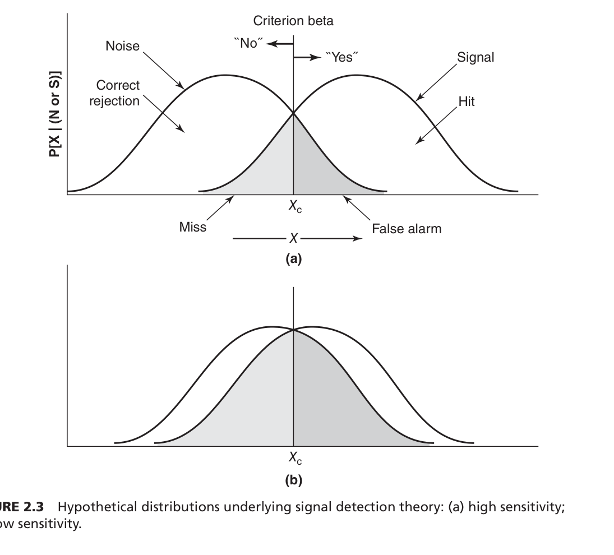
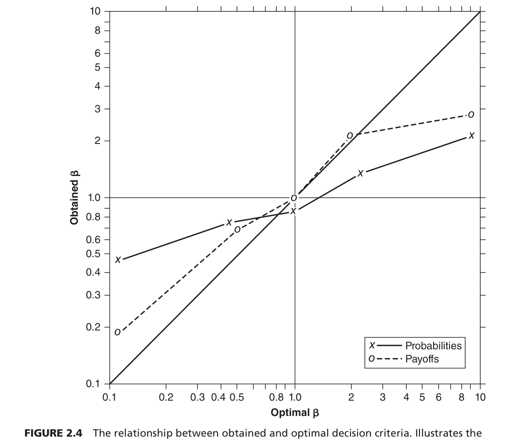
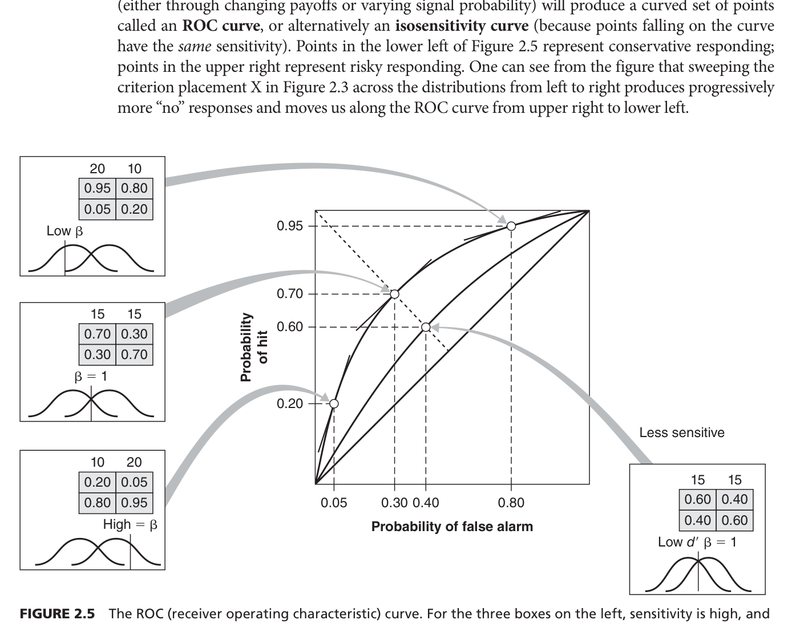
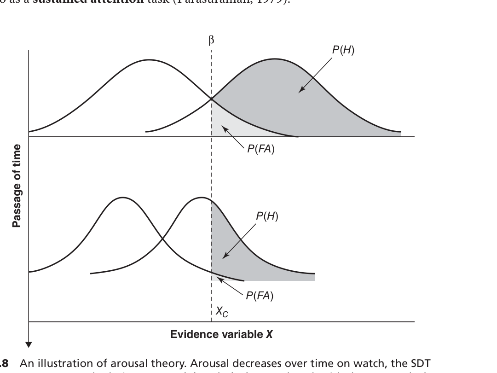
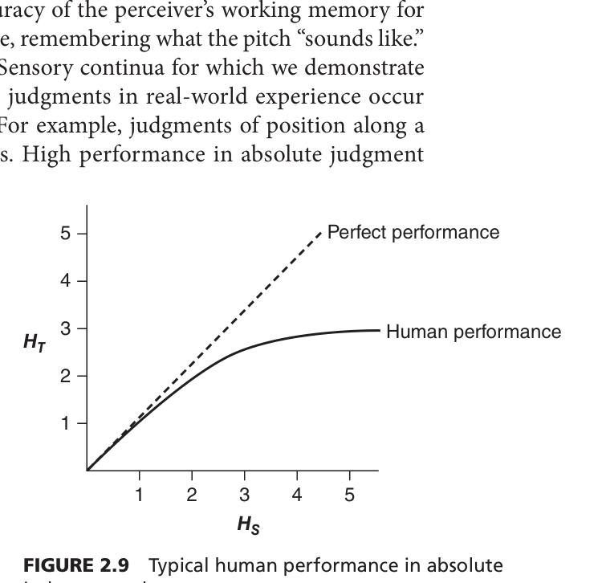
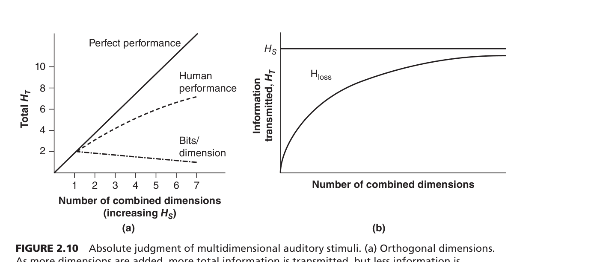


이 챕터의 가장 큰 주제는 환경에서 발생하는 사건을 인간이 어떻게 탐지(detection)하고 불확실성 속에서 어떻게 분류하고 판단을 내리는지 알아보는 것입니다.

### **💡 우리는 왜 이 챕터를 배워야 할까요?**

공항의 보안 요원이나 엑스레이를 판독하는 방사선 전문의처럼, 우리의 지각 임계치 근처에 있는 미세하고 불확실한 정보들을 다룰 때 탐지의 실패는 시스템의 심각한 병목 현상이나 치명적인 사고로 이어질 수 있기 때문입니다. 이 이론들을 배우면 인간이 탐지에 실패했을 때 정확히 무엇이 잘못되었는지 진단하고, 이를 바로잡을 공학적인 교정 해결책을 설계할 수 있게 됩니다.

하위 섹션들은 다음과 같은 논리적인 흐름으로 큰 주제와 연결되어 있습니다. 
처음에는 세상의 상태를 '신호가 있다' 혹은 '없다'의 두 가지로만 나누는 가장 단순한 '신호탐지이론(SDT)' 패러다임으로 시작하여 기초를 다집니다. 그 후, 현실 세계에서는 신호가 칼같이 흑백으로 나뉘지 않기 때문에 여러 회색 지대를 인정하는 '퍼지 신호탐지이론(Fuzzy SDT)'으로 논리를 확장합니다. 기본 이론을 배운 뒤에는 의료, 법정, 자동화 경보 시스템 등 현실에 직접 응용하는 방법과 문제점들을 진단합니다. 이어서 '장시간 모니터링'이라는 가혹한 조건이 추가되었을 때 인간의 주의력이 어떻게 떨어지는지를 '경계(Vigilance)' 섹션에서 다루며 한계점을 명확히 합니다. 마지막으로 선택지가 단순히 두 개가 아니라 여러 개로 늘어날 때 인간의 뇌가 겪는 한계를 '절대 판단(Absolute Judgment)'과 '정보 이론(Information Theory)'을 통해 수학적으로 규명하며 마무리됩니다.

이 단원을 공부하면서 영어 원서 대신 반드시 머릿속에 기억해야 할 **'가장 중요한 전문 용어'**들은 다음과 같습니다.

*   **신호탐지이론 (Signal Detection Theory, SDT)**: 신호와 잡음을 쉽게 구별할 수 없는 불확실한 상황에서 인간이나 기계의 탐지 수행을 분석하는 수학적 모델입니다. (Source: / 연구자: Green & Swets, 1966; Macmillan & Creelman, 2005)
*   **반응 기준 (Response Criterion, $\beta$)**: 관찰자가 '신호가 있다'고 결정하기 위해 요구하는 내적인 증거의 임계치(커트라인)입니다. (Source: / 연구자: Green & Swets, 1966; Swets & Pickett, 1982)
*   **민감도 (Sensitivity, $d'$)**: 관찰자의 심리적 반응 편향과는 완전히 독립적으로 측정되는 탐지 메커니즘의 순수한 해상도나 식별 능력입니다. (Source: / 연구자: Macmillan & Creelman, 2005)
*   **지연된 베타 (Sluggish Beta)**: 인간이 신호 확률이나 보상이 변할 때, 이상적이고 최적화된 기준만큼 충분히 기준을 조정하지 못하고 굼뜨게 반응하는 인지적 편향 현상입니다. (Source: / 연구자: Green & Swets, 1966; Laming, 2010)
*   **수신기 조작 특성 곡선 (ROC Curve)**: 관찰자의 민감도가 일정하게 유지될 때, 반응 기준을 변화시킴에 따라 달라지는 적중률과 오경보율의 관계를 보여주는 둥글게 굽은 형태의 그래프입니다. (Source: / 연구자: Green & Swets, 1966)
*   **퍼지 신호탐지이론 (Fuzzy SDT)**: 명확하게 정의할 수 없는 모호한 현실의 신호에 대해 0과 1 사이의 '소속도(degree of membership)'를 부여하여 판단을 분석하는 이론입니다. (Source: / 연구자: Zadeh, 1965; Parasuraman et al., 2000)
*   **경계 저하 (Vigilance Decrement)**: 희귀하고 예측 불가능한 신호를 장시간 감시해야 할 때, 업무를 시작한 지 대략 처음 30분 이내에 탐지 성능이 급격히 떨어지는 현상입니다. (Source: / 연구자: Mackworth, 1948)
*   **채널 용량 (Channel Capacity)과 매직 넘버 7**: 단일 감각 차원에서 인간이 오류 없이 절대 판단을 내릴 수 있는 정보 전달의 최대 한계점이며, 이는 대략 7개 내외(2~3비트)의 수준입니다. (Source: / 연구자: Miller, 1956)
*   **적분적 차원과 분리적 차원 (Integral and Separable Dimensions)**: 한 차원(예: 직사각형의 너비)의 변화가 다른 차원(예: 높이)의 판단에 강제적인 간섭을 일으키면 적분적 차원, 전혀 간섭 없이 독립적으로 처리되면 분리적 차원이라고 부릅니다. (Source: / 연구자: Garner, 1974; Garner & Felfoldy, 1970)
*   **정보 (Information)**: 정보 이론에서 단순한 데이터를 뜻하는 것이 아니라, 특정 사건이 발생하기 전의 '불확실성이 감소한 정도'를 의미하며 비트(bits) 단위로 계산됩니다. (Source: / 연구자: Shannon & Weaver, 1949)

**전체 Flow Chart (인간의 지각적 판단을 위한 마인드 맵 개념도)**

```text
[ 핵심 뿌리: 인간의 불확실한 정보 탐지와 판단 ]
    │
    ├─▶ 1단계: 단순한 이분법적 판단 (신호인가, 잡음인가?)
    │      └─ [신호탐지이론 (SDT)]
    │           ├─ 에러의 2가지 원인 분석: 내 실력(민감도 d') vs 내 마음가짐(반응 기준 Beta)
    │           └─ 시각화 도구: ROC 곡선 (등민감도 측정)
    │
    ├─▶ 2단계: 현실 세계의 복잡성 반영
    │      ├─ 애매모호한 신호 처리 ─▶ [퍼지 신호탐지이론 (Fuzzy SDT)]
    │      └─ 실제 현장 적용 ─▶ 의료 진단 오진 방지, 목격자 오인 방지, 알람 시스템 최적화
    │
    ├─▶ 3단계: '장시간'이라는 시간적 압박 추가
    │      └─ [경계 (Vigilance)]
    │           └─ 문제 발생: 감시 초기 30분 내에 집중력이 추락하는 '경계 저하' 현상
    │
    └─▶ 4단계: 다중 선택지로의 확장
           └─ [절대 판단 (Absolute Judgment) & 정보 이론]
                ├─ 뇌의 기억 한계: 채널 용량 (마법의 숫자 7)
                └─ 해결 원리: 다차원 디스플레이 설계 (적분적/분리적 차원 활용, 정보의 불확실성 감소 통제)
```

**💡 차트 보충 설명 (어떤 식으로 흘러가는가?)**

이 마인드 맵은 우리가 환경의 정보를 받아들일 때, **'가장 단순한 상황'에서 시작하여 점차 '변수가 많은 복잡한 현실'로 지식을 확장**해 나가는 방식으로 구성되어 있습니다.

1. 처음에는 "저기에 신호가 있는가, 없는가?"로만 나뉘는 가장 단순한 O/X 게임으로 시작합니다. 여기서 우리가 실수를 할 때, 그것이 시력 문제(민감도) 때문인지 아니면 지시사항 때문에 너무 쫄아서(반응 기준) 생긴 실수인지를 분리해 내는 마법 같은 공식을 먼저 배웁니다.
2. 하지만 현실은 그렇게 무 자르듯 나뉘지 않기 때문에 "이건 0.6 정도 신호 같아"라고 판단하는 퍼지(Fuzzy) 이론을 배우고, 이 원리를 실제 의사의 암 판정이나 경찰의 범인 식별에 응용해 봅니다.
3. 그다음에는 이 탐지 작업을 공항 보안 요원처럼 '하루 종일' 해야 할 때 생기는 문제점을 다룹니다. 시간이 지날수록 집중력이 붕괴하는 경계 저하(Vigilance Decrement) 현상을 통해 인간의 약점을 추가로 배웁니다.
4. 마지막으로 O/X를 넘어서 "신호가 여러 가지 색상과 소리 중 무엇인가?"를 여러 개 중에 골라야 할 때, 인간의 작업 기억 용량이 약 7개 언저리에서 과부하가 걸린다는 사실을 배우게 됩니다. 그리고 이를 어떻게 공학적으로 해결할지 정보 이론(비트 계산)과 연결해 최적의 시스템 설계 방법을 도출하며 단원이 끝납니다.

---
신입생 여러분, STEP 2에 오신 것을 환영합니다! 

전공 서적을 처음 펼치면 여러 알파벳 약자와 이론들이 쏟아져 나와 당황하기 쉽습니다. (참고로 질문해주신 SEEV, SSTS, PCP 등은 주의력과 시각 탐색을 다루는 다른 챕터에 나오는 모델들이며, 우리가 다루는 이 2장의 핵심 모델은 **신호탐지이론(SDT), 퍼지 SDT, 경계 이론, 정보 이론** 등입니다). 

이 챕터를 완벽히 마스터하기 위해, 우선 **왜 이 이론과 모델들을 서로 '연결'해서 공부해야 하는지** 그 중요성부터 짚고 넘어가겠습니다.

### **💡 왜 이론과 모델을 연결해서 공부해야 할까요?**

심리학에서 **'이론(Theory)'**은 "인간은 도대체 왜 이런 행동과 실수를 할까?"를 말로 설명하는 아이디어입니다. 반면 **'모델(Model)'**은 그 아이디어를 수학 공식이나 도표로 만들어서, 실제로 눈으로 보고 계산할 수 있게 만든 '설계도'입니다. 

인간의 뇌는 단순한 기계가 아니기 때문에 단 하나의 이론이나 모델로 모든 행동을 설명할 수 없습니다. 처음에는 가장 단순한 상황(A 아니면 B)을 설명하는 기초 모델을 배우고, 거기에 '시간이 지날 때', '상황이 애매할 때', '선택지가 여러 개일 때'라는 현실적인 조건들을 하나씩 블록처럼 얹어가는 과정이 바로 심리학의 역사입니다. 따라서 이것들을 하나로 연결해 **"인간의 정보 처리 파이프라인"**이라는 큰 그림을 그릴 줄 알아야만, 무작정 달달 외우지 않아도 전체 맥락이 자연스럽게 이해됩니다.

---

### **🧠 핵심 개념 딥다이빙 (Concept Mastery)**

신입생의 눈높이에 맞춰, 아무것도 모른다는 가정하에 2장의 가장 핵심적인 4가지 이론과 모델을 아주 쉬운 비유와 함께 파헤쳐 보겠습니다.

#### **1. 신호탐지이론 (Signal Detection Theory, SDT) 모델**
*   **연구자(연도):** Green & Swets (1966), Macmillan & Creelman (2005).
*   **왜 만들어졌나?** 레이더 감시병이나 엑스레이 판독 의사들이 왜 자꾸 '있는 신호를 놓치거나(누락)', '없는 신호를 있다고 착각(오경보)'하는지 그 근본적인 에러의 원인을 정확히 분리해내기 위해 만들어졌습니다.
*   **세부 요소:** 
    1. **증거 변수 (X):** 내 머릿속에서 느껴지는 자극의 강도(뇌파의 활성도)입니다.
    2. **반응 기준 (Beta, $\beta$ / $X_c$):** 내가 마음속으로 정한 "이 정도면 100% 신호야!"라고 외치는 커트라인입니다.
    3. **민감도 ($d'$):** 내 눈이나 귀가 가진 순수한 시력/청력 수준, 즉 '해상도'입니다.
*   **비유를 통한 상호작용 설명:** 
    여러분이 **공항 보안 검색대 직원**이라고 상상해 보세요. 엑스레이 화면에 길쭉한 물건(증거 변수 X)이 보입니다. 직원의 '순수한 눈썰미(민감도 $d'$)'가 좋으면 칼인지 텀블러인지 금방 구분하겠죠. 그런데 최근 테러 위협이 있어서 "무조건 꼼꼼히 잡아내!"라는 지시를 받았다면, 직원은 마음속의 '커트라인(기준 Beta)'을 확 낮춰버립니다. 그러면 텀블러만 봐도 "칼이다!"라고 외치게 되죠(오경보 증가). 즉, **최종 탐지 결과는 내 '눈썰미(민감도)'와 내 '마음가짐(기준)'이 상호작용하여 만들어낸 결과물**이라는 위대한 발견입니다.

#### **2. 퍼지 신호탐지이론 (Fuzzy SDT) 모델**
*   **연구자(연도):** Zadeh (1965), Parasuraman et al. (2000).
*   **왜 만들어졌나?** 기존 SDT는 무조건 "신호다(1) vs 아니다(0)"로 흑백을 명확히 나눴습니다. 하지만 현실은 야구 심판의 스트라이크 판정처럼 "애매하게 걸쳤는데?" 같은 회색 지대가 훨씬 많기 때문에, 이런 모호한(Fuzzy) 현실을 수학적으로 계산하기 위해 만들어졌습니다.
*   **세부 요소:**
    1. **소속도 (Degree of Membership):** 0부터 1 사이의 소수점 값으로 "얼마나 신호스러운가?"를 나타냅니다.
    2. **매핑 함수 (Mapping Function):** 애매한 자극을 소속도 값으로 변환해 주는 규칙입니다.
*   **비유를 통한 상호작용 설명:** 
    **에어컨 온도를 맞출 때**를 생각해 보세요. 13도는 확실히 춥고 30도는 확실히 덥지만, 24도는 "완전 덥지도 않고 완전 춥지도 않은" 애매한 상태입니다. 기존 모델은 24도를 무조건 '덥다(1)'로 쳐버렸지만, 퍼지 모델은 매핑 함수를 통해 "이건 0.6만큼 덥고 0.4만큼은 추운 상태야"라고 계산합니다. 이를 통해 야구 심판이 이전 투구가 어땠는지에 따라 다음 투구를 다르게 판정하는 인간 특유의 '애매한 판단'이 어떻게 이루어지는지 정확히 설명해 냅니다.

#### **3. 경계 이론들 (Theories of Vigilance)**
*   **연구자(연도):** Welford (1968, 각성 이론), Warm, Parasuraman, & Matthews (2008, 지속적 요구 이론), Baker (1961, 기대 이론).
*   **왜 만들어졌나?** 컨베이어 벨트의 불량품 검사원들이 일을 시작하고 불과 30분만 지나면 왜 갑자기 에러를 폭발적으로 내는지(경계 저하)를 설명하기 위해 만들어졌습니다.
*   **세부 요소 및 설명 (3가지 이론의 대립과 상호작용):**
    1. **각성 이론:** "너무 지루해서 뇌가 잠들어버린다." 뇌의 신경 활동 곡선 자체가 쪼그라든다고 보았습니다.
    2. **지속적 요구 이론:** "지루한 게 아니라, 계속 초집중하느라 뇌의 배터리(인지 자원)가 다 타버려서 그런 것이다"라고 주장합니다.
    3. **기대 이론 (악순환):** "내가 신호를 못 찾으니까 '아, 이제 신호 안 나오나 보다'하고 스스로 커트라인(Beta)을 높이고, 그러다 보니 진짜 신호를 더 못 보게 되는 악순환에 빠진다"고 설명합니다.
*   **비유를 통한 상호작용 설명:** 
    **수풀 속에 숨어 적을 기다리는 스나이퍼**를 상상해 보세요. 처음엔 눈을 부릅뜨고 에너지를 씁니다(지속적 요구). 하지만 3시간 동안 개미 한 마리 안 지나가면 "오늘 적 안 오려나 보다" 하고 커트라인을 높여 마음을 놓아버립니다(기대 이론). 이때 스나이퍼의 뇌는 피로감에 절어 시력의 해상도마저 떨어지게 되죠(각성 이론). 이 세 가지 현상이 상호작용하며 30분 만에 집중력이 바닥을 치게 만듭니다.

#### **4. 절대 판단과 정보 이론 (Information Theory) 모델**
*   **연구자(연도):** Shannon & Weaver (1949), Miller (1956).
*   **왜 만들어졌나?** 인간이 한 번에 에러 없이 처리할 수 있는 선택지의 개수(채널 용량)에 한계가 있다는 것을 깨닫고, 인간의 뇌를 컴퓨터의 통신망처럼 '비트(bit)' 단위로 계산해 시스템의 한계를 예측하려고 만들었습니다.
*   **세부 요소:**
    1. **정보 (Information, $H_S$):** 단순한 글자가 아니라 "불확실성을 얼마나 줄여주었는가?"를 뜻합니다.
    2. **채널 용량 (Channel Capacity):** 인간이 에러 없이 분류할 수 있는 마법의 숫자 '7'입니다.
    3. **정보 전송 공식 ($H_T = H_S + H_R - H_{SR}$):** 들어온 자극 정보($H_S$)가 내 반응($H_R$)으로 나갈 때, 엉뚱한 버튼을 누르는 에러 노이즈($H_{SR}$)를 뺀 '진짜 성공적으로 전달된 정보량($H_T$)'입니다.
*   **비유를 통한 상호작용 설명:** 
    **스무고개 게임**을 생각해 보세요. "해는 동쪽에서 뜬다"는 말은 누구나 아는 사실이라 스무고개에서 전혀 힌트가 되지 못합니다(정보량 0비트). 하지만 "내일 외계인이 침공한다"는 엄청나게 희귀한 사건이므로 내 불확실성을 크게 깨주며 막대한 정보(비트 폭발)를 줍니다. 하지만 인간의 뇌는 이런 정보를 한 번에 7개(예: 7가지 색상 구분) 이상 주면 과부하가 걸려(채널 용량 한계), 제대로 반응하지 못하고 엉뚱한 대답을 내놓는 에러($H_{SR}$)를 발생시킵니다.

---

### **🔗 이론과 모델 간의 연결 관계 (The Connection)**

이 모든 내용을 따로따로 외우지 않기 위해 아래와 같은 3단계 연결 고리를 이해해야 합니다.

**(1) 이론 간 연결 관계 (Theory to Theory)**
*   **SDT ➡️ 퍼지 SDT ➡️ 경계 이론 ➡️ 정보 이론:** 인간의 판단을 단순한 흑백(SDT)으로 보던 시각에서 점차 발전합니다. 현실의 모호성(퍼지)을 더하고, 거기에 '장시간의 피로'라는 시간의 흐름(경계 이론)을 덧붙인 뒤, 마지막으로 선택지가 2개가 아니라 여러 개일 때의 한계(정보 이론)로 점진적으로 진화하며 연결됩니다.

**(2) 모델 간 연결 관계 (Model to Model)**
*   **2x2 매트릭스 ➡️ 정보 전송 방정식 ($H_T$):** SDT에서 사용된 "적중(Hit)과 오경보(False Alarm)"라는 아주 단순한 2x2 확률 표가, 나중에는 정보 이론으로 넘어가 "들어온 신호가 얼마나 훼손 없이 전달되었는가($H_T$)"를 계산하는 거대한 NxN 행렬의 통신 전송 모델로 수학적으로 완벽히 연결됩니다. 인간을 하나의 '정보 수신기'로 본다는 뼈대가 같습니다.

**(3) 이론과 모델의 연결 (Theory & Model Mind Map)**
*   이론은 현상을 **'설명'**하고, 모델은 그것을 수학적으로 **'측정'**합니다. 
*   *이론:* "인간은 너무 지루하면 에러를 낸다(각성 이론)", "선택지가 너무 많아도 에러를 낸다(정보 이론)."
*   *모델:* 이를 측정하기 위해 "반응 기준 Beta가 상승하는 것(SDT 모델)"을 계산하고, "정보 전송량 $H_T$가 수평으로 멈추는 것(채널 용량 모델)"을 도표로 그려냅니다.

---

### **🗺️ 최종 정리: 인간 정보 처리 Flow Chart**

아래는 신입생 여러분의 머릿속에 반드시 들어가 있어야 할 전체 흐름도입니다.

```text
[ 환경의 이벤트(자극) 발생 ] 
       👇
[ 1단계: 단순 탐지 (SDT 모델) ]
  - 질문: "신호가 있나? 없나?"
  - 무기: 실력(민감도 d')을 키우거나, 깐깐함(Beta)을 조절하라!
       👇
       ├─ (현실이 너무 애매해!) ➡️ [ 퍼지 모델 (Fuzzy SDT) ] "이건 0.6만큼 신호야!"
       │
       ├─ (시간이 너무 길어!) ➡️ [ 경계 이론들 (Vigilance) ] "30분 지나니 베타가 치솟네!" (악순환)
       👇
[ 2단계: 다중 선택 및 분류 (절대 판단 / 정보 이론 모델) ]
  - 질문: "이건 빨강, 파랑, 노랑 중 어느 걸까?"
  - 한계: 매직 넘버 7 (채널 용량 초과 시 에러 펑!)
       👇
[ 반응 및 정보 전송 완료 (H_T) ] 
  - 결론: 우리는 불확실성을 줄여가는 '정보 처리 수신기'다!
```

**💡 [차트가 흘러가는 방식 - 쉬운 보충 설명]**
이 도식은 우리가 세상을 **인지하고 반응하는 순서**입니다. 처음엔 아주 단순하게 **"불이 켜졌나?"(1단계: SDT)**를 판단합니다. 하지만 일상생활은 불이 희미하거나(퍼지), 몇 시간 동안 쳐다봐야 해서 눈이 빠질 것 같은(경계 이론) 방해 요소들이 끼어듭니다. 그리고 "불이 켜졌나?"를 넘어 **"저게 무슨 색 불이지?"(2단계: 정보 이론)** 하고 선택지가 많아지는 순간, 인간의 뇌는 용량 한계에 부딪혀 정보($H_T$)를 흘려버리게 됩니다. 

이 흐름을 이해하셨다면, 여러분은 이미 심리학에서 인간을 어떻게 공학적으로 분석하는지 그 '뼈대'를 완벽히 마스터한 것입니다!

다른 과 친구에게 심리학이 일상과 산업 현장에 어떻게 적용되는지 쉽게 설명하기 위한 '현실 세계 적용(Real-world Case Study)' 가이드입니다.

### 1. 교재 속 실제 사례와 이론의 체계적 연결

**사례 A: 의사의 암 진단과 국가별 차이 (의료 진단)**
*   **적용 이론:** 신호탐지이론(SDT)의 반응 기준(Beta)과 민감도(d')
*   **이론 적용:** 방사선 전문의가 엑스레이에서 악성 종양(Signal)을 놓치는 누락(Miss)은 환자의 생명과 직결되므로, 의사들은 보통 진단 기준(Beta)을 낮춰 미세한 징후에도 암이라고 판정하는 경향이 있다. 예를 들어, 생검(조직 검사) 후 실제 암으로 판정되는 비율이 영국은 약 50%인 반면 미국은 20~30%에 불과한데, 이는 미국 의사들이 소송 등 위험을 피하기 위해 더 낮은 기준을 두어 오경보(False Alarm)를 많이 내기 때문이다. Swets (1998)는 특징 확인 체크리스트 같은 판독 보조 도구를 사용하면 의사들의 순수한 민감도(d') 자체가 향상되어, 진짜 암 환자를 더 많이 찾아내면서도 불필요한 생검을 크게 줄일 수 있음을 증명했다.

**사례 B: 목격자는 왜 무고한 사람을 지목할까? (목격자 증언)**
*   **적용 이론:** 반응 편향(Response Bias) 및 사후 거짓 확신
*   **이론 적용:** 경찰이 용의자들을 한 번에 보여주는 동시 라인업은 목격자가 자신의 기억과 '가장 비슷한' 사람을 고르는 상대적 판단을 유발해 무고한 사람을 지목할 오경보율을 높인다. 이를 한 명씩 보여주는 순차적 라인업으로 바꾸면, 목격자의 판단 기준이 보수적으로 변해 오인 식별이 대폭 감소한다 (Lindsay & Wells, 1985). 또한, 목격자가 지목을 마친 후 형사가 "잘 골랐다"고 긍정적 피드백을 주면 목격자는 거짓 확신(False certainty)에 빠져 배심원들을 오도하는 치명적 결과를 낳는다 (Wells & Bradfield, 1998).

**사례 C: 괌 항공기 추락과 병원 알람 무시 (양치기 소년 증후군)**
*   **적용 이론:** 자동화 경보 시스템과 반응 편향 이동
*   **이론 적용:** 항공기 충돌이나 환자 심정지처럼 위험을 놓칠 때의 비용이 치명적인 경우, 엔지니어들은 알람 시스템의 기준을 극도로 낮게 설정하며 이는 필연적으로 엄청난 빈도의 오경보를 낳는다. 2001년 괌의 항공교통관제사들이 너무 잦은 오경보에 지쳐 최저 안전 고도 경보 시스템을 비활성화시켰고, 이로 인해 100명 이상이 사망한 추락 사고가 발생했다. 이는 기계의 과도하게 낮은 기준에 대한 반발로 인간 스스로 자신의 판단 기준을 과도하게 높여버리거나 알람을 무시하게 되는 '양치기 소년(Cry wolf)' 증후군 때문이다 (Breznitz, 1983; Sorkin, 1989).

**사례 D: 초보 운전자는 정말 둔감한 것일까? (운전자 위험 지각)**
*   **적용 이론:** 퍼지 신호탐지이론 (Fuzzy SDT)
*   **이론 적용:** 운전 중 앞차가 브레이크를 밟는 등 도로 위에서 직면하는 위험은 흑백으로 100% 명확히 나뉘지 않는 모호한(Fuzzy) 신호다. Wallis & Horswill (2007)은 퍼지 신호탐지이론을 사용하여 초보 운전자가 숙련자보다 사고를 더 자주 내는 이유를 분석했다. 그 결과, 초보 운전자는 위험을 식별하는 근본적인 민감도(시력이나 감각)가 떨어져서가 아니라, 특정 상황을 '위험하다'고 판정하는 임계치(Threshold) 자체가 숙련자보다 훨씬 높게 설정된 안전불감증 때문임을 밝혀냈다.

**사례 E: 전투기 레이더의 위협 표시 (디스플레이 디자인)**
*   **적용 이론:** 정보 이론, 다차원 코딩 (상관 차원)
*   **이론 적용:** 전투기 조종사에게 레이더상의 표적이 얼마나 위험한지(위협 수준)를 전달할 때, 기호의 모양(Shape)과 색상(Color)이라는 두 가지 감각 차원을 동일한 위협 정보로 묶는 '상관 차원(Correlated dimensions)' 중복 코딩을 사용하면 매우 효과적이다 (Kopala, 1979). 이는 전달하는 정보의 총량을 늘리지는 못하지만, 급박한 상황에서 정보 손실(Hloss)을 막아 채널의 보안성(Security)을 극대화하여 오독 사고를 방지한다.

---

### 2. 일상생활 사례 적용 (개념 이해 확인)

**📱 일상 사례 1: 스마트폰 유령 진동 증후군과 '소리+진동' 알림의 공학**
*   **상황 및 이론 확인:** 합격 통보나 썸남썸녀의 연락처럼 나에게 '극히 높은 보상(가치)'을 지닌 메시지를 간절히 기다릴 때, 주머니 속 폰이 울리지 않았는데도 옷의 스침(Noise)을 스마트폰 진동(Signal)으로 착각해 화면을 켜본 경험이 있을 것이다. 이는 강력한 보상에 대한 기대감으로 인해 뇌의 판단 기준(Beta)이 극단적으로 낮아져 발생한 전형적인 **오경보(False Alarm)** 현상이다.
*   또한, 절대 놓치면 안 되는 중요한 알림을 '벨소리(청각) + 진동(촉각) + 화면 켜짐(시각)'으로 동시에 설정하는 것은 정보 이론의 **'상관 차원(Correlated Dimensions) 중복 코딩'**을 일상에 적용한 완벽한 예시다. 이렇게 세 가지를 동시에 묶어두면 주변이 시끄럽거나 폰이 가방 깊숙이 있을 때 정보가 유실되는 것(Hloss)을 방지하여, 메시지 수신 확률인 채널의 보안성을 극한으로 끌어올리게 된다.

**📚 일상 사례 2: 3시간짜리 인강 시청 시 집중력 붕괴 (경계 저하)**
*   **상황 및 이론 확인:** 시험 전날 3시간짜리 인터넷 강의를 들을 때, 처음 30분은 강사가 강조하는 핵심 시험 출제 포인트(Signal)와 농담(Noise)을 완벽하게 구분하며 필기를 해낸다. 하지만 30분이 넘어가면 점차 멍해지며 중요한 내용을 놓치기(Miss) 시작한다. 이는 장시간 감시 과제에서 필연적으로 발생하는 **'경계 저하(Vigilance Decrement)'** 현상이다.
*   단순히 인강이 지루해서 뇌가 잠이 온다는 고전적 관점(각성 이론)과 달리, 최신 **지속적 요구 이론(Sustained demand theory)**은 네가 핵심을 필기하기 위해 작업 기억(Working memory)을 쉴 새 없이 가동하느라 뇌의 인지 자원을 완전히 고갈시켰기 때문이라고 진단한다 (Warm, Parasuraman, & Matthews, 2008). 또한, 멍때리다 핵심을 한두 번 놓치고 나면 "이제 중요한 내용은 다 지나갔나 보다"라며 스스로 주관적 출현 확률을 낮춰 깐깐하게 기준(Beta)을 높여버리고, 그 높아진 기준 때문에 더 많은 내용을 놓치게 되는 **기대 이론(Expectancy theory)**의 **악순환(Vicious circle)**에 빠진 것으로도 해석할 수 있다 (Baker, 1961). 네가 이해한 일상 적용은 학술적으로 아주 완벽하다.

---

### 3. 참고문헌 (APA 양식)

Baker, C. H. (1961). Expectancy theory in vigilance.
Breznitz, S. (1983). *Cry wolf syndrome*.
Kopala, C. J. (1979). The use of color-coded symbols in a highly dense situation. *Display design and multidimensional absolute judgment*.
Lindsay, R. C. L., & Wells, G. L. (1985). Improving eyewitness identifications from lineups: Simultaneous versus sequential lineup presentation.
Lusted, L. B. (1976). Signal detectability and medical decision-making.
Sorkin, R. D. (1989). *Cry wolf syndrome and alarm systems*.
Swets, J. A. (1998). Separating discrimination and decision in detection, recognition, and matters of life and death. *Signal Detection Theory in Medical Diagnosis*.
Wallis, M. A., & Horswill, M. S. (2007). *Fuzzy SDT analysis of driver hazard perception*.
Warm, J. S., Parasuraman, R., & Matthews, G. (2008). *Sustained demand theory in vigilance*.
Wells, G. L., & Bradfield, A. L. (1998). "Good, you identified the suspect": Feedback to eyewitnesses distorts their reports of the witnessing experience.

*(※ 본 참고문헌은 제공된 교재 텍스트 내의 연구자 및 연도 정보를 바탕으로 작성된 APA 기본 양식입니다. 소스 내에 명시되지 않은 허위 URL이나 연결 사이트는 제외하였습니다.)*

인스타그램에 전공 지식을 쉽고 재밌게 공유하고 싶어 하는 심리학과 친구를 위해, 요청하신 특별 지침(쉬운 X·Y축 번역, 손가락 지시법, 일상/밈 1:1 매칭)을 완벽하게 적용한 **STEP 4: 데이터 및 시각 자료 해석** 카드뉴스 가이드를 준비했습니다!

---

### 📸 **[카드뉴스 슬라이드 1] 내 뇌는 왜 똥눈일까?: 신호탐지 분포 곡선**
*   **대상 도표:** **Figure 2.3 (신호탐지이론의 가설적 분포)**



*   **프로세스와 목적:** 헷갈리는 상황에서 우리의 뇌가 '잡음(아무것도 아님)'과 '진짜 신호'를 어떻게 구분하며, 왜 어이없는 실수(누락, 오경보)를 하는지 도식화하여 보여줍니다.
*   **축 번역 (X, Y):**
    *   **X축:** **'내 뇌가 느끼는 찌릿함(의심)의 정도'** (증거 변수 X).
    *   **Y축:** **'그게 진짜 신호일 확률'** (확률 밀도).
*   **그래프 읽는 법 (Point-and-Tell):** 
    👉 "1. 먼저 두 개의 둥근 산봉우리 모양을 보세요. 2. 두 산이 완전히 떨어져 있지 않고 중간에 겹쳐 있는 부분이 보이죠? 3. 그리고 그 사이를 가로지르는 세로선($X_c$)이 왔다 갔다 합니다. 산이 겹쳐 있다는 건, 애초에 에러율 0%인 완벽한 탐지는 불가능하다는 뜻입니다!".
*   **일상 밈(Meme) 1:1 매칭:** 
    🎮 **배틀그라운드(PUBG) 숲속 존버 상황!** 멀리 있는 검은 점을 보고 "저거 길리슈트 입은 적이야(Signal), 아니면 그냥 나무 그림자야(Noise)?" 고민하며 눈을 가늘게 뜨는 순간입니다. 여기서 세로선($X_c$)을 옮긴다는 건, 내가 총소리를 내기 싫은 '쫄보 메타(보수적 기준)'인지, 의심되면 무조건 쏘고 보는 '여포 메타(위험 감수 기준)'인지를 뇌가 스스로 결정하는 것과 똑같습니다.
*   **해석과 시사점:** 이 도표는 인간의 탐지 수행을 뇌의 순수한 해상도인 **'민감도($d'$)'**와 심리적 쫄보 수치인 **'반응 기준(Beta)'**으로 완벽히 쪼개서 보여줍니다. 공항 보안 검색대에서 요원이 칼을 놓쳤을 때, 시력이 나빠서인지 지침이 느슨해서인지 정확히 진단하게 해주는 공학 심리학의 마스터키입니다 (Green & Swets, 1966).

---

### 📸 **[카드뉴스 슬라이드 2] 인간은 로봇처럼 완벽할 수 없다: 지연된 베타**
*   **대상 도표:** **Figure 2.4 (획득한 베타와 최적 베타의 관계)**



*   **프로세스와 목적:** 확률이나 보상이 변할 때, 인간이 기계처럼 수학적으로 완벽한 정답 커트라인을 그대로 따르는지, 아니면 자기 고집대로 편향에 빠지는지를 진단합니다.
*   **축 번역 (X, Y):**
    *   **X축:** **'기계가 계산한 완벽한 정답 커트라인'** (최적 베타, Optimal $\beta$).
    *   **Y축:** **'내가 똥고집 부리며 실제로 들이댄 커트라인'** (획득한 베타, Obtained $\beta$).
*   **그래프 읽는 법 (Point-and-Tell):** 
    👉 "1. 그래프 정중앙을 가로지르는 가파른 45도 점선을 보세요. 이게 감정 없는 기계의 완벽한 정답선입니다. 2. 그런데 사람들이 찍은 점(x, o 기호)들이 모인 실선을 보세요. 점선 위로 못 올라가고 아래로 축 처지면서 완만하게 누워버리죠? 3. 완벽한 기준을 못 따라가고 굼뜨게 반응하는 인간의 한계입니다!".
*   **일상 밈(Meme) 1:1 매칭:** 
    🍕 **다이어터의 치팅데이 타협!** 머리(이성)로는 "오늘 치팅데이니까 딱 1000칼로리만 먹고 숟가락 놔야 해!(최적 베타)"라고 계산하지만, 실제로는 "에이, 어차피 먹은 거 1200칼로리까진 먹자(획득한 베타)"라며 기준을 덜 깐깐하게 타협해버리는 상황과 완벽히 일치합니다.
*   **해석과 시사점:** 인간은 객관적인 데이터가 주어져도 항상 최적치보다 '덜 위험을 감수하거나 덜 보수적으로' 행동하는 **지연된 베타(Sluggish Beta) 법칙**을 따릅니다. 코닥(Kodak) 공장에서 불량률이 5% 미만으로 떨어졌음에도, 검사원들이 기준을 충분히 낮추지 못해 불량품을 흘려보낸 것이 대표적 사례입니다 (Harris & Chaney, 1969). 이는 인간이 희귀한 사건의 확률을 뇌에서 과대평가하기 때문입니다 (Laming, 2010; Erlick, 1964).

---

### 📸 **[카드뉴스 슬라이드 3] 핑계 불가! 찍기 운을 뺀 '내 찐 실력': ROC 곡선**
*   **대상 도표:** **Figure 2.5 (수신기 조작 특성 곡선, ROC Curve)**



*   **프로세스와 목적:** 찍기나 쫄보 성향 같은 편향(운)을 다 걷어내고, 내 순수한 탐지 실력(민감도)이 어느 정도 등급인지 한눈에 성적표처럼 보여줍니다.
*   **축 번역 (X, Y):**
    *   **X축:** **'생사람 잡은 비율 (억울한 사람 수)'** (오경보 확률, P(FA)).
    *   **Y축:** **'제대로 정답 맞춘 비율 (캐리한 횟수)'** (적중 확률, P(H)).
*   **그래프 읽는 법 (Point-and-Tell):** 
    👉 "1. 왼쪽 아래에서 오른쪽 위로 대각선으로 그어진 점선을 보세요. 이건 눈 감고 찍는 '우연 수준(Chance)'입니다. 2. 그 위로 활처럼 둥글게 훅 휜 곡선이 보이죠? 3. 이 휜 곡선이 그래프의 왼쪽 위 모서리(정답 100%)로 바짝 붙어 올라갈수록 찐 실력자(고민감도)라는 뜻입니다!".
*   **일상 밈(Meme) 1:1 매칭:** 
    🎫 **아이돌 콘서트 티켓팅 피켓팅!** "무조건 광클한다(위험 감수)"와 "정각 타이밍 보고 누른다(보수적)"는 전략(Beta)의 차이일 뿐입니다. 근본적인 컴퓨터 사양과 내 손가락 반응속도(민감도 $d'$)가 구리면 전략을 아무리 바꿔도 결국 저 곡선 안에서 헤어 나오지 못하는 팩트 폭행 상황이죠.
*   **해석과 시사점:** 조작자가 깐깐함을 버리고 찍기 신공을 펼치더라도 결국 **'등민감도 궤적(Isosensitivity curve)'**이라는 동일한 곡선 위를 이동할 뿐입니다. 병원의 오진율을 낮추려면 의사에게 잔소리할 게 아니라, 훈련이나 보조 시스템을 통해 ROC 곡선 자체를 좌상단으로 멱살 잡고 끌어올려야 한다는 시사점을 줍니다 (Green & Swets, 1966).

---

### 📸 **[카드뉴스 슬라이드 4] 30분 만에 동태 눈깔이 되는 이유: 각성 이론**
*   **대상 도표:** **Figure 2.8 (경계 저하에 대한 각성 이론 도식화)**



*   **프로세스와 목적:** 아무 일도 안 일어나는 지루한 환경에서 장시간 감시를 할 때, 뇌의 집중력이 어떻게 붕괴하는지(경계 저하)를 3차원으로 증명합니다.
*   **축 번역 (X, Y, Z):**
    *   **X축:** **'뇌의 찌릿함'** (증거 변수 X).
    *   **Y축:** **'발생 빈도'** (확률).
    *   **Z축(깊이):** **'지루하게 버틴 시간 (눈물 콧물 쏙 뺀 시간)'** (시간의 흐름).
*   **그래프 읽는 법 (Point-and-Tell):** 
    👉 "1. 맨 앞쪽에 뚱뚱하고 널찍했던 두 개의 산봉우리를 보세요. 2. 그런데 뒤쪽(시간이 흐를수록)으로 갈수록 산봉우리가 홀쭉하게 확 쪼그라들죠? 3. 내 커트라인 선($X_c$)은 가만히 있는데, 산이 쪼그라들면서 커트라인 안쪽으로 진입조차 못 하는 슬픈 상황입니다!".
*   **일상 밈(Meme) 1:1 매칭:** 
    🎧 **MZ 오피스 오후 3시 식곤증 타임!** 점심 먹고 에어팟 낀 채 모니터를 멍하니 쳐다볼 때입니다. 부장님이 뒤에 나타나는 엄청난 위협 신호(Signal)가 발생해도, 뇌세포가 쪼그라들어서(각성 저하) 커트라인을 못 넘기고 "아... 몰라..." 하며 반응을 안 해버리는 치명적 집중력 붕괴의 순간이죠.
*   **해석과 시사점:** 레이더 감시병이나 CCTV 요원이 30분만 지나면 탐지율이 급락하는 **'경계 저하(Vigilance Decrement)'** 현상을 기하학적으로 입증했습니다. 뇌의 각성이 떨어지면 신호를 놓치는 누락(Miss)과 오경보(FA)가 동반 추락하며, 결국 작업자는 기계처럼 아예 반응하지 않는 극단적 보수화(Beta 급상승) 편향에 빠집니다 (Welford, 1968; Mackworth, 1948).

---

### 📸 **[카드뉴스 슬라이드 5] 내 머릿속 메모리 초과!: 채널 용량 한계**
*   **대상 도표:** **Figure 2.9 (절대 판단의 인간 수행)**



*   **프로세스와 목적:** 기억해야 할 정보(색상, 소리)가 기하급수적으로 늘어날 때, 인간의 뇌가 에러 없이 소화할 수 있는 '기억 용량의 한계'를 정량적으로 계산합니다.
*   **축 번역 (X, Y):**
    *   **X축:** **'내 뇌에 밀어 넣은 퀘스트 개수'** (입력 자극 정보량 $H_S$, 비트).
    *   **Y축:** **'내 뇌가 에러 없이 완벽히 소화해 낸 개수'** (전송 정보량 $H_T$, 비트).
*   **그래프 읽는 법 (Point-and-Tell):** 
    👉 "1. 처음엔 밑에서부터 45도 점선을 따라 쫙쫙 예쁘게 올라가죠? 2. 그러다가 X축 중간쯤(2~3 부근)에서 실선이 위로 못 가고 오른쪽으로 평평하게 드러누워버립니다. 3. 이 누워버린 천장(점근선)이 바로 뇌 메모리가 꽉 차서 더 이상 못 받아들이고 에러를 뿜는 구간입니다!".
*   **일상 밈(Meme) 1:1 매칭:** 
    ☕ **카페 알바 첫날 뇌정지!** 손님이 "아아 1잔, 뜨아 1잔" 시킬 때까진 점선 따라 완벽히 기억합니다. 그런데 "아아 샷추가 연하게 얼음 많이, 바닐라라떼 덜 달게, 딸기스무디 펄 추가..." 이렇게 요구사항이 7개를 넘어가는 순간, 뇌 용량이 터져서 "네? 다시 한번만요..." 하고 멈춰버리는 상황입니다.
*   **해석과 시사점:** 인간의 눈과 귀는 수천 가지를 구분하지만, 이를 뇌에 저장하고 분류하는 **'채널 용량(Channel Capacity)'**은 대략 2~3비트(4~8개 대안)에서 포화됩니다. 조지 밀러(George Miller, 1956)의 그 유명한 **'마법의 숫자 7(Magical Number 7)'** 법칙입니다. 이 그래프 때문에 현재 모든 앱 UI나 PPT를 디자인할 때 색상을 7개 이상 쓰면 안 된다는 철칙이 생겼습니다.

---

### 📸 **[카드뉴스 슬라이드 6] 절대 안 까먹게 만드는 뇌 해킹법: 다차원 코딩**
*   **대상 도표:** **Figure 2.10 (a, b) (다차원 청각 자극의 직교 vs 상관 차원 절대 판단)**



*   **프로세스와 목적:** 비행기 추락 경보나 재난 문자처럼 '절대 놓치면 안 되는 복잡한 정보'를 설계할 때, 시각과 청각을 어떻게 결합해야 인간이 에러 없이 받아들이는지 증명합니다.
*   **축 번역 (X, Y):**
    *   **X축:** **'동시에 쏟아지는 감각의 종류 (눈, 귀, 코 총동원)'** (결합된 차원의 수).
    *   **Y축:** **'내 뇌에 성공적으로 꽂힌 진짜 팩트의 양'** (전송 정보량 $H_T$).
*   **그래프 읽는 법 (Point-and-Tell):** 
    👉 "1. 오른쪽 (b) 그래프를 보세요. 위쪽에 가로로 그어진 뚜껑(입력 한계선 $H_S$)이 있죠? 2. 아래서 시작한 실선 곡선이 감각이 늘어날수록 쑥쑥 올라가다가 이 뚜껑에 찰싹 달라붙습니다! 3. 정보 손실($H_{loss}$, 뚜껑과 실선 사이 틈)이 0으로 완전히 사라지며 절대 방어막이 쳐지는 기적의 순간입니다!".
*   **일상 밈(Meme) 1:1 매칭:** 
    💺 **아이언맨 HUD 헬멧 (또는 4D 영화관)!** 넷플릭스를 태블릿(시각)으로 보면서 이어폰(청각)으로 딴 걸 들으면 정보가 튕겨 나갑니다(a. 직교 차원). 하지만 4D 영화관이나 아이언맨 헬멧에서 폭탄이 터질 때(시각), 쾅 소리가 나고(청각), 슈트가 진동(촉각)하며 모두 똑같은 의미로 때려 넣으면(b. 상관 차원), 절대 딴생각을 할 수 없이 뇌에 100% 때려 박히게 됩니다.
*   **해석과 시사점:** 덜 중요한 정보는 각각 다르게 설계(직교)해도 되지만, 치명적인 위험 경보는 반드시 빨간불(시각)과 삐-소리(청각)를 하나로 묶는 **상관 차원(Correlated Dimensions, 중복 코딩)**으로 설계해야 합니다. 그래야 총 정보량은 늘지 않아도, 정보를 놓칠 위험을 0으로 만들어 시스템의 **'보안성(Security)'**을 극대화할 수 있습니다 (Pollack & Ficks, 1954; Eriksen & Hake, 1955).

---

### 🗺️ **[부록] 인간을 구원하는 공학 심리학 Flow Chart (흐름도)**

인스타그램 마지막 슬라이드로 올리기 딱 좋은 "전체 스토리 요약본"입니다!

```text
[ 인간 뇌의 버그(에러)를 찾고 패치(수정)하는 과정 ]

▶ Step 1: 뇌의 쌩얼 진단 (원인 분석)
   └─ [Figure 2.3 & 2.5 (SDT & ROC)] : "눈이 나쁜 거야(실력), 쫄보인 거야(성향)?" 에러의 진짜 원인 분리!

▶ Step 2: 인간의 근본적 결함 발견
   ├─ [Figure 2.4 (지연된 베타)] : 인간은 기계처럼 칼같이 판단을 못 바꿈 (고집불통 편향)
   └─ [Figure 2.8 (각성 이론)] : 지루하면 30분 만에 뇌가 수축하며 동태 눈깔이 됨 (시간적 한계)

▶ Step 3: 메모리 보틀넥(병목) 측정
   └─ [Figure 2.9 (채널 용량 한계)] : 퀘스트가 7개를 넘어가면 뇌에 렉(오류)이 걸리기 시작함.

▶ Step 4: 한계 극복을 위한 UI/UX 시스템 설계
   └─ [Figure 2.10 (다차원 코딩)] : 뇌의 버그를 막기 위해, 시각과 청각을 하나로 묶어(중복 코딩) 절대 안 까먹게 강제 주입하는 공학적 솔루션 도출!
```

**💡 [왜 이런 흐름으로 이어지나요? - 쉬운 보충 설명]**
이 차트들의 흐름은 공학 심리학자들이 **"인간이 자꾸 어이없는 실수를 하는데, 기계를 어떻게 만들어야 이걸 막을 수 있을까?"**를 탐구해 온 완벽한 스토리라인입니다. 

처음(Step 1, 2)에는 아주 단순한 O/X 상황에서 인간이 똥고집을 부리거나(지연된 베타) 편향에 빠지는 결함을 '돋보기'로 관찰합니다. 그 후(Step 3), 피로감이나 '너무 많은 퀘스트'라는 가혹한 조건을 던져주자 인간의 뇌가 30분 만에 쪼그라들고, 7개 이상을 기억하지 못해 에러를 뿜어내는 치명적 병목 현상을 수학적으로 팩트 폭행하죠. 

하지만 여기서 포기하지 않고 마지막(Step 4)에 이르러, 이 불완전하고 연약한 인간을 구원하기 위해 알람의 소리와 색상을 하나로 강제로 묶어버리는 **'상관 차원 중복 코딩'**이라는 최적의 디자인 해결책을 제시합니다. 즉, **인간의 약점을 진단하고 시스템 디자인으로 치료하는 감동적인 공학 스토리**랍니다!

**STEP 5: 셀프 테스트 및 피드백 (Self-Check)**

심리학과 친구가 교재 2장의 전체적인 맥락을 제대로 이해했는지 스스로 점검할 수 있도록, 단순 암기가 아닌 **'사고력 중심의 상황 적용 퀴즈'**를 준비했습니다. 친구에게 "네가 실제 공학 심리학자가 되어 다음의 시스템 오류를 진단하고 해결책을 제시해 봐!"라고 하며 건네주면 좋습니다.

---

### 📝 **[사고력 중심 퀴즈: 인간 정보 처리 시스템 진단 및 설계]**

### ✅ **[정답 및 해설 (내용 정보, 인용 정보, 이론 근거)]**


**Q1. [신호탐지이론(SDT)과 지연된 베타] - 정책 변화에 따른 조작자의 행동 예측**
당신은 스마트폰 부품 공장의 품질 관리 감독관입니다. 최근 불량품(Signal)이 고객에게 넘어갔을 때 발생하는 환불 및 소송 비용(Cost of Miss)이 막대해지자, 회사 경영진은 "불량품을 하나라도 놓치면 엄벌에 처하겠다"는 새로운 정책을 발표했습니다.
신호탐지이론(SDT)에 따르면, 이 정책 도입 후 검사원들의 **판단 기준(Beta, $\beta$)**과 **ROC 곡선 상의 위치**는 어떻게 변할까요? 또한, 이로 인해 공장 전체 시스템에는 어떤 새로운 부작용이 발생할지 예측해 보시오. 
추가로, 데이터(Figure 2.4)에 따르면 검사원들은 회사가 요구하는 최적의 수학적 기준만큼 $\beta$를 충분히 이동시키지 않는 경향을 보입니다. 이 인지적 편향의 명칭은 무엇이며, 왜 발생하는지 설명하시오.

**A1. [SDT와 지연된 베타의 이해]**
*   **해설:** 누락의 비용(Cost of Miss)이 극단적으로 커지면, 검사원들은 불량을 놓치지 않기 위해 마음속 커트라인인 **베타($\beta$)를 대폭 낮추게 됩니다(Risky 성향)**. 이로 인해 ROC 곡선 상에서의 위치는 곡선을 따라 **'우상단(Upper right)'**으로 이동합니다. 그 부작용으로 멀쩡한 부품도 불량으로 판정해 폐기해 버리는 **오경보(False Alarm)가 폭증**하여 멀쩡한 제품을 버리는 막대한 재정적 낭비가 발생합니다.
    하지만 검사원들은 완벽한 최적의 베타만큼 기준을 충분히 내리지 않는 **'지연된 베타(Sluggish Beta)'** 현상을 보입니다. 이는 인간이 작업 기억의 한계로 인해 단기적인 에러 비율을 1:1로 맞추려는 확률 매칭(Probability matching) 전략을 사용하거나, 드문 사건의 확률을 과대평가하는 인지적 결함이 있기 때문입니다.
*   **이론 근거 및 인용:** 기대 가치와 반응 편향 (Green & Swets, 1966), 지연된 베타와 확률 매칭 (Laming, 2010), 코닥 공장 사례 (Harris & Chaney, 1969) [Source: 23, 24, 25, 26, 30].

**Q2. [퍼지 신호탐지이론(Fuzzy SDT)] - 자율주행 시스템의 모호성 극복**
자율주행 자동차의 전방 충돌 방지 시스템을 설계하고 있습니다. 앞차가 감속하는 상황을 단순히 '위험(Signal)=1'과 '안전(Noise)=0'으로만 구분하는 전통적인 SDT 모델을 적용할 경우 발생하는 치명적인 한계는 무엇입니까? 
이를 해결하기 위해 **퍼지 신호탐지이론(Fuzzy SDT)**을 도입한다면, **'매핑 함수(Mapping function)'**를 사용하여 시스템의 반응 유연성을 어떻게 개선할 수 있는지 설명하시오.

**A2. [Fuzzy SDT의 진단적 이점]**
*   **해설:** 실제 도로 위 차량의 감속이나 보행자의 움직임은 0과 1로 명확히 나눌 수 없는 모호한(Fuzzy) 신호입니다. 전통적 SDT를 적용하면 임계치에 미치지 못하는 미세한 감속을 노이즈(안전)로 무시해버려 치명적 사고가 발생하거나, 반대로 임계치를 넘는 순간 100% 급브레이크를 밟아 혼란을 초래합니다. 
    퍼지 SDT는 **매핑 함수(Mapping function)**를 통해 "이 상황은 0.6 정도 위험하다"라는 **소속도(Degree of membership)**를 산출합니다. 이를 통해 시스템은 즉각적인 급정거 대신 부분적인 주의(Partial attention)를 기울이거나 서서히 감속하는 등, 인간의 유연한 판단과 유사한 안전한 대처를 가능하게 합니다.
*   **이론 근거 및 인용:** 퍼지 논리 (Zadeh, 1965), 퍼지 SDT 방정식 및 운전자 위험 지각 적용 (Parasuraman et al., 2000; Wallis & Horswill, 2007) [Source: 41, 42, 43, 47].

**Q3. [경계(Vigilance) 성능 패러다임] - 30분의 마의 벽 해석**
공항의 수하물 X-ray 검색대 요원이 업무에 투입된 지 30분이 지나자, 뻔히 보이는 칼이나 라이터(Signal)를 놓치는 에러율이 급격히 증가했습니다(경계 저하 현상). 
이 현상의 원인을 1) 뇌의 에너지가 타버렸다고 보는 **'지속적 요구 이론(Sustained demand theory)'**과 2) 주관적 확률과 기준 상향이 맞물린 **'기대 이론(Expectancy theory)의 악순환(Vicious circle)'** 관점에서 각각 다르게 진단해 보시오.

**A3. [경계 이론의 다각적 분석]**
*   **해설:** 1) **지속적 요구 이론(Sustained demand theory):** X-ray 감시 작업은 고도의 주의력을 요하므로, 단순히 지루해서가 아니라 30분 동안 초집중을 유지하느라 뇌의 작업 기억 등 인지적 자원(Resources)이 완전히 고갈되어 민감도($d'$) 자체가 하락한 것입니다.
    2) **기대 이론(Expectancy theory):** 작업자가 자원 고갈이나 다른 이유로 어쩌다 신호를 놓치게 되면, "이제 타겟이 잘 안 나오네"라며 주관적 신호 출현 확률($P_s(S)$)을 낮게 예상합니다. 그 결과 판단 기준($\beta$)을 스스로 높여 더 보수적으로 변하고, 높아진 기준 때문에 신호를 더 많이 놓치게 되며, 이는 또다시 주관적 확률을 낮추는 **'악순환(Vicious circle)'**을 유발합니다.
*   **이론 근거 및 인용:** 지속적 요구 이론 (Warm, Parasuraman, & Matthews, 2008), 기대 이론과 악순환 가설 (Baker, 1961; Broadbent, 1971) [Source: 82, 83, 85].

**Q4. [절대 판단과 정보 이론] - 치명적 알람 시스템 설계**
원자력 발전소 제어실의 경보 시스템을 설계해야 합니다. 수십 가지의 서로 다른 경보 상태를 작업자가 한눈에 구별하게 만들고자, 10가지의 서로 다른 색상(Color)으로 경보를 분류했습니다.
**'채널 용량(Channel Capacity)'** 개념과 도표(Figure 2.9)를 근거로 볼 때, 이 색상 코딩 설계가 초래할 치명적 문제점은 무엇입니까? 
만약 '노심 용융'과 같은 절대 놓쳐서는 안 되는 치명적 경보를 설계한다면, 시각(빨간색)과 청각(사이렌 소리) 차원을 **'직교 차원(Orthogonal)'**으로 설계해야 합니까, 아니면 **'상관 차원(Correlated, 중복 코딩)'**으로 설계해야 합니까? **정보 손실($H_{loss}$)**과 **보안성(Security)**의 관점에서 그 이유를 설명하시오.

**A4. [다차원 절대 판단과 코딩의 보안성]**
*   **해설:** 단일 차원(색상)으로 10가지를 분류하게 하면 인간의 **채널 용량(Channel Capacity, 약 2~3비트 / 4~8개 대안)**을 초과하게 됩니다. 즉, '마법의 숫자 7'을 넘어가 작업 기억이 포화되므로, 작업자는 필연적으로 경보의 색상을 헷갈리는 에러를 범하게 됩니다. 
    치명적 경보는 반드시 빨간색(시각)과 사이렌(청각)을 똑같은 의미로 묶는 **상관 차원(Correlated dimensions, 중복 코딩)**으로 설계해야 합니다. 이렇게 설계하면 전달되는 총 정보의 최대 한계치를 늘리지는 못하지만, 시끄러운 환경이나 눈을 돌린 상황에서도 경보를 놓치는 **정보 손실($H_{loss}$)**을 0에 가깝게 최소화하여 시스템의 **보안성(Security of the channel)**을 극대화할 수 있기 때문입니다.
*   **이론 근거 및 인용:** 마법의 숫자 7과 채널 용량 (Miller, 1956), 다차원 차원 결합 및 상관 차원의 채널 보안성 (Eriksen & Hake, 1955) [Source: 104, 116, 118].


---

### 🗺️ **[전체 Flow Chart: 인간 정보 처리 시스템의 진단과 한계 극복]**

이 차트는 지금까지 배운 이론과 모델들이 어떤 논리적 흐름으로 이어지며 거대한 "인간 공학의 뼈대"를 완성하는지 텍스트로 시각화한 것입니다.

```text
[ 환경의 불확실한 자극(Event) 발생 ] 
       👇
[ 1. 이분법적 에러 진단 (SDT) ] 
  - 상황: O인가 X인가? (단순 탐지)
  - 진단: 에러의 원인이 '순수 실력(민감도 d')'인가, '심리적 편향(기준 Beta)'인가 분리 파악.
       👇
[ 2. 현실 제약의 반영 (Fuzzy SDT & Vigilance) ]
  - 제약 A (모호성): 현실은 0과 1로 나뉘지 않음 ➡️ 소속도를 계산하는 Fuzzy 논리 도입.
  - 제약 B (시간): 오래 감시하면 집중력이 무너짐 ➡️ 자원 고갈과 악순환(기대 이론) 규명.
       👇
[ 3. 다중 선택 상황의 보틀넥 측정 (Absolute Judgment) ]
  - 상황: 자극의 종류가 3개 이상 폭발할 때.
  - 진단: 인간의 뇌는 단일 차원에서 '마법의 숫자 7'을 넘기면 에러가 폭증함(채널 용량 포화).
       👇
[ 4. 시스템 최적화 및 에러 방어 (Information Theory) ]
  - 해결: 뇌의 용량 한계를 돕기 위해, 시각/청각/촉각 등 다차원 정보를 하나로 묶는 중복 코딩(상관 차원) 적용.
  - 결과: 정보 손실(H_loss)을 막고, 시스템 전송의 완벽한 보안성(Security) 달성.
```

**💡 [차트 흐름 보충 설명 (Overview)]**
이 플로우 차트는 공학 심리학이 **"불완전한 인간의 뇌를 이해하고, 이를 보완하는 완벽한 시스템을 설계해 나가는 여정"**을 보여줍니다.
가장 먼저 아주 단순한 이분법적 상황에서 인간이 왜 실수를 하는지 진단하는 돋보기(SDT)를 배웁니다(1단계). 하지만 현실은 칼같이 나뉘지 않고(퍼지), 오래 집중하면 뇌의 배터리가 닳아버리며(경계 저하), 선택지가 조금만 많아져도(절대 판단) 금세 한계에 부딪힌다는 인간의 치명적인 결함들을 차례대로 밝혀냅니다(2, 3단계). 
결국 이 단원은, 이렇게 연약하고 불완전한 인간이 에러 없이 정보를 받아들일 수 있도록, 시스템 엔지니어가 알람의 소리와 색상을 중복해서 묶어주고(상관 차원) 안전한 디스플레이를 설계해야 한다는 공학적 해결책(4단계, 정보 이론)으로 귀결됩니다. 즉, **"인간의 한계를 수학적으로 진단하고, 공학적 디자인으로 방어한다"**는 완벽한 논리적 흐름을 가지고 있습니다.

**STEP 6: 보완 전략 및 위기 탈출법**

영어 원서를 읽지 못해 불안해하는 마음, 충분히 이해합니다. 하지만 공학 심리학과 인지 심리학의 핵심은 '영어 독해력'이 아니라 **'인간의 행동 원리와 데이터의 흐름'**을 이해하는 것입니다. 평생 영어를 공부하지 않아도 이 과목에서 완벽하게 살아남고 A+를 받을 수 있는 구체적인 보완 전략과, 교수님의 압박 질문을 단번에 통과할 수 있는 3분 스피치 대본을 준비했습니다.

---

### 💡 **영어 원서 콤플렉스 극복을 위한 3가지 보완 전략**

**1. 번역된 '국내 인지심리학/인간공학 전공서'를 바이블로 활용하라**
이 챕터에서 다루는 신호탐지이론(SDT), 수신기 조작 특성(ROC) 곡선, 마법의 숫자 7, 경계 저하(Vigilance decrement) 등은 전 세계 모든 심리학과에서 동일하게 배우는 가장 표준적인 이론입니다. 굳이 영어 원서를 볼 필요 없이, 학교 도서관에서 한국어로 쓰인 '인지심리학' 또는 '인간공학' 전공 서적을 빌려 해당 키워드의 목차를 찾아 읽으세요. 뼈대와 원리는 100% 동일합니다. 

**2. 영어 텍스트 대신 '시각 자료(그래프/도표)와 공식'을 통째로 외워라**
공학과 심리학이 만나는 이 분야에서 **수식과 그래프는 만국 공통어**입니다. 영어 문장을 읽으려 하지 말고, 신호와 잡음의 분포 곡선이 교차하는 지점(판단 기준 $X_c$), 순수한 실력을 나타내는 민감도 거리($d'$), 정보 전송량을 구하는 공식($H_T = H_S + H_R - H_{SR}$)의 형태와 원리만 완벽히 백지에 그릴 줄 알면 핵심의 80%를 마스터한 것입니다. 그림은 언어의 장벽을 뛰어넘습니다.

**3. '현실 사례' 위주로 개념을 한국어로 매핑하라**
교수님들이 시험이나 질문에서 요구하는 것은 원서의 영어 문장 암기가 아니라 **"이 이론을 현실 문제에 어떻게 적용할 것인가?"**입니다. 의사의 암 진단(의료 진단), 괌 항공기 추락 사고(양치기 소년 효과), 목격자 오인 지목 방지 등 책에 등장한 생생한 사례들을 한국어로 완벽하게 숙지하고 이론과 연결해 두세요. 개념만 명확하면 영어 단어를 몰라도 전문적인 답변이 가능합니다.

---

### 🎙️ **[위기 탈출용] 교수님 압박 질문 대비 3분 써머리 스피치 대본**

교수님이 "자, 오늘 배운 2장 내용 전체적으로 누가 한 번 요약해 볼까?"라고 지목했을 때, 당황하지 않고 핵심만 짚어낼 수 있는 브리핑 대본입니다. 자연스럽게 말하듯 톤을 조절했습니다.

**(0:00 ~ 0:30) 도입: 챕터의 목표 제시**
"교수님, 2장의 핵심은 **'불확실성이 높은 환경 속에서 인간이 어떻게 신호를 탐지하고 판단을 내리는가'**를 공학적으로 분석하는 것입니다. 이 단원은 아주 단순한 '신호가 있다, 없다'의 이분법적 판단에서 시작해, 시간의 흐름에 따른 피로도 문제, 그리고 여러 선택지를 동시에 처리해야 하는 복잡한 상황으로 논리를 확장해 나갑니다."

**(0:30 ~ 1:30) 본론 1: 신호탐지이론(SDT)과 모호성(Fuzzy)**
"가장 먼저 **신호탐지이론(SDT)**은 인간의 탐지 에러를 두 가지로 예리하게 분리합니다. 하나는 관찰자의 순수한 감각적 해상도인 **'민감도($d'$)'**이고, 다른 하나는 개인의 심리적 깐깐함을 나타내는 **'반응 기준($\beta$)'**입니다. 예를 들어, 암을 진단하는 의사나 공항 보안 요원은 위험을 놓치는 비용이 너무 크기 때문에 기준($\beta$)을 낮추게 되고, 이는 필연적으로 오경보(False Alarm)의 폭증을 낳습니다. 흥미롭게도 인간은 기계와 달리 확률이 변할 때 최적의 기준을 맞추지 못하고 굼뜨게 반응하는 **'지연된 베타(Sluggish beta)'** 편향을 보입니다. 더 나아가, 현실의 신호는 0과 1로 나뉘지 않으므로, 0과 1 사이의 '소속도'를 활용하는 **'퍼지(Fuzzy) 신호탐지이론'**을 통해 인간의 유연하고 애매한 판단을 정확히 설명해 냅니다."

**(1:30 ~ 2:15) 본론 2: 시간의 한계(경계)와 기억의 한계(절대 판단)**
"하지만 탐지 작업에 '시간'이 추가되면 문제가 발생합니다. 관제사나 검사원이 지루한 모니터링을 할 때 30분 이내에 탐지력이 급락하는 **'경계 저하(Vigilance Decrement)'** 현상이 나타나는데, 이는 단순히 졸려서가 아니라 주의력을 쏟느라 뇌의 인지 자원이 고갈되었기 때문(지속적 요구 이론)이거나, 신호가 안 나온다고 지레짐작하여 판단 기준을 높여버리는 악순환(기대 이론) 때문입니다. 
또한, 흑백 논리를 넘어 여러 개의 자극을 분류해야 하는 **'절대 판단(Absolute Judgment)'** 상황에서, 인간의 작업 기억은 이른바 '마법의 숫자 7(대략 2~3비트)'이라는 채널 용량의 한계에 부딪혀 오류를 쏟아내게 됩니다."

**(2:15 ~ 3:00) 결론: 정보 이론과 공학적 해결책**
"결국 인간의 뇌는 들어온 환경 정보를 에러 없이 100% 손가락 반응으로 전송하지 못하고 노이즈를 만들어내는 불완전한 정보 수신기입니다. 따라서 시스템 설계자들은 인간의 이러한 한계를 돕기 위해, 비행기 알람처럼 절대 놓치면 안 되는 중요한 정보는 색상과 소리를 강제로 묶어주는 **'상관 차원(Correlated dimensions)'**으로 중복 설계해야 합니다. 이를 통해 정보의 손실을 막고 시스템 전송의 안전성(Security)을 극대화할 수 있습니다. 
요약하자면, 이 챕터는 **인간의 지각적 한계와 편향을 수학적으로 정확히 진단하고, 그 한계를 보완할 수 있는 안전한 시스템을 설계하는 과학적 토대**를 제공한다고 이해했습니다. 이상입니다."