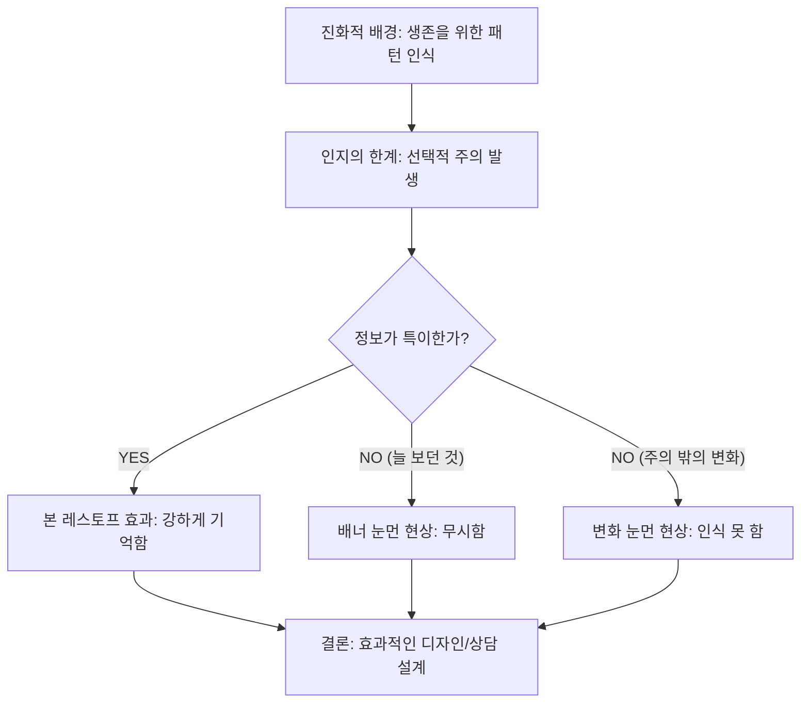
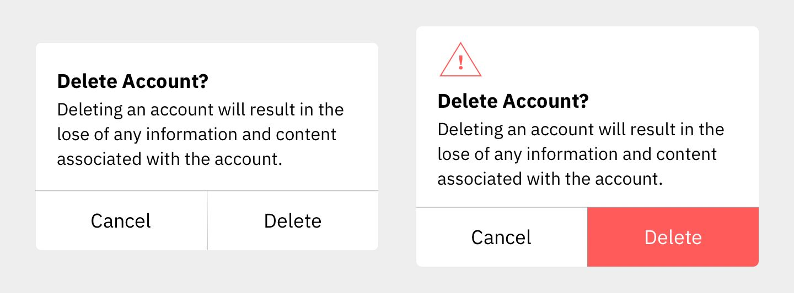
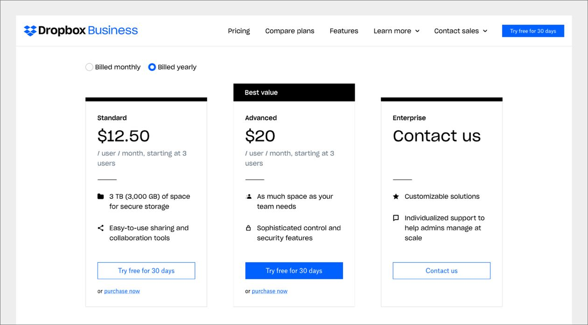
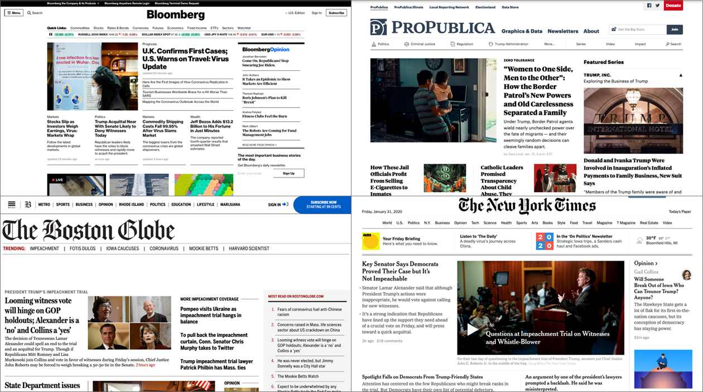
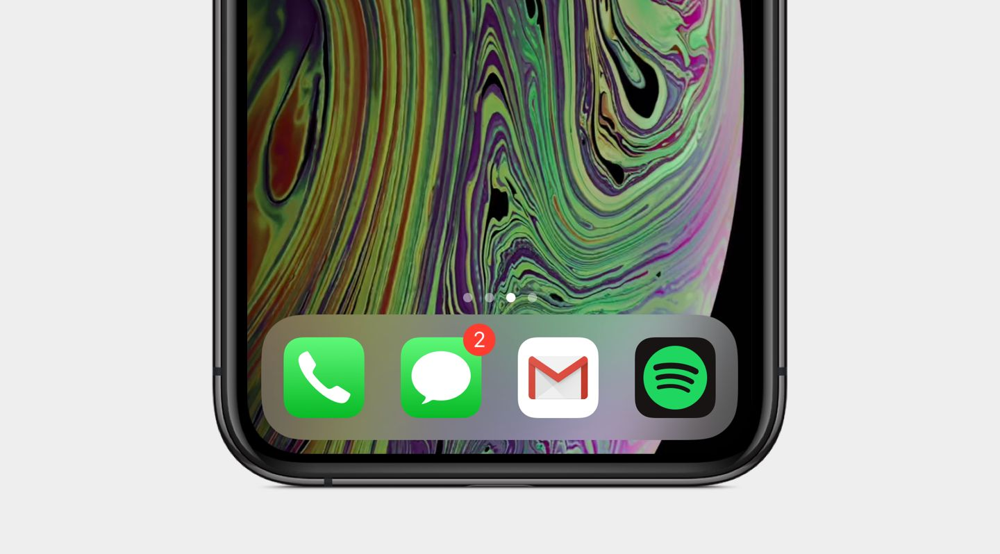
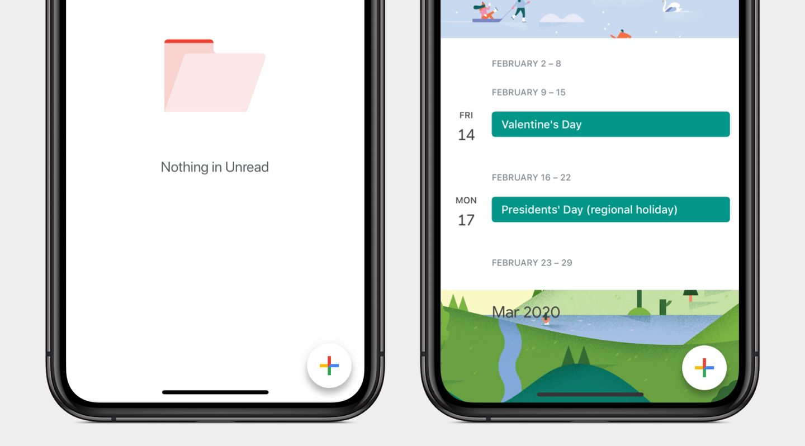
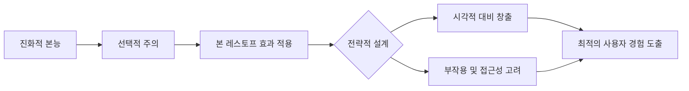

심리학과 입학을 축하합니다! 영어를 전혀 몰라도 이 책의 핵심 내용을 완벽하게 이해할 수 있도록 **[STEP 1: 프리뷰]** 단계를 준비했습니다. 이 내용은 제공된 자료를 바탕으로 구성되었습니다.

---

### 1. 이 챕터의 큰 주제: "왜 우리는 유독 '튀는 것'을 잘 기억할까?"

이 챕터의 주인공은 **'본 레스토프 효과(von Restorff Effect)'**입니다. 간단히 말해, **여러 개의 비슷한 물체가 있을 때, 나머지와 다른 하나가 가장 잘 기억된다**는 원리입니다.

**왜 배워야 할까요?**
우리 인간은 수천 년의 진화 과정을 거치며 아주 미세한 차이를 순식간에 포착하는 능력을 갖게 되었습니다. 이는 생존에 필수적이었으며, 오늘날 우리가 세상을 인지하고 기억하는 방식에도 큰 영향을 미칩니다. 심리학도로서 이 원리를 배우면 사람들이 수많은 정보 속에서 무엇에 주의를 기울이고, 무엇을 잊어버리는지 설계할 수 있게 됩니다.

**섹션들의 논리적 연결성:**
1.  **기원(Origins):** 이 현상이 언제, 누구에 의해 발견되었는지 학술적 뿌리를 찾습니다.
2.  **심리학적 개념(Psychology Concepts):** '주의(Attention)'라는 자원이 어떻게 작동하는지, 왜 어떤 정보는 걸러지는지 이론적 배경을 설명합니다.
3.  **실제 사례(Examples):** 우리가 매일 쓰는 앱이나 웹사이트에서 이 효과가 어떻게 쓰이는지 보여줍니다.
4.  **주의사항(Considerations):** 너무 과하게 쓰면 오히려 독이 되는 이유와 모든 사용자를 배려하는 법을 배웁니다.

---

### 2. 반드시 기억해야 할 '가장 중요한 전문 용어'

이 단원을 공부할 때 이 4가지 용어만은 꼭 잡고 가야 합니다.

| 전문 용어 | 소스(Source) | 학술적 정보 및 연구자(연도) |
| :--- | :--- | :--- |
| **본 레스토프 효과** (von Restorff Effect) |, | **헤드비히 본 레스토프 (Hedwig von Restorff, 1933)**: '격리 패러다임' 연구를 통해 범주가 비슷한 항목들 중 유독 눈에 띄는 항목이 가장 잘 기억된다는 것을 밝혀냄. |
| **선택적 주의** (Selective Attention) |, | **인지 심리학의 생존 본능**: 인간의 주의력은 한계가 있기 때문에, 중요한 정보에 집중하기 위해 관련 없는 정보를 걸러내는 필터링 시스템. |
| **배너 눈먼 현상** (Banner Blindness) |, | **사용자 행동 패턴 (1990년대~현재)**: 사람들이 웹사이트의 광고(배너)처럼 보이는 요소를 본능적으로 무시하는 현상. |
| **변화 눈먼 현상** (Change Blindness) |, | **주의력 결핍 현상**: 주의가 다른 곳에 쏠려 있을 때, 눈앞의 중요한 변화를 알아차리지 못하는 경향. |

---

### 3. 전체 Flow Chart (Mind Map)

이 챕터는 다음과 같은 흐름으로 머릿속에 그리시면 됩니다.

**[중심 개념: 본 레스토프 효과]**
*   **A. 뿌리 (Why & Who)**
    *   진화론적 배경 (생존을 위한 차이 감지)
    *   헤드비히 본 레스토프의 1933년 연구
*   **B. 심리학적 기저 (How it works)**
    *   선택적 주의 (필요한 것만 골라 보기)
    *   주의 자원의 한계 (워킹 메모리와의 관계)
*   **C. 실전 디자인 (Application)**
    *   시각적 대비 (색상, 모양, 크기, 위치, 움직임 이용)
    *   사례: 강조 버튼, 알림 숫자, 가격표의 '베스트 상품'
*   **D. 부작용과 제약 (Warning)**
    *   과도한 강조 금지 (오히려 아무것도 안 보임)
    *   배너/변화 눈먼 현상 유발 주의
    *   접근성 고려 (색약자, 어지럼증 환자 배려)

---

**[Flow Chart 보충 설명]**
이 차트는 **'본능 -> 이론 -> 실제 -> 책임'**의 흐름을 따릅니다.
1.  먼저 인간은 원래 다르게 생긴 것에 끌리도록 태어났다는 점을 이해합니다(**본능**).
2.  이것이 심리학적으로 '선택적 주의'라는 시스템을 통해 기억에 남는다는 원리를 배웁니다(**이론**).
3.  이 원리를 이용해 중요한 버튼을 빨간색으로 만들거나 크게 만드는 법을 익힙니다(**실제**).
4.  마지막으로, 너무 남용하면 광고처럼 보여서 무시당하거나(배너 눈먼 현상), 색을 못 보는 사람들에게 불편을 줄 수 있음을 깨닫는 과정(**책임**)으로 공부가 마무리됩니다.

이제 STEP 1을 통해 전체적인 지도를 그렸으니, 다음 단계에서는 구체적인 세부 내용을 하나씩 파헤쳐 봅시다!

심리학도 여러분, 환영합니다! 이제 본격적으로 이 책의 핵심 이론들을 파헤쳐 보는 **[STEP 2: 핵심 개념 딥다이빙]** 시간을 갖겠습니다. 

영어를 전혀 몰라도 괜찮습니다. 우리가 배우는 이 이론들은 복잡한 수식이 아니라, 결국 **'우리 인간이 세상을 어떻게 바라보는가'**에 대한 이야기이기 때문입니다.

---

### 0. 왜 이론과 모델을 연결해서 배워야 할까요?

심리학에서 개별 이론은 '퍼즐 조각'과 같습니다. 조각 하나만 봐서는 그림 전체를 알 수 없죠. **이론들을 연결하는 것**은 흩어진 조각을 맞춰 **'인간의 마음이 작동하는 전체 지도'**를 그리는 과정입니다. 이 연결 고리를 이해해야만 실제 상황에서 사람들의 행동을 정확히 예측하고 유도할 수 있습니다.

---

### 1. 핵심 이론 및 모델 딥다이빙

제공된 자료(Chapter 8)를 바탕으로, 심리학 신입생이 반드시 알아야 할 3가지 핵심 축을 설명해 드릴게요. (참고: 요청하신 SEEV, SSTS 등의 모델은 현재 챕터 자료에는 등장하지 않으므로, 이 챕터의 핵심인 '주의와 기억' 모델을 중심으로 설명합니다.)

#### ① 본 레스토프 효과 (von Restorff Effect)
*   **연구자(연도):** 헤드비히 본 레스토프 (Hedwig von Restorff, 1933)
*   **왜 만들어졌나?** 비슷한 것들이 모여 있을 때, 왜 유독 '다른 하나'가 기억에 잘 남는지 그 원리를 학술적으로 증명하기 위해 연구되었습니다.
*   **세부 요소와 상호작용 (비유):**
    *   **요소 1. 범주적 유사성:** 초록색 사과들이 가득 담긴 바구니 (배경).
    *   **요소 2. 격리(Isolation):** 그 사이에 딱 하나 놓인 빨간색 사과 (주인공).
    *   **상호작용:** 우리 뇌는 '초록색'이라는 반복되는 정보는 지루하게 느껴 에너지를 덜 쓰고, '빨간색'이라는 튀는 정보에 에너지를 쏟아 강하게 기억에 저장합니다.
*   **신입생을 위한 한 줄 요약:** "튀는 놈이 살아남는다!"

#### ② 선택적 주의 모델 (Selective Attention Model)
*   **연구자(연도):** 인지 심리학의 고전적 개념 (셸리 테일러 & 수잔 피스크, 1978년 연구와도 관련됨)
*   **왜 만들어졌나?** 세상에는 정보가 너무 많습니다. 인간의 뇌는 용량이 한정되어 있어, 모든 정보를 다 처리하다간 과부하가 걸려 죽을지도 모릅니다. 그래서 '필터'가 필요했습니다.
*   **세부 요소와 상호작용 (비유):**
    *   **요소 1. 감각 정보 입입:** 클럽의 시끄러운 음악, 조명, 사람들 대화 소리.
    *   **요소 2. 필터(Filter):** 내 앞에 있는 친구의 목소리에만 집중하는 능력.
    *   **상호작용:** 필터는 '중요하지 않은 정보'는 쓰레기통으로 던지고, '나에게 중요한 정보'만 뇌의 본부로 보냅니다.
*   **신입생을 위한 한 줄 요약:** "보고 싶은 것만 골라 보는 우리 뇌의 방어 기제"

#### ③ 배너 눈먼 현상 & 변화 눈먼 현상 (Blindness Models)
*   **연구자(연도):** 카라 퍼니스(Kara Pernice) 등 닐슨 노먼 그룹 (약 30년간 연구됨)
*   **왜 만들어졌나?** 인간이 왜 눈앞에 있는 뻔한 광고나 큰 변화를 못 보고 지나치는지 설명하기 위해 등장했습니다.
*   **세부 요소와 상호작용 (비유):**
    *   **요소 1. 목표 지향적 태도:** "나는 지금 맛집을 찾겠어!"라는 강한 목적.
    *   **요소 2. 패턴 인식:** "저렇게 생긴 건 보통 광고였어"라는 과거의 경험.
    *   **상호작용:** 내 목표와 상관없는 정보(배너 광고)나 주의를 기울이지 않은 곳에서의 변화는 우리 뇌가 아예 '삭제' 처리해 버립니다.
*   **신입생을 위한 한 줄 요약:** "관심 없으면 눈앞에 있어도 투명 인간 취급!"

---

### 2. 이론과 모델의 연결 관계 (Mind Map)

이 이론들은 따로 노는 것이 아니라 하나의 **'인지 프로세스'**로 연결됩니다.

1.  **진화적 본능:** "살아남으려면 주변의 변화(차이)를 빨리 알아채야 해!"
2.  **선택적 주의 (필터링):** "에너지가 부족하니 중요한 것만 골라보자."
3.  **결과물 A: 본 레스토프 효과:** "와! 저건 확실히 다르네? 기억해두자!" (긍정적 주의)
4.  **결과물 B: 눈먼 현상:** "저건 늘 보던 광고 같네? 무시하자!" (부정적 주의)

---

### 3. 전체 학습 흐름 (Flow Chart)

**[도식 보충 설명]**
1.  **시작(A):** 우리 조상님들이 숲속에서 호랑이를 피하기 위해 '튀는 것'을 찾는 능력을 키웠습니다.
2.  **과정(B):** 하지만 뇌의 용량은 작아서 모든 걸 다 볼 순 없습니다. 그래서 '선택'을 합니다.
3.  **갈림길(C):** 이때 정보가 다른 것들과 **다르면(YES)** 우리는 그것을 **본 레스토프 효과**로 기억합니다. 반대로 너무 **익숙하거나 관심 밖이면(NO)** 아예 **못 본 척**하게 되죠.
4.  **도착(G):** 심리학자인 우리는 이 흐름을 이해해서, 사람들에게 꼭 알려줘야 할 정보는 '다르게' 만들고, 방해되는 정보는 '익숙하게' 숨기는 전략을 짤 수 있게 됩니다.

이제 지도가 좀 그려지시나요? 다음 STEP에서는 이 이론들이 우리 일상에서 어떻게 쓰이는지 실제 사례로 확인해 봅시다!

심리학과 신입생 여러분, 이제 마지막 **[STEP 3: 현실 세계 적용]** 단계입니다. 이론만 아는 것보다, 이를 실제 현상에 어떻게 대입하는지 아는 것이 진짜 실력입니다. 다른 과 친구에게 "이게 바로 심리학이야!"라고 멋지게 설명해 줄 수 있도록 정리해 드릴게요.

---

### 1. 책에 나온 실제 사례와 이론의 연결

이 소스들은 우리가 일상에서 무심코 지나치는 디자인들이 사실은 철저한 심리학적 계산에 의한 것임을 보여줍니다.

*   **사례 1: 삭제 확인 창의 '빨간색 버튼' (본 레스토프 효과)**

    

    *   **설명:** 계정 삭제 화면에서 '취소'와 '삭제' 버튼이 똑같이 생겼다면 실수하기 쉽습니다. 이때 삭제 버튼에만 강렬한 색상이나 경고 아이콘을 넣으면, 다른 버튼들과 시각적으로 격리(Isolation)되어 사용자의 주의를 확 끌게 됩니다.
    *   **연결 이론:** **본 레스토프 효과 (von Restorff, 1933)** – 범주가 비슷한 항목들 사이에서 시각적으로 튀는 항목이 가장 잘 기억되고 눈에 띈다는 원리입니다.

*   **사례 2: 드롭박스(Dropbox)의 요금제 표 (시각적 대비와 강조)**

    

    *   **설명:** 여러 요금제 중 기업이 권장하는 모델을 더 크게 만들거나, '베스트 가치'라는 라벨을 붙이고 밝은 색 버튼을 사용하는 경우입니다. 크기(Scale), 모양, 색상을 다르게 하여 사용자의 시선을 특정 지점으로 유도합니다.
    *   **연결 이론:** **선택적 주의 (Selective Attention)** – 인간은 모든 정보를 다 볼 수 없으므로, 시각적으로 두드러진(Salient) 정보에 우선순위를 두는 본능을 이용한 것입니다.

*   **사례 3: 웹사이트 광고 무시하기 (배너 눈먼 현상)**

    

    *   **설명:** 사람들은 웹사이트에서 광고처럼 보이는 영역(배너)을 아예 쳐다보지도 않는 경향이 있습니다. 심지어 중요한 정보가 광고와 비슷한 위치나 모양으로 배치되면, 뇌가 그것을 '무익한 정보'로 필터링하여 무시해 버립니다.
    *   **연결 이론:** **배너 눈먼 현상 (Pernice, 2018)** – 한정된 주의 자원을 효율적으로 쓰기 위해 과거 경험상 불필요했던 패턴을 자동으로 차단하는 현상입니다.

---

### 2. 신입생을 위한 일상생활 적용 (이해 확인용)

여러분이 이해한 것이 맞는지, 일상의 새로운 사례로 확인해 봅시다.

*   **스마트폰 알림 숫자 (빨간 점):**

    

    모든 앱 아이콘이 조용히 있을 때, 특정 앱 위에만 **빨간색 동그라미와 숫자**가 떠 있는 것은 **본 레스토프 효과**의 전형적인 예시입니다. 수많은 아이콘 사이에서 '차이'를 만들어내어 여러분이 앱을 누르지 않고는 못 배기게 만듭니다.

*   **전공 책 공부와 형광펜:**
    검은색 글자만 가득한 책 페이지에서 중요한 문장에 **노란색 형광펜**을 칠하는 행위는 스스로 **본 레스토프 효과**를 만드는 과정입니다. 뇌에게 "이 부분은 주변과 다르니까 집중해서 기억해!"라고 신호를 보내는 것이죠.

*   **공부할 때의 카톡 소리:**
    도서관에서 공부에 열중할 때 주변의 백색 소음은 들리지 않지만, 내 폰에서 나는 '카톡' 소리는 즉각적으로 들립니다. 이는 뇌가 수많은 자극 중 나에게 의미 있는 것만 골라내는 **선택적 주의**가 작동하기 때문입니다.

---

### 3. 참고 문헌 (APA 양식)

심리학 보고서를 쓸 때는 아래와 같이 출처를 밝히는 것이 기본입니다.

*   Mattson, M. P. (2014). Superior pattern processing is the essence of the evolved human brain. *Frontiers in Neuroscience, 8*, 265.
*   Oberauer, K. (2019). Working memory and attention – A conceptual analysis and review. *Journal of Cognition, 2*(1), 36.
*   Pernice, K. (2018, April 22). *Banner Blindness Revisited: Users Dodge Ads on Mobile and Desktop*. Nielsen Norman Group. https://www.nngroup.com/articles/banner-blindness-old-and-new-findings
*   Taylor, S. E., & Fiske, S. T. (1978). Salience, attention, and attribution: Top of the head phenomena. In L. Berkowitz (Ed.), *Advances in Experimental Social Psychology* (Vol. 11, pp. 249–288). Academic Press.
*   von Restorff, H. (1933). Über die Wirkung von Bereichsbildungen im Spurenfeld. *Psychologische Forschung, 18*, 299–342.

**전문가 팁:** 영어를 안 배우더라도, 위와 같은 핵심 연구자의 이름과 연도 정도는 눈에 익혀두면 전공 서적을 볼 때 큰 도움이 됩니다! 고생하셨습니다. 여러분은 이제 '주의와 기억'의 기초를 마스터했습니다.

심리학과 신입생 여러분, 인스타그램에 올리면 '과탑' 소리 들을 수 있는 **[STEP 4: 데이터 및 시각 자료 해석]** 단계입니다. 이 책의 저자는 이론을 설명하기 위해 다양한 디자인 사례를 시각적으로 제시하고 있습니다. 도표와 그림들이 어떤 인지심리학적 원리를 담고 있는지 하나씩 분석해 드릴게요.

---

### 1. 주요 도표 및 시각 자료 분석

이 챕터에는 수치로 된 그래프보다는 **실제 인터페이스(UI) 사례**를 통해 이론을 증명하는 시각 자료가 많습니다. 이를 심리학적으로 해석해 보겠습니다.

#### ① Figure 8-1: 삭제 확인 모달 (실수 방지 프로세스)
*   **의미:** 왼쪽은 모든 버튼이 똑같이 생겼고, 오른쪽은 '삭제' 버튼만 **빨간색 대비**와 **경고 아이콘**을 사용했습니다.
*   **심리학적 해석:** 
    *   **X축(가상):** 시각적 유사성 (왼쪽은 높음, 오른쪽은 낮음).
    *   **Y축(가상):** 오류 발생 확률 (왼쪽은 높음, 오른쪽은 낮음).
*   **시사점:** 인간은 비슷한 것들 사이에서 차이를 못 느끼면 실수를 합니다. **본 레스토프 효과(1933)**를 적용해 파괴적인 작업(삭제)을 시각적으로 **격리(Isolation)**시키면, 뇌는 이를 '중요한 경고'로 인식해 사고를 막습니다.

#### ② Figure 8-3: 드롭박스 요금표 (선택 유도 프로세스)
*   **의미:** 세 가지 요금제 중 가운데 'Advanced' 요금제만 더 크고, 밝은 파란색 버튼과 'Best Value'라는 라벨이 붙어 있습니다.
*   **심리학적 해석:**
    *   **그래프의 원리:** **시각적 현저성(Salience)**. 연구자 **테일러와 피스크(1978)**에 따르면 인간은 두드러지고 참신한 자극에 본능적으로 끌립니다.
*   **시사점:** 기업은 사용자의 **선택적 주의(Selective Attention)**를 특정 상품으로 유도하기 위해 크기, 색상, 위치를 전략적으로 조절합니다. 이것이 바로 디자인에 이식된 심리학적 마케팅입니다.

#### ③ Figure 8-4: 스마트폰 알림 배치 (주의 집중 프로세스)
*   **의미:** 초록색 아이콘들 사이에 빨간색 동그라미 숫자가 떠 있는 모습입니다.
*   **심리학적 해석:** 
    *   **인지 법칙:** '범주적 유사성'을 깨뜨리는 '시각적 변칙'.
*   **시사점:** 우리 뇌는 수천 년의 진화를 통해 패턴 속의 작은 변화를 감지하도록 설계되었습니다. 빨간색 숫자는 배경(앱 아이콘)과 강한 대비를 이루어, 사용자가 이를 확인하지 않고는 못 배기게 만드는 강력한 **주의(Attention) 도구**가 됩니다.

---

### 2. 시각 자료의 데이터 및 이론적 근거

*   **진화론적 근거:** 인간은 생존을 위해 아주 미세한 차이를 포착하는 **고도의 패턴 처리 능력**을 갖췄습니다 (**Mattson, 2014**).
*   **주의의 한계:** 인간의 **작업 기억(Working Memory)**과 주의력은 용량이 정해진 '제한된 자원'입니다 (**Oberauer, 2019**).
*   **시각적 수치와 대비:** 
    *   **배너 눈먼 현상(Pernice, 2018):** 만약 강조가 너무 과해 '광고'처럼 느껴지면, 사용자는 이를 0.1초 만에 무시해 버립니다. 
    *   **변화 눈먼 현상:** 시각적 신호가 충분히 강하지 않으면 사용자는 중요한 변화를 놓치게 됩니다.

---

### 3. 전체 시각 자료의 흐름 (Flow Chart)

이 챕터의 그림들은 아래와 같은 논리적 흐름으로 이어집니다.

**[시각 인지 처리 Flow Chart]**

1.  **패턴 인식 (Figure 8-2, FAB):** 익숙한 버튼 모양을 통해 "아, 이건 버튼이구나"라고 먼저 인식합니다 (제이콥의 법칙 연결).
2.  **차이 감지 (Figure 8-1, 8-3):** 여러 선택지 중 색상, 크기, 모양이 다른 것을 순식간에 골라냅니다 (**본 레스토프 효과**).
3.  **주의 할당 (Figure 8-4):** 뇌의 한정된 자원을 '빨간 점'이나 '강조된 버튼'에 우선적으로 쏟아붓습니다 (**선택적 주의**).
4.  **행동 결정:** 강조된 정보를 바탕으로 클릭하거나, 실수를 피하거나, 구매를 결정합니다.
5.  **부작용 방지 (Figure 8-5):** 너무 많은 강조가 '소음'이 되지 않도록 적절히 조절하여 사용자가 지치지 않게 합니다 (**절제와 접근성**).

---

**[보충 설명]**
이 흐름은 결국 **"어떻게 하면 사용자의 뇌를 피곤하게 하지 않으면서, 우리가 원하는 정보를 가장 먼저 보게 할 것인가?"**에 대한 답을 시각적으로 보여줍니다. 처음엔 버튼 하나(8-1)에서 시작해, 서비스 전체(8-3), 그리고 일상적인 알림(8-4)과 복잡한 뉴스 사이트(8-5)까지 점점 범위를 넓혀가며 **차이(Contrast)의 중요성**을 증명하고 있습니다.

이 내용을 캡쳐해서 올리면, 단순히 "디자인 예쁘다"가 아니라 **"이 빨간 버튼은 본 레스토프 효과와 선택적 주의 모델을 기반으로 설계된 인지적 장치야"**라고 설명할 수 있겠죠? 수고하셨습니다!

심리학과 신입생 여러분, 드디어 마지막 단계인 **[STEP 5: 셀프 테스트 및 피드백]**에 도달했습니다! 단순히 외우는 것을 넘어, 배운 내용을 실제 상황에 적용해 보며 여러분의 '심리학적 사고력'을 확인해 봅시다.

---

### 1. 사고력 중심 리인포스먼트 퀴즈

**[문제 1: 전략적 강조의 딜레마]**
여러분이 새로운 쇼핑 앱을 디자인하는 심리학 자문가라고 가정해 봅시다. 메인 화면에 20개의 상품이 나열되어 있는데, 클라이언트가 "모든 상품이 다 중요하니 20개 모두에 빨간색 '특가' 배지를 붙여달라"고 요청했습니다. 이때 **본 레스토프 효과(von Restorff Effect)**와 **주의(Attention)**의 특성을 근거로 이 요청을 어떻게 반박하거나 수정 제안하겠습니까?

**[문제 2: 왜 사용자는 '공지사항'을 못 볼까?]**
한 웹사이트에서 매우 중요한 보안 업데이트 공지를 화면 오른쪽에 화려한 움직이는 배너 형태로 띄웠습니다. 하지만 대부분의 사용자가 이 공지를 확인하지 못해 보안 사고가 발생했습니다. 이 현상을 **'배너 눈먼 현상(Banner Blindness)'**과 **'선택적 주의(Selective Attention)'** 개념을 사용해 설명해 보세요.

**[문제 3: 모두를 위한 심리학적 설계]**
중요한 '구매 확정' 버튼을 주변 버튼과 구별하기 위해 오직 '밝은 초록색'만을 사용해 강조했습니다. 이 디자인이 **본 레스토프 효과**를 충분히 활용했음에도 불구하고, **접근성(Accessibility)** 측면에서 어떤 심리학적 간과가 있었는지 설명해 보세요.

---

### 2. 전체 학습 Flow Chart (Overview)

이 챕터의 전체 내용을 관통하는 논리적 흐름입니다.

**[인지적 주의 제어의 흐름도]**

1.  **진화적 기전:** 인간의 정교한 시각 및 패턴 처리 능력 (생존을 위한 차이 감지)
2.  **인지적 한계:** 주의(Attention)는 한정된 자원이며 작업 기억과 밀접하게 연결됨
3.  **심리학적 원리 (본 레스토프 효과):** 비슷한 항목들 사이에서 '격리'된 항목이 가장 잘 인지되고 기억됨
4.  **실행 전략:** 색상, 모양, 크기, 위치, 움직임 등을 통한 시각적 대비 창출
5.  **제약 조건:**
    *   **과도한 강조 방지:** 너무 많은 강조는 서로 경쟁하며 효과를 희석함 (노이즈 발생)
    *   **인지적 오류 방지:** 배너 눈먼 현상 및 변화 눈먼 현상 주의
    *   **포용적 설계:** 색약자 및 운동 민감도 사용자를 위한 접근성 고려
6.  **최종 목표:** 사용자의 목표 달성을 지원하고 실수를 방지하는 효과적 인터페이스 구축

**[차트 흐름 보충 설명]**
이 흐름은 **'인간의 본능적 능력'**에서 시작하여, 이를 어떻게 **'디자인 원리'**로 치환할 것인지, 그리고 그 과정에서 발생할 수 있는 **'부작용과 윤리적 고려사항'**을 순차적으로 다룹니다. 즉, 사람의 눈길을 끄는 법을 아는 것만큼이나, 언제 그 힘을 절제해야 하는지 배우는 것이 이 단원의 핵심입니다.

---

### 3. 정답 및 해설 (피드백)

*   **[문제 1 해설]**
    *   **답안 포인트:** 모든 것을 강조하는 것은 아무것도 강조하지 않는 것과 같습니다. **본 레스토프(1933)**에 따르면 강조는 '격리(Isolation)'될 때 힘을 얻습니다. 20개 모두에 배지를 붙이면 시각적 노이즈가 발생해 주의 자원이 분산되고, 결국 사용자는 압도당해 어떤 정보도 제대로 처리하지 못하게 됩니다.
    *   **근거:** "강조가 너무 과하면... 의도했던 요소의 힘을 약화시킬 뿐만 아니라 사람들을 시각적으로 압도하게 된다".

*   **[문제 2 해설]**
    *   **답안 포인트:** 사용자는 자신의 목표와 상관없는 광고 형태의 요소를 무시하는 **배너 눈먼 현상(Pernice, 2018)**을 보입니다. 또한, 주의가 다른 곳(쇼핑 등 본래 목적)에 쏠려 있으면 눈앞의 큰 변화도 인지하지 못하는 **변화 눈먼 현상**이 발생합니다. 화려한 움직이는 배너는 뇌가 '광고'로 판단해 자동으로 필터링했을 가능성이 높습니다.
    *   **근거:** "사람들은 광고라고 인식하는 요소를 무시하는 경향이 있으며, 이는 30년 동안 문서화된 강력한 현상이다".

*   **[문제 3 해설]**
    *   **답안 포인트:** 색약(Color vision deficiency)이 있는 사용자는 색상만으로 만든 대비를 구분하지 못할 수 있습니다. 따라서 색상 외에도 **모양, 크기, 아이콘(Figure 8-1의 경고 아이콘 등)**과 같은 다른 시각적 요소를 함께 사용해야 합니다.
    *   **근거:** "대비를 전달하기 위해 오직 색상에만 의존함으로써 색각 이상이나 저시력 사용자를 소외시켜서는 안 된다".

---
**심리학과 신입생 여러분, 이제 여러분은 본 레스토프 효과의 전문가가 되었습니다!** 수고 많으셨습니다. 이 지식들을 바탕으로 더 나은 세상을 설계하는 심리학도가 되길 응원합니다.

심리학과 신입생 여러분, 마지막 고비인 영어 원서에 대한 불안감을 해소해 줄 **[STEP 6: 보완 전략 및 위기 탈출법]**입니다. 영어를 전혀 못 해도 이 책의 정수를 내 것으로 만들고, 교수님 앞에서도 당당하게 발표할 수 있는 전략을 짜드리겠습니다.

---

### 1. 영어를 못해도 완벽해지는 추가 학습 보완전략

영어를 못한다는 사실이 심리학적 통찰력을 방해해서는 안 됩니다. 다음 세 가지 전략으로 불안감을 자신감으로 바꾸세요.

1.  **'비주얼 리터러시(Visual Literacy)' 강화:** 이 책은 시각적 사례가 풍부합니다. 글자보다 도표(Figure 8-1 ~ 8-5)의 **'전후 차이'**에 집중하세요,,,. 그림만 보고도 "아, 이건 대비를 줘서 주의를 끄는 거구나"라고 설명할 수 있다면 이미 원서의 80%를 읽은 것과 다름없습니다.
2.  **진화론적 맥락 이해:** 왜 우리가 튀는 것에 주목하는지 그 근원(Survival Instinct)을 기억하세요,. "호랑이를 피하기 위해 패턴 속의 변화를 감지했다"는 진화적 배경(Mattson, 2014)만 명확히 알아도 이론의 깊이가 달라집니다.
3.  **한국어 사례 수집:** 카카오톡의 빨간 배지나 토스 앱의 강조 버튼처럼 우리 주변의 한국어 앱에서 '본 레스토프 효과'가 쓰인 사례를 3개만 찾아보세요. 원서의 영어 예시보다 여러분이 직접 찾은 한국어 사례가 교수님께 더 깊은 인상을 남깁니다.

---

### 2. [위기 탈출] 교수님 브리핑용 3분 스피치 대본

교수님이 "이번 챕터의 핵심이 뭔가?"라고 물으신다면, 당황하지 말고 이 흐름대로 답변하세요.

**[0~1분: 정의와 기원]**
"네, 교수님. 저는 8장 **'본 레스토프 효과(von Restorff Effect)'**에 대해 공부했습니다. 이 이론은 1933년 헤드비히 본 레스토프가 발견한 것으로, **비슷한 여러 사물 중 유독 다른 하나가 가장 잘 기억된다**는 원리입니다,. 인지 심리학에서는 이를 '격리 패러다임'이라고도 부르는데, 1978년 테일러와 피스크의 연구를 통해 인간이 두드러지고 새로운 자극에 본능적으로 끌린다는 점이 재확인되었습니다,."

**[1~2분: 메커니즘과 적용]**
"우리 뇌는 생존을 위해 패턴 속의 미세한 차이를 포착하도록 진화했습니다. 따라서 디자인할 때 색상, 모양, 크기, 위치 등을 이용해 **시각적 대비**를 주면 사용자의 **선택적 주의**를 효과적으로 유도할 수 있습니다,. 예를 들어, 삭제 버튼에만 빨간색을 써서 실수를 방지하거나, 요금표에서 특정 플랜을 크게 만들어 구매를 유도하는 식입니다,."

**[2~3분: 한계와 결론]**
"다만, 주의할 점은 **절제**입니다. 너무 많은 요소를 강조하면 오히려 주의 자원이 분산되어 '광고'처럼 무시당하는 **배너 눈먼 현상**이 생길 수 있기 때문입니다,. 또한, 색약자나 운동 민감도가 있는 사용자들을 배려하는 **접근성**까지 고려해야 한다는 것이 이 단원의 핵심입니다,. 결론적으로 심리학도는 한정된 주의 자원을 어떻게 효율적으로 배분할지 설계할 수 있어야 한다고 배웠습니다,."

---

### 3. 전체 학습 마무리 Flow Chart

**[Flow Chart 보충 설명]**
이 흐름은 인간의 **근본적인 본능(A, B)**에서 시작하여, 이를 실제 세상에 어떻게 **심리학적으로 적용(C, E)**할 것인지, 그리고 전문가로서 어떤 **윤리적/기술적 책임(F)**을 가져야 하는지를 보여줍니다. 영어를 몰라도 이 흐름도만 머릿속에 있다면, 여러분은 이미 이 챕터의 마스터입니다!

이제 원서에 대한 두려움은 내려놓으세요. 당신은 이미 핵심을 꿰뚫고 있습니다!

---

보고서
## [기초 해설서] 폰 레스토프 효과: 인간의 기억을 돕는 디자인의 힘

### 1. 도입: 우리의 뇌는 왜 '특별한 것'을 기억할까?

인간은 수천 년의 진화 과정을 거치며 생존을 위해 매우 정교한 시각 시스템과 인지 처리 능력을 발달시켜 왔습니다. 우리는 찰나의 순간에 물체를 식별하고, 복잡한 환경 속에서도 미세한 차이를 포착해내는 탁월한 패턴 처리 능력을 보유하고 있습니다. 이러한 시각적 본능은 오늘날 우리가 디지털 환경을 탐색하고 정보를 수집하는 방식에도 깊이 뿌리박혀 있습니다.

"인간은 물체의 아주 미세한 차이를 포착하는 타고난 능력을 가지고 있습니다. 이러한 본능은 과거 인류의 생존에 핵심적인 역할을 했으며, 오늘날 우리가 세상을 인식하고 정보를 처리하는 방식에도 여전히 큰 영향을 미칩니다."

디자인은 단순히 시각적 아름다움을 추구하는 예술이 아니라, 사용자의 제한된 인지 자원을 효율적으로 배분하는 '주의(Attention) 관리'의 과정입니다. 디자이너의 핵심 도전 과제는 사용자가 수많은 정보 속에서 길을 잃지 않도록 시각적 단서를 제공하고, 그들의 인지 능력을 보조하여 목표 달성을 돕는 것입니다.

이러한 본능적 시각 시스템이 구체적으로 어떤 심리학적 법칙으로 정의되는지 알아봅시다.

--------------------------------------------------------------------------------

### 2. 폰 레스토프 효과(von Restorff Effect)의 정의와 기원

폰 레스토프 효과란 여러 개의 유사한 객체가 존재할 때, 그중 나머지 항목들과 시각적 또는 개념적으로 차별화된 하나가 기억될 가능성이 가장 높다는 심리학 원리입니다.

* 역사적 배경: 이 이론은 1933년 독일의 정신과 의사이자 소아과 의사인 헤드윅 폰 레스토프(Hedwig von Restorff)의 연구에서 시작되었습니다. 그녀는 '고립 패러다임(Isolation Paradigm)' 실험을 통해, 범주적으로 유사한 항목들 사이에서 독특하게 '고립된' 항목이 가장 잘 회상된다는 사실을 입증했습니다.
* 연구의 확장: 이후 1978년 셸리 테일러(Shelley Taylor)와 수전 피스크(Susan Fiske)의 연구를 통해, 인간은 본능적으로 두드러지고(Salient), 새롭고(Novel), 놀라운(Surprising) 자극에 강력하게 끌린다는 사실이 다시 한번 확인되었습니다.
* 재인(Recognition)의 우선순위: 이 효과는 정보를 뇌에 저장하고 나중에 꺼내는 과정에 영향을 주어, 단순히 기억을 떠올리는 '회상'보다 이미 본 것을 즉각적으로 알아채는 '재인'이 훨씬 더 빠르고 정확하게 일어나도록 돕습니다.

그렇다면 이 효과가 우리의 일상적인 디지털 경험에서는 어떻게 작동하고 있을까요?

--------------------------------------------------------------------------------

### 3. 선택적 주의 집중과 인지적 한계

우리의 뇌는 매 순간 쏟아지는 방대한 감각 정보 속에서 생존에 필요한 정보만을 필터링하는 '선택적 주의(Selective Attention)' 기제를 작동시킵니다. 주의력은 한정된 자원이기에, 우리는 중요하지 않다고 판단되는 정보를 무의식적으로 차단합니다.

구분	정의	원인	디자인적 시사점
배너 눈머멂 (Banner Blindness)	사람들이 광고라고 인식하는 요소를 무의식적으로 무시하는 현상	제한된 주의 자원을 효율적으로 쓰기 위해 광고처럼 보이는 정보를 필터링함	중요한 정보가 광고와 유사한 스타일이나 위치에 배치되지 않도록 유의해야 함
변화 눈머멂 (Change Blindness)	주의가 다른 곳에 있거나 시각적 단서가 부족할 때 화면의 큰 변화를 인지하지 못하는 현상	뇌가 가장 두드러진 요소(Salient)에만 집중하여 다른 영역의 변화를 간과함	인터페이스의 중요한 상태 변화가 발생하면 사용자가 즉각 인지하도록 강력한 시각적 장치 제공

주의(Attention) 관리를 위한 체크리스트

* [ ] 현재 디자인이 사용자의 목표 달성을 명확하게 가이드하고 있는가?
* [ ] 사용자를 혼란스럽게 하거나 주의를 분산시키는 '시각적 소음'이 너무 많지는 않은가?
* [ ] 중요한 행동 유도 장치(CTA)가 강조되어 있는가, 아니면 광고로 오인될 가능성이 있는가?
* [ ] 인터페이스의 변화가 일어날 때 사용자의 시선이 머무는 곳에 명확한 단서를 주었는가?

우리의 뇌가 정보를 필터링하는 방식을 이해했다면, 이제 디자인을 통해 의도적으로 주의를 끄는 방법을 살펴볼 차례입니다.

--------------------------------------------------------------------------------

### 4. 실전 사례: 디지털 제품 속의 폰 레스토프 효과

시각적 대비는 컬러, 모양, 크기, 위치, 움직임 등 다양한 요소를 통해 구현될 수 있습니다.

1) 상호작용 요소(버튼 및 링크)

버튼의 시각적 차별화는 사용자에게 가능한 행동을 알리는 동시에 치명적인 실수를 방지하는 안전장치가 됩니다. 예를 들어, 계정 삭제 모달 창에서 '삭제' 버튼에 강렬한 대비색을 적용하고, 헤더에 **경고 아이콘(Warning Icon)**을 배치하면 사용자는 해당 작업의 중요성과 위험성을 즉각 인지하여 의도치 않은 클릭을 예방할 수 있습니다.

디자이너를 위한 인사이트: 시각적 강조와 아이콘의 결합은 사용자가 올바른 선택을 하도록 돕는 인지적 이정표가 됩니다.

2) 플로팅 액션 버튼(FAB)

구글의 머티리얼 디자인에서 제안하는 FAB는 화면 내에서 가장 핵심적인 기능을 수행합니다. 이는 독특한 위치와 그림자 효과로 대비를 주어 폰 레스토프 효과를 극대화하는 동시에, 어떤 서비스에서든 일관된 경험을 제공함으로써 **제이콥의 법칙(Jakob's Law)**을 준수합니다. 사용자는 이미 익숙한 패턴을 통해 해당 버튼이 주요 기능을 수행함을 본능적으로 압도적으로 빠르게 인식합니다.

디자이너를 위한 인사이트: 일관성 있는 강조 패턴은 사용자의 학습 비용을 낮추고 익숙함을 통해 인지 부하를 줄여줍니다.

3) 가격 정책표(Pricing Tables)

드롭박스(Dropbox)는 특정 요금제를 강조하기 위해 폰 레스토프 효과를 전략적으로 사용합니다. 'Advanced' 플랜을 강조하기 위해 대비되는 컬러의 버튼을 사용하고, 카드 상단에 'Best Value' 배지를 추가하여 전체적인 **모양(Shape)**이 다른 카드보다 커 보이도록 설계했습니다. 또한 이를 화면 중앙(위치)에 배치하여 시선을 사로잡습니다.

디자이너를 위한 인사이트: 컬러, 크기(모양), 위치의 영리한 조합은 특정 옵션의 가치를 시각적으로 서열화하여 사용자의 의사결정을 돕습니다.

4) 뉴스 웹사이트의 레이아웃과 규모(Scale)

뉴스 웹사이트(Bloomberg, NYT 등)는 수많은 헤드라인 속에서 주요 기사를 돋보이게 하기 위해 **규모(Scale)**의 대비를 사용합니다. 일반적인 열 구성을 깨뜨리고 거대한 이미지와 폰트 크기를 적용한 '피처 기사'는 시각적 균형을 깨뜨리며 사용자의 시선을 즉각적으로 장악합니다.

디자이너를 위한 인사이트: 스케일의 변화는 정보의 위계를 명확히 하고, 사용자가 가장 먼저 읽어야 할 핵심 콘텐츠를 제안합니다.

강력한 효과에는 그만큼의 책임이 따릅니다. 무분별한 강조가 가져올 위험성을 확인해 봅시다.

--------------------------------------------------------------------------------

### 5. 핵심 가이드: 절제와 접근성 (Moderation & Accessibility)

폰 레스토프 효과는 전략적으로 사용될 때만 가치가 있습니다. 강조가 남용되면 오히려 사용자의 피로도를 높이고 디자인의 힘을 약화시킵니다.

* 절제의 중요성: 너무 많은 요소가 서로 돋보이려 경쟁하면 사용자는 무엇이 중요한지 판단할 수 없게 되어 인지적 과부하를 겪습니다.
* 광고 오인 방지: 지나치게 자극적인 대비나 위치 선정은 사용자가 해당 요소를 광고로 오해하여 무시하게 만드는 '배너 눈머멂' 현상을 유발할 수 있습니다.

접근성 가이드 (중요)

1. 색상 의존 탈피: 색각 이상자는 특정 색상을 구분하지 못합니다. 대비를 만들 때 색상에만 의존하지 말고 모양, 질감, 굵기, 아이콘 등을 병행하십시오.
2. 저시력자 및 질환 고려: 백내장(Cataracts) 등의 안질환이 있는 사용자는 미세한 대비를 감지하기 어렵습니다. 전경과 배경 사이에 충분한 명도 대비를 확보해야 합니다.
3. 동작 민감성(Motion Sensitivity) 주의: 움직임(Motion)을 통한 강조는 전정 기관 장애가 있는 사용자(예: 이석증(BPPV), 미로염(Labyrinthitis))에게 심한 어지러움과 메스꺼움을 유발할 수 있습니다. 또한 **간질(Epilepsy)**이나 편두통(Migraines) 환자에게도 치명적일 수 있으므로 매우 신중하게 사용해야 합니다.

마지막으로, 훌륭한 디자인이 인간의 인지를 어떻게 돕는지 정리하며 마무리하겠습니다.

--------------------------------------------------------------------------------

### 6. 결론: 인지 능력을 보조하는 도구로서의 디자인

폰 레스토프 효과는 단순한 시각적 기교가 아닙니다. 이는 사용자가 수많은 정보의 파도 속에서 길을 잃지 않고, 자신에게 필요한 가치를 가장 빠르고 정확하게 찾을 수 있도록 인지 과정을 보조하는 전략적 도구입니다.

Key Takeaways: 핵심 요약

* 전략적 차별화: 가장 중요한 행동 유도나 정보는 컬러, 크기, 위치를 활용해 시각적으로 고립시키십시오.
* 강조의 희소성: 강조점이 너무 많으면 아무것도 강조되지 않습니다. 시각적 대비 요소들이 서로 경쟁하지 않도록 절제하십시오.
* 포용적 설계: 색상이나 움직임에만 의존하지 말고, 저시력자나 동작 민감성 사용자를 배려하는 다중 단서를 설계하십시오.

훌륭한 디자인은 인간의 인지 시스템을 존중하고 배려하는 것에서 시작됩니다. 폰 레스토프 효과를 올바르게 이해하고 적용함으로써, 사용자의 기억을 돕고 더 나은 경험을 선사하는 유능한 디자이너가 되시길 바랍니다.
