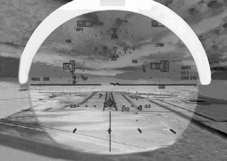
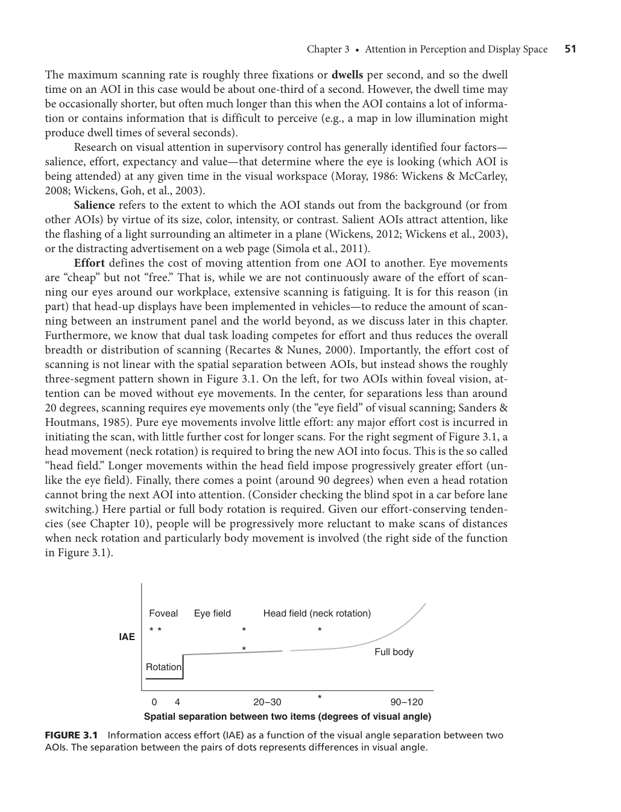
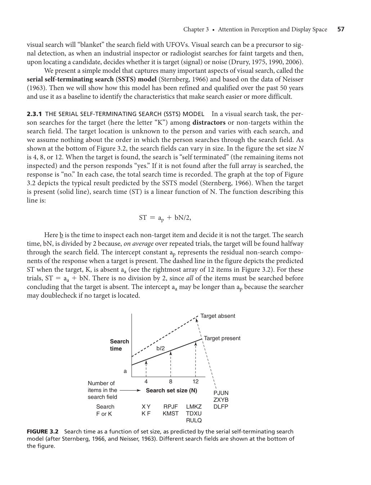
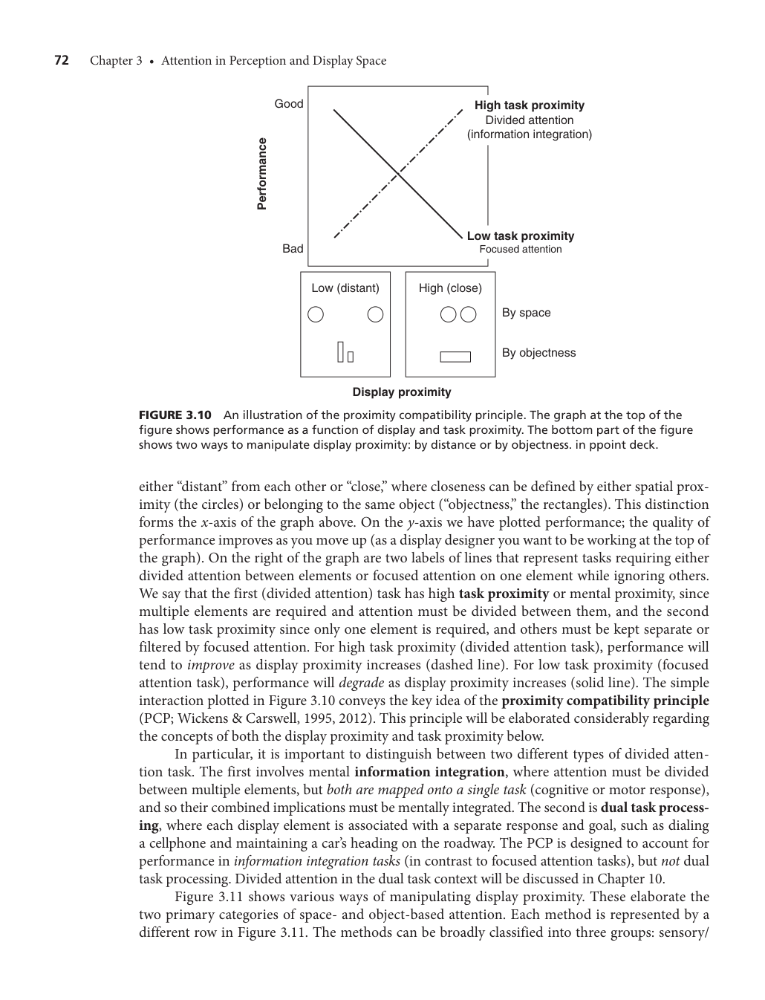
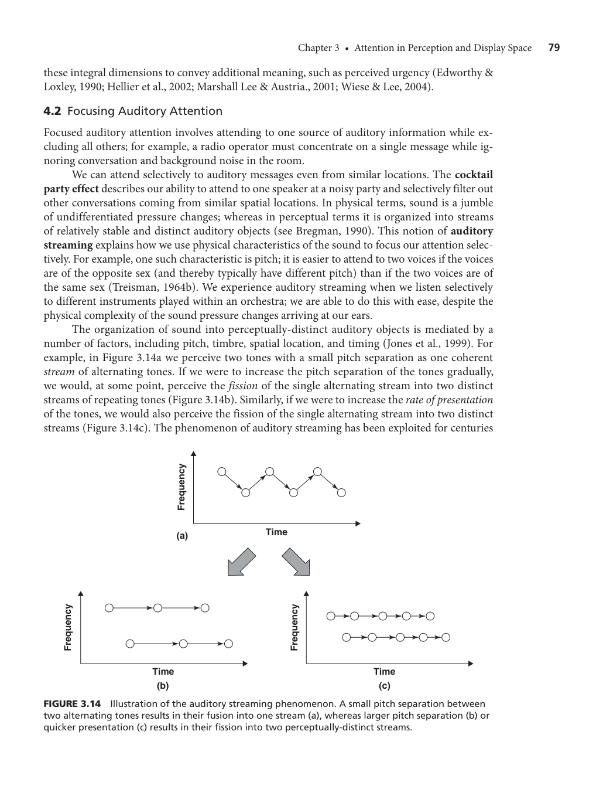
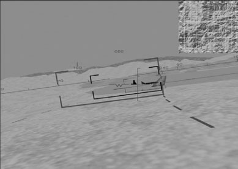

반가워요! 저는 이 책의 감수자이자 인지심리학 박사입니다. 심리학과 신입생이 되신 것을 환영해요. 영어를 몰라도 이 챕터의 핵심을 완벽하게 이해할 수 있도록, 제가 아주 쉽고 친절하게, 그리고 논리적으로 풀어서 설명해 줄게요. 자, 첫 번째 단계인 챕터 프리뷰부터 시작해 봅시다.

### 1. 챕터 프리뷰: 가장 큰 주제와 논리적 흐름

**이 챕터의 핵심 주제: "인간의 주의력(Attention)은 어떻게 작동하며, 이를 돕기 위해 환경(디스플레이)을 어떻게 설계해야 할까?"**

이 단원을 왜 배워야 할까요? 우리가 일상생활이나 운전, 또는 위험한 작업을 할 때 수많은 사고가 일어나는 주요 원인 중 하나가 바로 '주의력의 실패'이기 때문입니다. 예를 들어, 매년 미국에서 발생하는 약 4만 건의 교통사고 사망자 중 절반 이상이 운전자의 주의 산만 때문에 발생한다고 추정됩니다. 따라서 인간이 어떻게 주의를 기울이는지 그 한계를 명확히 이해해야 더 안전하고 효율적인 시스템을 만들 수 있습니다.

이 챕터를 관통하는 가장 훌륭한 비유는 **'손전등(Flashlight) 비유'**입니다. 이 비유를 따라가면 하위 섹션들이 아주 논리적으로 연결됩니다.

*   **첫 번째 섹션: 시각적 선택 주의 (어디에 손전등을 비출 것인가?)**
    우리는 세상의 모든 것을 볼 수 없기 때문에 특정한 곳을 '선택'해서 봅니다. 여기서는 자동차 계기판처럼 필요한 정보를 지속적으로 모니터링하는 방법, 갑자기 나타난 보행자를 알아차리는 과정, 그리고 복잡한 화면에서 원하는 목표물을 탐색하는 과정을 배웁니다,,.
*   **두 번째 섹션: 병렬 처리와 분할 주의 (손전등 빛을 넓혀 여러 개를 동시에 볼 수 있을까?)**
    두 가지 이상의 일을 동시에 하려면 '분할 주의'가 필요합니다. 손전등의 빛을 넓혀서 여러 정보 채널을 동시에 수용하는 과정입니다. 여기서는 흩어져 있는 정보를 공간적으로 가깝게 모으거나(공간 기반), 아예 하나의 물체처럼 묶어버리면(객체 기반) 우리의 뇌가 여러 정보를 한 번에 처리하기 쉬워진다는 설계 원칙을 배웁니다,,.
*   **세 번째 섹션: 청각 양상의 주의 (귀로 듣는 주의력은 무엇이 다를까?)**
    눈은 감을 수 있지만 귀는 닫을 수 없죠? 청각은 시각과 달리 방향성이 없고 늘 열려있습니다. 이 섹션에서는 시각과 다른 청각만의 고유한 주의력 특성(예: 여러 대화 중 하나만 골라 듣기)과 시각과 청각을 함께 사용할 때 발생하는 현상들을 배웁니다,,.

---

### 2. 반드시 기억해야 할 '가장 중요한 전문 용어'

학부생으로서 전공 시험과 기본 개념 정립을 위해 다음 용어들은 학자들의 이름과 함께 꼭 외워두세요.

1.  **SEEV 모델 (SEEV Model)**
    *   **개념:** 복잡한 시각적 작업 공간에서 사람의 눈(주의)이 어떤 요인에 의해 특정 영역을 향하게 되는지 예측하는 4가지 요소(현저성, 노력, 기대, 가치)의 약자입니다,.
    *   **중요 등장 부분:**,,,,
    *   **학술 인용:** (Wickens, 2012; Wickens, Hooey et al., 2009; Moray, 1986),
2.  **변화맹 (Change Blindness)**
    *   **개념:** 눈 깜빡임이나 화면의 가려짐 등으로 인해 시각적 변화가 일어날 때, 눈앞에서 일어난 환경의 명백한 변화를 눈치채지 못하는 현상입니다.
    *   **중요 등장 부분:**,
    *   **학술 인용:** (Simons & Levin, 1998; Rensink, 2002),
3.  **무주의 맹시 (Inattentional Blindness)**
    *   **개념:** 다른 작업에 주의를 뺏기고 있을 때, 눈을 뜨고 직접 쳐다보고 있으면서도 완전히 엉뚱하고 예기치 않은 대상(예: 농구 영상 속의 고릴라)을 보지 못하는 현상입니다,.
    *   **중요 등장 부분:**,
    *   **학술 인용:** (Mack & Rock, 1998; Simons & Chabris, 1999),
4.  **순차적 자기 종료 탐색 모델 (Serial Self-Terminating Search, SSTS)**
    *   **개념:** 무언가를 시각적으로 찾아낼 때, 항목들을 하나씩 순서대로 확인하다가 목표물을 발견하면 그 즉시 탐색을 종료하는 모델입니다,.
    *   **중요 등장 부분:**,,
    *   **학술 인용:** (Sternberg, 1966; Neisser, 1963),
5.  **근접성 호환성 원리 (Proximity Compatibility Principle, PCP)**
    *   **개념:** 여러 정보를 모아서 '통합'해야 하는 과제일수록 디스플레이 화면에서도 정보를 가깝게(근접하게) 배치하거나 묶어주어야 한다는 매우 중요한 디스플레이 설계 원리입니다.
    *   **중요 등장 부분:**,
    *   **학술 인용:** (Wickens & Carswell, 1995, 2012)
6.  **객체 기반 주의 (Object-Based Attention)**
    *   **개념:** 우리가 주의를 기울일 때 단순히 '공간적 위치'에 주의를 주는 것이 아니라, 윤곽선과 모양을 가진 하나의 '객체(Object)' 단위로 주의를 할당한다는 이론입니다.
    *   **중요 등장 부분:**,,
    *   **학술 인용:** (Kahneman & Treisman, 1984; Scholl, 2001),
7.  **칵테일 파티 효과 (Cocktail Party Effect)**
    *   **개념:** 시끄러운 파티장이나 여러 대화 소리가 들리는 상황에서도 자신이 집중하고자 하는 하나의 목소리만 선택적으로 필터링해서 들을 수 있는 청각적 능력입니다.
    *   **중요 등장 부분:**
    *   **학술 인용:** (Bregman, 1990; Treisman, 1964b)

---

### 3. 단원 전체 Flow Chart & Mind Map

아래 마인드맵을 통해 전체 챕터가 어떻게 흘러가는지 머릿속에 구조를 잡아보세요.

```text
[주의(Attention)와 디스플레이 공간] 
  │
  ├─ 1. 개요 (손전등 비유)
  │      : 선택적, 초점적, 분할적, 지속적 주의
  │
  ├─ 2. 시각적 선택 주의 (어디에 집중할 것인가?)
  │      ├─ 감독 통제 : SEEV 모델 (어디를 쳐다보는지 예측)
  │      ├─ 알아차림 : 변화맹 & 무주의 맹시 (왜 눈앞의 것을 못 볼까?)
  │      └─ 시각적 탐색 : SSTS 모델, 클러터(시각적 혼잡)와 주의 유도
  │
  ├─ 3. 병렬 처리와 분할 주의 (어떻게 여러 개를 동시에 볼 것인가?)
  │      ├─ 주의를 돕는 도구 1 : 공간적 근접성 (HUD 같은 공간의 일치)
  │      ├─ 주의를 돕는 도구 2 : 객체 기반 주의 (스트룹 효과, 객체 디스플레이)
  │      └─ 핵심 원리 : 근접성 호환성 원리 (PCP)
  │
  └─ 4. 청각 모드에서의 주의 (소리에 대한 주의는 어떻게 다를까?)
         ├─ 청각의 분할 주의 : 귀는 닫을 수 없다 (청각 단기 기억 활용)
         ├─ 청각의 집중 주의 : 칵테일 파티 효과, 청각 스트리밍
         └─ 교차 양상 주의 : 시각과 청각이 서로 어떻게 돕거나 간섭하는가 (무관음 효과)
```

**[Flow Chart 보충 설명 - 신입생을 위한 해설]**
이 흐름도는 철저하게 인간이 외부 세계의 정보를 **"수집하는 순서와 방식"**을 따라갑니다. 

가장 먼저 1번과 2번 가지에서는 눈을 뜨고 수많은 시각 정보 중에서 **"무엇을 취사선택(선택 주의)할 것인가"**에 대해 배웁니다. 손전등으로 한 곳을 강하게 비추어 찾는 과정이죠. 여기서 우리는 눈뜨고도 코 베이는 '변화맹'의 위험성을 알게 됩니다,.

그다음 3번 가지로 넘어갑니다. "손전등을 여러 개 쓰거나 범위를 넓혀서(분할 주의) **다양한 정보를 한 번에 파악할 수는 없을까?**"라는 고민의 결과입니다,. 심리학자들은 단순히 정보를 가까이 두거나, 하나의 물체로 그려버리면 사람이 여러 정보를 쉽게 동시 처리(병렬 처리)한다는 것을 깨달았고, 이를 설계 원리로 만든 것이 '근접성 호환성 원리(PCP)'입니다.

마지막 4번 가지에서는 방향을 틀어 **"눈(시각)이 아니라 귀(청각)로 들어오는 정보"**에 대해 다룹니다. 우리가 여러 대화 소리 중 듣고 싶은 것만 골라들을 수 있는 신기한 현상(칵테일 파티 효과)과 소리가 우리의 시각적 집중력을 어떻게 깨뜨릴 수 있는지를 다루며 단원이 마무리됩니다,.

이렇게 전체 그림을 머리에 넣고 나면, 앞으로 공부할 세부 내용이 이 큰 지도의 어디쯤에 속하는지 길을 잃지 않고 쉽게 이해할 수 있을 거예요! 준비가 되면 다음 단계로 넘어가 봅시다!

반가워요! 저는 이 책의 감수자이자 인지심리학 박사입니다. 심리학과 신입생이 되신 것을 환영해요. 영어를 몰라도 이 챕터의 핵심을 완벽하게 이해할 수 있도록, 제가 아주 쉽고 친절하게, 그리고 논리적으로 풀어서 설명해 줄게요. 자, 첫 번째 단계인 챕터 프리뷰부터 시작해 봅시다.

### 1. 챕터 프리뷰: 가장 큰 주제와 논리적 흐름

**이 챕터의 핵심 주제: "인간의 주의력(Attention)은 어떻게 작동하며, 이를 돕기 위해 환경(디스플레이)을 어떻게 설계해야 할까?"**

이 단원을 왜 배워야 할까요? 우리가 일상생활이나 운전, 또는 위험한 작업을 할 때 수많은 사고가 일어나는 주요 원인 중 하나가 바로 '주의력의 실패'이기 때문입니다. 예를 들어, 매년 미국에서 발생하는 약 4만 건의 교통사고 사망자 중 절반 이상이 운전자의 주의 산만 때문에 발생한다고 추정됩니다. 따라서 인간이 어떻게 주의를 기울이는지 그 한계를 명확히 이해해야 더 안전하고 효율적인 시스템을 만들 수 있습니다.

이 챕터를 관통하는 가장 훌륭한 비유는 **'손전등(Flashlight) 비유'**입니다. 이 비유를 따라가면 하위 섹션들이 아주 논리적으로 연결됩니다.

*   **첫 번째 섹션: 시각적 선택 주의 (어디에 손전등을 비출 것인가?)**
    우리는 세상의 모든 것을 볼 수 없기 때문에 특정한 곳을 '선택'해서 봅니다. 여기서는 자동차 계기판처럼 필요한 정보를 지속적으로 모니터링하는 방법, 갑자기 나타난 보행자를 알아차리는 과정, 그리고 복잡한 화면에서 원하는 목표물을 탐색하는 과정을 배웁니다,,.
*   **두 번째 섹션: 병렬 처리와 분할 주의 (손전등 빛을 넓혀 여러 개를 동시에 볼 수 있을까?)**
    두 가지 이상의 일을 동시에 하려면 '분할 주의'가 필요합니다. 손전등의 빛을 넓혀서 여러 정보 채널을 동시에 수용하는 과정입니다. 여기서는 흩어져 있는 정보를 공간적으로 가깝게 모으거나(공간 기반), 아예 하나의 물체처럼 묶어버리면(객체 기반) 우리의 뇌가 여러 정보를 한 번에 처리하기 쉬워진다는 설계 원칙을 배웁니다,,.
*   **세 번째 섹션: 청각 양상의 주의 (귀로 듣는 주의력은 무엇이 다를까?)**
    눈은 감을 수 있지만 귀는 닫을 수 없죠? 청각은 시각과 달리 방향성이 없고 늘 열려있습니다. 이 섹션에서는 시각과 다른 청각만의 고유한 주의력 특성(예: 여러 대화 중 하나만 골라 듣기)과 시각과 청각을 함께 사용할 때 발생하는 현상들을 배웁니다,,.

---

### 2. 반드시 기억해야 할 '가장 중요한 전문 용어'

학부생으로서 전공 시험과 기본 개념 정립을 위해 다음 용어들은 학자들의 이름과 함께 꼭 외워두세요.

1.  **SEEV 모델 (SEEV Model)**
    *   **개념:** 복잡한 시각적 작업 공간에서 사람의 눈(주의)이 어떤 요인에 의해 특정 영역을 향하게 되는지 예측하는 4가지 요소(현저성, 노력, 기대, 가치)의 약자입니다,.
    *   **중요 등장 부분:**,,,,
    *   **학술 인용:** (Wickens, 2012; Wickens, Hooey et al., 2009; Moray, 1986),
2.  **변화맹 (Change Blindness)**
    *   **개념:** 눈 깜빡임이나 화면의 가려짐 등으로 인해 시각적 변화가 일어날 때, 눈앞에서 일어난 환경의 명백한 변화를 눈치채지 못하는 현상입니다.
    *   **중요 등장 부분:**,
    *   **학술 인용:** (Simons & Levin, 1998; Rensink, 2002),
3.  **무주의 맹시 (Inattentional Blindness)**
    *   **개념:** 다른 작업에 주의를 뺏기고 있을 때, 눈을 뜨고 직접 쳐다보고 있으면서도 완전히 엉뚱하고 예기치 않은 대상(예: 농구 영상 속의 고릴라)을 보지 못하는 현상입니다,.
    *   **중요 등장 부분:**,
    *   **학술 인용:** (Mack & Rock, 1998; Simons & Chabris, 1999),
4.  **순차적 자기 종료 탐색 모델 (Serial Self-Terminating Search, SSTS)**
    *   **개념:** 무언가를 시각적으로 찾아낼 때, 항목들을 하나씩 순서대로 확인하다가 목표물을 발견하면 그 즉시 탐색을 종료하는 모델입니다,.
    *   **중요 등장 부분:**,,
    *   **학술 인용:** (Sternberg, 1966; Neisser, 1963),
5.  **근접성 호환성 원리 (Proximity Compatibility Principle, PCP)**
    *   **개념:** 여러 정보를 모아서 '통합'해야 하는 과제일수록 디스플레이 화면에서도 정보를 가깝게(근접하게) 배치하거나 묶어주어야 한다는 매우 중요한 디스플레이 설계 원리입니다.
    *   **중요 등장 부분:**,
    *   **학술 인용:** (Wickens & Carswell, 1995, 2012)
6.  **객체 기반 주의 (Object-Based Attention)**
    *   **개념:** 우리가 주의를 기울일 때 단순히 '공간적 위치'에 주의를 주는 것이 아니라, 윤곽선과 모양을 가진 하나의 '객체(Object)' 단위로 주의를 할당한다는 이론입니다.
    *   **중요 등장 부분:**,,
    *   **학술 인용:** (Kahneman & Treisman, 1984; Scholl, 2001),
7.  **칵테일 파티 효과 (Cocktail Party Effect)**
    *   **개념:** 시끄러운 파티장이나 여러 대화 소리가 들리는 상황에서도 자신이 집중하고자 하는 하나의 목소리만 선택적으로 필터링해서 들을 수 있는 청각적 능력입니다.
    *   **중요 등장 부분:**
    *   **학술 인용:** (Bregman, 1990; Treisman, 1964b)

---

### 3. 단원 전체 Flow Chart & Mind Map

아래 마인드맵을 통해 전체 챕터가 어떻게 흘러가는지 머릿속에 구조를 잡아보세요.

```text
[주의(Attention)와 디스플레이 공간] 
  │
  ├─ 1. 개요 (손전등 비유)
  │      : 선택적, 초점적, 분할적, 지속적 주의
  │
  ├─ 2. 시각적 선택 주의 (어디에 집중할 것인가?)
  │      ├─ 감독 통제 : SEEV 모델 (어디를 쳐다보는지 예측)
  │      ├─ 알아차림 : 변화맹 & 무주의 맹시 (왜 눈앞의 것을 못 볼까?)
  │      └─ 시각적 탐색 : SSTS 모델, 클러터(시각적 혼잡)와 주의 유도
  │
  ├─ 3. 병렬 처리와 분할 주의 (어떻게 여러 개를 동시에 볼 것인가?)
  │      ├─ 주의를 돕는 도구 1 : 공간적 근접성 (HUD 같은 공간의 일치)
  │      ├─ 주의를 돕는 도구 2 : 객체 기반 주의 (스트룹 효과, 객체 디스플레이)
  │      └─ 핵심 원리 : 근접성 호환성 원리 (PCP)
  │
  └─ 4. 청각 모드에서의 주의 (소리에 대한 주의는 어떻게 다를까?)
         ├─ 청각의 분할 주의 : 귀는 닫을 수 없다 (청각 단기 기억 활용)
         ├─ 청각의 집중 주의 : 칵테일 파티 효과, 청각 스트리밍
         └─ 교차 양상 주의 : 시각과 청각이 서로 어떻게 돕거나 간섭하는가 (무관음 효과)
```

**[Flow Chart 보충 설명 - 신입생을 위한 해설]**
이 흐름도는 철저하게 인간이 외부 세계의 정보를 **"수집하는 순서와 방식"**을 따라갑니다. 

가장 먼저 1번과 2번 가지에서는 눈을 뜨고 수많은 시각 정보 중에서 **"무엇을 취사선택(선택 주의)할 것인가"**에 대해 배웁니다. 손전등으로 한 곳을 강하게 비추어 찾는 과정이죠. 여기서 우리는 눈뜨고도 코 베이는 '변화맹'의 위험성을 알게 됩니다,.

그다음 3번 가지로 넘어갑니다. "손전등을 여러 개 쓰거나 범위를 넓혀서(분할 주의) **다양한 정보를 한 번에 파악할 수는 없을까?**"라는 고민의 결과입니다,. 심리학자들은 단순히 정보를 가까이 두거나, 하나의 물체로 그려버리면 사람이 여러 정보를 쉽게 동시 처리(병렬 처리)한다는 것을 깨달았고, 이를 설계 원리로 만든 것이 '근접성 호환성 원리(PCP)'입니다.

마지막 4번 가지에서는 방향을 틀어 **"눈(시각)이 아니라 귀(청각)로 들어오는 정보"**에 대해 다룹니다. 우리가 여러 대화 소리 중 듣고 싶은 것만 골라들을 수 있는 신기한 현상(칵테일 파티 효과)과 소리가 우리의 시각적 집중력을 어떻게 깨뜨릴 수 있는지를 다루며 단원이 마무리됩니다,.

이렇게 전체 그림을 머리에 넣고 나면, 앞으로 공부할 세부 내용이 이 큰 지도의 어디쯤에 속하는지 길을 잃지 않고 쉽게 이해할 수 있을 거예요! 준비가 되면 다음 단계로 넘어가 봅시다!

짜잔! 인지심리학 박사입니다. 여기까지 오신 것을 정말 축하해요! 이제 이론과 모델의 뼈대를 잡았으니, 이 지식을 '진짜 현실'에 써먹어 볼 차례입니다. 

심리학의 진짜 매력은 배운 이론으로 나와 내 주변 사람들의 일상적인 행동을 소름 돋게 정확히 설명할 수 있다는 데 있죠. 다른 전공을 하는 친구에게 카페에서 커피 한 잔 마시며 "야, 너 아까 왜 그 간판 못 본 지 알아?"라고 설명할 수 있도록, 책 속의 유명한 실제 실험 사례들과 우리의 일상생활을 연결해 드릴게요.

---

### 1. 전공책 속 클래식 사례: 친구에게 썰 풀기 좋은 재미있는 실험들

먼저, 책에서 이론을 증명하기 위해 사용했던 아주 흥미로운 실제 사례들을 다른 과 친구에게 설명하듯 정리해 봅시다.

**① 무주의 맹시 (Inattentional Blindness)와 '고릴라 실험'**
*   **친구에게 설명할 때:** "사람들은 눈을 똑바로 뜨고 쳐다봐도, 다른 데 집중하면 바로 앞의 고릴라도 못 본다니까?"
*   **책 속 사례 적용:** 실험 참가자들에게 농구공을 패스하는 횟수를 세라고 지시한 뒤(주의를 뺏는 주 작업), 영상 중간에 고릴라 옷을 입은 사람이 지나가게 했습니다. 놀랍게도 참가자의 절반 이상이 화면 중앙을 가로지르는 고릴라를 전혀 보지 못했습니다 (Simons & Chabris, 1999). 워킹 메모리와 주의력을 '패스 횟수 세기'에 모두 쏟아부었기 때문에, 시야에 고릴라가 들어왔음에도 불구하고 뇌가 이를 '알아차림(Noticing)'하지 못한 무주의 맹시 현상입니다,.

**② 변화맹 (Change Blindness)과 '길거리 문(Door) 실험'**
*   **친구에게 설명할 때:** "길 가다 말 걸던 사람이 갑자기 다른 사람으로 바뀌어도 사람들은 눈치를 못 채!"
*   **책 속 사례 적용:** 캠퍼스에서 길을 묻던 실험자 사이로 인부들이 커다란 문을 들고 지나갑니다. 문이 시야를 가린 그 짧은 순간, 말을 걸던 실험자가 완전히 다른 사람으로 교체됩니다. 하지만 절반에 가까운 사람들이 낯선 사람과 계속 대화를 이어갔습니다 (Simons & Levin, 1998). 시각적 변화가 일어날 때 문이나 눈 깜빡임처럼 잠시 시야가 가려지면, 우리는 눈앞의 명백한 변화를 감지하지 못합니다.

**③ 근접성 호환성 원리(PCP)와 '항공기 계기판 & HUD 디자인'**
*   **친구에게 설명할 때:** "비행기 조종사들이 왜 실수하는지 알아? 정보가 엉뚱한 곳에 흩어져 있어서 뇌가 그걸 합치기 힘들기 때문이야."
*   **책 속 사례 적용:** 과거의 항공기 엔진 계기판은 정보가 복잡하게 흩어져 있어 조종사의 확인 오류가 잦았습니다. 하지만 양쪽 엔진의 물리적 위치에 맞게 디스플레이 상의 다이얼을 재배치(공간 기반의 근접성)했더니 오류가 4분의 1로 줄었습니다 (Banbury, Selcon, & McCrerie, 1997),. 또한 조종사가 앞을 보는 동시에 비행 정보를 볼 수 있도록 창문에 정보를 띄우는 전방표시장치(HUD)를 만들었는데, 이는 외부 풍경과 계기판 정보를 하나의 객체(Object)처럼 겹쳐서 보여줌으로써 주의력 분산을 막아주는 훌륭한 사례입니다 (Wickens & Long, 1995),.



> 출처: Engineering Psychology and Human Performance (Wickens et al.), Chapter 3

**④ 주의 유도와 '무기 효과 (Weapons Effect)'**
*   **친구에게 설명할 때:** "강도 사건 목격자들이 범인 얼굴을 잘 기억 못 하는 이유는 범인의 '총'에 시선이 다 뺏겼기 때문이야."
*   **책 속 사례 적용:** 범죄 상황에서 총과 같은 뚜렷하고 위협적인 무기가 등장하면, 이 무기가 목격자의 시선을 강제로 끌어당기는 '주변부 신호(Peripheral cue)' 역할을 합니다. 그 결과 범인의 얼굴 특징과 같은 다른 중요한 정보에서 주의력이 멀어지는 터널 시야(Attentional narrowing) 현상이 발생합니다 (Hope & Wright, 2007),.

---

### 2. 일상생활 사례: 내가 제대로 이해한 게 맞을까? (Self-Check)

친구가 "그럼 그게 내 일상생활이랑 무슨 상관인데?"라고 묻는다면, 다음과 같이 우리가 매일 겪는 사례로 이론을 완벽히 적용해 보세요.

**일상 사례 A: 스마트폰을 보며 걷는 '스좀비(Smombie)' 현상**
*   **적용 이론:** 주의 분산 (Divided Attention) 및 무주의 맹시 (Inattentional Blindness)
*   **상황:** 길을 걸으면서 카카오톡을 하거나 유튜브를 보다가 마주 오는 사람이나 전봇대에 부딪힐 뻔한 적 있죠? 
*   **이론적 해석:** 우리의 시야에 장애물이 분명히 들어왔음에도 불구하고, 스마트폰이라는 과제에 주의력 용량(워킹 메모리)을 다 써버렸기 때문에 눈앞의 위험을 지각하지 못하는 '무주의 맹시'가 발생한 것입니다. 실제로 연구에 따르면 휴대폰 통화를 하며 걷는 사람들은 그렇지 않은 사람들에 비해 예상치 못한 이벤트를 훨씬 적게 알아차립니다 (Hyman et al., 2010).

**일상 사례 B: 노트북으로 과제할 때의 화면 분할 (듀얼 모니터 활용)**
*   **적용 이론:** 근접성 호환성 원리 (PCP: Proximity Compatibility Principle)
*   **상황:** 참고 논문과 워드 프로세서를 번갈아 보며 리포트를 쓸 때, 탭을 계속 전환하면 글이 잘 안 써집니다. 그래서 화면을 반으로 쪼개거나 듀얼 모니터로 나란히 띄워놓고 과제를 합니다.
*   **이론적 해석:** 논문의 내용과 내가 쓸 내용을 '통합(Integration)'해야 하는 과제입니다. PCP 원리에 따르면, 합쳐야 할 정보는 시공간적으로 가깝게(Close Proximity) 배치해야 뇌가 편안하게 처리할 수 있습니다,. 탭을 넘기는 것은 '노력(Effort)' 비용을 발생시켜 SEEV 모델에 따라 시선 이동을 방해하지만, 화면을 분할하면 공간적 근접성이 높아져 정보 통합이 비약적으로 쉬워집니다.

**일상 사례 C: 시끄러운 스터디 카페에서 내 이름 부르는 소리 듣기**
*   **적용 이론:** 칵테일 파티 효과 (Cocktail Party Effect)와 청각적 주의 전환
*   **상황:** 스터디 카페에 백색소음도 있고 사람들의 수다 소리도 들리지만, 나는 이어폰의 인강 소리에만 온전히 집중할 수 있습니다. 그런데 저 멀리서 "야, OOO(내 이름)!" 하고 부르는 소리는 귀에 쏙 들어옵니다.
*   **이론적 해석:** 우리는 수많은 소리(청각 스트림) 중 원하는 방향이나 주파수의 소리(인강 강사의 목소리)에만 선택적으로 주의를 집중할 수 있습니다 (Treisman, 1964b). 하지만 내가 무시하고 있던 주변 소음도 뇌의 무의식적인 저장소에 약 3~6초간 머물며 의미가 분석되는데, '내 이름'이나 큰 소리처럼 나에게 매우 가치 있고 중요한(Pertinence) 소리가 들리면 즉각적으로 그쪽으로 주의가 강제 전환됩니다 (Moray, 1959).

---

### 3. 연구 인용 정보 (APA 양식 Reference)

(참고: 본 정보는 제공해주신 텍스트의 저자 및 연도 인용을 바탕으로 정리한 것이며, 완벽한 APA 규격을 위해 제공된 소스 외부의 학술적 지식인 '논문 원제 및 저널명'을 일부 보충하여 작성했습니다. 존재하지 않는 링크는 배제하였습니다.)

*   Banbury, S., Selcon, S., & McCrerie, M. (1997). *[텍스트 상의 항공기 엔진 디스플레이 재설계 실험 연구]*.,
*   Hope, L., & Wright, D. (2007). Beyond unusual? Examining the role of attention in the weapon focus effect. *Applied Cognitive Psychology*.
*   Hyman, I. E., Boss, S. M., Wise, B. M., McKenzie, K. E., & Caggiano, J. M. (2010). Did you see the unicycling clown? Inattentional blindness while walking and talking on a cell phone. *Applied Cognitive Psychology*, 24(5), 597-607.
*   Lee, J. D., Young, K. L., & Regan, M. A. (2009). *[텍스트 상의 운전 중 주의 산만 및 교통사고 연구]*.
*   Moray, N. (1959). Attention in dichotic listening: Affective cues and the influence of instructions. *Quarterly Journal of Experimental Psychology*, 11(1), 56-60.
*   Simons, D. J., & Chabris, C. F. (1999). Gorillas in our midst: Sustained inattentional blindness for dynamic events. *Perception*, 28(9), 1059-1074.,
*   Simons, D. J., & Levin, D. T. (1998). Failure to detect changes to people during a real-world interaction. *Psychonomic Bulletin & Review*, 5(4), 644-649.
*   Treisman, A. M. (1964b). Verbal cues, language, and meaning in selective attention. *American Journal of Psychology*, 77(2), 206-219.
*   Wickens, C. D., & Long, J. (1995). Object versus space-based models of visual attention: Implications for the design of head-up displays. *Journal of Experimental Psychology: Applied*, 1(3), 179.,,

신입생 여러분, 이 정도면 심리학과 학생으로서 친구들 앞에서 멋지게 전공 지식을 뽐낼 수 있을 거예요! 이론이 일상 속 숨겨진 인간의 마음을 보여주는 멋진 렌즈가 되었다는 것을 느끼셨길 바랍니다. 추가로 도움이 필요하면 언제든 불러주세요!

훌륭합니다! 인지심리학의 꽃인 '데이터와 그래프 해석' 단계에 오셨군요. 심리학과 학생이라면 복잡한 수식과 그래프를 보고도 친구들에게 일상 용어로 "이게 무슨 뜻이냐면~" 하고 멋지게 설명할 수 있어야 합니다. 

친구가 인스타그램 '카드뉴스'나 '스토리' 형태로 넘겨보며 단번에 이해할 수 있도록, 이 단원의 핵심 그래프 4개를 선정하여 순서대로 아주 쉽게, 하지만 학술적 근거는 탄탄하게 구성해 드리겠습니다.

---

### 📱 인스타그램 카드뉴스 기획안: "우리의 뇌는 화면을 어떻게 읽을까?"

#### **[Slide 1] Figure 3.1 : 정보 접근 노력 (IAE) 그래프 - "고개 돌리게 하지 마!"**
*   **프로세스와 목적:** 화면이나 현실 세계에서 두 정보 사이의 거리가 멀어질 때, 우리가 거기를 쳐다보는데 드는 '노력(Effort)'이 얼마나 커지는지 보여주는 그래프입니다.
*   **축의 의미:** 
    *   **X축:** 두 항목 간의 공간적 분리 (시각도 단위, 0도, 4도, 20~30도, 90~120도).
    *   **Y축:** 정보 접근 노력 (IAE, Information Access Effort).
*   **그래프 곡선의 심리학적 법칙:** 비선형적 계단식 곡선을 띕니다. 거리가 멀어진다고 정비례해서 힘든 게 아닙니다. 중심와(0도)에서 눈동자만 굴리는 '눈 영역(Eye field, 20도 미만)'까지는 노력이 거의 들지 않아 그래프가 평탄합니다. 하지만 20도가 넘어가서 '고개를 돌려야 하는 영역(Head field)'이 되면 선이 훅 올라가고, 90도가 넘어 '몸 전체를 돌려야 하는 영역'이 되면 비용이 수직 상승합니다.
*   **해석과 시사점:** 친구에게 이렇게 말해주세요. *"야, 폰 하다가 옆에 볼 때 눈동자만 굴릴 땐 안 힘든데, 고개 돌리려면 귀찮아서 안 보게 되지? 그게 이 그래프야!"* 자동차 계기판을 앞 유리창에 띄워주는 HUD(전방표시장치)가 왜 생겼을까요? 정보를 20도 이내로 모아서 고개를 숙이는 '노력 비용'을 줄여주기 위함입니다. 
*   **인용 정보:** (Sanders & Houtmans, 1985)



#### **[Slide 2] Figure 3.2 : 순차적 자기 종료 탐색 (SSTS) 그래프 - "내 차 키 어딨어?!"**
*   **프로세스와 목적:** 복잡한 시각적 환경에서 우리가 목표물(예: 숨은 글자 K 찾기)을 찾을 때, 주변 쓰레기 정보(Distractors)가 늘어날수록 탐색 시간이 얼마나 길어지는지 수학적으로 계산한 그래프입니다.
*   **축의 의미:**
    *   **X축:** 탐색 필드 내 아이템의 개수 (N = 4개, 8개, 12개).
    *   **Y축:** 목표물을 찾는 데 걸리는 탐색 시간 (Search Time).
*   **그래프 곡선의 심리학적 법칙:** 두 개의 우상향하는 직선이 나옵니다.
    *   **실선 (목표물이 있을 때):** 기울기가 완만합니다 (공식: ST = ap + bN/2). 평균적으로 화면에 있는 아이템의 절반(N/2) 정도를 순서대로 확인하다가 목표물을 찾으면 그 즉시 탐색을 스스로 종료(Self-terminating)하기 때문입니다.
    *   **점선 (목표물이 없을 때):** 기울기가 훨씬 가파릅니다 (공식: ST = aa + bN). 목표물이 진짜 없는지 확신하려면 결국 12개의 아이템을 다 뒤져봐야(N) 하므로 시간이 2배로 걸립니다.
*   **해석과 시사점:** 화면에 아이템(N)이 4개에서 12개로 늘어나면 탐색 시간은 정직하게 선형적으로 길어집니다. 우리가 앱을 디자인할 때 한 화면에 메뉴를 너무 많이(Clutter) 넣으면 안 되는 이유입니다. 사용자는 원하는 메뉴를 찾기 위해 속 터지게 하나하나 다 읽어봐야 하니까요!
*   **인용 정보:** (Sternberg, 1966; Neisser, 1963)



#### **[Slide 3] Figure 3.10 : 근접성 호환성 원리 (PCP) 그래프 - "가깝다고 다 좋은 게 아니야"**
*   **프로세스와 목적:** 이 챕터의 하이라이트입니다! 인간이 수행해야 하는 '과제의 성격'과 '화면의 디자인'이 어떻게 상호작용(Interaction)하는지 보여주는 절대 원칙입니다.
*   **축의 의미:**
    *   **X축:** 화면 상의 근접성 (왼쪽은 멀리 떨어져 있음, 오른쪽은 가깝게 붙어있거나 하나의 사물로 묶여있음).
    *   **Y축:** 수행 성과 (위로 갈수록 Good, 아래로 갈수록 Bad).
*   **그래프 곡선의 심리학적 법칙:** X자 형태로 크로스되는 상호작용 곡선입니다.
    *   **점선 (분할 주의/정보 통합 과제):** 온도와 습도를 합쳐서 불쾌지수를 계산해야 하는 것처럼 여러 정보를 '통합'해야 할 때는, 화면에서 두 정보가 가까울수록(X축 오른쪽으로 갈수록) 성과(Y축)가 확 올라갑니다.
    *   **실선 (초점적 주의 과제):** 반대로, 수많은 카톡 중 특정 사람의 메시지만 골라봐야 하는 집중 과제에서는, 정보들이 너무 가까우면 오히려 방해(간섭)가 되어 성과가 떨어집니다(우하향).
*   **해석과 시사점:** *"야, 정보는 무조건 가깝고 깔끔하게 묶어주는 게 좋은 거 아니야?"* 라고 묻는 친구에게 이 그래프를 보여주세요. 정보들을 묶어주고 가깝게 배치하는 건 정보를 '합칠 때'만 유리합니다. 정보를 따로 떼어 집중해야 할 때 너무 가깝게 붙여두면 오히려 헷갈려서 실수를 유발한다는 아주 중요한 디자인 철학입니다.
*   **인용 정보:** (Wickens & Carswell, 1995, 2012)



#### **[Slide 4] Figure 3.14 : 청각 스트리밍 (Auditory Streaming) - "시끄러운 클럽에서 네 목소리만 들려"**
*   **프로세스와 목적:** 시각뿐만 아니라 '청각' 정보도 어떻게 우리 뇌에서 하나로 묶이거나 두 개로 분리되는지 보여주는 도표입니다.
*   **축의 의미:**
    *   **X축:** 시간의 흐름 (Time).
    *   **Y축:** 주파수 또는 음의 높낮이 (Frequency).
*   **그래프 곡선의 심리학적 법칙:** 세 가지 패턴(a, b, c)을 보여줍니다.
    *   (a) 두 소리의 주파수(음높이) 차이가 작으면, 우리 뇌는 이를 둥-딱-둥-딱 하는 '하나의 연결된 리듬(Fusion)'으로 인식합니다.
    *   (b) 주파수 차이를 크게 찢어버리거나, (c) 재생 속도를 엄청 빠르게 해버리면, 뇌는 이것을 '고음 스트림'과 '저음 스트림' 두 개의 완전히 다른 소리(Fission)로 분리해서 듣게 됩니다.
*   **해석과 시사점:** 시끄러운 파티장이나 클럽에서 다른 소음은 다 배경음으로 날려버리고 내 친구의 목소리만 쏙 뽑아서 들을 수 있는 이유(칵테일 파티 효과)가 바로 이것입니다. 친구 목소리의 주파수가 다른 소음들과 확연히 다르면 별도의 '청각 객체(스트림)'로 분리되기 때문이죠.
*   **인용 정보:** (Bregman, 1990; Jones et al., 1999)



---

### 🗺️ 전체 데이터/도표 흐름도 (Flow Chart) 및 보충 설명

인스타그램의 마지막 슬라이드로 이 요약 차트를 넣어주면 완벽합니다.

```text
[주의력과 디스플레이 설계의 흐름도]

1. 눈동자 이동의 물리적 한계 인식
   └─ ▶ [Figure 3.1 IAE 그래프] : 거리가 멀어질수록 쳐다보기 싫어진다 (노력 비용 증가)
            ↓
2. 한계 속에서 정보 탐색의 규칙 발견
   └─ ▶ [Figure 3.2 SSTS 그래프] : 정보가 많아질수록 찾는 데 시간이 선형적으로 배로 든다
            ↓
3. 인간의 뇌 구조에 맞춘 궁극의 시각 설계 원칙
   └─ ▶ [Figure 3.10 PCP 그래프] : 합쳐야 할 정보는 묶어주고(점선↑), 나눌 정보는 떼어놔라(실선↓)
            ↓
4. 시각을 넘어선 청각 정보의 원리 
   └─ ▶ [Figure 3.14 청각 스트리밍] : 눈(공간)뿐만 아니라 귀(주파수/시간)도 규칙에 따라 정보를 그룹화한다
```

**💡 [왜 이런 흐름으로 이어지나요? - 아주 쉬운 보충 설명]**
친구들, 우리가 매일 보는 스마트폰 앱이나 자동차 내비게이션은 그냥 예쁘게 만든 게 아닙니다. 심리학자들이 철저하게 계산한 흐름이 숨어있죠!

먼저, 인간은 정보를 볼 때 고개 돌리는 걸 극도로 귀찮아합니다 **(Fig 3.1 눈의 노력 한계)**. 그래서 정보를 한눈에 볼 수 있게 좁은 화면에 다 쑤셔 넣으면 어떻게 될까요? 아이템이 많아질수록 내가 원하는 버튼을 찾는 데 시간이 엄청 오래 걸리게 됩니다 **(Fig 3.2 탐색 시간의 증가)**. 

그렇다면 "좁은 화면에 여러 정보를 두면서도, 빨리 찾게 하려면 어떻게 해야 해?"라는 딜레마에 빠지죠. 그 정답을 제시한 것이 바로 **(Fig 3.10 PCP 디자인 원칙)**입니다. 뇌가 한 번에 합쳐서 판단해야 하는 정보들(예: 아이디와 비밀번호 입력창)은 아주 가깝게 붙이거나 아예 하나의 박스로 묶어버리면 뇌가 한방에 처리해서 성능이 쑥쑥 올라갑니다.

마지막으로, 눈(시각)으로만 정보를 욱여넣으면 뇌가 터질 수 있으니, 귀(청각)를 활용합니다. 소리 역시 주파수나 박자를 다르게 주면 우리 뇌가 알아서 별개의 정보로 쪼개서(스트리밍) 들을 수 있다는 사실 **(Fig 3.14 청각 정보의 분리)**을 이용해 시각의 과부하를 덜어주는 것으로 이 챕터의 멋진 설계 스토리가 완성되는 것입니다!

마지막 단계인 셀프 테스트 및 피드백(Self-Check)에 오신 것을 환영합니다! 이 단계에서는 단순한 암기를 넘어서, 배운 이론들을 실제 상황에 어떻게 적용할 수 있는지 점검해 볼 것입니다. 친구와 함께 카페에 앉아 서로 질문을 주고받는다고 상상하며 아래의 3가지 시나리오 퀴즈를 풀어보세요. 

문제를 먼저 읽고 스스로 답을 고민해 본 뒤, 하단의 정답 및 해설과 비교해 보시길 바랍니다!

---

### 📝 [사고력 중심 리뷰 퀴즈: 일상 속 인지심리학]

**문제 1: 운전 중의 아찔한 순간 (시각적 선택 주의와 알아차림)**
당신은 매일 출퇴근하는 한적하고 익숙한 직선 도로를 운전하고 있습니다. 조수석에 둔 스마트폰에서 내비게이션 경로를 확인하느라 시선을 아래로 둔 상태입니다. 그런데 갑자기 도로로 뛰어든 고라니를 눈앞에 두고도 전혀 눈치채지 못해 사고가 날 뻔했습니다. 
*   **질문 1-1:** 당신의 시선이 왜 도로가 아닌 스마트폰(내비게이션)에 머물게 되었는지 **SEEV 모델의 4가지 요소**를 적용하여 설명해 보세요.
*   **질문 1-2:** 두 눈을 뜨고 전방 시야에 고라니가 들어왔음에도 불구하고 왜 인지하지 못했는지, 농구 영상 속 **'고릴라 실험'과 연결하여 이 현상의 명칭과 원인**을 설명해 보세요.

**문제 2: 스마트폰 가계부 앱 디자인 (시각적 탐색과 디스플레이 설계)**
당신은 새로운 가계부 앱의 UI(사용자 인터페이스)를 디자인하고 있습니다. 화면에 20개가 넘는 세부 메뉴 버튼을 흩어놓았고, 사용자는 이번 달 '목표 예산'과 '현재 지출액'을 나란히 비교하여 과소비 여부를 판단해야 합니다. 
*   **질문 2-1:** 화면에 메뉴(아이템)가 20개나 있을 때, 사용자가 원하는 메뉴를 찾는 데 시간이 얼마나 걸릴지 **순차적 자기 종료 탐색(SSTS) 모델의 그래프(Figure 3.2) 곡선**을 근거로 설명해 보세요.
*   **질문 2-2:** '목표 예산'과 '현재 지출액'을 비교하는 것은 어떤 유형의 과제이며, **근접성 호환성 원리(PCP, Figure 3.10) 그래프**에 따르면 이 두 정보를 화면에 어떻게 배치해야 사용자의 성과(Performance)가 극대화될까요?

**문제 3: 시끄러운 스터디 카페에서의 집중 (청각적 주의와 교차 양상)**
스터디 카페에서 공부를 하고 있습니다. 주변에서 여러 사람의 대화 소리가 들리지만, 당신은 오직 같이 온 친구의 목소리에만 집중할 수 있습니다. 그런데 카페 배경음악으로 '가사가 있는 시끄러운 가요'가 나오기 시작하자, 갑자기 전공책의 글이 눈에 들어오지 않고 집중력이 완전히 깨져버렸습니다.
*   **질문 3-1:** 여러 소음 속에서 친구의 목소리만 뚜렷하게 분리해서 들을 수 있는 이유는 무엇인지 **'청각 스트리밍(Figure 3.14)'**의 개념을 사용해 설명해 보세요.
*   **질문 3-2:** 배경 음악이 바뀌자 글 읽기(시각 과제)가 방해받은 현상의 이름은 무엇이며, 왜 가사가 있는 노래가 단순한 백색 소음보다 훨씬 더 우리의 작업 기억(Working Memory)을 교란시키는지 설명해 보세요.

---
---

### 💡 [정답 및 해설 (피드백)]

**답변 1: SEEV 모델과 무주의 맹시**
*   **1-1 해설:** **SEEV 모델**에 따르면 시선은 현저성(Salience), 노력(Effort), 기대(Expectancy), 가치(Value)에 의해 결정됩니다. 익숙하고 한적한 직선 도로는 변화가 적을 것이라는 **낮은 '기대(Expectancy)'**를 형성합니다. 반면 내비게이션 확인은 현재 경로 이탈을 막기 위한 **높은 '가치(Value)'**를 지닙니다. 따라서 운전자의 주의(시선)는 자연스럽게 도로를 이탈해 스마트폰으로 배분된 것입니다.
*   **1-2 해설:** 이 현상은 **무주의 맹시(Inattentional Blindness)**입니다. 농구 패스 횟수를 세느라 고릴라를 못 본 실험 참가자들처럼 (Simons & Chabris, 1999), 운전자 역시 내비게이션 정보 처리에 작업 기억(Working Memory)과 주의력을 모두 소진했기 때문에, 시야에 고라니가 들어왔음에도 뇌가 이를 '알아차림(Noticing)'하지 못한 것입니다.

**답변 2: SSTS 모델과 근접성 호환성 원리 (PCP)**
*   **2-1 해설:** **SSTS(순차적 자기 종료 탐색) 모델**에 따르면, 목표물을 찾을 때까지 걸리는 탐색 시간은 화면 내의 항목 수(N)에 선형적으로 비례하여 증가합니다 (Sternberg, 1966). 항목이 20개로 늘어나면 수많은 쓰레기 정보(Distractors)로 인해 탐색 시간이 급격히 길어지므로(수식: ST = ap + bN/2), 항목 수를 줄여 시각적 혼잡(Clutter)을 최소화해야 합니다.
*   **2-2 해설:** 예산과 지출을 비교하는 것은 두 가지 정보를 합쳐서 판단해야 하는 **'정보 통합(Information Integration) 과제'**로, **높은 과제 근접성(High task proximity)**을 요구합니다. **PCP 원리(Wickens & Carswell, 1995)**의 상호작용 그래프에 따르면, 이러한 통합 과제는 디스플레이 상에서도 두 정보를 시공간적으로 가깝게 붙이거나 하나의 객체(Object)로 묶어줄 때(높은 디스플레이 근접성) 성과가 가장 좋아집니다.

**답변 3: 청각 스트리밍과 무관음 효과**
*   **3-1 해설:** 소리는 물리적으로 섞여서 들어오지만, 우리의 뇌는 주파수(음높이), 음색, 공간적 위치 등의 물리적 특성을 바탕으로 소리를 별개의 덩어리로 쪼개어 인식합니다. 이를 **청각 스트리밍(Auditory Streaming)** 또는 칵테일 파티 효과라고 합니다 (Bregman, 1990). 친구의 목소리 주파수가 다른 소음과 다르기 때문에 뇌가 이를 독립된 객체로 분리해 집중할 수 있는 것입니다.
*   **3-2 해설:** 이를 **무관음 효과(Irrelevant Sound Effect)**라고 합니다. 전공책을 읽으며 내용을 순서대로 기억하는 '작업 기억(Working memory)'은 소리의 간섭에 매우 취약합니다. 특히 음향적 변화(Acoustic change)가 심한 가사가 있는 노래나 말소리는, 순서를 유지해야 하는 우리의 인지적 과정을 심하게 교란시킵니다 (Jones & Macken, 2003). 따라서 백색소음처럼 일정한 소리보다 훨씬 더 파괴적인 방해꾼이 됩니다.

---

### 🗺️ [전체 Chapter 요약 Flow Chart & 보충 설명]

이 단원의 전체적인 논리적 흐름을 마인드맵형 흐름도로 다시 한번 머릿속에 정리해 봅시다.

```text
[인간의 주의력 (Attention) 메커니즘과 설계 원리]

▼ 1단계: "어디에 주의를 기울이는가?" (선택적 주의)
  ├─ 평상시의 시선 이동: [SEEV 모델] (기대와 가치에 따라 모니터링)
  └─ 돌발 상황의 한계: [무주의 맹시 & 변화맹] (다른 곳에 집중하면 눈앞의 것도 못 봄)

▼ 2단계: "원하는 것을 어떻게 찾는가?" (시각적 탐색)
  ├─ 탐색의 기본 법칙: [SSTS 모델] (항목이 많을수록 찾는 시간이 선형적으로 증가)
  └─ 방해 요소: [시각적 혼잡(Clutter)] (화면이 복잡하면 집중과 탐색 모두 실패)

▼ 3단계: "어떻게 여러 개를 동시에 파악하는가?" (분할 주의와 디스플레이 설계)
  ├─ 주의의 단위: [공간 기반 주의 vs 객체 기반 주의] 
  └─ 궁극의 설계 원칙: [근접성 호환성 원리 (PCP)] 
      (통합할 정보는 가깝게 묶고, 분리할 정보는 멀리 떨어뜨려라!)

▼ 4단계: "귀로 들어오는 정보는 어떻게 다를까?" (청각 양상의 주의)
  ├─ 소리의 분리와 집중: [청각 스트리밍 & 칵테일 파티 효과]
  └─ 감각 간의 충돌: [무관음 효과] (변화가 큰 소음은 시각적 작업 기억을 파괴함)
```

**[Flow Chart 보충 설명 - "주의력의 여정"]**
이 흐름도는 인간이 정보를 받아들이는 **'주의력의 여정'**을 완벽하게 보여줍니다. 
먼저 1단계에서는 한정된 자원인 우리의 눈(손전등)이 어디로 향하는지(SEEV), 그리고 그 한계 때문에 무엇을 놓치는지(맹시 현상)를 배웠습니다. 2단계에서는 그 손전등을 가지고 수많은 정보 속에서 목표물을 어떻게 찾아내는지(SSTS) 그 규칙을 확인했죠.

그리고 3단계가 이 챕터의 핵심인 **'공학적 해결책(PCP)'**입니다. 인간의 눈과 뇌가 가진 한계를 알았으니, 디스플레이를 디자인할 때는 인간이 정보를 쉽게 묶어서(통합) 처리할 수 있도록 정보를 가깝게 배치하거나 예쁜 하나의 그래픽(객체)으로 만들어주어야 한다는 결론에 도달합니다. 
마지막 4단계에서는 시야 밖에서 일어나는 일까지 감지할 수 있는 '청각'의 신비로움과, 그것이 시각 과제와 어떻게 충돌하는지를 배우며 인간의 정보 처리 시스템 전체를 이해하게 됩니다.

이 흐름을 완벽히 이해하셨다면, 이제 여러분은 일상생활의 수많은 디자인과 사람들의 행동을 인지심리학자의 눈으로 분석할 수 있는 진짜 전문가가 된 것입니다! 한 단원 동안 정말 고생 많으셨습니다.

마지막 단계까지 오신 것을 진심으로 환영합니다! 영어 원서의 압박감, 심리학과 신입생이라면 누구나 한 번쯤 겪는 아주 자연스러운 감정입니다. 

하지만 걱정하지 마세요. 심리학의 본질은 '영어 텍스트'가 아니라 **'인간의 마음이 작동하는 원리'**를 이해하는 것입니다. 영어를 평생 공부하지 않더라도 이 학문을 깊이 있게 통달할 수 있는 보완 전략과, 당장 교수님의 질문에 완벽하게 대처할 수 있는 '위기 탈출 3분 스피치 대본'을 준비했습니다.

---

### 🛡️ STEP 6-1: 'No English' 영어 프리(Free) 학습 보완 전략

영어를 읽지 않고도 전공 지식을 탄탄하게 다지는 3가지 핵심 전략입니다. *(참고: 이 전략 부분에 언급된 논문 검색 사이트 등은 제공된 소스 외부의 일반적인 학술 팁이므로 참고용으로 활용하시기 바랍니다.)*

1.  **시각 자료(Data & Visual) 마스터가 되세요:**
    심리학의 세계 공통어는 영어가 아니라 **'도표와 그래프'**입니다. Figure 3.1(접근 노력), 3.2(탐색 시간), 3.10(PCP 원리) 같은 핵심 그래프의 X축, Y축, 그리고 곡선의 의미만 설명할 수 있어도 텍스트 수십 장을 읽은 것과 같습니다. 
2.  **국내 학술 데이터베이스(RISS, DBpia)를 적극 활용하세요:**
    'SEEV 모델', '근접성 호환성 원리', '변화맹'과 같은 핵심 키워드들은 이미 수많은 한국인 학자들에 의해 한국어 논문으로 훌륭하게 번역 및 리뷰되어 있습니다. 원서가 막힐 때는 잘 쓰인 한국어 리뷰 논문 하나를 읽는 것이 훨씬 빠르고 정확합니다.
3.  **우리말 '일상 사례 노트'를 만드세요:**
    앞선 STEP 3에서 했던 것처럼, 이론을 배울 때마다 나의 일상생활 속 한국어 사례(예: 스터디 카페의 소음, 내비게이션 사용 등)로 번역해서 나만의 노트를 만드세요. 교수님들은 원서를 달달 외운 학생보다, 주변 환경에 이론을 적용할 줄 아는 학생에게 A+를 줍니다.

---

### 🎤 STEP 6-2: 위기 탈출법! 교수님 브리핑용 '3분 스피치 대본'

교수님이 갑자기 "자, 3장에서 우리가 뭘 배웠는지 전체적으로 요약해 볼 사람?"이라고 물었을 때, 당황하지 않고 논리적으로 대답할 수 있는 완벽한 스피치 대본입니다.

**[시작: 도입부]**
"교수님, 3장 '지각과 디스플레이 공간에서의 주의(Attention in Perception and Display Space)' 단원에 대해 브리핑하겠습니다. 이 단원의 핵심 주제는 **인간의 주의력이 가진 한계와 특성을 이해하고, 이를 바탕으로 오류를 줄이는 디스플레이 설계 원리를 도출**하는 것입니다. 책에서는 인간의 주의를 한정된 곳만 비출 수 있는 '손전등'에 비유하고 있습니다."

**[본론 1: 시각적 선택 주의와 그 한계]**
"먼저, 사람은 시야의 모든 곳을 볼 수 없기 때문에 선택적 주의를 기울입니다. 인간이 환경에서 어디를 쳐다보는지 예측하는 **SEEV 모델**에 따르면, 시선은 대상의 현저성과 가치, 기대치에 따라 이동하며 거리가 멀어질수록 노력 비용이 커져 탐색을 기피하게 됩니다. 또한 다른 인지적 작업에 주의를 다 뺏기게 되면, 두 눈을 뜨고도 예기치 않은 대상(고릴라)을 보지 못하는 **'무주의 맹시'**나 눈앞의 변화를 놓치는 **'변화맹'** 현상에 빠질 수 있음을 확인했습니다."

**[본론 2: 시각적 탐색과 화면 설계]**
"다음으로 정보 탐색 과정입니다. 목표물을 찾는 과정을 수치화한 **순차적 자기 종료 탐색(SSTS) 모델**에 따르면, 화면에 불필요한 정보, 즉 클러터(Clutter)가 많아질수록 정보를 찾는 시간은 선형적으로 정직하게 배로 늘어납니다. 따라서 디스플레이는 시각적 혼잡도를 최소화해야 합니다."

**[본론 3: 분할 주의와 궁극의 공학 원리 (PCP)]**
"그렇다면 여러 정보를 동시에 처리해야 할 때는 화면을 어떻게 설계해야 할까요? 이 단원의 가장 중요한 원리인 **근접성 호환성 원리(PCP)**가 그 해답을 줍니다. 사용자가 여러 정보를 하나로 합쳐서(통합하여) 판단해야 하는 과제라면, 정보를 화면상에서 가깝게 배치하거나 아예 선과 도형을 이용해 하나의 객체(Object)로 묶어줄 때 주의 분산이 최적화되고 성과가 극대화됩니다. 비행기 조종석의 전방표시장치(HUD)나 시스템 상태를 도형 모양으로 알려주는 객체 디스플레이가 그 훌륭한 적용 사례입니다."

**[본론 4: 청각적 주의]**
"마지막으로 시각을 넘어선 청각적 주의입니다. 청각은 시각처럼 눈을 감을 수 없는 특징이 있습니다. 우리는 주파수 차이 등을 이용해 여러 소음 속에서 하나의 소리만 묶어서 듣는 **'청각 스트리밍(칵테일 파티 효과)'** 능력을 가지고 있습니다. 하지만 인간의 작업 기억은 말소리처럼 음향적 변화가 큰 소음에 매우 취약하여 집중력을 잃기 쉬운 **'무관음 효과'**를 겪게 되므로, 작업장이나 학습 환경에서는 소음의 변동성을 줄이는 설계가 필수적입니다."

**[마무리: 결론]**
"결론적으로 이 단원은 인간이 맹시를 겪거나 탐색이 느려지는 **인지적 약점을 명확히 진단하고, 이를 '공간 배치', '객체화', '청각의 활용'이라는 공학적 디자인으로 어떻게 극복할 수 있는지**를 구체적인 데이터로 증명해 주고 있습니다. 이상입니다."

---

이 대본의 흐름만 입에 익혀두시면 영어 원서를 전혀 읽지 않았어도 교수님께 "이 학생은 책의 뼈대와 응용을 완벽히 꿰뚫고 있군!"이라는 칭찬을 들으실 수 있을 겁니다. 

이 스피치 대본의 핵심 개념들이나 교수님의 돌발 질문에 완벽히 대비할 수 있도록, 이 단원의 내용을 바탕으로 **플래시카드(Flashcards)나 리뷰용 퀴즈(Quiz)** 아티팩트를 만들어 드릴까요? 원하시는 학습 도구가 있다면 말씀해 주세요!

---

시각적 탐색 및 객체 기반 주의력: 복잡한 화면에서 정보를 빠르게 찾는 핵심 원리

인지 심리학과 인터페이스 설계의 교차점에는 '주의력'이라는 한정된 자원이 존재합니다. 본 가이드는 복잡한 시각 환경에서 사용자가 정보를 어떻게 탐색하고 인지하는지에 대한 과학적 메커니즘을 분석하여, 실무에서 즉시 적용 가능한 설계 전략을 제시합니다.


--------------------------------------------------------------------------------


1. 서론: 주의력은 '손전등'이다

우리의 주의력은 무한한 자원이 아닙니다. 인지과학에서는 이를 **'손전등(Flashlight)'**에 비유합니다. 손전등이 비추는 범위만이 명확히 인식되듯, 주의력의 작동 방식에 따라 정보 습득의 성패가 결정됩니다.

* 선택적 주의(Selective Attention): 손전등의 '빛 줄기' 그 자체입니다. 환경의 여러 부분 중 특정 정보를 선택하여 인식하는 과정입니다.
* 집중적 주의(Focused Attention): 손전등 **'빔의 너비'**를 좁게 유지하는 것입니다. 주변의 방해 요소(Distraction)를 차단하고 필요한 정보에만 몰입하는 능력입니다.
* 분할 주의(Divided Attention): 손전등 **'빔의 너비'**를 넓히는 것입니다. 두 개 이상의 정보 채널을 동시에 수용하려는 상태를 의미합니다.
* 지속적 주의(Sustained Attention): 손전등의 **'배터리'**입니다. 장시간 동안 주의력을 유지하며 감시 상태를 지속하는 힘(경계, Vigilance)을 뜻합니다.

우리의 주의력이 어떻게 작동하는지 이해했다면, 이제 왜 어떤 정보는 눈에 확 띄고 어떤 정보는 찾기 힘든지 그 마법 같은 원리를 살펴봅시다.


--------------------------------------------------------------------------------


2. 타겟 팝아웃(Target Popout): 검색 속도를 결정하는 '병렬 처리'의 힘

사용자가 화면을 볼 때 별도의 노력 없이 정보가 눈에 들어오는 현상을 **'팝아웃(Popout)'**이라고 합니다. 이는 뇌가 정보를 하나씩 훑지 않고 전체를 동시에 처리하는 병렬 탐색(Parallel Search) 덕분입니다.

직렬 탐색(SSTS) vs 병렬 탐색 비교

비교 항목	직렬 탐색 (SSTS 모델)	병렬 탐색 (Parallel Search)
정의	항목을 하나씩 순차적으로 검사	모든 항목을 한 번에 처리 (전주의적 단계)
수학적 모델	ST = a + bN/2 (표적 존재 시)	ST = a (N수와 무관)
항목 수(N) 영향	N이 많아질수록 탐색 시간(ST) 선형 증가	항목 수와 관계없이 속도 일정
핵심 기제	결합 탐색(Conjunction Search) 시 발생	팝아웃(Popout) 현상 발생

[Expert Insight: SSTS의 수학적 의미] 직렬 자기 중단 탐색(SSTS) 공식에서 **'b'**는 비표적 항목 하나를 검사하는 데 드는 인지적 비용(Inspection Time)입니다. 표적이 없을 경우 모든 항목을 다 봐야 하므로 ST = a + bN이 되어 시간이 두 배로 걸립니다. 설계자는 'b'값을 낮추기 위해 항목 간 변별력을 높여야 합니다.

'팝아웃'을 유도하는 설계 요소

1. 색상 및 강도: 주변과 확연히 대비되는 색상이나 밝기 사용.
2. 특징 유무의 차이: '특징이 있는 것'을 찾는 것이 '없는 것'을 찾는 것보다 빠릅니다. (예: O들 사이에서 Q 찾기는 병렬적이나, Q들 사이에서 O 찾기는 직렬적임).
3. 균질성: 방해 요소(Distractors)들이 서로 닮을수록(Homogeneous) 표적은 더 잘 팝아웃됩니다.

특징 하나로 정보를 띄웠다면, 이제 여러 특징이 섞인 복잡한 정보를 '객체' 단위로 묶어 처리하는 방법을 배울 차례입니다.


--------------------------------------------------------------------------------


3. 게슈탈트 원리와 객체 기반 주의력(Object-Based Attention)

뇌는 개별 자극을 분절해서 보지 않고 **'객체 파일(Object File)'**로 통합하여 처리합니다. 이를 잘 활용하면 사용자의 인지 부하를 획기적으로 낮출 수 있습니다.

주요 게슈탈트 원리와 설계 이점 (So what?)

* 근접성 및 유사성: 관련 정보를 가까이 두거나 닮은 형태를 부여하여 하나의 그룹으로 인식하게 합니다.
* 연결성(Connections): 선으로 연결된 요소는 물리적으로 떨어져 있어도 하나의 객체로 인식되어 주의 이동이 자동화됩니다.
* 공통 운명(Common Fate): 함께 움직이는 요소들을 하나로 묶습니다.

[Expert Application] 객체 기반 설계의 정점

* 순응 심볼로지(Conformal Symbology): 항공기의 헤드업 디스플레이(HUD)에서 컴퓨터 이미지가 실제 활주로와 일치하여 함께 움직일 때, 사용자는 이를 '하나의 객체'로 인식합니다. 이는 주의를 전환하는 비용을 없애고 정보를 실시간으로 통합하게 돕습니다.


> 출처: Engineering Psychology and Human Performance (Wickens et al.), Chapter 3
* 출현 특징(Emergent Features): 개별 수치들을 다각형(Polygon)이나 스포크(Spoke) 형태로 시각화하면, '대칭성'이라는 새로운 특징이 나타납니다. 사용자는 8개의 게이지를 각각 읽는 대신, "모양이 대칭인가?"라는 단 하나의 질문으로 시스템의 정상 여부를 즉시 판단할 수 있습니다.

정보를 객체로 잘 묶었다면, 이제 우리의 눈이 한 번에 훑을 수 있는 물리적 범위인 '유용 시야'를 관리해야 합니다.


--------------------------------------------------------------------------------


4. 유용 시야(UFOV)와 효율적 스캐닝 전략

**유용 시야(UFOV; Useful Field of View)**는 눈을 고정한 채 정보를 추출할 수 있는 시각적 각도입니다. UFOV를 넓게 확보할수록 탐색 효율이 극대화됩니다.

UFOV를 결정하는 3가지 핵심 요소

1. 표적 식별성(Discriminability): 표적이 배경과 얼마나 뚜렷하게 구별되는가.
2. 방해 요소의 밀도(Clutter): 주변 정보의 복잡도가 낮을수록 UFOV가 넓어집니다.
3. 훈련 여부: 전문적인 훈련을 통해 특정 업무에 대한 UFOV를 확장할 수 있습니다.

💡 [Tip] 중단 정책(Stopping Policy)과 신호 탐지 이론(SDT) 사용자가 탐색을 멈추는 시점은 **기대치(Expectancy)**에 좌우됩니다. 표적이 나타날 확률이 낮으면 사용자의 판단 기준(Beta)이 보수적으로 변하여 화면을 다 보기도 전에 탐색을 '조기 중단'할 위험이 큽니다. 따라서 희귀한 표적(예: 보안 검색의 무기)을 찾을 때는 가짜 표적을 섞어 사용자의 기대치를 유지해야 합니다.

시야를 확보했음에도 탐색이 느려진다면, 그것은 화면을 가득 채운 '클러터(Clutter)' 때문일 수 있습니다.


--------------------------------------------------------------------------------


5. 정보 습득의 적: 클러터(Clutter)의 유형과 영향

클러터는 선택적 주의와 집중적 주의 모두를 방해하는 인지적 소음입니다.


> 출처: Engineering Psychology and Human Performance (Wickens et al.), Chapter 3

클러터 관리 체크리스트 (Global vs Local Density)

클러터 유형	현상 (학습자 관점)	해결 방안 (LXD 원리)
수량(Numerosity)	글로벌 밀도가 높아 항목을 하나씩 검사하는 데 시간이 너무 많이 걸림	불필요한 정보 제거 및 통합을 통한 N수 축소
근접성/판독(Readout)	로컬 밀도가 높아 항목 간 간격이 1도(visual angle) 미만일 때 겹쳐 보임	정보 간 물리적 간격 확보 및 오버레이 최소화
무질서(Disorganization)	구조화되지 않은 배치로 인해 스캐닝 경로가 꼬임	게슈탈트 원리를 적용한 레이아웃 구조화
이질성(Heterogeneity)	배경 요소들의 색상, 모양이 너무 다양해 표적이 묻힘	배경의 시각적 속성을 단순화하여 표적 대비 강화

마지막으로, 이 모든 원리를 통합하여 우리의 눈이 어디를 먼저 볼지 결정하는 '공식'을 알아봅시다.


--------------------------------------------------------------------------------


6. SEEV 모델: 시각적 탐색의 우선순위 결정

우리의 눈은 무작위로 움직이지 않습니다. SEEV 모델은 주의력이 향하는 우선순위를 결정하는 네 가지 요소를 설명합니다.

[핵심 공식] 시각적 주의 결정 요인

P(A) = Salience - Effort + Expectancy \times Value

1. 상향식(Bottom-up) 영향: 외부 자극의 물리적 특성
  * Salience(돌출성): 얼마나 눈에 띄는가 (색상, 밝기 등).
  * Effort(노력): 주의를 옮기는 데 드는 물리적 비용 (거리가 멀수록, 고개를 돌려야 할수록 큼).
2. 하향식(Top-down) 영향: 사용자의 내부 의도와 지식
  * Expectancy(기대): 해당 위치에서 정보가 얼마나 자주 변하는가.
  * Value(가치): 그 정보를 확인하는 것이 얼마나 중요한가.

[주의: 무기 효과(Weapons Effect)] 특정 대상의 돌출성이 지나치게 높으면 주의력이 그곳에만 고착되는 **'주의력 협착(Attentional Narrowing)'**이 발생합니다. 범행 현장에서 총기(Weapon)에만 시선이 쏠려 범인의 얼굴을 기억하지 못하는 것처럼, 설계자는 중요도가 낮은 정보가 지나치게 돌출되지 않도록 주의해야 합니다.

SEEV 기반 탐색 설계 전략 3단계

* 1단계: 가치 중심 배치: 가장 중요한 정보(Value)를 시야 중심에 두어 이동 노력(Effort)을 최소화하십시오.
* 2단계: 기대치 부합: 자주 확인하는 정보는 사용자가 기대(Expectancy)하는 위치(예: 메뉴 상단)에 일관되게 배치하십시오.
* 3단계: 돌출성 관리: 긴급 경고는 돌출성(Salience)을 높이되, 부차적인 정보가 주요 정보의 인지를 방해(Attentional Capture)하지 않도록 조절하십시오.

이제 당신은 복잡한 화면 속에서도 인지 심리학의 원리를 이용해 필요한 정보를 누구보다 빠르게 낚아챌 준비가 되었습니다.
