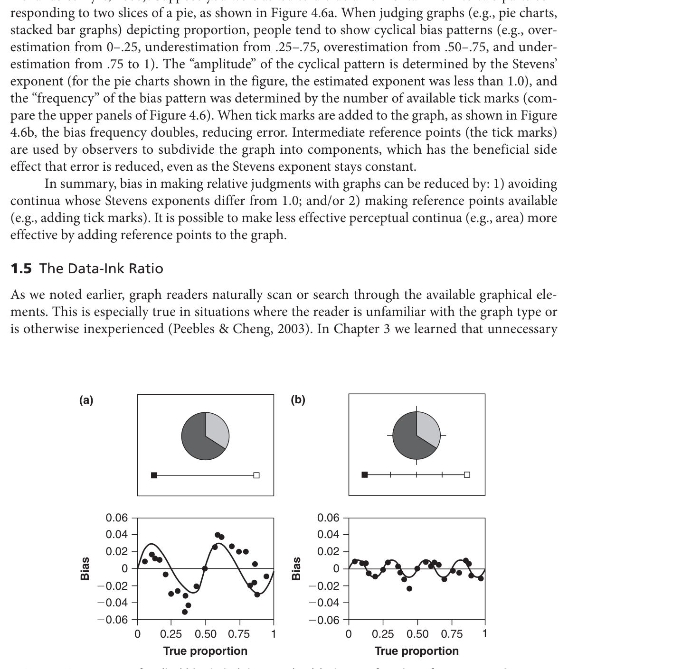
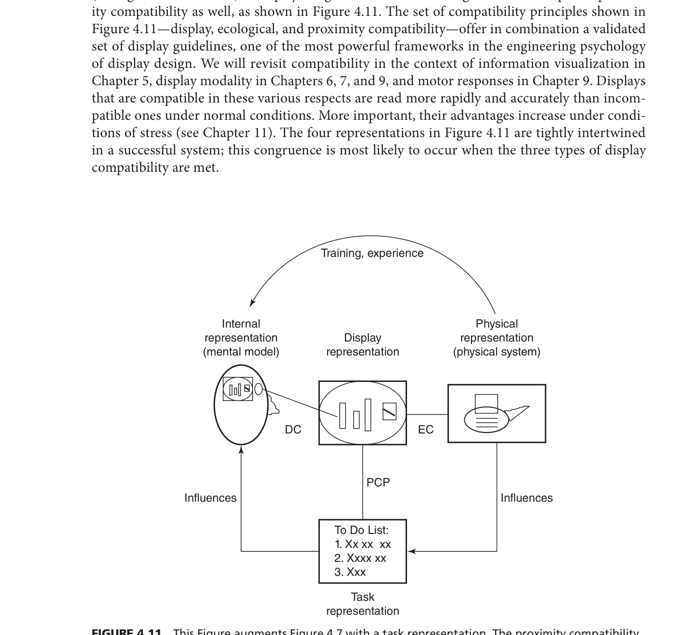

심리학과 새내기이시군요! 환영합니다. 전공 서적에 영어가 가득해서 당황하셨을 텐데, 걱정하지 마세요. 영어 원문을 전혀 몰라도 이 책의 핵심인 '공학 심리학'과 '인지 심리학'의 원리를 완벽하게 이해할 수 있도록 아주 쉽고 친절하게, 단계별로 풀어서 설명해 드리겠습니다.

오늘은 그 첫 번째 단계로, 4단원 **'공간 디스플레이(Spatial Displays)'**의 숲을 먼저 내려다보는 **프리뷰(Preview)** 시간을 갖겠습니다.

---

### 1. 이 챕터의 가장 큰 주제와 배워야 하는 이유

**가장 큰 주제: "기계(디스플레이)가 보여주는 정보를 인간의 뇌가 어떻게 지각하고 처리하는가, 그리고 어떻게 설계해야 인간의 인지 구조(호환성)에 딱 들어맞는가?"**

우리는 운전을 할 때 창밖의 풍경을 보며 앞차와의 거리를 가늠하고(3D 현실 공간), 스마트폰의 내비게이션이나 주식 그래프(2D 공간 화면)를 보며 상황을 판단합니다. 이 챕터는 정보가 **'공간적(Spatial)'**으로 배치되었을 때, 우리 인간이 그것을 어떻게 이해하는지 다룹니다.

**왜 배워야 할까요?**
심리학도가 이 단원을 배우는 이유는 명확합니다. 인간의 '지각(Perception)'과 '주의(Attention)'의 한계를 모른 채 디자인된 화면은 인간에게 불필요한 인지적 스트레스를 주고, 심지어 치명적인 사고(예: 비행기 추락, 자동차 추돌)를 유발하기 때문입니다. 따라서 인간의 **'멘탈 모델(머릿속에서 세상이 돌아갈 것이라고 기대하는 방식)'**과 기계의 화면이 완벽하게 일치하는 **'호환성(Compatibility)'**을 달성하는 원리를 심리학적으로 파헤치기 위해 배웁니다.

---

### 2. 하위 섹션들의 논리적 흐름 (왜 이 순서대로 배울까?)

이 챕터는 가장 단순한 차원에서 시작해 점점 복잡한 차원으로, 그리고 시각을 넘어 다른 감각으로 아주 논리적으로 확장됩니다.

*   **섹션 1: 그래프 지각 (Graph Perception)**
    *   *논리:* 가장 단순한 **'2D 정지 화면(정적)'**부터 시작합니다. 종이나 화면에 그려진 멈춰있는 데이터(막대 그래프, 선 그래프 등)를 인간의 뇌가 어떤 순서로 읽어내고(탐색->인코딩->비교), 어떤 지각적 착시(편향)를 겪는지 먼저 배웁니다.
*   **섹션 2: 다이얼, 미터기, 그리고 디스플레이 호환성 (Dials, Meters, & Display Compatibility)**
    *   *논리:* 정지 화면을 이해했으니, 이제 **'2D 움직이는 화면(동적)'**으로 넘어갑니다. 자동차 속도계나 비행기 고도계처럼 실시간으로 변하는 정보를 다룹니다. 이때 물리적 현실-디스플레이-인간의 멘탈 모델이 일치해야 한다는 핵심 원리들(PPR, PMP 등)이 등장합니다.
*   **섹션 3: 3차원 공간: 자기운동, 깊이, 그리고 거리 (The Third Dimension)**
    *   *논리:* 2D 화면을 마스터했으니, 우리가 실제로 살아가는 **'3D 입체 공간'**으로 차원을 확장합니다. 인간이 걸어가거나 날아갈 때(자기 운동) 뇌가 시야의 흐름을 어떻게 자동 계산하는지 배우고, 3D 화면을 2D 모니터에 구겨 넣을 때 발생하는 치명적인 한계와 해결책을 배웁니다.
*   **섹션 4: 공간 오디오 및 촉각 디스플레이 (Spatial Audio & Tactile Displays)**
    *   *논리:* 시각 정보 처리의 한계치에 도달했습니다! 눈이 너무 바쁘다면 다른 감각을 써야겠죠? 시각을 넘어 **'청각(소리)'**과 **'촉각(진동)'**으로 공간의 입체감을 뇌에 어떻게 전달하는지 배우며 챕터가 마무리됩니다.

---

### 3. 핵심 전문 용어 사전 (반드시 기억해야 할 키워드)

시험이나 전공 공부에 무조건 등장하는 핵심 용어입니다. 영어 이름도 괄호 안에 적어두었으니, 눈에만 익혀두세요!

1.  **근접성 호환성 원리 (PCP: Proximity Compatibility Principle)**
    *   **의미:** 인간이 여러 정보를 '통합(합성)'해서 판단해야 하는 과제라면 화면(그래프)도 하나로 통합된 형태(선 그래프 등)여야 하고, 개별 정보를 따로 읽어야 하는 과제라면 화면도 분리된 형태(막대 그래프 등)가 유리하다는 원칙입니다.
    *   **출처/연구자:** 위켄스와 카스웰 (Wickens & Carswell, 1995), 카스웰 (Carswell, 1992a).
2.  **회화적 사실주의 원리 (PPR: Principle of Pictorial Realism)**
    *   **의미:** 물리적으로 연속적인(아날로그) 변수는 디스플레이에서도 연속적인 형태(아날로그)로 보여주어야 하며, 그 움직임의 '방향'이나 '형태'가 사용자의 머릿속 직관(고도가 높으면 화면에서도 위쪽에 위치)과 완벽히 일치해야 한다는 원리입니다.
    *   **출처/연구자:** 로스코 (Roscoe, 1968).
3.  **가동부의 원리 (PMP: Principle of the Moving Part)**
    *   **의미:** 디스플레이 화면 속의 움직이는 지시침(포인터 등)은, 조작자가 머릿속으로 기대하는 변수의 움직임 방향과 똑같이 움직여야 한다는 원칙입니다.
    *   **출처/연구자:** 로스코, 코를, 젠센 (Roscoe, Corl, & Jensen, 1981).
4.  **광학적 불변성 (Optical Invariants)**
    *   **의미:** 관찰자가 환경을 이동할 때 변하지 않고 눈에 도달하는 기하학적 정보입니다. 예를 들어, 시야의 질감(Texture)이나 내 눈으로 돌진하는 팽창점(Expansion point)의 흐름 등이 내 뇌에 나의 속도와 방향을 자동으로 알려줍니다.
    *   **출처/연구자:** 깁슨 (Gibson, 1979).
5.  **가중 선형 큐 모델 (WLCM: Weighted Linear Cue Model)**
    *   **의미:** 인간의 뇌가 3차원 깊이(거리)를 판단할 때, 여러 가지 시각적 단서들 중 더 믿을만한 단서(가림, 입체시 등)에 더 높은 '가중치'를 부여하여 종합적으로 거리를 추론한다는 심리학적 모델입니다.
    *   **출처/연구자:** 브루노와 커팅 (Bruno & Cutting, 1988), 닐 (Knill, 2007).

---

### 4. 전체 구조 도식화 (Mind Map Flow Chart)

머릿속에 아래의 맵을 그려놓고 세부 내용을 채워 넣으면 공부가 아주 쉬워집니다.

```text
[공간 디스플레이의 설계 원리 (핵심 목표: 멘탈 모델과의 '호환성' 극대화)]
   │
   ├─▶ 1단계: 2D 정적 화면 [그래프 지각] 
   │    ├─ 기본 원칙: 목적에 맞는 설계 (통합 vs 분리)
   │    ├─ 핵심 이론: PCP (근접성 호환성 원리)
   │    └─ 주의점: 인간의 시각 편향 (착시) 및 불필요한 잉크 제거 (Data-Ink Ratio)
   │
   ├─▶ 2단계: 2D 동적 화면 [계기판과 다이얼]
   │    ├─ 핵심 목표: 기계 - 디스플레이 - 멘탈 모델 간의 3각 일치
   │    ├─ 핵심 이론 1: PPR (형태와 방향을 직관에 맞출 것)
   │    ├─ 핵심 이론 2: PMP (움직임을 기대 방향에 맞출 것)
   │    └─ 문제 해결: 두 원칙이 충돌할 땐? -> 하이브리드(주파수 분리) 디스플레이 사용
   │
   ├─▶ 3단계: 3D 입체 공간 [자기운동과 깊이 지각]
   │    ├─ 지각의 두 시스템: 직접 지각 (무의식적/생존) vs 간접 지각 (의식적/거리추론)
   │    ├─ 이동할 때 (Egomotion): 깁슨의 '광학적 불변성' 활용 (광학적 흐름 등)
   │    ├─ 깊이를 가늠할 때: 뇌의 단서 통합 방정식 'WLCM'
   │    └─ 주의점: 3D 화면을 2D 모니터에 억지로 넣으면 시선의 모호성, 착시 발생 위험
   │
   └─▶ 4단계: 비시각적 확장 [청각 및 촉각 공간 디스플레이]
        ├─ 청각: 3D 오디오 (HRTF 필터링)를 통해 방향 본능 자극
        └─ 촉각: 진동을 통해 시야가 안 보일 때 공간 인지 회복 (방향 정위 반사 활용)
```

**📊 [보충 설명: 이 차트가 흘러가는 방식]**
이 챕터는 **"인간이 세상의 공간 정보를 어떻게 받아들이는가?"**라는 질문을 던지고, 화면의 차원을 점점 늘려가며 답을 찾습니다.
처음엔 가장 단순한 '멈춰있는 2D 그래프(1단계)'에서 시각 처리의 기본기를 다집니다. 그다음 '실시간으로 변하는 계기판(2단계)'을 통해 인간의 머릿속 기대(멘탈 모델)와 화면의 움직임(PPR, PMP)이 어떻게 맞아떨어져야 하는지 배웁니다. 나아가 현실의 '3차원 공간(3단계)'으로 무대를 옮겨, 우리가 걸어가거나 운전할 때 눈을 통해 쏟아지는 방대한 정보를 뇌가 어떻게 처리(광학적 불변성)하고 거리를 가늠하는지 심도 있게 다룹니다. 마지막으로 시각 정보가 너무 넘쳐날 때를 대비해 소리와 진동(4단계)으로 공간을 느끼게 하는 공학적 해결책으로 멋지게 마무리됩니다.
결국 이 모든 과정의 궁극적인 목표는 **'인간의 심리와 기계 화면 간의 호환성(Compatibility) 찾기'**입니다.

어떠신가요? 전체적인 뼈대가 잡히셨나요? 
1단계 프리뷰를 통해 숲을 보셨으니, 다음 단계(STEP 2)에서는 이 흐름표의 첫 번째 가지인 **'그래프 지각'**부터 본격적이고 쉽게 쪼개어 설명해 드릴 준비가 되어 있습니다! 다음 단계로 넘어갈까요?

환영합니다, 심리학과 새내기님! 1단계에서 이 챕터의 전체적인 지도를 머릿속에 잘 그려보셨나요? 

이제 2단계인 **'핵심 개념 딥다이빙(Concept Mastery)'**을 시작할 차례입니다. 영어 원문에 가득한 무시무시한 학자 이름이나 영어 약자들 때문에 겁먹을 필요 전혀 없습니다. 

본격적으로 시작하기 전에, **우리가 왜 이론과 모델을 서로 연결해서 이해해야 하는지, 그게 왜 중요한지**부터 짚고 넘어갈게요.
심리학에서 **'이론(Theory)'**은 "인간의 뇌와 감각은 원래 이렇게 생겨먹었다"라는 자연 법칙(현상)을 의미합니다. 반면 **'모델(Model)이나 원리'**는 그 이론을 바탕으로 "그러니까 기계나 화면을 이렇게 설계해야 인간이 사고를 안 낸다"라고 만든 응용 공식(해결책)입니다.
만약 이 둘을 따로 놀게 두면, "왜 화면을 이렇게 만들어야 하지?"라는 근본적인 질문에 답할 수 없습니다. 즉, 인간의 심리(이론)와 기계의 설계(모델)를 연결해야만 진정한 **'인간 중심의 공학(Human Factors)'**이 완성되기 때문입니다. 

그럼 마치 백지상태인 신입생의 눈높이에 맞춰, 이 챕터의 심장과도 같은 핵심 이론과 모델들을 아주 맛깔나는 비유로 하나씩 뜯어보겠습니다!

---

### 📚 핵심 이론 및 모델 딥다이빙 (비유로 이해하기)

#### 1. SEEV 모델 (시각적 정보 샘플링 모델)
*   **연구자:** 앞선 3장에서 주로 다뤄진 내용으로 본문에서는 SEEV 요소로 요약 언급됨.
*   **왜 만들어졌는가?** 인간이 수많은 정보 중에서 화면(그래프 등)을 볼 때, 어떤 순서와 이유로 특정 정보에 '주의(Attention)'를 기울이는지 설명하기 위해 만들어졌습니다.
*   **구성 요소 및 상호작용:** 
    *   **S (Salience, 현저성):** 얼마나 눈에 띄는가? (상향식 처리).
    *   **E (Effort, 노력):** 고개를 돌리거나 눈을 굴리는 데 에너지가 얼마나 드는가?.
    *   **E (Expectancy, 기대):** 저기에 중요한 정보가 뜰 것 같은가? (하향식 처리).
    *   **V (Value, 가치):** 저 정보가 내게 얼마나 중요한가?.
*   **💡 쉬운 비유:** **'뷔페에서 음식 담기'**
    뷔페(화면)에 갔을 때, 우리는 화려하게 장식된 케이크(Salience)에 눈이 먼저 갑니다. 하지만 저 구석에 있어서 걸어가기 귀찮으면(Effort) 안 먹죠. 대신 "정각에 스테이크가 나온다"는 사실을 알면(Expectancy), 내가 고기를 매우 사랑하기 때문에(Value) 그곳을 계속 주시하게 됩니다. 화면 설계도 이와 같아서, 중요한 정보는 눈에 띄고 찾기 쉬워야 합니다.

#### 2. PCP (Proximity Compatibility Principle, 근접성 호환성 원리)
*   **연구자:** 위켄스와 카스웰 (Wickens & Carswell, 1995), 카스웰 (Carswell, 1992a).
*   **왜 만들어졌는가?** 우리가 수행해야 할 '과제의 성격'에 따라, 화면에 정보를 어떻게 '배치(통합 또는 분리)'해야 뇌가 가장 편안하게 이해하는지 공식을 만들기 위해서입니다.
*   **구성 요소 및 상호작용:** 과제가 정보를 다 합쳐서 생각해야 하는 '정보 통합(Synthesis)' 과제라면 화면도 선 그래프처럼 하나의 '객체(Object)'로 합쳐서(통합해서) 보여줘야 합니다. 반면 단일 수치를 읽는 '포인트 읽기'라면 표나 막대그래프처럼 떨어뜨려 놔야 합니다.
*   **💡 쉬운 비유:** **'비빔밥과 구절판'**
    "이 음식들의 맛이 다 합쳐지면 무슨 맛이지?"(통합 과제)를 알고 싶을 때는 재료가 다 섞여 있는 비빔밥(선 그래프)을 먹여주는 게 낫습니다. 반면 "계란 지단만의 맛은 어때?"(포인트 읽기)를 묻는다면 재료가 칸칸이 분리된 구절판(막대그래프)을 줘야 한눈에 파악하기 쉽습니다.

#### 3. EC & DC (생태학적 호환성 & 디스플레이 호환성 모델)
*   **연구자:** 비센테 (Vicente, 1990, 1997).
*   **왜 만들어졌는가?** 복잡한 기계 시스템을 조종할 때, 기계의 실제 상태, 기계 화면, 그리고 조작자의 머릿속 생각(멘탈 모델) 이 세 박자가 완벽히 들어맞아야 사고가 안 나기 때문입니다.
*   **구성 요소 및 상호작용:** '물리적 기계'와 '화면'이 정확히 물리 법칙대로 대응되는 것을 생태학적 호환성(EC)이라 하고, '화면'이 사람의 '머릿속 기대(멘탈 모델)'와 직관적으로 일치하는 것을 디스플레이 호환성(DC)이라 합니다.
*   **💡 쉬운 비유:** **'완벽한 통역사'**
    미국인(물리적 기계)이 하는 말을 통역사(디스플레이 화면)가 있는 그대로 정확히 번역하는 것이 EC입니다. 그런데 그 번역을 한국인(나의 멘탈 모델)이 이해하기 쉬운 찰진 한국어 속담으로 바꿔서 말해주는 센스가 바로 DC입니다. 이 두 개가 다 되어야 소통이 됩니다.

#### 4. PPR & PMP (회화적 사실주의 원리 & 가동부의 원리)
*   **연구자:** 로스코 (Roscoe, 1968), 로스코 등 (Roscoe, Corl, & Jensen, 1981).
*   **왜 만들어졌는가?** 자동차 속도계나 비행기 고도계처럼 '움직이는 계기판'을 디자인할 때, 사람들이 직관적으로 헷갈리지 않게 만드는 절대 규칙을 세우기 위해서입니다.
*   **구성 요소 및 상호작용:** 
    *   **PPR (회화적 사실주의):** 고도(높이)처럼 위아래 개념이면 화면도 원형 다이얼이 아닌 위아래 직선형이어야 하고, 높은 숫자가 위에 있어야 한다는 형태/방향 일치 원칙.
    *   **PMP (가동부의 원리):** 숫자가 올라가면 화면 속 바늘도 내 기대대로 '위로' 움직여야 한다는 움직임 원칙.
*   **💡 쉬운 비유:** **'엘리베이터 층수 표시기'**
    엘리베이터가 올라가는데(물리적 현실), 높은 층 버튼이 맨 아래에 있으면 뇌가 꼬입니다(PPR 위반). 또, 올라가고 있는데 화면의 화살표가 아래로 떨어지면 패닉이 오겠죠(PMP 위반). 이 둘을 우리의 상식에 맞추라는 뜻입니다.

#### 5. EID (Ecological Interface Design, 생태학적 인터페이스 설계 모델)
*   **연구자:** 비센테와 라스무센 (Vicente & Rasmussen, 1992).
*   **왜 만들어졌는가?** 핵발전소처럼 눈에 보이지 않는 복잡한 역학(압력, 질량 등)을 다룰 때, 조작자가 머리를 쥐어짜며 숫자를 계산하지 않아도 화면의 모양(도형)만 보고 직관적으로 이상을 감지하게 만들기 위해서입니다.
*   **구성 요소 및 상호작용:** 작업 도메인 분석(WDA)을 통해 기계의 숨은 법칙을 찾고, 이를 창발적 특징(Emergent feature, 예: 선의 기울기, 사다리꼴 모양)이라는 시각적 도형으로 변환해 화면에 띄워줍니다.
*   **💡 쉬운 비유:** **'인바디 검사 결과지'**
    내 몸의 체지방량, 근육량 숫자를 그냥 나열하면(구식 계기판) 복잡합니다. 하지만 이 숫자들을 연결한 선이 'D자 형태(강인함)'인지 'C자 형태(허약함)'인지 모양(창발적 특징)만 보여주면(EID 설계), 숫자를 몰라도 내 몸 상태를 1초 만에 알 수 있습니다.

#### 6. WLCM (Weighted Linear Cue Model, 가중 선형 큐 모델)
*   **연구자:** 브루노와 커팅 등 (Bruno & Cutting, 1988; Knill, 2007).
*   **왜 만들어졌는가?** 2D 모니터나 그림을 보면서도 우리가 어떻게 그것을 3D 입체라고 느끼고 거리를 짐작하는지, 인간 뇌의 '거리 계산법'을 설명하기 위해 만들어졌습니다.
*   **구성 요소 및 상호작용:** 상대적 크기, 빛과 그림자, 입체시 등 수많은 '깊이 단서(Cues)'가 뇌에 들어옵니다. 뇌는 이 단서들을 다 똑같이 믿지 않고, 가장 믿을만한 강력한 단서(예: 가림 현상-Occlusion)에 엄청난 '가중치(Weight)'를 부여해 결론을 냅니다.
*   **💡 쉬운 비유:** **'명탐정의 범인 추리'**
    탐정(뇌)이 거리를 추리할 때, 멀리서 대충 본 목격자(신뢰도 낮은 단서)의 증언보다는 뚜렷한 CCTV 영상(가림 현상 같은 신뢰도 높은 단서)에 더 큰 점수(가중치)를 주고 종합적으로 범인을 결론 내리는 것과 똑같습니다.

#### 7. 광학적 불변성 (Optical Invariants)
*   **연구자:** 깁슨 (Gibson, 1979).
*   **왜 만들어졌는가?** 우리가 길을 걷거나 운전할 때, 골치 아프게 수학 계산을 하지 않아도 어떻게 방향과 속도를 동물적으로(생태학적으로) 아는지 설명하기 위해서입니다.
*   **구성 요소 및 상호작용:** 텍스처(결), 벌어짐(Splay), 광학적 흐름(Optical Flow) 등 내가 환경을 이동할 때 '변하지 않고 눈에 들어오는 기하학적 정보'들입니다.
*   **💡 쉬운 비유:** **'스타워즈의 우주선 워프 속도'**
    우주선이 엄청난 속도로 전진할 때, 창밖의 수많은 별빛이 나를 향해 쫙 뿜어져 나오는 시각적 효과(광학적 흐름과 팽창점)를 보신 적 있나요? 뇌는 속도계 숫자를 안 봐도 이 별빛의 쏟아짐(광학적 불변성)만으로 내 속도와 방향을 본능적으로 알아챕니다.

#### 8. 스티븐스의 법칙 (Stevens' Law)
*   **연구자:** 스티븐스 (Stevens, 1957, 1975).
*   **왜 만들어졌는가?** 물리적인 실제 크기와 사람이 느끼는 심리적인 크기(지각량)가 왜 항상 어긋나는지(편향되는지) 수학적으로 증명하기 위해 만들어졌습니다.
*   **구성 요소 및 상호작용:** 선의 길이는 비교적 정확히 지각하지만, 면적이나 부피는 물리적으로 커진 것보다 뇌에서 더 적게 커졌다고 착각(반응 압축)하고, 색의 진함은 실제보다 더 많이 진해졌다고 착각(반응 확장)합니다.
*   **💡 쉬운 비유:** **'캡사이신과 매운맛'**
    떡볶이에 캡사이신(물리량)을 2배 넣었다고 해서 사람이 2배 맵다고(지각량) 느끼지 않는 것과 같습니다. 그래서 그래프를 그릴 때 '부피(3D)'나 '색깔'로 데이터의 크기를 표현하면, 보는 사람의 뇌가 무조건 착각(편향)을 일으키니 쓰지 말라는 뜻입니다.

---

### 🗺️ (1), (2), (3) 이론과 모델의 연결 관계 및 Flow Chart

우리가 지금까지 배운 이 멋진 개념들은 철저하게 인과관계로 연결되어 있습니다. **인간의 본성(이론)**이 있기 때문에, **기계의 설계 규칙(모델)**이 탄생한 것입니다.

*   **(1) 이론 간 연결관계:** 
    *   **깁슨의 '광학적 불변성' (본능적 지각)**은 인간이 환경의 정보를 무의식적으로 어떻게 받아들이는지 보여줍니다. 
    *   **스티븐스의 법칙 (지각 편향)**은 하지만 인간의 그 시각 정보 처리가 '완벽하지 않으며 찌그러진다(착시/왜곡)'는 사실을 증명합니다. 
    *   **가중 선형 큐 모델(WLCM)**은 이렇게 불완전한 단서들을 뇌가 살기 위해 어떻게든 조합하고 가중치를 매겨서 3차원 공간을 파악하려 발버둥 치는 과정을 설명합니다.
*   **(2) 모델 간 연결관계:**
    *   **SEEV 모델**이 사용자의 시선이 어디로 갈지 예측해주면, 
    *   **PCP (근접성 호환성 원리)**는 그 시선의 이동(인지적 비용)을 줄이기 위해 정보를 통합하거나 분리하는 구체적인 '화면 배치 방법'을 제시합니다.
    *   이 PCP의 목표는 결국 조작자의 머릿속과 기계를 일치시키는 **EC/DC (생태/디스플레이 호환성)**를 달성하는 것이며, 이 호환성을 끝판왕으로 발전시킨 설계법이 바로 **EID (생태학적 인터페이스 설계)**입니다.
    *   한편, **PPR (형태 일치)**과 **PMP (움직임 일치)** 원칙은 계기판 설계 시 자주 충돌하는데, 이를 해결하기 위해 두 원칙을 상황에 따라 번갈아 쓰는 하이브리드 기술(주파수 분리 디스플레이)이라는 새로운 모델이 파생됩니다.

#### 📌 [MIND MAP Flow Chart: 이론과 모델의 진화 구조]

```text
[ 인간의 근본적 심리 (Theories: Why we fail/succeed) ]
       │
       ├─▶ ① 지각의 한계: Stevens' Law (우리는 면적/부피를 과소평가한다)
       │
       ├─▶ ② 공간 지각 본능: Gibson의 Optical Invariants (우리는 텍스처와 흐름으로 이동을 안다)
       │
       └─▶ ③ 뇌의 정보 처리: WLCM (우리는 단서들에 가중치를 두어 3D 거리를 추리한다)
                            SEEV (우리는 눈에 띄고 가치 있는 것만 주의 깊게 본다)
                 │
  (이러한 인간의 특성 때문에, 기계를 대충 만들면 사고가 납니다!)
  (그래서 아래의 '공학적 설계 원리'들이 탄생합니다.)
                 ▼
[ 디스플레이 공학 모델 (Models: How to design for humans) ]
       │
       ├─▶ ⓐ 정적 화면 설계 (그래프)
       │     └─ PCP (근접성 호환성 원리) : "뇌가 통합을 원하면(Task), 하나로 뭉쳐 그려라(Display)!"
       │
       ├─▶ ⓑ 동적 화면 설계 (계기판)
       │     ├─ EC / DC : "기계의 물리 법칙과 내 머릿속(Mental Model)을 화면이 연결해야 한다."
       │     ├─ PPR / PMP : "모양도 내 상식대로(PPR), 움직임 방향도 내 직관대로(PMP) 해라."
       │     └─ 딜레마 해결 : 주파수 분리 디스플레이 (PPR과 PMP가 싸울 때 쓰는 하이브리드 기술)
       │
       └─▶ ⓒ 3D 최상위 융합 설계
             └─ EID (생태학적 인터페이스 설계) : "숨겨진 물리 법칙을 한눈에 보이는 도형(창발적 특징)으로 만들어 호환성을 극대화하라!"
```

**📊 [보충 설명: 이 차트가 흘러가는 방식]**
이 마인드맵은 **"인간의 불완전함(이론)에서 출발하여, 완벽한 호환성을 지닌 기계 화면(모델)을 창조해내는 여정"**을 보여줍니다. 
위쪽 블록(Theories)을 보면 인간은 색상이나 부피를 자기 마음대로 착각하고(Stevens의 법칙), 한정된 주의력(SEEV)을 가지며, 경험에 의존해 거리를 추리(WLCM)하는 존재입니다. 하지만 동시에 쏟아지는 시각적 결(Optical Invariants)을 본능적으로 느낄 수 있는 능력도 있죠. 
이렇게 '인간 뇌의 설명서'를 다 파악하고 나면, 화살표를 따라 아래쪽 블록(Models)으로 내려옵니다. "아, 인간의 뇌가 이러니까 그래프는 과제에 맞게 묶어주고(PCP), 계기판 움직임은 헷갈리지 않게 머릿속 직관과 똑같이 맞추고(PPR/PMP), 궁극적으로는 기계의 복잡한 상태를 한눈에 직관적으로 알아채도록 생태학적으로 그려야겠다(EID)"라는 공학적 결론이자 솔루션에 도달하게 되는 것입니다.

어떤가요? 그저 딱딱하고 외우기 싫었던 알파벳 약자들이, 사실은 인간의 심리와 기계 공학을 잇는 아주 논리적이고 재미있는 톱니바퀴였다는 사실이 느껴지시나요?

심리학과 새내기님, 드디어 3단계 **'현실 세계 적용(Real-world Case Study)'**까지 오셨군요! 정말 훌륭합니다. 

지금까지 배운 복잡한 이론들을 다른 전공(예: 경영학과, 공대 등) 친구들에게 "우리 과에서는 이런 거 배워!"라고 재미있게 썰을 풀 수 있도록, 책에 등장한 흥미로운 실제 사건들과 우리의 일상생활을 연결해 드리겠습니다. 

*(참고로 질문해주신 '운전 중 주의 분산'이나 '고릴라 실험'은 인지 심리학의 주의(Attention) 챕터에서 아주 유명한 사례지만, 이번 4단원 소스에는 공간 지각과 관련된 더 스펙터클한 자동차 추돌과 비행기 착륙 사고 사례들이 등장한답니다! 이 챕터의 사례들로 꽉 채워볼게요.)*

---

### 💡 Part 1: 전공 책 속의 소름 돋는 실제 사례들 (이론 적용)

공학 심리학이 단순히 기계를 만드는 학문이 아니라, **'인간의 목숨을 구하는 학문'**임을 보여주는 책 속의 대표적인 사례 4가지입니다.

#### 1. 🚗 "왜 경차(소형차)가 뒤에서 더 많이 들이받힐까?" 
*   **관련 이론:** 간접 지각 (Indirect Perception)과 상대적 크기 단서 (Relative Size Cue)의 오류
*   **사례 설명:** 고속도로에서 대형차보다 소형차가 뒤따라오는 차에게 후방 추돌(Rear-end collisions)을 당할 확률이 압도적으로 높습니다. 운전자들은 앞차와의 안전거리를 가늠할 때, "보통 자동차는 이 정도 크기지"라는 머릿속의 **'친숙한 크기'** 기억에 의존합니다. 그런데 앞차가 소형차면 시야에 아주 작게 보이므로, 뒤차 운전자의 뇌는 "어? 차가 작게 보이네? 내 생각보다 훨씬 멀리 있구나!"라고 치명적인 착각을 해버립니다. 결국 브레이크를 밟지 않고 바짝 다가가다 추돌 사고가 나는 것이죠.
*   **연구자:** (Eberts & MacMillan, 1985)

#### 2. 🛣️ "과속 사고가 끊이지 않던 마의 로터리, 페인트칠 하나로 해결하다"
*   **관련 이론:** 에지율 (Edge Rate)을 이용한 지각적 속도 조작
*   **사례 설명:** 영국 스코틀랜드의 한 원형 교차로(로터리)에서는 사람들이 속도를 줄이지 않고 진입해 사망 사고가 속출했습니다. 이때 심리학자 덴튼이 천재적인 아이디어를 냅니다. 도로 바닥에 칠해진 흰색 가로선(마커)들의 간격을 교차로에 가까워질수록 점점 좁게(촘촘하게) 칠해버린 것입니다. 운전자가 똑같은 속도로 달리더라도, 창밖으로 선들이 미친 듯이 빠르게 휙휙 지나가게 됩니다(에지율 폭증). 뇌는 "헉, 내 차가 지금 엄청 급가속하고 있잖아!"라고 착각하게 되고, 깜짝 놀란 운전자들은 스스로 브레이크를 밟아 사망 사고율이 획기적으로 줄어들었습니다.
*   **연구자:** (Denton, 1980)

#### 3. ✈️ "베테랑 조종사들이 보잉 747 바퀴를 다 부숴먹은 이유"
*   **관련 이론:** 전역 광학적 흐름 (Global Optical Flow)의 스케일링 오류
*   **사례 설명:** 거대한 여객기 보잉 747이 처음 도입되었을 때, 베테랑 조종사들이 활주로를 이동(Taxiing)하다가 커브를 돌 때 과속을 해서 착륙 기어(바퀴)를 부숴먹는 사고가 빈번했습니다. 이유가 뭘까요? 747 여객기는 2층 구조라서 조종석이 지면에서 예전 비행기보다 2배나 높았습니다. 시야가 높아지면 땅바닥이 흘러가는 속도(전역 광학적 흐름)가 절반으로 느리게 보입니다. 조종사들은 뇌에서 "왜 이렇게 비행기가 느리게 가지?"라고 착각하여 무의식적으로 가속 페달을 밟아버렸던 것입니다.
*   **연구자:** (Owen & Warren, 1987)

#### 4. 🛑 "숫자를 버리고 도형을 썼더니 사고가 사라졌다: 스마트 크루즈 컨트롤"
*   **관련 이론:** 생태학적 인터페이스 설계 (EID)와 창발적 특징 (Emergent Feature)
*   **사례 설명:** 앞차와의 간격을 자동으로 조절해주는 자동차의 '적응형 순항 제어(ACC)' 기능을 쓸 때, 화면에 앞차와의 거리(m)나 속도(km/h)를 복잡한 숫자로 보여주면 운전자가 즉각적으로 반응하지 못합니다. 연구진은 이 숫자들을 없애고, 위험하게 앞차와 가까워지면 화면 속 도로가 뾰족한 붉은색 **'역삼각형(경고/양보 표지판 모양)'**으로 오그라들고, 안전하게 거리가 벌어지면 넓고 평온한 **'사다리꼴'**로 변하도록 설계했습니다. 이 기하학적 도형(창발적 특징) 덕분에 폭우가 쏟아지는 악천후 속에서도 운전자들은 본능적으로 안전거리를 완벽히 사수했습니다.
*   **연구자:** (Seppelt & Lee, 2007)

---

### 📱 Part 2: 우리의 일상생활 속 공학 심리학 (이해 점검하기)

친구가 "와, 비행기나 자동차 사고에 그런 심리학이 숨어있었어? 그럼 우리가 매일 쓰는 스마트폰에도 그런 게 있어?"라고 묻는다면, 이렇게 대답해 주시면 완벽합니다! (새롭게 적용해 본 사례들입니다.)

*   **일상 사례 1: 아이패드나 스마트폰의 '자연스러운 스크롤(Natural Scrolling)'**
    *   **이론 적용:** **가동부의 원리 (PMP)**
    *   **설명:** 예전 컴퓨터 마우스 휠은 아래로 굴리면 화면(스크롤 바)이 아래로 내려갔습니다. 그런데 스마트폰이 나오면서 터치스크린을 손가락으로 '위로' 쓸어올리면, 화면 내용물이 '위로' 올라가며 아래쪽 내용이 보입니다. 마치 진짜 물리적인 종이를 손으로 밀어 올리는 것과 같은 방향이죠. 사용자의 머릿속 직관(위로 밀면 위로 간다)과 화면의 움직임을 완벽히 일치시킨 PMP의 일상적인 예시입니다.
*   **일상 사례 2: 애플워치나 갤럭시워치의 '피트니스 활동 링'**
    *   **이론 적용:** **생태학적 인터페이스 설계 (EID) & 근접성 호환성 원리 (PCP)**
    *   **설명:** 내가 오늘 몇 칼로리를 소모했고, 몇 분 걸었고, 몇 번 일어났는지 숫자로만(345kcal, 23분, 8번) 띄워주면 내 건강 목표 달성률을 한눈에 알기 힘듭니다(통합 과제). 하지만 이것을 세 개의 색상으로 된 '동심원 링(Ring)'으로 보여주고, 링이 끝과 끝이 만나 하나의 완벽한 원으로 닫히는 형상(창발적 특징)을 사용하면 어떨까요? 우리는 숫자를 읽을 필요도 없이 "아, 오늘 목표 다 채웠네!"라고 1초 만에 직관적으로 깨닫습니다. 
*   **일상 사례 3: '카트라이더'나 레이싱 게임의 부스터 속도감**
    *   **이론 적용:** **광학적 흐름 (Optical Flow) & 에지율 (Edge Rate)**
    *   **설명:** 레이싱 게임에서 아이템(부스터)을 써서 미친 듯이 가속할 때, 게임 화면 양옆으로 하얀 선(바람 효과나 별빛)들이 내 시야(망막)를 향해 쫙 뻗어져 나오는 이펙트가 생깁니다. 실제 내 몸은 방구석 의자에 가만히 앉아있지만, 주변부 시야를 자극하는 인위적인 텍스처 흐름(광학적 흐름)과 모서리의 증가(에지율) 때문에 뇌는 엄청난 속도감을 느끼며 아드레날린을 뿜어냅니다.

---

### 🔗 Part 3: 참고문헌 (APA 양식) 및 유용한 링크

학문적인 지식 전달의 마무리는 깔끔한 출처 표기죠! 다른 과 친구에게 레포트 작성 꿀팁이라며 아래 형식을 보여주세요.

**[참고문헌 - APA 7th Edition Format]**
*   Denton, G. G. (1980). The influence of visual pattern on perceived speed. *Perception*, 9(4), 393-402.
*   Eberts, R., & MacMillan, A. G. (1985). Misperception of small cars. *Trends in Ergonomics/Human Factors II*, 33-39.
*   Gibb, R. W. (2007). Visual spatial disorientation: Revisiting the black hole illusion. *Aviation, Space, and Environmental Medicine*, 78(8), 801-808.
*   Owen, D. H., & Warren, R. (1987). Perception and control of self-motion: Implications for visual simulation of vehicular locomotion. In L. S. Mark, J. S. Warm, & R. L. Huston (Eds.), *Ergonomics and human factors* (pp. 40-70). Springer.
*   Seppelt, B. D., & Lee, J. D. (2007). Making adaptive cruise control (ACC) limits visible. *International Journal of Human-Computer Studies*, 65(3), 192-205.

**[관련 URL 링크]**
*본문에서 5세대 전투기의 주변 시각 및 광학적 흐름 단서(HMD 디스플레이)를 설명할 때 실제로 언급된 F-35 전투기 관련 자료입니다.*
*   **Lockheed Martin F-35 Lightning II (Wikipedia):** http://en.wikipedia.org/wiki/Lockheed_Martin_F-35_Lightning_II

어떠신가요? 이제 심리학과 신입생으로서 다른 전공 친구들에게 "이게 바로 공학 심리학의 위력이야!"라고 당당하게 설명할 수 있는 완벽한 무기가 생기셨기를 바랍니다! 이해하신 내용이 아주 정확하고 훌륭합니다.

인스타그램 피드에 올리면 심리학과 동기들의 좋아요를 휩쓸 수 있는 **"우리의 뇌는 화면을 어떻게 읽을까? (공학 심리학 도표 해부)"** 카드뉴스 기획안을 준비했습니다. 

요청하신 대로 어려운 학술 용어는 싹 빼고, 일상생활과 콘텐츠 비유(밈)를 가득 담아 옆에서 손가락으로 짚어주듯 설명해 드릴게요!

---

### 📸 [인스타 카드뉴스 텍스트 가이드]

#### 📊 [Slide 1] Figure 4.2: PCP 메타분석 그래프 (어떤 그래프가 뇌를 편하게 할까?)
  
*   **목적:** 우리가 데이터를 볼 때 뇌가 덜 피곤하려면 '막대 그래프'를 써야 하는지, '선 그래프'를 써야 하는지 수학적으로 증명하는 그래프입니다,.
*   **초등학생도 아는 X/Y축:**
    *   **X축:** '머리를 얼마나 굴려서 정보를 합쳐야 하는지' (왼쪽은 숫자 딱 1개만 찾기, 오른쪽은 여러 숫자를 머릿속에서 믹스해서 전체 추세 파악하기),,.
    *   **Y축:** '이 그래프가 더 좋다고 손들어준 연구의 비율(%)',,.
*   **👉 손가락 지시법 (Point-and-Tell):** "1. 먼저 X축 왼쪽 끝을 보세요. 단순 수치 찾기일 땐 실선과 점선이 비슷비슷하게 붙어있죠? 2. 이제 오른쪽 끝으로 시선을 확 옮겨보세요! 전체 추세를 봐야 할 땐 실선(선 그래프)이 하늘을 뚫고 100%를 향해 확 치솟고, 반대로 점선(막대/파이)은 바닥으로 처참하게 곤두박질칩니다!",.
*   **🎮 1:1 밈 매칭:** **"뷔페에서 비빔밥 재료 담기"**
    계란지단 1개만 찾을 땐(왼쪽) 칸칸이 나뉜 구절판(막대그래프)이 편합니다. 하지만 모든 맛을 한 번에 믹스해서 봐야 할 땐(오른쪽) 다 섞인 비빔밥 한 그릇(선 그래프)이 압도적으로 편한 상황과 똑같습니다!
*   **해석 및 시사점:** 
    이는 **'근접성 호환성 원리(PCP)'**를 증명합니다. 정보를 합쳐서 생각해야 할 땐 선 그래프처럼 잉크가 하나로 쭉 '통합된' 객체를 써야 뇌가 95% 이상 유리하게 처리합니다,,. 선 그래프의 기울기 자체가 뇌에 한 방에 꽂히기 때문입니다 (Carswell, 1992a),,.

#### 📈 [Slide 2] Figure 4.6: 파이 차트 편향 그래프 (뇌의 치명적인 눈대중 실패)
  
*   **목적:** 파이 차트를 볼 때 우리 눈이 얼마나 크기를 마음대로 착각(왜곡)하는지 고발하고, 그 해결책을 알려주는 그래프입니다,,.
*   **초등학생도 아는 X/Y축:**
    *   **X축:** '실제 피자 조각의 크기 (0부터 100% 한 판까지)',.
    *   **Y축:** '내 눈의 착각 지수' (0보다 위로 가면 실제보다 부풀려 보기, 아래로 가면 쪼그라트려 보기),.
*   **👉 손가락 지시법 (Point-and-Tell):** "1. 위쪽 (a) 그래프를 보세요. 0에서 출발한 곡선이 산봉우리를 크게 만들었다가 계곡으로 깊게 떨어지는 큼직한 '2번의 물결'을 그리죠? 착각의 폭이 엄청 큽니다. 2. 그런데 아래쪽 (b) 그래프를 보세요. 피자판 테두리에 눈금선(틱마크)을 그어줬더니, 산과 계곡이 엄청 촘촘해지면서 위아래로 출렁이는 착각의 폭이 확 깎여나갔죠?",.
*   **🎮 1:1 밈 매칭:** **"다이어트 중 피자 먹을 때의 뇌내망상"**
    분명 진짜 쪼금(25%) 먹었는데 내 뇌는 "너 방금 엄청 많이 먹었어!"라며 산봉우리(+)처럼 부풀려 착각합니다. 하지만 피자판에 칼집(눈금선)을 촘촘히 내주면(b그래프) 눈대중 실패가 사라져서 오차가 줄어듭니다!
*   **해석 및 시사점:**
    부피나 면적이 커질 때 인간의 뇌는 실제보다 덜 커졌다고 찌그러뜨려 인지하는 **'스티븐스의 법칙(반응 압축)'**을 따릅니다. 그래서 파이 차트는 최악입니다. 정 써야겠다면 테두리에 기준점(눈금)을 꼭 박아넣어 오차의 물결(진폭)을 줄여야 합니다 (Hollands & Dyre, 2000; Stevens, 1957),.

#### ⚙️ [Slide 3] Figure 4.7 & 4.11: 3단계 호환성 도식 (아이언맨 수트 설계도)
  
  
*   **목적:** 복잡한 기계(자동차/비행기)를 조종할 때, 인간이 실수로 사고를 내지 않으려면 시스템 전체가 어떻게 세팅되어야 하는지 보여주는 마스터플랜입니다,,,.
*   **초등학생도 아는 축(구조):** (X, Y 그래프가 아닌 샌드위치 구조도입니다)
    *   **맨 아래층:** '실제 기계 쇳덩어리와 엔진의 물리적 상태',.
    *   **중간층:** '내 눈앞에 띄워진 모니터 화면(디스플레이)',.
    *   **맨 위층:** '내 머릿속 직관과 기대치(멘탈 모델)',.
*   **👉 손가락 지시법 (Point-and-Tell):** "1. 맨 아래 실제 기계에서 출발한 화살표가 중간의 모니터로 쏙 올라갑니다. 2. 그리고 이 모니터에서 다시 내 머릿속으로 화살표가 튼튼하게 이어지죠? 3. 이 세 층이 샌드위치처럼 위아래로 빈틈없이 척척 맞아떨어지게 묶여 있는 구조입니다!",.
*   **🎮 1:1 밈 매칭:** **"아이언맨 헬멧 HUD(헤드업 디스플레이)"**
    토니 스타크의 생각(머릿속 기대)과 수트의 실제 동력(기계)을 자비스(중간 모니터)가 완벽하게 통역해주는 상황입니다. 여기서 자비스가 통역을 하나라도 실수하면 아이언맨은 바로 땅에 추락합니다!
*   **해석 및 시사점:**
    기계의 물리 법칙을 화면이 그대로 번역하는 **'생태학적 호환성(EC)'**, 그리고 그 화면의 모양이 내 머릿속 상식과 일치하는 **'디스플레이 호환성(DC)'**이 동시에 이뤄져야 위급 상황에서 인간이 헷갈리지 않고 생존할 수 있습니다 (Bennett & Flach, 2011; Vicente, 1990),,,.

#### ✈️ [Slide 4] Figure 4.9: 항공기 자세 표시기 (어지럼증 극복 하이브리드)
  
*   **목적:** 비행기가 옆으로 확 기울어질 때, 화면을 어떻게 디자인해야 조종사가 멀미를 안 하고 조종간을 반대로 꺾는 대참사를 막을 수 있는지 보여줍니다,,.
*   **초등학생도 아는 축(종류):**
    *   **(a) 방식:** '나는 가만히 있고 땅(수평선)이 빙글빙글 도는 화면',,.
    *   **(b) 방식:** '땅은 가만히 있고 내 비행기 아이콘이 빙글빙글 도는 화면',,.
    *   **(c) 방식:** '위 두 개를 똑똑하게 섞은 짬짜면 화면',,.
*   **👉 손가락 지시법 (Point-and-Tell):** "1. (a)를 보세요. 비행기는 가만히 있는데 뒤에 땅이 기울어지죠? 창밖 풍경이랑은 똑같지만 내 손맛이랑은 다릅니다. 2. (b)를 볼까요? 땅은 가만히 있고 비행기가 돌죠? 손맛은 맞는데 창밖 풍경이랑 달라서 뇌 정지가 옵니다. 3. 자, 이제 궁극의 (c)를 보세요! 처음엔 비행기 기호가 확 기울어지다가(손맛 만족!), 시간이 지나면 스르륵~ 땅이 기울어지는 걸로(풍경 만족!) 바뀝니다!",,.
*   **🎮 1:1 밈 매칭:** **"배틀그라운드(PUBG)에서 버기 타고 산탈 때의 화면"**
    마우스를 꺾는 찰나에는 차가 휙 꺾여야 조종하는 제맛이 나지만(b), 계속 달릴 땐 내 시야를 기준으로 주변 풍경이 기울어져야(a) 멀미가 안 납니다. 그래서 두 개를 섞은 게 (c)입니다!
*   **해석 및 시사점:**
    이것이 바로 **'주파수 분리 디스플레이'** 기술입니다. 움직임이 내 직관과 맞아야 하는 원칙(PMP)과 모양이 현실과 똑같아야 하는 원칙(PPR)이 서로 싸울 때, 조작이 빠른 순간(고주파)과 안정된 순간(저주파)을 분리하여 두 마리 토끼를 다 잡은 천재적인 설계입니다 (Lintern, Roscoe, & Sivier, 1990),,,,.

#### 👓 [Slide 5] Figure 4.17: 거리에 따른 깊이 단서 스펙트럼 (내 뇌는 뭘 믿을까?)
  
*   **목적:** 3D 게임이나 현실에서 거리를 짐작할 때, 거리가 멀어짐에 따라 우리 뇌가 어떤 시각 힌트(단서)들을 쓰레기통에 버리고 어떤 힌트를 맹신하는지 보여줍니다,.
*   **초등학생도 아는 X/Y축:**
    *   **X축:** '나랑 저 물체 사이의 실제 거리 (코앞 1m부터 저 멀리 산끝 1000m까지)',.
    *   **Y축:** '내 뇌가 이 힌트를 믿고 의존하는 절대적인 신뢰도 (쓸모없음 vs 무한 신뢰)',.
*   **👉 손가락 지시법 (Point-and-Tell):** "1. 왼쪽 아래에서 출발한 얇고 점선 같은 선들(눈알 근육 쥐어짜기, 입체시)을 보세요. 10m를 넘어가자마자 바닥으로 뚝 떨어져서 죽어버리죠? 2. 하지만 맨 위에 있는 굵직한 직선('가림' 단서)을 보세요. 1m든 1000m든 절대 꺾이지 않고 윗공기를 마시며 끝까지 쭉 직진합니다!",.
*   **🎮 1:1 밈 매칭:** **"배그에서 8배율 저격 스코프 켤 때"**
    코앞에 적이 있을 땐 내 두 눈의 초점(입체시)이 거리를 재는 데 최고지만, 1000m 밖 적을 쏠 땐 내 눈깔 근육은 아무 쓸모가 없습니다. 오직 적이 바위 뒤에 '가려져 있는지(가림 단서)' 아님 바위 앞에 있는지 하나만 절대적으로 믿고 쏴야 하는 뇌의 생존 메커니즘입니다!
*   **해석 및 시사점:**
    뇌가 여러 거리 힌트들을 조합할 때 맹신하는 힌트가 따로 있다는 **'가중 선형 큐 모델(WLCM)'**을 보여줍니다,. 거리가 멀어질수록 입체시(Stereopsis) 같은 생리적 단서는 무용지물이 되며, 오직 가림(Occlusion)이나 크기 비교 같은 풍경 단서가 지배적인 가중치를 갖게 됩니다 (Cutting & Vishton, 1995; Knill, 2007),,.

---

### 🗺️ [전체 흐름도(Flow Chart) 및 보충 설명]

인스타 마지막 슬라이드에 요약본으로 올리기 딱 좋은 흐름도입니다!

```text
[ 우리의 뇌가 세상을 (그리고 화면을) 읽어내는 5단계 진화 과정 ]

① [종이 위의 정보 조합] Figure 4.2 
   👉 "뇌가 합치길 원해? 그럼 모양도 합쳐줘!" (PCP 원칙)
        ▼ (하지만 그냥 그려두면 눈대중 실패가 일어나지!)
② [평면의 착시 극복] Figure 4.6 
   👉 "파이 조각 크기에 속지 마! 눈금선으로 뇌의 오차를 박살내자." (Stevens' Law)
        ▼ (종이를 벗어나 움직이는 기계 화면으로 넘어가 보자!)
③ [기계와 뇌의 동기화] Figure 4.7 & 4.11 
   👉 "기계의 상태 - 모니터 화면 - 내 머릿속 상식, 3위일체를 이뤄라." (EC/DC)
        ▼ (그런데 움직임을 디자인하다가 내 머릿속 상식끼리 충돌하면?)
④ [움직임의 딜레마 타파] Figure 4.9 
   👉 "직관적인 손맛과 직관적인 풍경이 싸울 땐? 시간차를 두고 섞어버려!" (하이브리드)
        ▼ (평면 화면 정복 끝! 이제 진짜 3D 입체 현실로!)
⑤ [3D 현실 공간의 지각] Figure 4.17 
   👉 "거리에 따라 내 뇌가 믿는 힌트는 달라진다. 1000m 밖에선 원근법이 신이다!" (WLCM)
```

**💡 [이 차트가 왜 이렇게 흘러갈까요? (보충 설명)]**
이 흐름도는 우리 눈이 **'가장 단순한 2D 평면에서 출발해, 가장 복잡한 3D 입체 공간으로 나아가는 과정'**을 아주 논리적으로 밟고 있습니다. 
처음 ①과 ②에서는 종이에 그려진 가만히 있는 그래프(2D 정적 화면)를 볼 때 우리 뇌가 얼마나 꼼수를 부리고 또 착각에 빠지는지 심리학적 한계를 보여줍니다. 
그다음 ③과 ④에서는 이 평면이 실시간으로 움직이는 자동차나 비행기의 조종석(2D 동적 화면)으로 변합니다. 이때 기계의 복잡한 움직임을 내 머릿속 상식(멘탈 모델)과 맞추다가 생기는 충돌을 기발하게 해결하죠.
마지막 ⑤에서는 모니터를 아예 뚫고 나와 우리가 매일 걷고 달리는 진짜 3차원 현실(3D)로 무대를 옮깁니다. 뇌가 거리를 계산하는 본능적인 공식을 파헤치며, 공학 심리학이 화면을 넘어 공간 자체를 어떻게 다루는지 그 장대한 여정을 마무리하는 완벽한 흐름입니다!

심리학과 친구가 4단원 '공간 디스플레이(Spatial Displays)'의 전체 내용을 완벽하게 자신의 것으로 만들 수 있도록, 단순 암기가 아닌 **'사고력 중심의 상황 적용 퀴즈'**를 준비했습니다. 

요청하신 대로 **[문제]와 [정답 및 해설]을 나란히 배치**하여 바로바로 피드백을 확인할 수 있도록 구성했습니다. 자, 시작해볼까요?

---

### 🧠 STEP 5: 셀프 테스트 및 피드백 (사고력 중심 퀴즈)

#### 📝 문제 1. [그래프 지각: 2D 정적 디스플레이]
**[상황]** 마케팅 부서에서 일하는 당신은 "최근 5년간 우리 회사와 경쟁사 3곳의 매출 변화 추이를 한눈에 비교해달라"는 임원의 지시를 받았습니다. 동료가 연도별로 3D 파이 차트(총 5개의 파이 차트)를 화려하게 그려서 가져왔습니다.
**[질문]** 동료의 디자인이 인지심리학적으로 왜 최악의 선택인지 **1) 근접성 호환성 원리(PCP)**, **2) 스티븐스의 법칙(Stevens' Law)**, **3) 클리블랜드와 맥길(Cleveland & McGill)의 순위**를 모두 적용하여 비판하고, 대안을 제시해 보세요.

> **✅ [정답 및 해설]**
> *   **비판 근거 1 (PCP):** 매출의 '변화 추이'를 비교하는 것은 데이터를 머릿속에서 합쳐야 하는 '정보 통합 과제(Integration task)'입니다. 근접성 호환성 원리(PCP)에 따르면, 통합 과제는 분리된 파이 차트가 아니라 하나의 객체로 이어진 '통합 그래프'를 사용해야 시각적 탐색 비용을 줄일 수 있습니다 [Carswell, 1992a].
> *   **비판 근거 2 (스티븐스의 법칙):** 파이 차트는 '면적(각도)'을, 3D 그래프는 '부피'를 사용합니다. 스티븐스의 법칙에 따르면 인간의 뇌는 면적이나 부피가 커질 때 실제 물리량보다 덜 커졌다고 지각하는 **'반응 압축(Response compression)'** 편향을 심하게 겪어 체계적인 오판을 유발합니다 [Stevens, 1957].
> *   **비판 근거 3 (Cleveland & McGill):** 이들의 평가 순위에 따르면 인간이 가장 정확하게 비교 판단을 내리는 차원은 '정렬된 선의 길이(1순위)'이며, 부피(6순위)나 면적(5순위)은 최하위권에 속합니다 [Cleveland & McGill, 1984].
> *   **대안 제시:** 3D 파이 차트를 버리고, **'2D 선 그래프(Line graph)'**로 바꿔야 합니다. 선형 그래프의 '기울기(Slope)'는 뇌가 직관적으로 파악할 수 있는 창발적 특징(Emergent feature)을 제공합니다.

#### 📝 문제 2. [다이얼과 계기판: 2D 동적 디스플레이]
**[상황]** 당신은 최신형 드론의 조종기 화면(고도계)을 설계하고 있습니다. 화면이 좁아서 비행기 아이콘(포인터)을 화면 중앙에 고정하고, 드론이 상승하면 배경의 숫자판(스케일)이 아래로 스크롤되어 내려가도록(Moving-scale) 만들었습니다. 그런데 조종사들이 방향 감각을 잃고 멀미를 호소합니다.
**[질문]** 조종사들이 혼란을 겪는 이유를 **'회화적 사실주의 원리(PPR)'**와 **'가동부의 원리(PMP)'**의 충돌 관점에서 설명하고, 이를 해결할 수 있는 **'주파수 분리 디스플레이(Frequency-separated display)'** 설계법을 적용해 보세요.

> **✅ [정답 및 해설]**
> *   **원인 분석:** 높은 고도의 숫자가 화면 위쪽에 배열되는 것은 인간의 상식과 일치하므로 **PPR(형태 일치)**은 만족합니다. 하지만, 드론이 위로 상승하는데 눈앞의 화면(숫자판)은 아래로 떨어지게 되므로, 조작자의 직관적인 기대 방향과 기계의 움직임이 일치해야 한다는 **PMP(움직임 일치)**를 정면으로 위반하여 뇌에 혼란을 줍니다 [Roscoe, 1968].
> *   **해결책 (주파수 분리 디스플레이):** 조종간을 확 올리는 찰나의 빠른 움직임(고주파)에는 비행기 아이콘 자체가 위로 솟구치게 만들어 PMP를 먼저 만족시킵니다. 이후 고도가 안정되는 느린 움직임(저주파) 구간에서 배경의 숫자판을 천천히 이동시켜 아이콘을 중앙으로 되돌려 놓음으로써 PPR을 유지합니다. 즉, 시간차를 두고 두 원칙을 모두 만족시키는 하이브리드 기술입니다 [Lintern, Roscoe, & Sivier, 1990].

#### 📝 문제 3. [자기운동 지각: 3D 공간 지각]
**[상황]** 눈이 펑펑 쏟아지는 밤, 고속도로를 운전하던 운전자가 차선을 이탈하여 눈밭으로 돌진하는 사고를 냈습니다. 한편, 스코틀랜드의 한 로터리 진입로에서는 도로 바닥에 칠해진 흰색 선들의 간격이 갈수록 좁아지도록 페인트칠을 새로 했더니 과속 사고가 획기적으로 줄었습니다.
**[질문]** 깁슨(Gibson)의 **'광학적 불변성(Optical Invariants)'** 개념을 사용하여, 눈 오는 날 차선을 이탈한 원인(단서 1개)과 로터리에서 과속 사고가 줄어든 원리(단서 1개)를 각각 설명해 보세요.

> **✅ [정답 및 해설]**
> *   **차선 이탈 원인 (팽창점, Expansion Point & Optical Flow):** 주행 중 뇌는 시야가 방사형으로 뻗어나가는 중심점인 '팽창점'을 통해 자신의 진행 방향을 직접 지각(Direct perception)합니다. 폭설 시 운전자는 도로가 만들어내는 안전한 팽창점을 놓치고, 자신을 향해 쏟아지는 눈송이들의 팽창점(바람에 의해 왜곡된 흐름)에 시선을 빼앗겨 무의식적으로 그 방향으로 핸들을 꺾은 것입니다 [Dyre & Lew, 2005].
> *   **과속 방지 원리 (에지율, Edge Rate):** 에지율은 단위 시간당 시야를 가로지르는 선(모서리)의 개수입니다. 마커의 간격을 좁히면, 똑같은 속도로 달려도 운전자의 시야를 통과하는 선의 개수(에지율)가 폭증합니다. 뇌는 이를 "차가 급가속하고 있다"고 착각하여 본능적으로 브레이크를 밟게 됩니다 [Denton, 1980].

#### 📝 문제 4. [3D 디스플레이의 한계]
**[상황]** 항공 교통 관제사들에게 기존의 2D 화면(위에서 내려다보는 지도 화면 + 고도를 보여주는 분리된 화면) 대신, 공중에 비행기들이 떠 있는 것처럼 보이는 최첨단 3D 그래픽 디스플레이를 제공했습니다. 하지만 충돌 위험을 예측하는 테스트에서 3D 디스플레이를 사용한 관제사들의 오답률이 훨씬 높았습니다.
**[질문]** 이 현상을 통해 **'소박한 실재론(Naïve Realism)'**의 문제점을 지적하고, 3D 디스플레이가 실패한 원인을 **'시선 모호성(Line of Sight Ambiguity)'** 개념을 들어 명확히 설명해 보세요.

> **✅ [정답 및 해설]**
> *   **소박한 실재론 지적:** 디스플레이가 현실(3D)과 똑같이 생겼다고 해서 무조건 과제 수행에 도움을 줄 것이라고 맹신하는 것을 소박한 실재론이라고 합니다. 이는 과제와 무관한 시각적 클러터(Clutter)를 발생시켜 뇌의 인지 부하를 높입니다 [Smallman & Cook, 2010].
> *   **시선 모호성 (LOS Ambiguity):** 두 비행기가 충돌할지 아닐지 판단하는 것은 정확한 거리(미터)와 고도 수치를 읽어야 하는 '집중 주의(Focused attention)' 과제입니다. 실제 3차원 공간을 2D 모니터 평면에 억지로 압축(투영)하면, 화면에서 비행기 두 대가 겹쳐 보이더라도 실제 깊이(Z축) 방향으로 얼마나 떨어져 있는지 수학적으로 도출할 수 없는 치명적인 '시선 모호성'이 발생합니다. 따라서 정밀 판단에는 X-Y축과 Z-Y축을 따로 보여주는 2D 평면 분리형(Co-planar) 디스플레이가 우월합니다 [McGreevy & Ellis, 1986].

#### 📝 문제 5. [다감각 디스플레이 융합]
**[상황]** 전투기 조종사가 격렬한 공중전을 벌이며 엄청난 중력 가속도(G-force)를 견디고 있습니다. 눈앞의 수많은 시각 계기판을 확인하느라 시각적 주의력이 완전히 고갈된 상태일 때, 좌측 후방에서 미사일이 날아오고 있습니다.
**[질문]** 조종석 화면에 빨간색 경고등을 깜빡이는 대신, **'3D 공간 오디오(HRTF)'**나 **'촉각(진동) 수트'**를 활용해야 하는 인지심리학적 이유를 **'방향 정위 반사(Orientation reflex)'**와 생리적 환경(중력 가속도)을 근거로 설명해 보세요.

> **✅ [정답 및 해설]**
> *   **시각 채널의 과부하 및 한계:** 조종사는 이미 시각적 정보 처리 한계에 도달해 있으며, 고중력 가속도(G-force) 상황에서는 피가 쏠려 시야가 좁아지거나 보이지 않는 현상(블랙아웃)을 겪습니다.
> *   **다감각의 생리적 이점:** 반면 청각(3D 오디오)과 촉각(진동)은 높은 G-force 환경에서도 지각 능력이 끄떡없이 유지됩니다 [Nelson, Bolia, & Tripp, 2001; van Erp et al., 2007].
> *   **방향 정위 반사 (Orientation Reflex):** 3D 공간 오디오 기술(HRTF)이나 좌측 어깨의 진동을 통해 실제 미사일이 날아오는 방향에서 물리적인 자극을 주면, 인간은 본능적으로 소리나 진동이 느껴지는 방향으로 주의를 휙 돌리는 '방향 정위 반사'를 일으킵니다. 이를 통해 위험 인지 및 회피 반응 시간을 무려 25% 이상 극적으로 단축할 수 있습니다 [Perrott et al., 1990; Simpson Brungart et al., 2004].

---

### 🗺️ [전체 흐름도 (Text Flow Chart) 및 보충 설명]

이 단원의 지식들은 파편화된 것이 아니라, **'어떻게 하면 인간의 인지 구조와 기계의 화면을 완벽히 동기화(호환) 시킬 것인가?'**를 향해 차원을 넓혀가며 진화하는 플로우를 가지고 있습니다.

```text
[공간 디스플레이 설계의 인지심리학적 진화 흐름도]

[Step 1] 2D 정적 평면 (그래프와 데이터)
 ├─ 이론: 인간은 면적/부피 판단에 인지적 왜곡(Stevens' law)을 일으킨다.
 └─ 적용 (Q1): 통합 과제엔 선 그래프를 쓰고, 왜곡을 막기 위해 잉크 비율을 조절하라 (PCP 적용).
        ▼
[Step 2] 2D 동적 평면 (움직이는 계기판과 다이얼)
 ├─ 이론: 인간의 멘탈 모델은 직관적인 형태(PPR)와 방향(PMP)을 기대한다.
 └─ 적용 (Q2): 두 원칙이 충돌할 땐, 주파수 분리 하이브리드 기술로 시간을 나눠 설계하라.
        ▼
[Step 3] 3D 현실 공간 (자기운동과 깊이 지각)
 ├─ 이론: 뇌는 움직일 때 시야의 흐름(Optical Invariants)을 본능적으로 스캔한다.
 └─ 적용 (Q3): 이 단서(팽창점, 에지율 등)를 조작하여 착시를 막거나 사고를 예방하라.
        ▼
[Step 4] 3D 가상 화면 (입체 디스플레이의 역설)
 ├─ 이론: 현실(3D)을 화면(2D)에 압축하면 깊이 단서가 뭉개지는 모호성이 발생한다.
 └─ 적용 (Q4): 소박한 실재론을 버리고, 정밀 작업엔 2D 분리 디스플레이를 써라.
        ▼
[Step 5] 초월적 융합 (다감각 디스플레이)
 ├─ 이론: 시각은 부하가 걸리기 쉽고 생리적 압박(G-force)에 취약하다.
 └─ 적용 (Q5): 본능적 반사(방향 정위 반사)를 자극하는 공간 오디오/촉각을 융합하라.
```

**💡 [흐름도 보충 설명]**
이 흐름도는 **"인간 시각의 한계를 공학적으로 어떻게 돌파해 나가는가"**에 대한 스토리텔링입니다.
처음(Step 1)에는 멈춰있는 종이 위에서 그래프를 잘못 읽는 인간의 뇌를 교정합니다. 그 후(Step 2), 움직이는 기계 속에서 내 생각과 화면이 겉도는 멀미(부조화) 현상을 영리한 알고리즘으로 해결합니다. 
이제 모니터를 벗어나 우리가 살아가는 진짜 3차원 입체 공간(Step 3)으로 나가면, 속도와 거리를 계산하는 본능적인 공식(광학적 불변성)을 깨닫게 됩니다. 하지만 이 거대한 3차원을 다시 좁은 2D 모니터 안에 구겨 넣으려 할 때(Step 4), 또 다른 모호성과 착시가 발생한다는 뼈아픈 역설을 마주합니다.
결국 이 모든 시각적 딜레마와 인지 과부하를 완벽히 해결하기 위해(Step 5), 공학 심리학은 눈(시야)을 넘어 귀(3D 오디오)와 피부(촉각)라는 새로운 감각의 세계로 확장을 이루어냅니다. 

이 5문제를 막힘없이 풀고 흐름을 이해하셨다면, 이 챕터의 핵심은 이미 완벽하게 마스터하신 겁니다! 수고 많으셨습니다.

---

### 🛡️ [위기 탈출 및 보완 학습 전략]

영어를 안 읽어도 A+를 받을 수 있는 3가지 우회 타격 전략입니다.

**1. 도표와 이미지 중심의 '시각적 암호 해독' 전략**
이 책에 등장하는 수많은 이론은 결국 도표(Figure 4.1 ~ 4.23)를 설명하기 위해 존재합니다. 영어 텍스트는 과감히 무시하고, 제가 STEP 4에서 정리해 드린 **'도표의 X축, Y축, 그리고 형태'**만 눈으로 사진 찍듯 외우세요. 교수님이 시험을 낼 때도 결국 이 도표를 화면에 띄우고 원리를 묻습니다. 도표의 흐름만 알아도 챕터의 80%를 정복한 것입니다.

**2. 영어는 버리고 '알파벳 약자(Acronym)'만 챙기기**
"Proximity Compatibility Principle"이라는 긴 영어 문장은 전혀 외울 필요가 없습니다. 오직 **PCP, PPR, PMP, EID, WLCM** 이 5개의 알파벳 약자와 그 '한국어 뜻'만 1:1로 매칭해서 외우세요. 학자들끼리도 실제 대화에서는 약자로 소통합니다. 약자만 툭툭 던져도 전공 지식이 매우 깊어 보이는 효과를 줍니다.

**3. '방구석 스토리텔링' 연상법**
이론을 읽지 말고 **'사고 사례(Story)'**를 기억하세요.
*   "보잉 747 바퀴가 왜 부서졌지? 아, 조종석이 높아서 광학적 흐름이 느려져 과속했구나!"
*   "왜 로터리에서 마커 간격을 좁혔지? 아, 에지율(Edge Rate)을 높여서 과속을 막으려고!"
이렇게 머릿속으로 재미있는 썰을 풀 수 있다면 영어 원문을 번역할 필요가 전혀 없습니다.

---

### 🎙️ [교수님 대응용: 전체 써머리 3분 스피치 대본]

교수님이 "자, 이번 4단원 공간 디스플레이에서 배운 내용을 누가 요약해 볼까?"라고 했을 때, 손을 들고 이 대본대로만 이야기하세요. (자연스러운 스피치 톤으로 작성되었습니다.)

> "교수님, 제가 요약해 보겠습니다.
> 
> 이번 4단원 '공간 디스플레이'를 관통하는 단 하나의 핵심 주제는 바로 **'기계의 화면과 인간의 멘탈 모델 사이의 호환성(Compatibility)을 어떻게 맞출 것인가'**입니다.
> 
> 인간의 인지적 한계를 극복하기 위해 이 단원에서는 차원을 점진적으로 확장하며 4단계의 설계 원리를 제시하고 있습니다.
> 
> **첫째, 2D 정적 화면인 '그래프' 설계입니다.** 
> 여기서는 **PCP(근접성 호환성 원리)**가 핵심입니다. 사용자가 여러 정보를 통합해서 판단해야 한다면 선 그래프처럼 화면도 하나로 '통합'해야 하고, 개별 수치를 읽어야 한다면 '분리'해야 인간의 정보 접근 비용이 최소화됩니다. 또한, 인간은 부피나 면적을 볼 때 실제보다 과소평가하는 '반응 압축(Response Compression)'이라는 지각 편향을 겪기 때문에 파이 차트나 3D 그래프의 사용을 지양해야 한다는 점을 배웠습니다.
> 
> **둘째, 2D 동적 화면인 '계기판' 설계입니다.**
> 자동차나 비행기처럼 실시간으로 움직이는 시스템에서는 조작자의 직관을 따르는 것이 생명입니다. 변수의 형태가 직관과 일치해야 한다는 **PPR(회화적 사실주의)**과 움직이는 방향이 직관과 일치해야 한다는 **PMP(가동부의 원리)**를 만족시켜야 합니다. 만약 고도계처럼 이 두 원칙이 충돌할 경우, 움직임의 주파수를 분리하는 하이브리드 기술을 통해 딜레마를 해결할 수 있습니다.
> 
> **셋째, 3차원 공간(3D) 지각과 디스플레이입니다.**
> 인간은 환경을 이동할 때 주변시를 통해 광학적 흐름이나 텍스처 같은 **'광학적 불변성(Optical Invariants)'** 단서를 자동 처리하여 속도와 방향을 지각합니다. 이 단서가 사라지면 치명적인 '블랙홀 착시' 같은 사고가 발생합니다. 중요한 것은 '3D 디스플레이가 무조건 좋다'는 소박한 실재론(Naïve Realism)을 버려야 한다는 점입니다. 3D 화면은 전체적인 형상을 파악할 때는 좋지만, 2D 평면에 억지로 압축되면서 발생하는 **'시선 모호성(Line of sight ambiguity)'** 때문에 정밀한 충돌 예측 등에는 오히려 2D 화면보다 열등하다는 것을 확인했습니다.
> 
> **마지막 넷째, 비시각적 채널로의 확장입니다.**
> 궁극적으로 복잡한 시스템에서는 **EID(생태학적 인터페이스 설계)**를 통해 숨겨진 물리적 역학을 직관적인 창발적 도형으로 보여주어 인지 부하를 줄여야 합니다. 나아가, 조종사처럼 시각이 극도로 과부하된 상황에서는 '방향 정위 반사'라는 본능을 활용할 수 있는 **'3D 공간 오디오'**나 **'촉각 진동 디스플레이'**를 도입하여 다감각적으로 생존율을 높여야 합니다.
> 
> 결론적으로 공학 심리학은 단순한 디자인을 넘어, 인간의 불완전한 지각 특성을 완벽히 이해하고 이를 공학적 시스템에 맞춰 생명을 구하는 학문이라는 것을 배웠습니다. 이상입니다."

---

### 💡 [보너스 제안: 노트북LM 인공지능 도구 활용]

친구가 평생 영어를 보지 않고도 이 내용을 완벽히 복습할 수 있도록, 제가 이 채팅창 밖(Studio 탭)에서 **한국어로 된 '오디오 팟캐스트(Audio Overview)'**를 만들어 드리거나, 개념 암기를 돕는 **'한국어 플래시카드(Flashcards)'**를 생성해 드릴 수 있습니다. 

라디오처럼 편안하게 들으면서 챕터를 정리하거나 퀴즈 카드로 공부하고 싶으시다면, **"팟캐스트 만들어줘"** 또는 **"플래시카드 만들어줘"**라고 언제든 편하게 말씀해 주세요! 즉시 만들어 드리겠습니다.