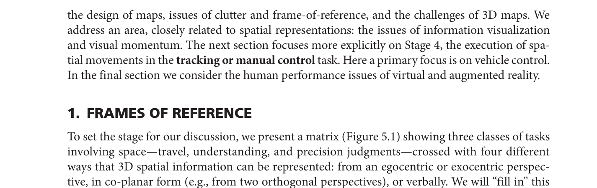
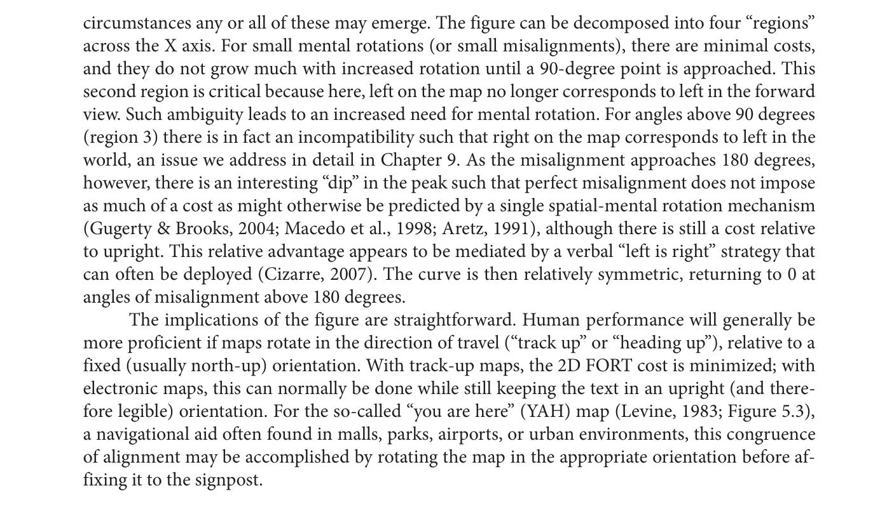
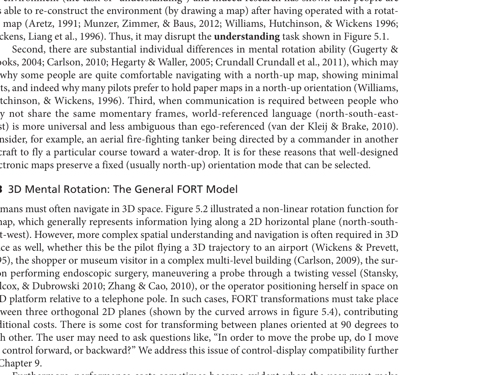
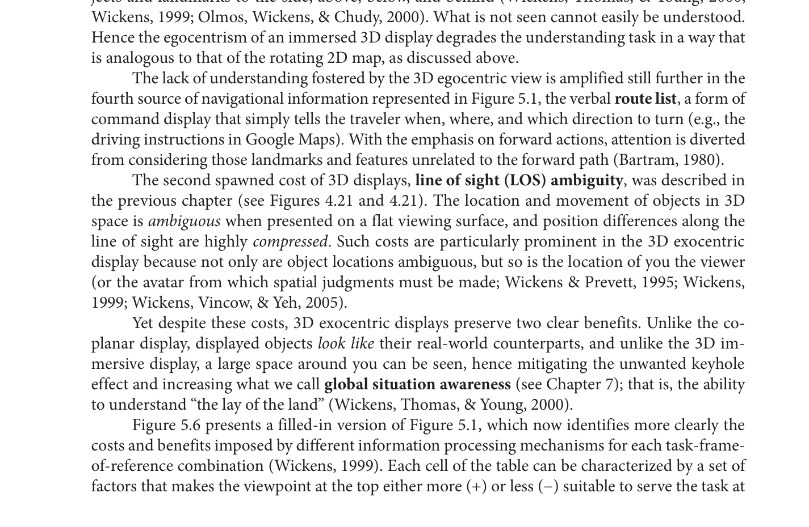
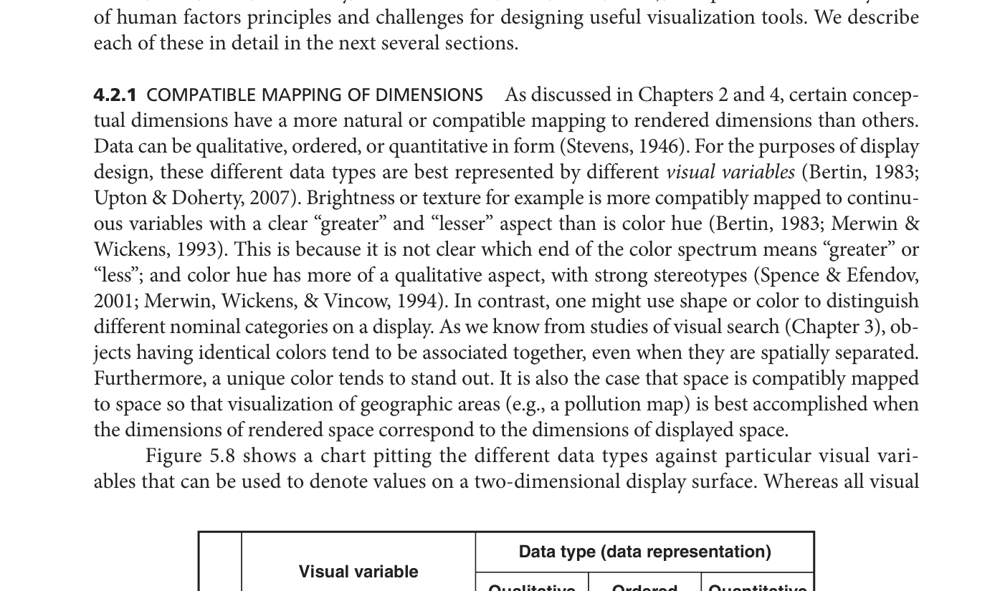
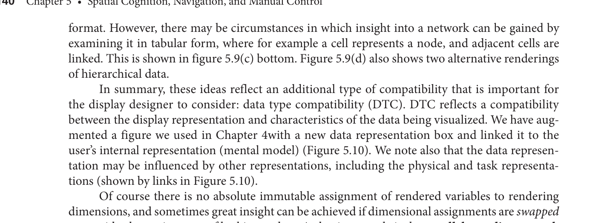
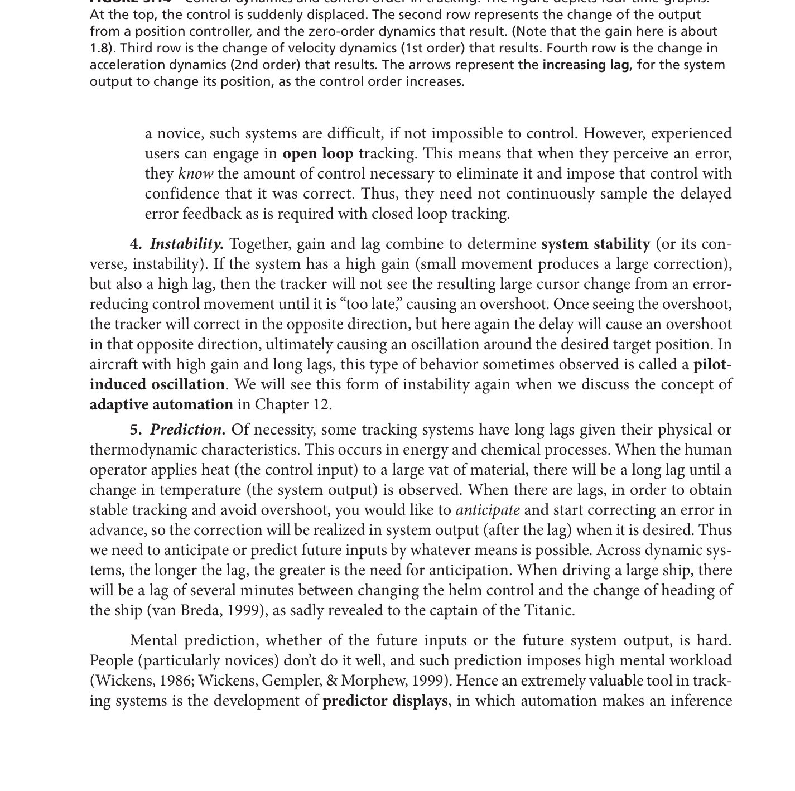

# Ch.5 공간 인지, 내비게이션, 수동 제어
**Engineering Psychology and Human Behaviour | Chapter 5 | pp. 123–159**

---

## STEP 1: 챕터 프리뷰

### 이 챕터, 왜 배우는가?

네이버지도를 보며 길을 찾다가 갑자기 길을 잃은 경험이 있는가? 지도가 분명 있는데, 실제 방향과 지도 방향이 달라서 멍해진 적? 그 순간에 일어나는 인지 과정이 바로 이 챕터의 핵심이다.

4장까지는 "정보를 어떻게 잘 보여줄 것인가"를 다뤘다. 5장은 한 발 더 나아가 **"공간 속을 이동하면서 정보를 어떻게 처리하는가"** 로 확장된다. 걷기, 운전, 비행, 그리고 가상현실 속 이동까지 포함한다.

공간 이동에는 4단계가 필요하다:
1. 장면을 **지각**하고 주의를 기울인다
2. 공간을 **이해**한다 — "지금 어디에 있지?"
3. 방향을 **선택**한다
4. 실제로 **이동**을 실행한다

이 4단계 중 어디에서나 **참조틀(Frame of Reference, FOR)의 변환 비용**이 발생한다. 이 챕터 전체를 관통하는 단 하나의 핵심 원리가 바로 이것이다.

---

### 반드시 기억할 핵심 전문 용어

| 용어 | 한 줄 설명 | 연구자(연도) | 페이지 |
|------|-----------|------------|--------|
| **Frames of Reference (FOR)** | 공간을 이해하는 기준 좌표계 | Wickens et al. (1999, 2005) | 124 |
| **Egocentric frame** | 내 몸 기준 좌표(좌우·앞뒤·상하) | Franklin & Tversky (1990) | 124 |
| **Exocentric frame** | 세계 기준 좌표(동서남북) | Previc (1998) | 124 |
| **FORT** | FOR 변환 비용(시간·오류·인지 부하 증가) | Wickens (1999) | 125 |
| **Track-up map** | 진행방향을 지도 위쪽으로 맞추는 동적 지도 | Aretz (1991) | 126 |
| **YAH map** | "You-Are-Here" 현장 부착형 방향 정렬 지도 | Levine (1983) | 126 |
| **Keyhole phenomenon** | 3D 몰입 뷰의 좁은 시야로 인한 이해 저하 | Woods (1984) | 129 |
| **LOS ambiguity** | 3D 공간이 2D 화면에서 위치가 압축·모호해지는 현상 | Wickens & Prevett (1995) | 130 |
| **Landmark knowledge** | 시각적으로 두드러진 랜드마크 기반의 공간 지식 | Thorndyke & Hayes-Roth (1982) | 132 |
| **Route knowledge** | 두 지점 간 이동 방법, 언어적으로 표현 | Thorndyke & Hayes-Roth (1982) | 132 |
| **Survey knowledge** | 공간 전체의 내적 지도("mental map") | Thorndyke & Hayes-Roth (1982) | 132 |
| **Visual momentum** | 복수 디스플레이 탐색 시 방향 상실 방지 설계 전략 | Hochberg & Brooks (1978) | 144 |
| **Fitts' Law** | 이동 시간 = 거리·정밀도 함수: ID = Log₂(2A/w) | Fitts (1954) | 146 |
| **Control order** | 제어 차수: 0차(위치), 1차(속도), 2차(가속도) | — | 147 |
| **Cybersickness** | VR에서 발생하는 메스꺼움·어지럼·방향 상실 | Ehrlich et al. (1998) | 158 |
| **Virtual ruler** | 실제↔가상 환경의 연속체 개념 | Milgram & Colquhoun (1999) | 155 |

---

### 전체 섹션 연결 Flow Chart

```
[참조틀(FOR)이란 무엇인가]
        ↓
[FORT: FOR가 맞지 않으면 인지 비용 발생]
  ├─→ [2D 정신 회전: 지도 방향 문제]
  └─→ [3D 정신 회전: 공간 이동 문제]
        ↓
[해결책: 지도 설계 + 환경 설계]
  ├─→ [2D/3D 지도 설계 원칙]
  ├─→ [Clutter 관리]
  └─→ [건물·도시 환경 설계]
        ↓
[정보 시각화: 대용량 데이터 공간 탐색]
  ├─→ [시각 변수 호환성 (DTC)]
  └─→ [복수 뷰 + 상호작용]
        ↓
[Visual Momentum: 여러 화면에서 길을 잃지 않으려면]
        ↓
[수동 제어: 직접 조종 — Fitts' Law, Gain, Lag]
        ↓
[VR/AR: 가상 공간에서도 같은 문제 반복]
```

**흐름 보충 설명**: 챕터는 "작은 공간(한 화면)" 문제에서 "큰 공간(건물·도시·가상현실)" 문제로 점점 확장된다. 핵심 원리는 항상 FOR 하나다 — 내 몸의 방향과 정보의 방향이 맞지 않으면 인지 비용이 발생한다. 이것이 지도 설계, 환경 설계, VR 설계 모두에서 반복된다.

---

## STEP 2: 핵심 개념 딥다이빙

### 왜 이론들을 연결해서 봐야 하는가?

이 챕터의 이론들은 각각 독립적인 것처럼 보이지만, 모두 **"FOR 불일치 → 인지 비용 → 설계 해결책"** 이라는 하나의 문제를 다른 각도에서 보는 것이다. FORT를 이해하면 Fitts' Law, Visual Momentum, Cybersickness까지 하나의 맥락으로 연결된다.

---

### 이론 1: 참조틀 (Frames of Reference, FOR)

**왜 만들어졌는가**: 사람은 3D 공간을 인지할 때 두 가지 완전히 다른 방식을 쓴다. 이 두 방식이 충돌할 때 왜 오류가 생기는지 설명하기 위해.

**구성 요소**:
- **Egocentric(자기중심)**: 내 몸이 기준. 왼손이 가리키는 방향이 "왼쪽". 카카오맵 내비게이션 화면처럼 내가 보는 방향이 항상 위.
- **Exocentric(외재중심, 세계 기준)**: 지구가 기준. 북쪽이 항상 위. 종이 지도처럼.

**상호작용**: 두 FOR가 정렬되어 있으면 — 즉, 내가 북쪽을 바라보면서 north-up 지도를 볼 때 — 인지 비용이 거의 없다. 하지만 내가 남쪽을 바라보면서 north-up 지도를 볼 때, 지도를 머릿속에서 돌려야 한다. 이것이 **FORT(Frame of Reference Transformation)**.

**K-콘텐츠 앵커**: 배틀그라운드(PUBG)의 미니맵. 자신의 캐릭터가 어느 방향으로 이동하든 미니맵은 북쪽이 위로 고정된 north-up 방식이다. 처음 플레이하는 사람이 미니맵을 보고 "내가 지금 어디 있지?"를 헷갈리는 이유가 바로 FORT 비용 때문이다.

---

### 이론 2: FORT — 2D 정신 회전 비용 (Figures 5.2~5.3)

**왜 만들어졌는가**: 지도와 현실 방향이 맞지 않을 때 어느 정도의 오류가 생기는지 정량적으로 예측하기 위해 (Shepard & Cooper, 1982).

**구성 요소**: 2D 정신 회전 비용은 각도에 따라 4구간으로 나뉜다 (Figure 5.2).

| 구간 | 각도 | 비용 | 이유 |
|------|------|------|------|
| 1구간 | 0~90° | 최소 | 지도 방향과 현실이 거의 일치 |
| 2구간 | 90~180° | 급등 | 지도 "왼쪽"이 현실 "오른쪽"이 됨 → 명확한 역전 |
| ~180° | 직전 "dip" | 일시 감소 | "좌=우" 언어 전략으로 처리 가능 |
| 4구간 | 180~360° | 대칭 감소 | 다시 정렬 방향으로 복귀 |

**실용적 함의**: Track-up(진행방향-위) 지도가 north-up보다 내비게이션 성능이 좋다 — 1구간에 머물기 때문이다. YAH 지도(Figure 5.3)는 현장에 붙이기 전에 방향을 맞춰 정렬 → 1구간 유지.

**K-콘텐츠 앵커**: 카카오내비의 "현재 방향 위" 모드 vs "북쪽 위" 모드. 운전 중 카카오내비를 "북쪽 위"로 설정하면 갑자기 우회전인지 좌회전인지 헷갈리는 순간이 FORT 2구간 경험이다.

---

### 이론 3: 3D 정신 회전 — 전반적 FORT 모델 (Figure 5.4~5.5)

**왜 만들어졌는가**: 항공기 조종, 수술 로봇 조작처럼 3D 공간에서 두 화면을 비교해야 할 때 왜 특히 어려운지 설명하기 위해.

**구성 요소**: 3D 공간에는 세 개의 직교 평면이 있다.
- **전두면(A) + 수평면**: 변환 비용 낮음 — 두 평면 모두에서 "좌·우"가 일치하기 때문
- **측면(B, C)**: 변환 비용 높음 — 좌·우 축이 두 평면 사이에서 뒤집히기 때문

**K-콘텐츠 앵커**: 드론 조종 유튜브 채널(한국 FPV 드론 크리에이터). 드론이 나를 향해 날아올 때 드론 카메라의 왼쪽이 내가 보는 오른쪽 → 이것이 측면 FORT(B, C) 비용이다.

---

### 이론 4: 내비게이션 지식의 3단계 (Thorndyke & Hayes-Roth, 1982)

**왜 만들어졌는가**: 낯선 도시에 처음 갔을 때와 1년 후의 공간 지식 수준이 왜 다른지 설명하기 위해.

**구성 요소**:

1. **Landmark knowledge(랜드마크 지식)**: 처음 생기는 지식. "강남역 출구 앞에 나이키 매장이 있다"처럼 시각적으로 두드러진 랜드마크를 기억한다.

2. **Route knowledge(경로 지식)**: 다음으로 생기는 지식. "나이키 매장에서 오른쪽으로 돌면 CGV가 있다"처럼 두 지점 간 이동 방법을 언어적으로 기억한다.

3. **Survey knowledge(서베이 지식, "mental map")**: 가장 마지막에 생기는 지식. 머릿속에 전체 지도가 그려진다. "강남역에서 선릉역까지 직선거리로 얼마나 되지?"를 대략 알 수 있다.

**상호작용**: 세 지식은 동시에 발달하지만, 지도 학습이 서베이 지식 획득의 가장 빠른 경로다. 길을 잃었을 때 경로 지식은 거의 쓸모없고, 서베이 지식이 있어야 대안 경로를 찾을 수 있다.

**K-콘텐츠 앵커**: 처음 홍대에 간 K-팝 팬이 경험하는 3단계. 처음엔 "주차장 건물 앞에 있는 카페" (랜드마크), 두 번째엔 "카페에서 직진하면 공연장" (경로), 1년 후엔 "홍대 전체 지형이 머릿속에" (서베이).

---

### 이론 5: Fitts' Law (고정 목표 추적)

**왜 만들어졌는가**: 화면에서 버튼을 클릭하거나 페달을 밟을 때 걸리는 시간을 정확히 예측하기 위해 (Fitts, 1954).

**공식**: **ID = Log₂(2A/w)**
- A = 이동 폭(얼마나 멀리), w = 목표 너비(얼마나 작은가)
- ID가 클수록 더 오래 걸리고 오류도 많음

**실용**: 버튼 크기를 2배로 늘리면 난이도(ID)가 1bit 줄어든다. 터치스크린 앱에서 버튼이 충분히 커야 하는 이유가 바로 이것이다.

**K-콘텐츠 앵커**: 배달의민족 앱에서 "주문하기" 버튼이 크고 화면 하단에 있는 이유. Fitts' Law대로 가장 자주 누르는 버튼은 크게, 닿기 쉬운 위치에 배치한다.

---

### 이론 6: 추적 난이도의 5가지 요인

**왜 만들어졌는가**: 자동차 운전, 항공기 조종, 내시경 수술처럼 연속적으로 조종 기기를 움직이는 과제에서 왜 실수가 생기는지 설명하기 위해.

| 요인 | 쉬운 설명 | 심각해지면 |
|------|----------|-----------|
| **Bandwidth(대역폭)** | 목표가 얼마나 빠르게 움직이는가(Hz) | 추적 오류 증가 |
| **Gain(이득)** | 핸들 조금 돌렸을 때 차가 얼마나 꺾이는가 | 너무 높으면: 과민반응 / 너무 낮으면: 둔감 |
| **Lag(지연)** | 핸들 돌리고 실제로 차가 반응하는 데 걸리는 시간 | 예측 불가능, 사고 위험 |
| **Instability(불안정성)** | 높은 Gain + 높은 Lag = 진동 발생 | 항공기 pilot-induced oscillation |
| **Prediction(예측)** | 지연 시스템에서 미래를 미리 예측해야 함 | Predictor display 필요 |

**Control Order(제어 차수)**:
- **0차(위치 제어)**: 마우스처럼 — 내가 움직인 만큼 커서가 움직임
- **1차(속도 제어)**: 핸들처럼 — 내가 꺾은 만큼 방향이 변하는 속도가 달라짐
- **2차(가속도 제어)**: 우주선처럼 — 내가 조작한 것이 가속도를 바꿈, 위치까지 오려면 두 단계를 거침 → 가장 어려움

**K-콘텐츠 앵커**: LOL(리그오브레전드)에서 스킬샷을 날릴 때. 상대가 빠르게 움직이면(높은 대역폭), 예측 사격을 해야 한다(prediction). 핑이 높으면(높은 lag) 스킬이 예상과 다른 위치에 닿는다. 이것이 Lag의 실제 경험이다.

---

### (1) 이론 간 연결 관계

```
FOR 불일치(FORT)
    ↓
  인지 비용(시간, 오류, 부하)
    ↓
  [공간 이해 저하] ──→ 3단계 내비게이션 지식으로 보완
  [지도 읽기 어려움] ──→ Track-up / YAH 지도 설계로 해결
  [추적 제어 어려움] ──→ Fitts' Law + 5요인 관리
```

### (2) 모델 간 연결 관계

```
[Figure 5.1: Task × Display FOR 매트릭스]
  → 어떤 과제에 어떤 FOR가 맞는가?
      ↓
[Figure 5.6: 비용·이점 완성 매트릭스]
  → 2D/3D 선택 기준을 수치로 제공
      ↓
[Figure 5.10: DTC 모델]
  → 데이터 구조와 디스플레이 표현의 호환성
```

### (3) 이론-모델 전체 연결 Flow Chart

```
FOR 이론
  ├─→ FORT 모델 (2D/3D 정신 회전 비용)
  ├─→ 내비게이션 3단계 지식 모델
  ├─→ 지도 설계 매트릭스 (Fig 5.1, 5.6)
  ├─→ 정보 시각화 DTC 모델 (Fig 5.10)
  ├─→ Visual Momentum 4원칙
  ├─→ Fitts' Law + 추적 5요인
  └─→ Virtual Ruler (AR/VR 연속체)
```

**보충**: 모든 모델은 "FOR 불일치 비용을 어떻게 줄일 것인가"라는 단일 질문에 대한 답이다. 지도 설계, 환경 설계, 시각화, 추적 제어, VR 모두 같은 문제를 다른 맥락에서 해결한다.

---

## STEP 3: 현실 세계 적용

### 사례 1: 항공기 조종사의 이중 지도 문제 (Figure 5.5)

**상황**: 조종사는 앞유리로 보이는 실제 하늘(egocentric)과 계기판의 north-up 지도(exocentric)를 동시에 비교해야 한다.

**이론 적용**: FORT 2중 발생 — 수평 방향(좌·우) + 수직 방향(상·하) 두 가지 모두. 특히 수평 FORT는 전두-수평 평면 변환(A)으로 비용이 낮지만, 측면(B, C) 변환은 비용이 높다 (Chan & Hoffman, 2010).

**해결**: Synthetic-vision-system 디스플레이 — 3D egocentric(위)와 2D north-up(아래)을 함께 표시하고, 아래 지도에 "wedge(쐐기)"로 현재 방향을 표시. Visual momentum 활용.

**K-앵커**: 헬리캠 운용 K-드라마 촬영팀. 드론 운용자가 드론 카메라 FPV 화면과 지상의 실제 방향을 동시에 비교하는 것과 동일한 FORT 문제다.

**인용**: Wickens, Vincow, & Yeh (2005); Aretz & Wickens (1992)

---

### 사례 2: 쇼핑몰 YAH 지도의 방향 오류

**상황**: 쇼핑몰 내 "현재 위치" 안내 지도를 봤는데, 지도의 위쪽이 실제 내가 바라보는 방향과 다르다.

**이론 적용**: YAH 지도 원칙 위반. YAH 지도는 현장에 붙이기 전에 관찰자의 전방 시야(FFOV)와 지도 방향을 정렬해야 한다 (Levine, 1983). 정렬이 안 되면 FORT 비용 발생.

**K-앵커**: 코엑스몰 지하 안내 지도. "현재 위치" 표시가 있지만 지도 방향이 내가 바라보는 방향과 달라서 헷갈리는 경험은 이 원칙 위반이다.

**인용**: Levine (1983); Aretz (1991)

---

### 사례 3: 항공기 조종사의 데이터 오버레이 (Figure 5.7)

**상황**: 조종사가 항공로 지도와 기상·지형 지도를 하나의 화면에 겹쳐서 본다.

**이론 적용**: Data base overlay → 근접 혼잡(readout clutter) 발생. 정보를 통합해서 보기 쉽지만, 지형 정보가 항공로 정보를 가려서 판독 어려움 발생 (Kroft & Wickens, 2003).

**해결책**: 분리 디스플레이 또는 decluttering 도구로 필요 없는 레이어 숨기기. 단, 분리하면 크기 감소 + 근접 호환성 위반이라는 새로운 비용이 발생 — 트레이드오프.

**K-앵커**: 카카오맵에서 교통정보 레이어 + 로드뷰 + 맛집 레이어를 모두 켜놓으면 지도가 너무 복잡해져서 정작 도로가 안 보이는 현상이 동일한 overlay clutter다.

**인용**: Kroft & Wickens (2003)

---

### 사례 4: Titanic 타이타닉 호 조타 지연

**상황**: 빙산 발견 후 항로를 바꾸려 했지만, 대형 선박의 조타는 몇 분의 system lag이 있어 이미 늦었다.

**이론 적용**: System lag의 극단적 사례. 2차 제어(가속도)에 가까운 대형 선박은 lag이 매우 길어 미래를 예측하지 않으면 제어 불가능하다 (van Breda, 1999). Predictor display가 있었다면 더 일찍 수정이 가능했을 것이다.

**K-앵커**: 배달 라이더가 큰 오토바이를 처음 탔을 때. 가벼운 킥보드와 달리 핸들을 꺾어도 반응이 느린 것이 lag의 일상적 경험이다.

**인용**: van Breda (1999)

---

### 사례 5: VR 치료 — 고소공포증

**상황**: 고소공포증 환자를 실제 높은 곳에 데려가지 않고 VR 환경에서 반복 노출하여 치료.

**이론 적용**: VR의 therapeutic application. Presence(VR이 실제처럼 느껴지는 정도)가 치료 효과의 핵심 — CAVE 방식이 HMD보다 더 강한 presence 유발 (Juan & Perez, 2009). 실제 노출과 동등한 효과 확인 (Emmelkamp et al., 2002).

**K-앵커**: 한국 VR방에서 공포 게임 경험. 헤드셋을 쓰고 좀비를 피하는 체험에서 실제로 심장이 빨리 뛰는 경험이 VR presence의 직접 체험이다.

**인용**: Emmelkamp et al. (2002); Juan & Perez (2009)

---

### APA 참고문헌

Aretz, A. J. (1991). The design of electronic map displays. *Human Factors, 33*(1), 85–101.

Emmelkamp, P. M. G., et al. (2002). Virtual reality treatment in acrophobia: A comparison with exposure in vivo. *CyberPsychology & Behavior, 5*(4), 335–344.

Fitts, P. M. (1954). The information capacity of the human motor system in controlling the amplitude of movement. *Journal of Experimental Psychology, 47*(6), 381–391.

Kroft, P., & Wickens, C. D. (2003). Displaying integrated versus separated databases in aviation en route ATC displays. *International Journal of Aviation Psychology, 13*(2), 115–141.

Levine, M. (1983). You-are-here maps: Psychological considerations. *Environment and Behavior, 14*(2), 221–237.

Milgram, P., & Colquhoun, H. (1999). A taxonomy of real and virtual world display integration. In Y. Ohta & H. Tamura (Eds.), *Mixed Reality: Merging Real and Virtual Worlds*. Springer.

Thorndyke, P. W., & Hayes-Roth, B. (1982). Differences in spatial knowledge acquired from maps and navigation. *Cognitive Psychology, 14*(4), 560–589.

van Breda, L. (1999). Predictive displays for ship navigation. *Proceedings of the Human Factors and Ergonomics Society Annual Meeting, 43*, 1–5.

---

## STEP 4: 데이터 및 시각 자료 해석

### Figure 5.1: 공간 과제 × 디스플레이 FOR 매트릭스



**뭘 보여주는 그림인가**: 가로축(X)은 디스플레이 유형(Co-planar, Exocentric, Egocentric, Verbal), 세로축(Y)은 과제 유형(여행·이해·정밀판단). 챕터 전체를 통해 이 빈 셀들을 채워가는 구조적 틀이다.

**핵심 메시지**: 어떤 디스플레이도 모든 과제에 최적이 아니다 — 과제에 따라 다른 FOR 디스플레이가 필요하다.

**손가락 지시법**: 표의 첫 번째 행(여행 과제)을 보자. 왼쪽 Co-planar는 랜드마크를 현실처럼 보여주지 못해서 불리하다. 오른쪽 Verbal(언어 지시)은 빠른 이동에 편리하지만 전체 지형을 모른다. 가운데 3D Immersed는? 랜드마크는 잘 보이지만 keyhole 문제가 생긴다 — 다음 그림에서 확인!

---

### Figure 5.2: 2D 정신 회전 비용 곡선


**뭘 보여주는 그림인가**: X축 = 지도와 현실 방향의 차이(0~360°), Y축 = 인지 비용(시간·오류). 비용이 균일하게 증가하지 않고 4구간으로 나뉜다.

**X축 쉬운 번역**: "내 지도를 얼마나 돌려야 현실과 맞는가"
**Y축 쉬운 번역**: "머릿속에서 지도를 돌리는 데 드는 힘·시간"

**손가락 지시법**:
1. 왼쪽 끝(0°)을 보자 → 비용이 거의 없다. 지도가 정확히 내 방향과 같으니까.
2. 90° 지점까지는 비용이 천천히 증가한다. 조금 어긋난 것은 금방 보정 가능.
3. 90~180° 구간 → 비용이 확 치솟는다. 이유? 지도의 "왼쪽"이 내 "오른쪽"이 되는 순간부터!
4. ~180° 직전에 살짝 비용이 내려가는 "dip"이 보이는가? "좌=우"라는 언어적 전략이 갑자기 통하는 구간이다.
5. 180° 이후는 다시 대칭적으로 내려간다.

**인지심리학적 의미**: 좌우 역전이 가장 큰 비용 유발. 상하는 중력 때문에 직관적으로 알지만, 좌우는 구별 단서가 약하다 (Franklin & Tversky, 1990).

---

### Figure 5.3: YAH(You-Are-Here) 지도



**뭘 보여주는 그림인가**: 관찰자 시점에서 바라본 건물 전경 + 현장에 방향 정렬된 YAH 지도.

**핵심 메시지**: 지도의 "위"쪽이 내가 바라보는 방향과 일치할 때 (FFOV = Forward Field Of View가 지도 방향과 정렬), FORT 비용이 거의 없어진다.

**시험 포인트**: 일부 YAH 지도는 이 원칙을 위반한다. 방향 정렬 없이 그냥 north-up으로 붙여놓은 쇼핑몰 지도가 그 예다.

---

### Figure 5.4: 3D 참조틀 변환



**뭘 보여주는 그림인가**: 3D 박스 안에 세 개의 직교 평면이 표시되어 있다. 각 평면에서 일어나는 이동(직선 화살표)과 평면 간 변환(곡선 화살표).

**핵심**: A(전두-수평) 변환 → 비교적 쉬움. B, C(측면 포함) 변환 → 어려움. 이유: A에서는 좌우가 항상 일관하지만, B와 C에서는 좌우가 뒤집힌다.

---

### Figure 5.6: 과제-디스플레이 비용·이점 완성 매트릭스



**뭘 보여주는 그림인가**: Figure 5.1의 빈 매트릭스를 채운 버전. 각 셀에 +/-로 해당 조합의 이점과 비용이 정리되어 있다.

**핵심 읽기**:
- 정밀 판단 + 2D Co-planar: 선형거리 이점(+) → 가장 적합
- 이해 + 3D Immersed: keyhole 비용(-) → 부적합
- 여행 + 3D Exocentric: 랜드마크 비교 가능(+) → 일부 적합

**손가락 지시법**: 표의 맨 아래 행(Precise judgment)을 보자. 왼쪽으로 갈수록 2D 디스플레이다. 거기에 "Linear distance +" 라고 적혀있다. 2D 평면 지도에서만 거리를 정확히 잴 수 있다. 오른쪽 3D Exocentric 셀에는 "Double LOS ambiguity −" → 3D에서는 위치 자체가 모호해서 거리 판단이 2중으로 어렵다.

---

### Figure 5.8: 시각 변수 × 데이터 유형



**뭘 보여주는 그림인가**: 가로축 = 데이터 유형(정성적·순서형·정량적), 세로축 = 시각 변수(공간·크기·밝기·질감·색조·방향·형태). "Yes"는 그 조합이 좋은 매핑임을 의미.

**X축 쉬운 번역**: "데이터의 성격 — 분류용인가, 등급용인가, 수치용인가"
**Y축 쉬운 번역**: "화면에서 어떻게 보여줄 것인가 — 위치로, 크기로, 밝기로, 색으로..."

**핵심 메시지**: 정량적 데이터(숫자, 수치)는 공간·크기·밝기만 써야 한다. 색조(빨강=높음, 파랑=낮음)로 수치를 표현하면 사람마다 "높음"의 색이 다르게 느껴져서 오해가 생긴다.

**손가락 지시법**: 맨 오른쪽 열(정량적)을 보자. Yes가 세 개(공간·크기·밝기)밖에 없다. 그 아래 색조·방향·형태는 빈칸이다. → 온도 지도(히트맵)를 색조로만 표현하면 정확한 수치 비교가 어려운 이유다.

---

### Figure 5.10: Data Type Compatibility (DTC) 모델



**뭘 보여주는 그림인가**: 내적 표현(사람의 머릿속), 디스플레이 표현(화면), 물리적 표현(실제 장치), 데이터 표현, 과제 표현이 어떻게 연결되는지 보여주는 전체 모델.

**핵심**: DTC = 데이터 구조와 디스플레이 표현의 호환성. PCP(근접 호환성)과 DC(디스플레이 호환성)과 함께 디스플레이 설계의 3대 원리.

---

### Figure 5.14: 제어 차수와 제어 역학


**뭘 보여주는 그림인가**: 동일한 계단형 제어 입력에 대해 0차(위치), 1차(속도), 2차(가속도) 시스템이 각각 어떻게 반응하는지 4개의 시계열 그래프로 비교.

**X축**: 시간
**Y축**: 시스템 출력(커서 위치)

**손가락 지시법**:
1. 맨 위 그래프(제어 입력): 계단형으로 갑자기 올라간다.
2. 두 번째(0차/위치): 거의 즉시 같이 올라간다 — 마우스처럼.
3. 세 번째(1차/속도): 천천히 올라가다가 평탄해진다 — 핸들처럼.
4. 네 번째(2차/가속도): 한참 후에 올라가서, 내려가도 멈추지 않고 계속 간다 — 가장 제어하기 어려움.

---

### Figure 5.15: Predictor Display (예측 디스플레이)



**뭘 보여주는 그림인가**: 위쪽 = 화학 공정 온도 예측 그래프 (지금 선과 미래 예측 선). 아래쪽 = 비행 HITS 화면에서 현재 비행기 위치 + 5초 후 예측 위치.

**핵심**: Lag이 있는 시스템에서 "지금 행동하면 나중에 어디에 있을지"를 자동화가 미리 보여준다. Span of prediction = 5초 = look-ahead time.

**K-앵커**: 쿠팡이츠 라이더 앱의 "예상 배달 시간" 표시. 실시간으로 교통 상황을 계산해서 "현재 속도를 유지하면 13분 후 도착"을 예측해주는 것이 predictor display의 일상 버전이다.

---

### Figure 5.16: Virtual Ruler (가상 자)


**뭘 보여주는 그림인가**: 완전한 실제 환경(왼쪽)부터 완전한 가상 환경(오른쪽)까지의 연속체. AR, Mixed Reality, Augmented Virtuality의 위치가 표시됨.

```
Real ←── AR ←── Mixed Reality ──→ AV ──→ Virtual Environment
실제 환경                                     완전 가상
```

**K-앵커**: 네이버 지도 AR 길찾기. 카메라로 실제 거리를 비추면서 그 위에 화살표를 오버레이하는 것이 AR. 실제 환경(왼쪽) + 가상 정보(오른쪽 방향) = AR 위치.

---

### 전체 Figure 흐름 Flow Chart + 보충 설명

```
[5.1: 과제 × 디스플레이 매트릭스 — 빈 틀]
    ↓
[5.2: FORT 비용 곡선 — 방향 불일치 비용 정량화]
    ↓
[5.3: YAH 지도 — 정렬 해결책]
    ↓
[5.4: 3D FORT — 3차원 복잡성]
    ↓
[5.5: 듀얼 맵 — Visual momentum 도입]
    ↓
[5.6: 매트릭스 완성 — 비용·이점 정리]
    ↓
[5.7: Data overlay — 혼잡 문제]
    ↓
[5.8: 시각 변수 호환성]
    ↓
[5.9: 데이터 구조 4유형]
    ↓
[5.10: DTC 전체 모델]
    ↓
[5.11: 병렬 좌표 그래프]
    ↓
[5.12: Visual momentum 예시]
    ↓
[5.13: Brushing 상호작용]
    ↓
[5.14: 제어 차수]
    ↓
[5.15: Predictor display]
    ↓
[5.16~5.18: VR/AR 연속체]
```

**흐름 보충**: Figure들은 크게 세 덩어리다. ①5.1~5.7: FOR와 지도 문제 → ②5.8~5.13: 시각화 원리 → ③5.14~5.18: 제어와 VR. 각 덩어리는 "같은 FOR 문제를 다른 규모에서 다룬다"는 공통점이 있다.

---

## STEP 5: 셀프 테스트 + 퀴즈

심리학과 친구가 리뷰 퀴즈를 통해서 스스로 테스트 해볼 수 있게 도와주자

지금까지 공부한 내용을 바탕으로 내가 제대로 이해했는지 확인하기 위한 사고력 중심의 퀴즈 문제를 제시한다.

---

**Q1.** 내비게이션 앱을 북쪽-위(North-up) 모드로 설정하고 남쪽으로 운전할 때, 좌회전과 우회전 판단이 어려워지는 이유를 참조틀(FOR) 이론으로 설명하라.

**Q1-K.** 카카오내비를 북쪽-위 고정 모드로 설정하고 강남에서 강북으로 이동할 때, "왼쪽 차선으로 이동하세요"라는 음성 안내를 들었는데 지도를 보면 오른쪽 화살표가 보인다. 왜 이런 일이 생기는가?

**A1.** 남쪽으로 이동하면 egocentric frame(내 몸 기준)과 exocentric frame(지도의 north-up) 사이에 180° 불일치가 발생한다. Figure 5.2의 FORT 비용 곡선에서 90~180° 구간이 비용이 가장 높은 이유는 지도의 "왼쪽"이 실제 "오른쪽"에 대응하기 때문이다. 해결책: track-up 모드(진행 방향 위)로 전환하면 FORT 비용이 0구간으로 돌아온다 (Wickens, 1999).

---

**Q2.** 쇼핑몰 3층 바닥에 붙어있는 YAH 지도를 보고도 출구를 잘 못 찾는 사람이 많다. 이를 YAH 지도 설계 원칙으로 설명하고, 올바른 설계 방향을 제시하라.

**Q2-K.** 코엑스몰 지하 1층의 안내판 지도가 내가 서 있는 방향과 다른 방향(북쪽-위)으로 붙어있다. 왜 이것이 문제이고, 어떻게 바꿔야 하는가?

**A2.** YAH 지도는 관찰자의 전방 시야(FFOV)와 지도의 "위" 방향이 일치해야 FORT 비용이 사라진다 (Levine, 1983). North-up으로 고정된 YAH 지도는 관찰자가 어느 방향을 바라보느냐에 따라 최대 180° FORT 비용이 발생한다. 올바른 설계: 지도를 현장에 부착하기 전에 관찰자가 지도를 볼 때 바라보는 방향이 지도의 위쪽이 되도록 회전하여 고정 (Figure 5.3 참조).

---

**Q3.** 3D 몰입형 디스플레이(3D Immersed View)가 전체 공간 이해(Understanding) 과제에 불리한 이유 두 가지를 Figure 5.6의 매트릭스를 참조하여 설명하라.

**Q3-K.** LOL(리그오브레전드) 게임에서 1인칭 FPS 시점이 3D Map-view 시점보다 전략적 판단에 불리한 이유를 인지공학 용어로 설명하라.

**A3.** Figure 5.6에서 이해 과제 × 3D Immersed 셀에는 두 가지 비용이 표시된다: ① **Keyhole phenomenon**: 좁은 시야로 인해 전방 이외의 지형·랜드마크를 볼 수 없어 전체 공간 파악이 불가능 (Woods, 1984). ② **Landmark comparison 어려움**: 3D 몰입 시점은 주변 랜드마크와 나의 위치를 동시에 비교하기 어렵다. 반면 2D Co-planar는 전체 FOV를 한 눈에 볼 수 있어 이해 과제에 더 유리하다.

---

**Q4.** Fitts' Law(ID = Log₂(2A/w))를 이용하여, 다음 두 버튼 중 어느 것이 클릭하기 더 쉬운지 계산하고 이유를 설명하라.
- 버튼 A: 거리 100px, 너비 10px
- 버튼 B: 거리 50px, 너비 20px

**Q4-K.** 배달의민족 앱에서 "주문 완료" 버튼을 크고 화면 하단에 배치하는 설계 결정을 Fitts' Law로 정당화하라.

**A4.** 버튼 A: ID = Log₂(2×100/10) = Log₂(20) ≈ 4.32 bits. 버튼 B: ID = Log₂(2×50/20) = Log₂(5) ≈ 2.32 bits. 버튼 B가 난이도 2bit 낮아 훨씬 쉽게 클릭 가능하다. 이유: 거리가 절반이고 너비가 2배이기 때문에 복합적으로 난이도가 낮아진다. 배달앱 설계: A(거리)를 줄이려면 화면 하단 배치(엄지손가락과 가장 가까운 위치), w(너비)를 키우려면 버튼 크게 → ID를 최소화 (Fitts, 1954).

---

**Q5.** 배틀그라운드(PUBG)에서 핑(Ping)이 높을 때 적을 맞추기 어려운 이유를, 추적 과제의 5요인(Bandwidth, Gain, Lag, Instability, Prediction) 중 관련 요인들로 설명하라.

**Q5-K.** 동일 (이미 K-버전)

**A5.** 핑(Ping) = **System Lag** (전송 지연). 마우스를 움직여 조준선을 이동시켰지만 화면에 반영되는 데 수십~수백ms 지연이 발생한다. Lag이 길면: ① **Prediction** 필요 — 적이 지금 있는 위치가 아닌 Lag 이후의 위치를 예측해서 조준해야 한다. ② **Instability** 위험 — Gain이 높은 게임(마우스 감도 높음)에서 Lag이 길면 조준선이 목표를 지나쳐 반대편으로 진동(overshoot)할 수 있다. 낮은 핑(낮은 Lag)에서는 이런 예측 부담이 줄어든다 (Wickens, 1986).

---

**Q6.** 내비게이션 지식의 3단계(Landmark → Route → Survey)에서 길을 잃었을 때 Route knowledge가 거의 쓸모없는 이유를 설명하고, 이 상황에서 어떤 지식이 필요하며 어떻게 얻을 수 있는가?

**Q6-K.** 처음 홍대에 간 팬이 콘서트 후 숙소로 돌아가는 길을 잃었다. 이 팬은 아는 카페 이름(랜드마크 지식)은 있고 "카페에서 직진하면 지하철"(경로 지식)도 아는데 왜 헤매는가? 이 상황을 해결하는 방법은?

**A6.** Route knowledge는 경로 위에서만 작동한다 — "카페에서 직진"이라는 지식은 이미 카페 앞에 있어야 쓸 수 있다. 경로를 이탈하면 어느 랜드마크도 찾지 못하는 상황이 발생한다. 필요한 것은 **Survey knowledge** — 전체 공간 구조를 알아야 "내가 지금 어느 구역에 있고, 카페는 대략 어느 방향"을 추론할 수 있다. 획득 방법: Thorndyke & Hayes-Roth (1982)에 따르면 **지도 학습**이 Survey knowledge 획득의 가장 빠른 경로다. 스마트폰 지도 앱을 zoomed-out으로 보면 순간적으로 Survey 뷰를 얻을 수 있다.

---

**Q7.** VR 환경에서 cybersickness가 발생하는 두 가지 주요 원인을 설명하고, 각각의 해결 방안을 제시하라.

**Q7-K.** 한국 VR방에서 좀비 공포 게임을 하다가 메스꺼움을 느꼈다. 이 경험을 cybersickness 이론으로 설명하고, VR방 운영자가 할 수 있는 두 가지 해결책을 제안하라.

**A7.** ① **System Lag**: HMD에서 머리를 움직였을 때 화면이 15~20ms 이상 지연되면 시각과 전정감각(내이의 균형감)이 불일치 → 멀미 유발 (Ellis et al., 2004). 해결: HMD 지연을 15ms 미만으로 줄이거나, 화면 렌더링 품질보다 동작 반응 속도를 우선. ② **Gain mismatch**: 머리 이동 각도 ≠ 화면 변화 각도일 때 불일치 발생. 해결: 1:1 정확한 gain으로 보정, 정기적 캘리브레이션. 추가적으로 세션 시간을 30분 이내로 제한하면 노출 시간에 따른 누적 cybersickness를 줄일 수 있다.

---

### 퀴즈 Flow Chart + 보충 설명

```
[Q1: FOR 불일치 → FORT 비용]
    ↓
[Q2: YAH 지도 설계 원칙 적용]
    ↓
[Q3: 3D 디스플레이 비용 — 키홀·LOS]
    ↓
[Q4: Fitts' Law 계산 적용]
    ↓
[Q5: 추적 5요인 — Lag + Prediction]
    ↓
[Q6: 내비게이션 3단계 지식 적용]
    ↓
[Q7: VR cybersickness 원인과 해결]
```

**보충**: Q1~Q3은 FOR 관련, Q4~Q5는 수동 제어, Q6은 학습/훈련, Q7은 VR. 챕터 전체를 균형 있게 커버한다. 특히 Q1과 Q7은 서로 연결된다 — 지도의 방향 불일치 비용(FORT)과 VR의 gain mismatch 비용은 같은 원리(참조틀 불일치)에서 나온다.

---

## STEP 6: 보완 전략 및 위기 탈출법

### 이 문서만으로 커버되는 범위

이 보고서 하나로 Ch.5의 다음 내용이 커버된다:
- 핵심 이론 전체 (FOR, FORT, 내비게이션 3단계, Fitts' Law, 5요인, VR/AR 7가지 특성)
- Key Terms 52개 모두 정의 포함
- Figure 5.1~5.18 전체 해설
- 연구 사례 10개 (Thorndyke, Fitts, Milgram, Kroft 등)
- 사고력 퀴즈 7세트 (일반 + K버전)

원서를 한 페이지도 읽지 않아도 이 문서로 챕터 핵심을 이해하고 교수님 질문에 답할 수 있다.

---

### 추가 학습 보완 전략 3가지

**전략 1: K-앵커 복습법**
공부할 때마다 이론 하나를 K-콘텐츠 하나와 짝을 지어라. "FOR = 카카오내비 방향 설정", "Fitts' Law = 배달앱 버튼 크기", "Cybersickness = VR방 멀미". 짝이 기억되면 이론도 따라온다.

**전략 2: 개념 짝 만들기**
혼자 공부할 때 "이게 뭐라고?" 질문 카드를 만든다:
- 앞: "FOR 불일치가 생기면?"
- 뒤: "FORT 비용 발생 → 시간 오류 인지 부하 증가"
스마트폰 메모앱에 10쌍만 만들어도 시험 전 반복 효과가 크다.

**전략 3: Flow Chart 손으로 그리기**
이 문서의 STEP 1 Flow Chart를 A4 용지에 직접 손으로 그려봐라. 그리다가 막히는 부분이 실제로 이해가 안 된 부분이다. 그 부분만 STEP 2로 돌아가서 다시 읽으면 효율적이다.

---

### 3분 스피치: 교수님이 "Ch.5 핵심이 뭔가요?" 물었을 때

"네, 교수님. Ch.5의 핵심은 **참조틀(Frame of Reference)**이라는 개념입니다.

우리가 지도를 보며 길을 찾거나, 차를 운전하거나, VR 게임을 할 때 모두 공통된 문제가 생깁니다 — 내 몸이 기준인 egocentric 참조틀과 지도나 세계가 기준인 exocentric 참조틀이 맞지 않을 때 **인지 비용이 발생한다**는 것입니다. 이것을 FORT라고 합니다.

이 원리가 챕터 전체를 관통합니다. 지도 설계에서는 '진행방향-위' 방식으로 해결하고, 환경 설계에서는 랜드마크와 직각 구조로, 수동 제어에서는 Fitts' Law와 predictor display로, VR에서는 lag과 gain mismatch 문제로 반복해서 등장합니다.

핵심 메시지는 하나입니다: **어떤 디스플레이도 모든 과제에 최적이지 않다. 과제마다 참조틀을 맞춰야 인지 비용이 줄어든다.** 감사합니다."

*(약 200단어, 구어체, 약 90초~2분 분량)*
