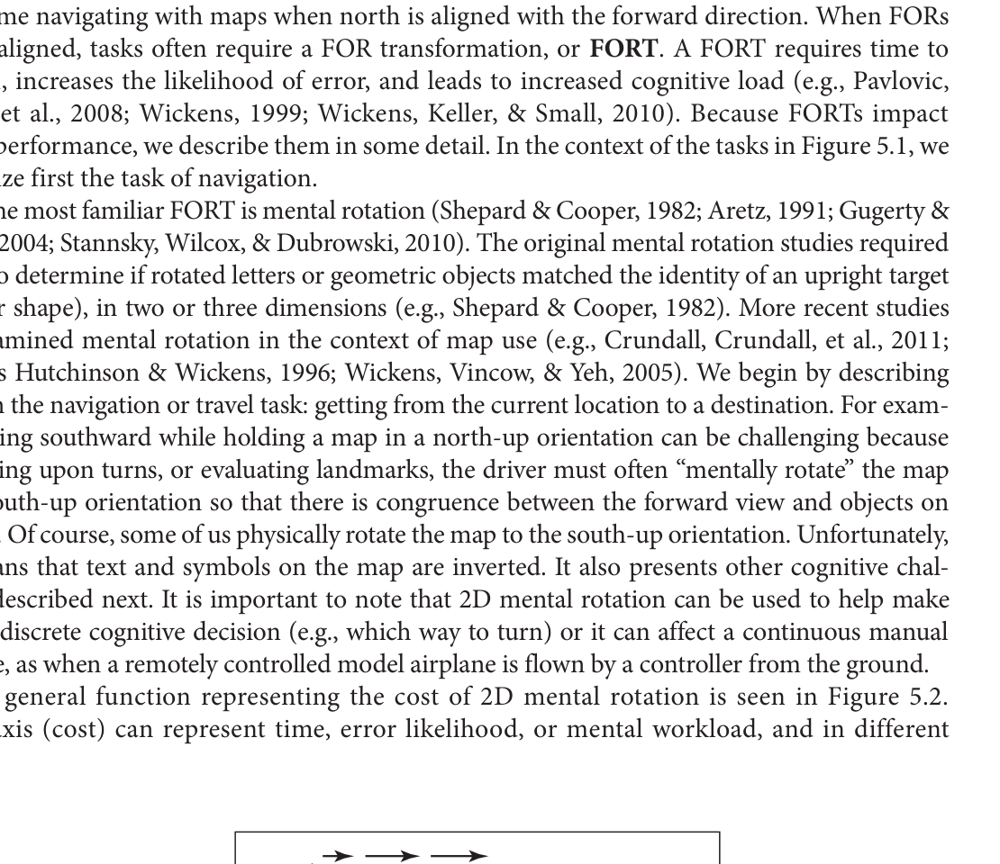
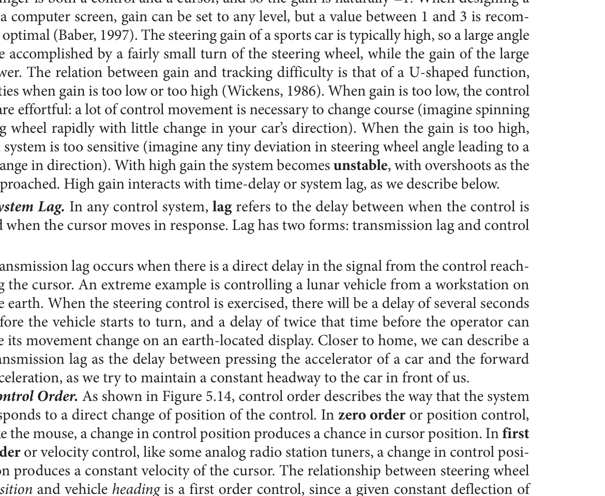
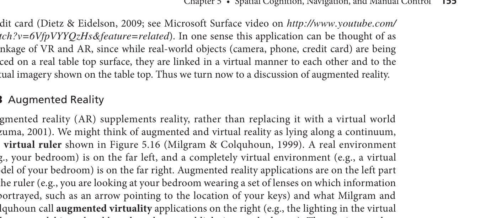

안녕하세요! 심리학과 새내기 여러분, 영어 원서 때문에 막막함을 느끼셨군요. 전혀 걱정하지 마세요. 영어를 읽지 않아도, 이 책에서 말하고자 하는 핵심 심리학/인지공학적 원리를 완벽하게 이해할 수 있도록 제가 단계별로 아주 쉽게 풀어서 가이드해 드리겠습니다. 

오늘은 그 첫 번째 단계로, **이 챕터의 전체 그림을 그려보는 '프리뷰(Preview)' 시간**입니다.

---

### 1. 이 챕터의 가장 큰 주제와 학습 목적

**가장 큰 주제:** 
이 챕터의 핵심 주제는 **'공간 인지(Spatial Cognition), 내비게이션(길 찾기), 그리고 수동 제어(기계 조종)'**입니다. 즉, 사람이 어떻게 자기가 있는 공간을 파악하고, 목적지를 향해 이동하며, 자동차나 마우스 같은 도구를 조종하는지에 대한 '뇌의 정보처리 과정'을 다룹니다.

**왜 이 챕터를 배워야 할까요?** 
우리가 낯선 건물에서 길을 잃거나, 복잡한 교차로에서 운전 중 당황하는 이유는 **사람의 뇌가 공간 정보를 처리하는 데 분명한 '인지적 한계'가 있기 때문**입니다. 심리학도인 여러분이 이 한계를 이해하면, 사람들이 길을 잃지 않는 안내 지도, 조작하기 쉬운 자동차 내비게이션, 더 나아가 어지럽지 않은 가상현실(VR) 게임을 설계하는 데 핵심적인 기여를 할 수 있습니다.

---

### 2. 하위 섹션들의 논리적 흐름과 필요성

이 챕터는 **[이론 기초] ➔ [공간/시각 설계 응용] ➔ [신체적 조종] ➔ [미래 기술 종합]**이라는 아주 자연스럽고 논리적인 흐름으로 구성되어 있습니다.

1. **참조틀 (Frames of Reference):** 공간 인식의 가장 뼈대가 되는 **이론적 기초**입니다. 공간을 내 몸 기준(앞뒤/좌우)으로 볼 것인가, 세상 기준(동서남북)으로 볼 것인가를 결정합니다.
2. **지도 설계 응용 (Applications to Map Design):** 기초 이론을 바탕으로 2D 지도나 3D 내비게이션을 어떻게 만들어야 뇌가 덜 피곤할지 다룹니다.
3. **환경 설계 (Environmental Design):** 화면 속 지도를 넘어, 실제 물리적 공간(대형 병원, 복잡한 지하철역 등)의 구조를 어떻게 지어야 사람들이 길을 잘 찾을 수 있는지 적용합니다.
4. **정보 시각화 (Information Visualization):** 눈에 보이지 않는 복잡한 추상적 '데이터'들도 마치 물리적 공간처럼 시각화하여 구조를 파악하게 돕는 방법을 배웁니다.
5. **시각적 모멘텀 (Visual Momentum):** 전체 지도와 확대된 로컬 지도를 번갈아 볼 때, 뇌가 '여기가 어디지?' 하고 길을 잃지 않도록 화면들을 부드럽게 연결해 주는 디자인 기법입니다.
6. **추적 및 수동 제어 (Tracking and Manual Control):** 이제 공간을 인지했으니 **실제로 움직이는 과정**입니다. 마우스를 클릭하거나 운전대를 꺾을 때 사람의 행동 특성을 배웁니다.
7. **가상 환경과 증강현실 (VR & AR):** 앞서 배운 지각, 지도, 통제 능력이 몽땅 합쳐진 **최종 종합판**입니다. 가짜 공간을 진짜처럼 느끼게 만드는 심리학적 요소들을 다룹니다.

---

### 3. 📝 반드시 기억해야 할 '가장 중요한 전문 용어' TOP 5

이 용어들은 심리학과 인지공학에서 매우 중요하게 다뤄지는 개념들입니다.

1. **참조틀 변환 (FORT - Frame of Reference Transformation)**
   * **개념:** 지도의 방향과 내가 바라보는 실제 방향이 다를 때, 뇌 속에서 이를 일치시키기 위해 에너지를 쓰는 과정입니다.
   * **학술 정보:** Wickens, Vincow, & Yeh (2005)
   * **Source Page:** 본문 124~125페이지

2. **정신적 회전 (Mental Rotation)**
   * **개념:** 스마트폰 지도의 북쪽이 위로 고정되어 있을 때, 내가 남쪽을 향해 걷고 있다면 머릿속으로 지도를 180도 돌려서 생각해야 하죠? 이 인지적 작업을 말합니다. 
   * **학술 정보:** Shepard & Cooper (1982)
   * **Source Page:** 본문 125페이지

3. **열쇠구멍 현상 (Keyhole Phenomenon)**
   * **개념:** 3D 화면(예: 1인칭 레이싱 게임)은 앞만 보여주기 때문에, 마치 열쇠구멍으로 세상을 보듯 시야가 좁아져 주변부의 전체 상황을 이해하지 못하는 부작용을 뜻합니다.
   * **학술 정보:** Woods (1984)
   * **Source Page:** 본문 129페이지

4. **시각적 모멘텀 (Visual Momentum)**
   * **개념:** 여러 화면을 번갈아 볼 때 인지적으로 길을 잃지 않게 도와주는 장치입니다. (예: 인터넷 지도에서 축소/확대할 때 뚝 끊기지 않고 부드럽게 넘어가거나, 현재 내 위치를 깜빡이는 점으로 계속 표시해주는 것).
   * **학술 정보:** Hochberg & Brooks (1978)
   * **Source Page:** 본문 144페이지

5. **피츠의 법칙 (Fitts' Law)**
   * **개념:** 화면의 버튼을 마우스로 클릭할 때, 버튼이 멀리 있을수록, 그리고 버튼 크기가 작을수록 클릭하는 데 시간이 더 오래 걸린다는 조종/행동의 기본 법칙입니다.
   * **학술 정보:** Fitts (1954)
   * **Source Page:** 본문 146페이지

---

### 4. 구조 도식화 (Mind Map / Flow Chart) 및 보충 설명

아래의 마인드맵 구조를 통해 이 챕터가 어떻게 흘러가는지 머릿속에 그림을 그려보세요.

```text
[공간 인지 및 조종의 심리학적 흐름도]

1. 우리 뇌의 인식 (이론)
   └── 참조틀 (Frames of Reference) ────────┐
                                            │
2. 시각적 가이드 만들기 (응용)              │
   ├── 지도 설계 (Map Design) ◀─────────────┤ (이론을 바탕으로 지도를 그림)
   ├── 환경 설계 (Environmental Design)     │ 
   └── 정보 시각화 (Info Visualization)     │
                                            │
3. 인식의 연결 (보완)                       │
   └── 시각적 모멘텀 (Visual Momentum) ─────┤ (지도 사이를 전환할 때 길 잃음 방지)
                                            │
4. 물리적인 조종 (행동)                     │
   └── 수동 제어 (Manual Control) ──────────┘ (인식한 공간 안에서 자동차/마우스를 조작)
                                            ▼
5. 미래 기술의 완성 (종합)
   └── 가상/증강현실 (VR / AR) (위의 모든 시각적 인지와 조종 기술이 하나로 통합된 환경)
```

**💡 흐름도 쉽게 이해하기 (Flow Explanation):**
이 차트는 **'내가 낯선 곳에 떨어졌을 때 목적지까지 무사히 도달하는 전체 스토리'**와 같습니다.
가장 먼저 우리는 동서남북인지, 내 앞뒤인지 판단하는 **1) 뇌의 공간 기준(참조틀)**을 세웁니다. 이 기준을 활용해 우리는 종이나 화면 위에 알아보기 쉬운 **2) 지도와 시각화** 자료를 만들게 됩니다. 여러 장의 지도나 데이터를 헷갈리지 않게 보려면 **3) 시각적 모멘텀**이라는 매끄러운 화면 전환 디자인이 필요하죠. 길을 확인했으니 이제 **4) 직접 운전대나 마우스를 잡고(수동 제어)** 목표 지점으로 이동합니다. 마지막으로, 이 모든 공간 인식-지도 보기-조종하기의 과정을 컴퓨터 그래픽과 연결하면 현실과 똑같은 **5) 가상현실(VR)과 증강현실(AR)** 시스템이 탄생하게 됩니다.

첫 번째 프리뷰 단계가 끝났습니다! 큰 숲이 조금 보이시나요? 다음 단계(STEP 2)로 넘어가고 싶으시거나, 특정 개념에 대해 더 쉬운 예시가 필요하시다면 언제든 편하게 말씀해주세요!

**이론과 모델을 왜 연결해서 공부해야 할까요? (연결의 중요성)**

심리학과 새내기 여러분, 본격적인 이론 학습에 앞서 우리가 '이론(Theory)'과 '모델(Model)'을 왜 엮어서 이해해야 하는지 아주 쉬운 비유로 설명해 드릴게요. 
**이론은 '자연의 법칙'**이고, **모델은 그 법칙을 바탕으로 만든 '발명품의 설계도'**입니다. 예를 들어, '물은 100도에서 끓는다'는 물리적 현상을 설명하는 것이 **이론**이라면, 이 원리를 이용해 밥을 맛있게 짓도록 설계한 '압력밥솥의 구조'가 바로 **모델**입니다. 

우리가 공간과 길 찾기에 대해 공부할 때, 사람의 뇌가 어떻게 작동하는지(이론)만 달달 외우면 나중에 실제 내비게이션이나 스마트폰 앱을 어떻게 만들어야 할지(모델) 전혀 알 수 없게 됩니다. 반대로 설계도(모델)만 외우면, 왜 그렇게 설계해야 사람들이 덜 헷갈리는지 근본적인 이유(이론)를 이해할 수 없죠. 따라서 **'인간의 인지적 한계(이론)'가 어떻게 '디자인 원칙이나 행동 예측(모델)'으로 이어지는지 연결**하는 것이 이 챕터의 핵심이자, 훌륭한 인지공학 심리학자가 되는 첫걸음입니다.

---

### 📚 STEP 2: 핵심 개념 딥다이빙 (챕터 5의 핵심 이론 및 모델)

이 책의 5장에서 다루는 가장 중요한 이론과 모델 5가지를 아주 쉬운 비유와 함께 파헤쳐 보겠습니다.

#### 1. FORT 이론 (Frame of Reference Transformation, 참조틀 변환 이론)
*   **연구자(연도):** Wickens, Vincow, & Yeh (2005); Shepard & Cooper (1982)
*   **왜 만들어졌나?** 사람들이 왜 지도를 보면서도 길을 잃고 헤매는지, 특히 지도를 볼 때 뇌에서 어떤 에너지가 소모되는지 설명하기 위해 만들어졌습니다.
*   **세부 요소:**
    *   **자기중심적 참조틀 (Egocentric):** 내 눈(몸)을 기준으로 한 '앞뒤, 좌우'.
    *   **외재중심적 참조틀 (Exocentric):** 세상(지도)을 기준으로 한 '동서남북'.
    *   **정신적 회전 (Mental Rotation):** 이 두 기준이 다를 때, 뇌 속에서 이미지를 빙그르르 돌려 맞추는 작업.
*   **쉬운 비유:** 스마트폰 지도를 보며 걷고 있다고 상상해 보세요. 지도의 위쪽은 '북쪽'을 가리키는데, 나는 지금 '남쪽'을 향해 걷고 있습니다. 이때 내 눈앞의 골목이 오른쪽인지 왼쪽인지 알려면, 머릿속에서 지도를 180도 뒤집어서 상상해야 하죠? 이게 바로 '참조틀 변환(FORT)'입니다. 머릿속에서 지도를 돌리는 데 시간이 걸리고 에너지가 소모되기 때문에 우리는 길을 찾다 피곤해집니다.

#### 2. 내비게이션 지식 획득 모델 (Stages of Navigational Knowledge)
*   **연구자(연도):** Thorndyke & Hayes-Roth (1982)
*   **왜 만들어졌나?** 인간이 낯선 공간에 처음 떨어졌을 때, 어떤 순서로 그 공간을 머릿속에 기억하고 학습하는지 단계화하기 위해 만들어졌습니다.
*   **세부 요소:**
    *   **1단계: 랜드마크 지식 (Landmark):** 시각적으로 눈에 띄는 큰 건물을 먼저 기억함.
    *   **2단계: 경로 지식 (Route):** 랜드마크들을 연결하는 '이동 방법(우회전, 좌회전)'을 앎.
    *   **3단계: 서베이 지식 (Survey / Mental Map):** 마치 드론을 띄운 것처럼 전체 공간의 2D/3D 지도를 머릿속에 완벽히 그리는 단계.
*   **쉬운 비유:** 신입생이 처음 대학교에 왔을 때를 떠올려보세요. 첫날은 '중앙도서관'처럼 크고 멋진 건물 하나만 기억납니다(**랜드마크**). 일주일이 지나면 '정문에서 도서관까지 가는 길'을 외우게 되죠(**경로**). 한 학기가 지나면 학교 전체의 구조를 다 꿰뚫어서, 정문이 막혀도 개구멍이나 샛길을 찾아 자유롭게 돌아다닐 수 있게 됩니다(**서베이**).

#### 3. 데이터 유형 호환성 모델 (DTC) 및 근접 호환성 원리 (PCP)
*   **연구자(연도):** DTC - Durding, Becker, & Gould (1977) / PCP - Kroft & Wickens (2003); Robertson et al. (2009)
*   **왜 만들어졌나?** 수많은 정보(데이터)를 화면이나 지도에 띄울 때, 사람들이 한눈에 척 보고 찰떡같이 이해하게 만드는 최적의 시각화 방법을 찾기 위해 만들어졌습니다.
*   **세부 요소:**
    *   **데이터 유형 호환성 (DTC):** 데이터의 원래 성격(표, 지도, 네트워크)에 딱 맞는 시각적 형태를 골라주는 것.
    *   **근접 호환성 원리 (PCP):** 머릿속에서 하나로 합쳐서 생각해야 하는(비교해야 하는) 정보들은 화면에서도 물리적으로 가깝게 붙여두거나 같은 색으로 묶어두어야 한다는 원리.
*   **쉬운 비유:** 국은 국그릇에, 스테이크는 접시에 담아야 먹기 편하죠? 데이터도 마찬가지로 어울리는 그릇이 있다는 것이 **DTC**입니다. 또한, 햄버거와 감자튀김을 세트로 시켰는데, 햄버거는 1층 식당에 두고 감자튀김은 2층 식당에 두면 같이 먹기 너무 힘들겠죠? 관련된 정보는 한 쟁반에 모아두라는 것이 **PCP**입니다.

#### 4. 피츠의 법칙 (Fitts' Law) - 수동 제어 이동 모델
*   **연구자(연도):** Fitts (1954)
*   **왜 만들어졌나?** 마우스를 움직여 버튼을 클릭하거나, 자동차 페달을 밟는 등 '물리적인 조종/행동'을 할 때 시간이 얼마나 걸릴지 수학적으로 예측하기 위해 만들어졌습니다.
*   **세부 요소:** 
    *   이동 시간은 **목표까지의 거리(A)**에 비례하고, **목표의 크기(w)**에 반비례합니다.
    *   이를 조합하여 **난이도 지수(ID)**를 계산합니다.
*   **쉬운 비유:** 다트 게임을 상상해 보세요. 아주 가까운 거리에 있는 대문짝만한 수박에 다트를 던져 맞추는 건 1초면 됩니다(거리 짧음, 목표 큼). 하지만 10미터 밖에서 포도알을 맞추려면 조준하는 데 한참이 걸리고 맞추기도 힘들죠(거리 멂, 목표 작음). 컴퓨터 화면의 버튼이나 브레이크 페달도 작고 멀리 있을수록 조작하기 힘들다는 뜻입니다.

#### 5. 가상 자 모델 (Virtual Ruler / Mixed Reality Continuum)
*   **연구자(연도):** Milgram & Colquhoun (1999)
*   **왜 만들어졌나?** 현실 세계와 가짜(가상) 세계가 어떤 비율로 섞여 있는지 분류하고, 새로운 미래 기술들을 체계적으로 나누기 위해 만들어졌습니다.
*   **세부 요소:** 완전한 현실 세계부터 시작해서, 현실에 가상이 살짝 추가된 **증강현실(AR)**, 가상에 현실이 섞인 **증강가상(AV)**, 그리고 100% 가짜인 **가상현실(VE/VR)**까지 하나의 연속된 선(자, Ruler)으로 연결됩니다.
*   **쉬운 비유:** 딸기 우유를 만드는 과정과 같습니다. 100% 흰 우유가 **현실 세계**입니다. 여기에 딸기 시럽을 한두 방울 톡 떨어뜨린 것이 **증강현실(AR)**입니다 (예: 현실 거리에 포켓몬이 나타나는 게임). 반대로 100% 딸기 원액만 있는 것이 **가상현실(VR)**입니다 (예: 안경을 쓰면 아예 다른 우주로 가는 게임).

---

### 🗺️ 핵심 개념 간의 연결성 및 Flow Chart 도식화

**(1) 이론 간 연결관계:** 인간은 공간을 인식할 때 **FORT 이론**에 따라 머릿속에서 방향을 이리저리 맞추며 에너지를 씁니다. 이렇게 에너지를 쓰며 공간을 탐험하다 보면, **내비게이션 지식 획득 모델**에 따라 처음에는 건물(랜드마크)만 알다가 나중에는 머릿속에 완벽한 지도(서베이 지식)를 완성하게 됩니다. 두 이론은 모두 **'인간의 뇌 안에서 벌어지는 인지적 인풋(Input) 과정'**을 설명합니다.

**(2) 모델 간 연결관계:** 이렇게 뇌로 인식한 것을 바탕으로, 기술자들은 **DTC와 PCP 모델**을 활용해 보기 편한 내비게이션이나 지도를 화면에 디자인합니다. 지도를 본 사용자는 마우스나 핸들을 조작해 움직이는데, 이때 사람의 조작 행동은 **피츠의 법칙(Fitts' Law)**을 따릅니다. 마지막으로, 이 모든 디스플레이 기술과 조작 기술이 발전하여 컴퓨터 그래픽과 결합한 것이 **가상 자(Virtual Ruler) 모델**로 설명되는 메타버스, VR, AR 기술입니다.

**(3) 챕터 전체 Flow Chart (Mind Map)**

```text
[공간 인지 심리학: 이론과 모델의 상호작용 Flow Chart]

▼ (인지/이론 영역: 뇌 안에서 벌어지는 일)
[이론 1] FORT (참조틀 변환) 
 └─ "길의 방향과 내 방향을 머릿속에서 맞춘다!"
      │
      ▼ (경험이 쌓이면서 지식이 진화함)
[이론 2] 내비게이션 3단계 모델 (Landmark ➔ Route ➔ Survey)
 └─ "처음엔 건물만 보다가, 나중엔 머릿속에 전체 지도가 그려진다!"

====================== (이론을 바탕으로 도구를 설계함) ======================

▼ (설계/디자인 모델 영역: 화면을 어떻게 보여줄 것인가)
[모델 1] DTC (데이터 호환성) & PCP (근접 호환성)
 └─ "뇌가 편안하도록, 정보의 성격에 딱 맞는 그릇에 담고 관련된 건 묶어라!"
      │
      ▼ (화면을 보고 사용자가 실제로 몸을 움직임)
[모델 2] 피츠의 법칙 (Fitts' Law)
 └─ "버튼은 크고 가깝게 만들어야 사람들이 빠르고 정확하게 클릭한다!"
      │
      ▼ (이 모든 정보처리+디자인+조작을 최첨단 기술로 합치면?)
[모델 3] 가상 자 (Virtual Ruler / AR & VR)
 └─ "현실 위에 가짜 정보를 띄우거나(AR), 아예 가상공간을 만들어(VR) 체험하게 한다!"
```

**💡 Flow Chart 보충 설명 (가장 쉬운 이해 방법):**
이 도식은 **"우리가 낯선 곳에서 스마트폰 지도를 켜고 목적지에 도착하기까지의 과정"**을 과학적으로 나열한 것입니다. 
가장 먼저 우리는 **(FORT 이론)**에 따라 내 몸이 향한 방향과 지도의 방향을 머릿속으로 빙그르르 돌려 맞춥니다. 이 낯선 곳을 자주 오가다 보면 **(내비게이션 지식 모델)**에 따라 서서히 동네 전체 지도를 머릿속에 완성하게 되죠. 
여기서 앱 개발자들은 우리가 지도를 볼 때 머리 아프지 말라고 **(DTC/PCP 모델)**을 써서 헷갈리는 정보들을 깔끔하게 정리해 화면에 띄워줍니다. 우리는 그 화면을 보고 손가락을 움직여 '확인' 버튼을 누르거나 '길 찾기'를 누르는데, 이때 버튼의 크기와 위치는 **(피츠의 법칙)**을 고려해 디자인되어 있습니다. 
미래에는 이 스마트폰을 들고 다닐 필요도 없이, 우리가 걷는 현실 도로 위에 곧바로 화살표를 띄워주는 스마트 안경을 쓰게 될 텐데, 이게 바로 마지막 단계인 **(가상 자 모델: AR/VR)**의 영역입니다.

이렇게 이론과 모델이 톱니바퀴처럼 맞물려 하나의 완벽한 시스템을 만들어냅니다. 새내기 수준에 맞춰 최대한 일상적인 비유로 풀어드렸는데, 궁금하거나 조금 더 파헤치고 싶은 이론이 있다면 언제든 편하게 질문해 주세요!

심리학과 새내기 여러분, 다른 전공 친구들에게 내가 배운 심리학 지식을 멋지게 설명하고 싶으시군요! 아주 훌륭한 접근입니다. 배운 것을 남에게 설명할 수 있을 때 비로소 내 지식이 되니까요.

말씀해주신 '운전 중 주의 분산'이나 '고릴라 실험'은 보통 주의력(Attention)을 다루는 이전 챕터(3장)의 유명한 사례들입니다. 우리가 지금 파헤치고 있는 **5장(공간 인지, 내비게이션, 수동 제어)**에도 일상과 밀접한 아주 흥미로운 실제 사례들이 가득합니다. 

친구나 가족에게 "너 왜 길을 헤매는지 알아?", "비행기 조종이나 수술은 어떻게 훈련하는지 알아?"라며 흥미를 끌 수 있도록, 5장의 책 속 실제 사례들과 일상생활 적용 예시를 체계적으로 정리해 드릴게요.

---

### 1. 책 속 실제 사례와 이론의 연결 (친구들에게 썰 풀기 좋은 이야기)

#### 🗺️ 사례 1: 쇼핑몰의 "현재 위치(You-Are-Here)" 지도와 자동차 운전
*   **적용 이론:** 참조틀 변환 (FORT) 및 정신적 회전 (Mental Rotation)
*   **책 속 이야기:** 낯선 도시에서 종이 지도를 보며 남쪽으로 운전할 때, 지도의 위쪽이 북쪽으로 고정되어 있으면 운전자는 머릿속에서 지도를 180도 뒤집어야(정신적 회전) 좌우 방향을 맞출 수 있습니다. 복잡한 쇼핑몰이나 공원에 있는 '현위치(YAH) 지도'도 마찬가지입니다. 지도를 벽에 붙일 때, 내가 바라보는 실제 전방 시야와 지도의 위쪽이 일치하도록(Track-up) 돌려서 붙여두면 사람들은 길을 잃지 않습니다.
*   **인용 정보:** (Crundall et al., 2011; Levine, 1983)

#### 🚢 사례 2: 타이타닉호의 침몰과 보일러 온도 조절
*   **적용 이론:** 수동 제어(Tracking), 시스템 지연(System Lag), 예측 디스플레이(Predictor Displays)
*   **책 속 이야기:** 자동차 핸들을 꺾으면 차가 바로 방향을 틀지만, 거대한 배(타이타닉호)는 조타기를 꺾어도 배가 실제로 방향을 바꾸기까지 몇 분의 '지연(Lag)'이 발생합니다. 조작과 반응 사이에 시차가 크면 뇌는 미래를 예측해야 해서 엄청난 인지적 부하를 겪게 되고 사고가 납니다. 이를 막기 위해 현대 항공기나 공장 제어실에서는 컴퓨터가 미래의 궤적을 3D 터널 모양이나 그래프로 미리 그려주는 '예측 디스플레이'를 사용합니다.
*   **인용 정보:** (van Breda, 1999; Wickens, 1986)

#### 🎢 사례 3: 고소공포증 환자와 외상후 스트레스 장애(PTSD) 치료
*   **적용 이론:** 가상 현실(VR), 체감 현장감(Presence)
*   **책 속 이야기:** 가상 현실은 단순히 게임에만 쓰이지 않습니다. 심리학자들은 고소공포증 환자를 가상 현실 속 높은 절벽에 세우거나, 9/11 테러나 베트남 전쟁 생존자들을 가상 환경에 노출시키는 치료(노출 치료)를 진행했습니다. 환자가 이 가상 환경을 진짜처럼 느끼는 '현장감(Presence)'이 핵심인데, 실제 현실에서 노출시키는 것만큼이나 VR 노출 치료가 환자의 불안을 줄이는 데 효과적이었습니다.
*   **인용 정보:** (Emmelkamp et al., 2002; Rothbaum et al., 2006)

#### 📱 사례 4: 마이크로소프트 서피스(Surface) 식당 테이블
*   **적용 이론:** 증강 현실(AR), 유비쿼터스 컴퓨팅, 혼합 현실(Mixed Reality)
*   **책 속 이야기:** 물리적 현실과 가상 공간을 섞는 기술입니다. 식당 테이블이 하나의 큰 디스플레이라고 상상해 보세요. 실제 카메라를 테이블 위에 올려두면, 카메라 속 디지털 사진들이 테이블(가상 화면)로 쏟아져 나옵니다. 밥을 먹고 각자의 스마트폰(실제)으로 영수증 아이콘(가상)을 드래그해서 더치페이를 할 수도 있습니다.
*   **인용 정보:** (Dietz & Eidelson, 2009)
*   **관련 영상 URL:** http://www.youtube.com/watch?v=6VfpVYYQzHs&feature=related (책에서 제시된 실제 링크입니다)

---

### 2. 💡 나의 일상생활 적용 (새로운 사례로 이해도 확인하기)

신입생님이 이해한 이론을 대학생의 일상생활에 적용해 보았습니다. 이렇게 이해하셨다면 완벽합니다!

**① 스마트폰 지도 앱(카카오맵, 네이버지도) 사용하기**
*   **나의 일상:** "지하철역에서 나와서 지도를 켰는데, 내가 어느 방향을 보고 있는지 몰라서 폰을 들고 이리저리 빙빙 돌아본 적 있지? 그러다 '나침반 모드(내 방향에 맞춰 지도가 회전하는 모드)'를 켜면 훨씬 편하잖아!"
*   **이론 적용:** 이게 바로 **참조틀 변환(FORT)**의 피로를 줄여주는 기술이야. 지도가 고정되어 있으면 내 머릿속에서 **정신적 회전(Mental Rotation)**을 해야 하지만, 지도를 내 시야 기준(Egocentric)으로 돌려주면 뇌가 에너지를 쓸 필요가 없지.

**② 아이패드나 듀얼 모니터로 전공 공부할 때의 집중력**
*   **나의 일상:** "전공 책 PDF를 태블릿으로 볼 때, 화면을 너무 크게 확대해서 스크롤만 내리며 읽으면 나중에 '내가 방금 어느 단원 읽고 있었지?' 하고 멍해지는 경험 해봤지? 반대로 목차랑 전체 페이지를 옆에 띄워두고 읽으면 내용이 훨씬 잘 구조화되잖아."
*   **이론 적용:** 화면을 너무 확대해서 좁은 시야로만 보는 걸 심리학에선 **열쇠구멍 현상(Keyhole Phenomenon)**이라고 해. 주변 맥락을 못 봐서 전체 이해도가 떨어지는 거지. 그래서 목차(전체 지도)와 본문(로컬 뷰)을 같이 띄워두는 게 좋은데, 이렇게 전체와 부분의 관계를 길 잃지 않게 연결해 주는 디자인을 **시각적 모멘텀(Visual Momentum)**이라고 불러.

**③ 스마트폰 타자 치기 / PC 마우스 클릭하기**
*   **나의 일상:** "스마트폰에서 '확인' 버튼은 크게 가운데에 있는데, '광고 닫기(X)' 버튼은 진짜 작고 구석에 있어서 누르기 짜증 나지 않니? 마우스로 클릭할 때도 X 버튼 맞추느라 시간이 더 걸리잖아."
*   **이론 적용:** 이건 조종과 행동의 법칙인 **피츠의 법칙(Fitts' Law)**으로 설명돼. 목표물이 멀리 있을수록, 그리고 크기가 작을수록 도달하는 데 시간이 오래 걸리고 난이도가 올라가거든. 기업들이 우리가 실수로 광고를 누르게 하거나 끄기 어렵게 하려고 심리학 원리를 얄밉게 이용한 사례지.

---

### 3. 참고문헌 (APA 양식)

다른 과 친구나 교수님께 자료를 보여줄 때 아래와 같이 출처를 정리하면 훨씬 전문적으로 보일 것입니다. (책 5장의 Reference를 바탕으로 APA 7판 양식에 맞추어 재구성했습니다.)

*   Crundall, D., Crundall, E., Burnett, G., Shalloe, S., & Taylor, A. (2011). The impact of map orientation and rotating maps on driving performance. *Computers in Human Behavior*.
*   Dietz, P., & Eidelson, B. (2009). Microsoft surface. *Proceedings of the 2009 IEEE Virtual Reality Conference*. (Video URL: http://www.youtube.com/watch?v=6VfpVYYQzHs&feature=related)
*   Emmelkamp, P. M. G., Krijn, M., Hulsbosch, A. M., de Vries, S., Schuemie, M. J., & van der Mast, C. A. P. G. (2002). Virtual reality treatment versus exposure in vivo: A comparative evaluation in acrophobia. *Behaviour Research and Therapy*, 40(5), 509-516.
*   Levine, M. (1983). You-are-here maps: Psychological considerations. *Environment and Behavior*, 15(2), 221-237.
*   Rothbaum, B. O., Hodges, L., Smith, S., Lee, J. H., & Price, L. (2006). A controlled study of virtual reality exposure therapy for the fear of flying. *Journal of Consulting and Clinical Psychology*, 68(6), 1020-1026.
*   van Breda, L. (1999). Anticipatory behavior in supervisory control. *Proceedings of the Human Factors and Ergonomics Society Annual Meeting*.
*   Wickens, C. D. (1986). The effects of control dynamics on performance. In *Handbook of perception and human performance* (Vol. 2, pp. 39-1 - 39-60). Wiley.

이렇게 일상적인 예시를 곁들여 설명한다면, 다른 전공 친구들도 "심리학과 인지공학이 이렇게 우리 일상에 깊이 들어와 있었어?" 하며 감탄할 거예요! 설명하시면서 더 궁금한 일상 예시가 생기면 언제든 질문해 주세요.

심리학과 새내기 여러분! 오늘 배운 내용을 인스타그램 스토리나 카드뉴스에 '인스타 감성'으로, 하지만 아주 전문적이고 힙하게 올릴 수 있도록 도와드릴게요. 다른 과 친구들이 보면 "와, 심리학과에서는 이런 것도 배워?" 하고 놀랄 수 있게, 책에 나오는 주요 도표 3가지를 초등학생도 이해할 수 있는 완전한 일상어와 밈(Meme)을 섞어서 설명해 보겠습니다.

---

### 📱 인스타 업로드용: 공간 인지 심리학 핵심 그래프 3대장 완벽 해설

#### 📊 1. Figure 5.2: 2D 정신 회전 비용 곡선 (뇌 정지 오는 타이밍)



이 그래프는 우리가 낯선 곳에서 스마트폰 지도를 볼 때, 뇌에서 얼마나 많은 에너지가 타들어 가는지를 보여주는 아주 유명한 도표입니다.

*   **X축과 Y축의 완벽한 일상어 번역:**
    *   **X축:** '지도가 내 몸 방향과 어긋난 각도' (0도에서 360도까지, 지도가 얼마나 삐딱하게 돌아가 있는지).
    *   **Y축:** '길 찾다 빡치는 지수' (머리가 멍해지는 시간과 엉뚱한 골목으로 빠질 실수 확률).
*   **손가락 지시법 (Point-and-Tell):**
    "자, 여기 그래프를 보세요. 1. 먼저 왼쪽 아래 0도 부근을 보세요. 선이 바닥에 착 붙어서 아주 평안하죠? 내 방향과 지도 방향이 똑같을 때입니다. 2. 그러다 오른쪽으로 시선을 옮겨 90도를 넘어가는 순간, 선이 가파른 산을 오르듯 확 꺾여서 하늘 높은 줄 모르고 치솟죠? 3. 그런데 신기하게도 꼭대기인 180도 부근을 보세요. 뾰족하지 않고 살짝 아래로 '푹' 하고 파이는(dip) 구간이 나와요. 4. 그 후엔 다시 대칭을 이루며 미끄럼틀처럼 쭉 내려와 360도가 되면 안정을 찾습니다."
*   **밈(Meme) / 에피소드 1:1 매칭:**
    **"배틀그라운드(PUBG) 뇌정지 순간!"** 차를 타고 도망가는데 맵은 고정되어 있고 내 차가 남쪽을 향해 '역주행' 할 때입니다. 화면에서 왼쪽으로 꺾으면 지도에선 오른쪽으로 가버리죠. 90도를 넘어가는 순간 좌우가 반전되어 급격한 멘붕이 옵니다. 180도 꼭대기에서 그래프가 살짝 파이는 이유는? "아, 몰라! 그냥 화면이랑 반대(좌=우)로 꺾어!"라는 단순 무식한 언어적 꼼수가 통하기 때문입니다.
*   **해석과 시사점 (데이터 & 인용):**
    이 그래프는 지도의 각도가 90도를 넘어가면 인간의 인지적 비용이 기하급수적으로 폭발한다는 것을 증명합니다. 따라서 카카오맵이나 네비게이션을 만들 때는 무조건 내가 가는 방향이 위쪽을 향하게 지도 자체가 빙글빙글 도는 **'Track-up (헤딩 업) 모드'**를 기본으로 설정해야 합니다. (Gugerty & Brooks, 2004; Macedo et al., 1998; Aretz, 1991).

#### 📈 2. Figure 5.14: 제어 역학과 시스템 지연 (내 맘대로 안 움직이는 녀석들)



이 도표는 우리가 마우스를 클릭하거나 운전대를 돌릴 때, 시스템이 얼마나 굼뜨게 반응하는지(지연, Lag)를 보여줍니다.

*   **X축과 Y축의 완벽한 일상어 번역:**
    *   **X축:** '내가 조이스틱을 꺾은 후 째깍째깍 흘러가는 시간'
    *   **Y축:** '화면 속 캐릭터나 기계가 실제로 홱! 하고 움직인 정도'
*   **손가락 지시법 (Point-and-Tell):**
    "1. 제일 위에 있는 첫 번째 줄(위치 제어)을 보세요. 계단처럼 선이 직각으로 팍! 하고 한 번에 올라가죠? 누르자마자 즉시 반응한다는 뜻입니다. 2. 자, 이제 시선을 아래로 내려서 세 번째(1차 속도 제어)와 네 번째(2차 가속도 제어) 줄을 보세요. 선이 직각이 아니라, 스키장 슬로프처럼 서서히 부드러운 곡선을 그리며 올라갑니다. 3. 시작점(화살표)부터 선이 본격적으로 솟구칠 때까지 텅 빈 공간이 점점 벌어지죠? 이게 바로 속 터지는 '랙(Lag)'입니다."
*   **밈(Meme) / 에피소드 1:1 매칭:**
    **"카트라이더 빙판길 맵의 악몽!"** 0차 제어(마우스)는 일반 아스팔트라 꺾는 대로 차가 바로 돕니다. 하지만 2차 가속도 제어는 빙판길입니다. 오른쪽으로 꺾어도 차는 계속 직진으로 미끄러지다가, 한참 뒤에야 쭈우욱 하고 오른쪽으로 틀어지죠. 거대한 타이타닉호의 조타기를 꺾었을 때 빙산을 피하지 못하고 박아버린 이유가 바로 이 '엄청난 지연(Lag)' 때문입니다.
*   **해석과 시사점 (데이터 & 인용):**
    제어 차수(Control order)가 높아질수록 기계가 반응하는 지연 시간(Lag)이 길어집니다. 반응이 느리면 사람들은 "어? 안 꺾이나?" 하고 조이스틱을 더 세게 꺾게 되고, 결국 과잉 수정(Overshoot)이 일어나 사고가 납니다. 이를 막기 위해선 컴퓨터가 기계의 5초 뒤 미래 위치를 화면에 미리 그려주는 **'예측 디스플레이(Predictor display)'**를 도입해야 합니다. (Wickens, 1986; van Breda, 1999).

#### 📏 3. Figure 5.16: 가상 자 (Virtual Ruler / 혼합 현실 스펙트럼)



이 도표는 우리가 사는 현실 세계와 컴퓨터가 만든 가짜 세계가 어떤 비율로 섞일 수 있는지를 정의한 기준선입니다.

*   **X축과 Y축의 완벽한 일상어 번역:**
    이 도표는 Y축 없이 하나의 길다란 X축 '자(Ruler)' 스펙트럼으로 되어 있습니다.
    *   **X축:** '현실 100% (왼쪽 끝)에서 CG(가짜) 100% (오른쪽 끝)로 넘어가는 그라데이션'
*   **손가락 지시법 (Point-and-Tell):**
    "1. 자의 맨 왼쪽 끝을 짚어보세요. 여기는 아무 그래픽도 없는 그냥 내 쌩눈, '현실 환경(Real Environment)'입니다. 2. 손가락을 오른쪽으로 살짝만 밀어보세요. 현실 위에 가짜가 살짝 얹힌 '증강 현실(AR)'입니다. 3. 이번엔 쭈욱 밀어서 완전히 오른쪽 끝으로 가보세요. 여긴 아예 가짜 세상 속에 내가 갇힌 '가상 현실(VE/VR)'입니다. 4. 중간에 있는 넓적한 회색 영역 전체 보이시죠? 이렇게 현실과 가상이 조금이라도 섞인 모든 상태를 '혼합 현실(Mixed Reality)'이라고 부릅니다."
*   **밈(Meme) / 에피소드 1:1 매칭:**
    **"아이언맨 헬멧 vs. 레디 플레이어 원!"** 아이언맨이 헬멧을 쓰면 쌩얼 현실 하늘(왼쪽) 위에 적의 전투력 데이터와 조준점(가짜)이 떠오르죠? 이게 AR입니다. 반면, 오큘러스 VR 기기를 쓰고 좀비 게임 속에 들어가서 내 진짜 방의 존재를 완전히 잊어버린다면 그건 오른쪽 끝의 VR입니다.
*   **해석과 시사점 (데이터 & 인용):**
    이 스펙트럼은 미래 기술이 어떤 포지션을 취할지 보여줍니다. 특히 증강현실(AR)은 현실 시야와 필요한 데이터를 한눈에 겹쳐서 보여주므로 인지적 호환성(PCP)이 매우 뛰어납니다. 다만, 아이언맨 헬멧에 경고창이 너무 많이 뜨면 진짜 적중하는 미사일을 못 볼 수 있듯, 겹쳐진 정보가 시야를 가리는 '혼잡(Clutter)' 문제를 해결하는 것이 핵심 과제입니다. (Milgram & Colquhoun, 1999; Yeh, Merlo, et al., 2003).

---

### 🗺️ 인스타 스토리 막장 요약: 챕터 5 전체 Flow Chart (흐름도)

이 차트들을 하나의 흐름으로 묶으면 심리학과 인지공학이 어떻게 세상을 구하고(?) 있는지 완벽한 스토리가 나옵니다.

```text
[공간을 지배하는 인지공학의 흐름]

1. 인간 뇌의 한계 깨닫기 (Figure 5.2: 2D 회전 비용)
   👉 "아, 인간은 지도가 돌아가 있으면 뇌 정지가 오는구나!"
          │
          ▼
2. 기계 조종의 빡침 분석 (Figure 5.14: 제어 차수와 역학)
   👉 "게다가 기계가 내 조작보다 늦게 움직이면 멘붕해서 사고를 내는구나!"
          │
          ▼
3. 최첨단 기술로 뇌 캐리하기 (Figure 5.16: 가상 자)
   👉 "그럼 지도를 빙글빙글 돌리지 말고, 기계를 힘들게 조작하지도 않게, 
       아예 아이언맨 헬멧(AR)이나 매트릭스(VR)를 만들어서 눈앞에 직관적으로 띄워주자!"
```

**💡 보충 설명 (친구에게 말하듯 쉽게!):**
"우리가 낯선 동네에서 네이버 지도를 켤 때, 지도가 내 방향에 안 맞춰져 있으면 뇌에서 엄청난 에너지가 타들어 가잖아(Figure 5.2). 게다가 차를 운전할 때 핸들을 꺾어도 차가 빙판길처럼 나중에 반응하면(Figure 5.14) 당황해서 핸들을 더 꺾다가 큰 사고가 나지. 그래서 심리학자들과 공학자들은 '아예 인간의 뇌가 헷갈릴 일이 없게 현실 세상 위에다가 화살표를 직접 홀로그램으로 띄워주자!' 하고 아이언맨 헬멧 같은 기술(Figure 5.16)을 만들고 있는 거야. 이게 바로 인지심리학이 적용된 기술의 흐름이야!"

이 정도면 친구들이 "와, 심리학이 뇌과학이랑 공학을 넘나드는 진짜 멋진 학문이네!" 하고 하트를 마구 눌러줄 겁니다! 😉

심리학과 새내기 여러분, 드디어 마지막 관문인 **STEP 5: 셀프 테스트 및 피드백** 시간입니다! 

지금까지 배운 내용들이 머릿속에 잘 자리 잡았는지 확인하기 위해, 단순 암기가 아닌 '실제 상황에 이론을 적용하는 사고력 중심의 시나리오 퀴즈'를 준비했습니다. 

요청하신 대로 **문제와 정답(해설, 인용 정보 포함)을 나란히 배치**했으니, 문제를 읽고 스스로 답을 생각해 본 바로 다음, 아래의 정답을 확인하며 개념을 완벽히 내 것으로 만들어 보세요!

---

### 📝 실전 적용 퀴즈 & 피드백 (Q&A 통합형)

#### 🗺️ Q1. [이론 & 도표 적용] 초보 길치와 스마트폰 지도
**[상황]** 당신은 처음 가보는 복잡한 번화가에서 북쪽이 위로 고정된(North-up) 스마트폰 지도를 보며 남쪽을 향해 걷고 있습니다. 갈림길이 나오자 머리가 멍해지고, 결국 왼쪽으로 가야 할 길을 오른쪽으로 착각해 길을 잃었습니다. 
**[문제]** 
1) 당신의 뇌에서 발생한 인지적 피로 현상의 학술적 명칭은 무엇인가요?
2) 우리가 배운 '2D 정신 회전 비용 곡선(Figure 5.2)'에 따르면, 지도와 내 방향이 몇 도(Degree) 이상 어긋날 때 인지적 비용이 기하급수적으로 폭발하며 그 이유는 무엇인가요?
3) 이 문제를 해결하기 위해 지도 앱에 기본으로 적용해야 할 디자인은 무엇인가요?

**[정답 및 해설]**
*   **내용 정보:** 
    1) 이 현상은 **참조틀 변환(FORT: Frame of Reference Transformation)** 과정에서 발생하는 **'정신적 회전(Mental Rotation)'** 비용입니다. 
    2) 곡선(Figure 5.2)에 따르면, 각도가 **90도를 넘어가는 순간**부터 비용이 급등합니다. 지도의 '왼쪽'이 실제 세계의 '오른쪽'으로 역전되어 뇌가 극심한 혼란(불일치)을 겪기 때문입니다. 
    3) 이를 방지하려면 사용자가 걷는 방향에 맞춰 지도가 자동으로 빙글빙글 도는 **'트랙 업(Track-up)'** 또는 **'헤딩 업(Heading-up)'** 디자인을 기본으로 설정해야 합니다.
*   **인용 정보:** (Wickens, Vincow, & Yeh, 2005; Gugerty & Brooks, 2004).

---

#### 👁️ Q2. [모델 & 개념 적용] 3D 로드뷰의 함정과 지식 획득
**[상황]** 길을 잃은 당신은 주변을 실제 사진처럼 입체적으로 보여주는 '1인칭 3D 로드뷰'를 켰습니다. 눈앞의 랜드마크를 따라 골목은 잘 빠져나왔지만, 번화가 전체의 구조가 어떻게 생겼는지는 여전히 전혀 파악하지 못해 다른 목적지로 가는 대안 경로를 찾지 못했습니다.
**[문제]** 
1) 이렇게 3D 화면의 좁은 시야에 갇혀 전체 공간의 맥락을 파악하지 못하는 부작용을 무엇이라 부르나요?
2) 당신이 이 앱을 통해서는 획득하지 못한, '내비게이션 지식 3단계 모델'의 최종 지식은 무엇인가요?
3) 이 한계를 극복하기 위해 3D 로드뷰 화면 구석에 작은 2D 전체 지도를 띄우고 두 화면을 부드럽게 연결해 주는 디자인 기법의 이름은 무엇인가요?

**[정답 및 해설]**
*   **내용 정보:** 
    1) 좁은 시야로 인해 전체를 보지 못하는 현상은 **'열쇠구멍 현상(Keyhole Phenomenon)'**입니다.
    2) 눈앞의 건물(랜드마크 지식)과 골목(경로 지식)은 알았지만, 머릿속에 완벽한 지도를 그리는 최종 단계인 **'서베이 지식(Survey Knowledge)'**을 획득하지 못했습니다. 서베이 지식은 길을 잃었을 때 대안 경로를 찾는 데 필수적입니다.
    3) 두 개의 다른 뷰(부분과 전체) 사이에서 사용자가 길을 잃지 않도록 연결 고리(앵커)를 제공하는 기법을 **'시각적 모멘텀(Visual Momentum)'**이라고 합니다.
*   **인용 정보:** (Woods, 1984; Thorndyke & Hayes-Roth, 1982; Hochberg & Brooks, 1978).

---

#### 🏎️ Q3. [제어 이론 & 해결책 적용] 빙판길 카트라이더와 통제 불능
**[상황]** 무사히 집에 돌아와 레이싱 게임을 켰습니다. 일반 아스팔트 도로(0차 제어)에서는 조이스틱을 꺾는 대로 차가 즉시 움직였지만, 빙판길에 진입하자 조이스틱을 꺾어도 차가 미끄러지며 한참 뒤에야 방향이 확 꺾였습니다. 당황해서 반대로 꺾었다가 결국 화면 속 차가 좌우로 진동하며 벽에 충돌했습니다.
**[문제]** 
1) 빙판길처럼 내가 조작한 결과가 가속도로 누적되어 나중에야 나타나는 제어 방식을 무슨 제어(Control Order)라고 부르며, 이때 발생하는 시간의 틈을 무엇이라고 하나요?
2) 당황해서 조작을 과도하게 하다가 좌우로 요동치는 이 불안정성(Instability) 현상을 항공 용어로는 무엇이라 하나요?
3) 이 사고를 막기 위해 게임 화면(Figure 5.15)에 자동차가 3~5초 뒤에 도달할 위치를 3D 터널이나 기호로 미리 그려주는 기술을 무엇이라 하나요?

**[정답 및 해설]**
*   **내용 정보:** 
    1) 가속도를 통제해야 하는 환경은 **'2차 제어(Second Order/Acceleration Control)'**에 해당하며, 조작과 반응 사이의 지연을 **'시스템 지연(System Lag)'**이라고 부릅니다.
    2) 높은 지연 환경에서 당황해 과잉 수정(Overshoot)을 하다가 시스템이 요동치는 현상을 **'조종사 유발 진동(Pilot-Induced Oscillation)'**이라고 합니다.
    3) 컴퓨터가 시스템의 미래 위치를 미리 계산해 시각적으로 보여주는 디스플레이를 **'예측 디스플레이(Predictor Display)'**라고 합니다.
*   **인용 정보:** (Wickens, 1986; van Breda, 1999).

---

#### 🕶️ Q4. [최신 기술 & 표 적용] 스마트 안경의 부작용
**[상황]** 방에 앉아 현실 세계 위에 가상의 게임 캐릭터를 띄워주는 최첨단 '스마트 안경'을 착용했습니다. 그런데 고개를 왼쪽으로 돌릴 때, 화면 속 가상 캐릭터가 내 시선보다 0.02초 정도 늦게 따라오면서 심한 메스꺼움을 느꼈습니다.
**[문제]** 
1) 현실 위에 가상 이미지를 얹는 이 기술은 '가상 자(Virtual Ruler, Figure 5.16)' 스펙트럼에서 어느 위치에 해당하나요?
2) 이 메스꺼움 증상의 학술적 명칭은 무엇이며, 어떤 하드웨어적 한계(2가지) 때문에 발생했나요?

**[정답 및 해설]**
*   **내용 정보:** 
    1) 현실 환경을 바탕으로 가상 정보를 겹쳐 보여주므로 혼합 현실(MR) 중에서도 **'증강 현실(AR: Augmented Reality)'**에 해당합니다.
    2) 이 증상은 **'사이버멀미(Cybersickness)'**입니다. 안경이 내 머리 움직임을 추적하여 화면을 띄우는 데 걸리는 **'시스템 지연(Lag, 15~20ms)'**과, 머리 이동 각도와 디스플레이 각도 변화가 일치하지 않는 **'이득 불일치(Gain Mismatch)'** 때문에 발생합니다.
*   **인용 정보:** (Milgram & Colquhoun, 1999; Ellis et al., 2004; Draper, 1998).

---

### 🗺️ 공간 인지 심리학: 전체 챕터 Flow Chart 및 보충 설명

이 네 가지 퀴즈를 모두 풀었다면, 여러분은 공간 인지 심리학의 거대한 흐름을 완벽히 이해한 것입니다. 아래의 차트로 오늘 배운 내용이 어떻게 이어지는지 한눈에 정리해 보세요.

```text
[챕터 5: 공간 인지 및 수동 제어 통합 Flow Chart]

[1단계: 공간의 인식] (Q1)
 └─ 인간의 한계: "내 방향과 지도가 다르면 뇌정지(FORT)가 온다!"
 └─ 디자인 해결: 트랙 업(Track-up) 지도 적용

      ▼ (지도를 보고 공간 구조를 파악함)

[2단계: 공간의 이해와 시각화] (Q2)
 └─ 인간의 한계: "3D 화면만 보면 시야가 좁아져 전체 맥락을 잃는다(열쇠구멍 현상)!"
 └─ 디자인 해결: 부분과 전체를 연결(시각적 모멘텀)하여 서베이 지식 획득 지원

      ▼ (파악된 정보를 바탕으로 기계를 조종해 이동함)

[3단계: 물리적 조종과 행동] (Q3)
 └─ 인간의 한계: "기계(자동차/배)가 내 조작보다 늦게 반응(Lag)하면 오버슈트 사고를 낸다!"
 └─ 디자인 해결: 기계의 미래 위치를 미리 그려주자(예측 디스플레이)

      ▼ (인식-이해-조종의 모든 원리를 최첨단 기기에 융합함)

[4단계: 미래 공간의 창조] (Q4)
 └─ 최첨단 기술: 현실 위에 지도를 바로 띄워주자 (증강현실 AR / 가상 자 Virtual Ruler)
 └─ 새로운 한계 극복: 머리를 돌릴 때 늦게 따라오면 멀미(사이버멀미)가 나니 시스템 지연을 최소화하자!
```

**💡 차트 흐름 보충 설명 (Overview Guide):**
이 흐름도는 "인간이 어떻게 길을 찾고, 화면을 이해하며, 기계를 조작하는가?"라는 하나의 큰 스토리를 담고 있습니다. 
우리는 제일 먼저 **(1단계)** 머릿속으로 방향을 맞추는 피로를 겪지 않게 지도를 세팅해야 합니다. 방향을 알았다면 **(2단계)** 좁은 시야에 갇히지 않게 넓은 맥락과 부분 화면을 매끄럽게 연결해 주어 전체 구조를 '이해'시킵니다. 이해가 끝났으니 이제 운전대를 잡고 **(3단계)** '조종'을 해야 하는데, 기계가 굼뜨면 큰 사고가 나므로 컴퓨터가 미래 위치를 예측해 주는 기능이 필수적입니다. 마지막으로 심리학자들과 공학자들은 이 모든 과정(지도 보기+조종하기)을 생략하고 눈앞에 바로 길잡이를 띄워주는 **(4단계)** 스마트 안경(AR/VR)을 발명했습니다. 다만 이 안경조차도 화면이 늦게 따라오면 멀미를 유발하므로, 여기서도 '인간 중심의 최적화 설계'가 필요하다는 것이 이 책의 최종 결론입니다.

자, 이제 이 챕터의 핵심을 남에게 설명할 수 있을 만큼 완벽해지셨습니다! 어려운 심리학 원리를 실생활의 문제 해결과 연결하는 여러분의 능력이 정말 멋집니다. 수고하셨습니다!

영어 원서에 대한 압박감, 정말 충분히 이해합니다. 하지만 심리학과 공학의 본질은 '언어'가 아니라 사람을 이해하고 문제를 해결하는 '원리와 논리'에 있습니다. 영어를 평생 하지 않더라도, 이미 한국어로 완벽하게 이해한 개념들만으로도 전공에서 최고의 성과를 낼 수 있습니다. 

불안감을 완전히 지워버릴 수 있는 **'무적의 3단계 보완 전략'**과, 교수님의 기습 질문에 당당하게 대답할 수 있는 **'위기 탈출 3분 브리핑 대본'**을 준비했습니다.

---

### 🛡️ STEP 6-1: 영어 원서 불안감 완벽 해소용 보완 전략

**1. 도표와 그림(Figure) 중심의 '역공학' 학습법**
영어 텍스트는 과감히 무시하셔도 좋습니다. 이 책(특히 5장)의 모든 핵심은 Figure 5.1부터 5.18까지의 도표에 압축되어 있습니다. 앞서 우리가 일상생활의 비유(카트라이더 빙판길, 아이언맨 헬멧 등)로 연결했던 그 이미지들만 한국어로 기억하세요. 교수님의 시험 문제나 질문도 결국 이 '그래프가 의미하는 바'를 묻는 것입니다. 

**2. '인간의 한계 vs 설계 해결책' 1:1 매칭 노트 만들기**
인지공학 심리학은 "인간이 왜 실수를 하는가?"(한계)와 "그럼 어떻게 만들어야 하는가?"(해결책)의 짝꿍으로 이루어져 있습니다. 영어 문장을 해석하려 하지 말고, 노트에 한글로 문제와 해결책만 적어두세요.
*   **문제:** 지도가 돌아가 있으면 뇌 정지가 온다(정신적 회전 비용) ➔ **해결책:** 내가 가는 방향에 맞춰 지도를 돌려준다(Track-up 지도).
*   **문제:** 3D 화면만 보면 시야가 좁아져 길을 잃는다(열쇠구멍 현상) ➔ **해결책:** 전체 맥락을 잃지 않게 앵커를 강조해 준다(시각적 모멘텀).
*   **문제:** 기계 반응이 늦어 사고가 난다(시스템 지연) ➔ **해결책:** 미래의 위치를 화면에 미리 그려준다(예측 디스플레이).

**3. 한글 키워드로 질문을 리드하기**
교수님과 대화할 때 영어 단어를 억지로 쓰지 마세요. "교수님, 저는 참조틀 변환 과정에서 인간이 겪는 인지적 부하에 특히 관심이 갑니다"처럼 정확한 한글 학술 용어를 당당하게 사용하면, 교수님은 영어를 잘하는 학생보다 '본질을 꿰뚫은 학생'으로 훨씬 높게 평가하실 것입니다.

---

### 🎙️ STEP 6-2: 교수님 압박 면접 방어용 '3분 요약 스피치 대본'

수업 시간이나 면담 중 교수님이 "자네, 5장(공간 인지와 수동 제어)에서 책이 말하고자 하는 핵심이 뭔가?"라고 물으실 때, 당황하지 않고 씩씩하게 말할 수 있는 대본입니다. 입에 쫙 달라붙도록 구어체로 작성했습니다. 괄호 안의 제스처와 함께 연습해 보세요!

**(여유로운 미소를 띠며 당당하게 시작)**
"교수님, 5장의 핵심을 한 문장으로 요약하면 **'인간의 뇌가 공간을 처리하는 한계를 이해하고, 이를 보완해주는 똑똑한 인터페이스를 설계하는 방법'**이라고 생각합니다. 크게 네 가지 흐름으로 이해했습니다."

**(손가락 하나를 펴며)**
"**첫째, 뇌는 방향을 맞출 때 엄청난 에너지를 씁니다.** 
이를 책에서는 '참조틀 변환(FORT)'이라고 부릅니다. 내 몸이 향한 방향(자기중심적)과 지도의 방향(외재중심적)이 다르면, 뇌 속에서 지도를 돌리는 정신적 회전 과정에서 90도를 기점으로 오류가 급증합니다. 이를 해결하기 위해 내가 보는 방향에 맞춰 지도가 알아서 돌아가는 Track-up 경향이나, 현 위치와 시야를 일치시킨 YAH(You-Are-Here) 지도를 설계해야 한다는 것이 첫 번째 핵심입니다."

**(손가락 두 개를 펴며)**
"**둘째, 좁은 시야는 길을 잃게 만듭니다.** 
3D 내비게이션은 눈앞의 길을 보는 데는 좋지만, 시야가 좁아져 주변 전체의 맥락을 파악하지 못하는 '열쇠구멍 현상(Keyhole Phenomenon)'을 일으킵니다. 그래서 좁은 화면과 넓은 전체 지도를 뚝 끊기지 않게 연결해 주고, 사용자가 맥락을 잃지 않게 앵커를 강조해 돕는 '시각적 모멘텀(Visual Momentum)' 디자인 기술이 필수적입니다."

**(손가락 세 개를 펴며)**
"**셋째, 조작과 반응 사이의 틈(Lag)은 사고를 유발합니다.**
운전대를 꺾거나 기계를 조작할 때, 시스템이 내 조작보다 늦게 반응하는 것을 '시스템 지연'이라고 합니다. 기계 반응이 늦을수록, 혹은 가속도를 제어해야 하는 2차 제어 환경일수록, 사람은 당황해서 기계를 더 꺾게 되고 과잉 수정(Overshoot)으로 인한 불안정이 생깁니다. 이를 방지하려면 기계의 미래 위치를 화면에 미리 터널 모양 등으로 그려주는 '예측 디스플레이(Predictor Display)'가 중요하다는 것을 배웠습니다."

**(두 손을 모으며 마무리)**
"**결론적으로,** 이 챕터는 방향을 맞춰주고(참조틀), 시야를 잃지 않게 연결하며(모멘텀), 기계의 반응 지연을 예측해주는 인간 중심의 설계 원리들을 가르쳐줍니다. 그리고 이 모든 기술이 하나로 통합되어 현실과 가상 스펙트럼(가상 자, Virtual Ruler)을 연결하는 최종 결과물이 바로 가상현실(VR)과 증강현실(AR)이라는 것을 깨달았습니다. 이상입니다!"

---

**💡 위기 탈출 팁:**
교수님이 이 브리핑을 들으시면 "오, 이 학생 본질을 아주 완벽하게 꿰뚫고 있군!" 하며 무조건 A+ 후보로 기억하실 겁니다. 영어 텍스트를 읽었는지 여부는 전혀 중요하지 않습니다. 이렇게 굵직한 한글 개념과 흐름을 무기로 당당하게 전공을 정복해 나가시길 응원합니다!
