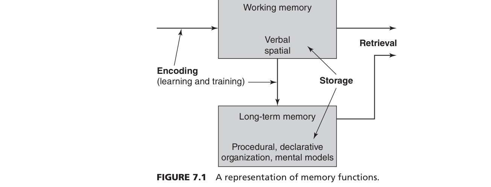
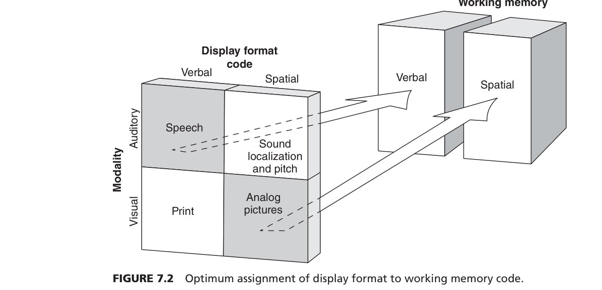
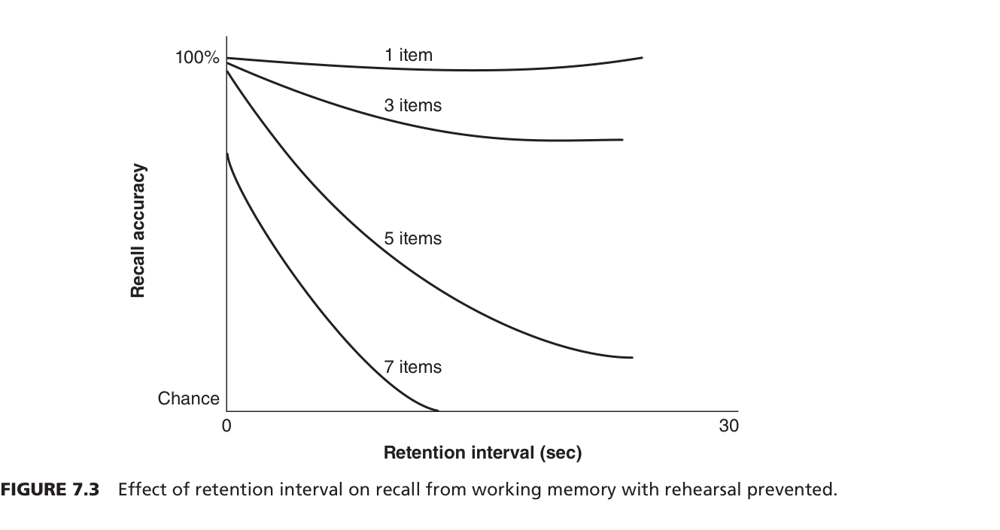
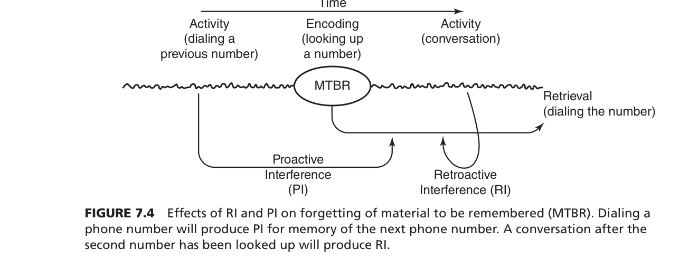

# Ch. 7. 기억과 훈련
## Memory and Training

> 작업기억은 작고 약하다 — 그래서 디스플레이 설계와 훈련이 필요하다

**W7** | Engineering Psychology & Human Behaviour

---

## PART 1 — 작업기억의 구조와 한계
### Slides 1 ~ 15

이 파트의 핵심 질문:
- 기억은 어떻게 작동하나?
- 왜 자꾸 까먹나?
- 어떻게 설계하면 덜 까먹게 할 수 있나?

---

## Slide 1. 기억의 3단계 모델

**기억은 3단계로 작동한다**
- **부호화(Encoding)** → **저장(Storage)** → **인출(Retrieval)**
- 이 중 하나라도 막히면 "기억이 안 난다"

**왜 중요한가 — ValuJet 592 추락 (1996)**
- 정비팀이 산소 발생기 상태를 잘못 부호화 → 화물칸 폭발 → 110명 사망
- 기억 실패 = 사고

---

## Slide 2. 배들리의 작업기억 4요소

**작업기억은 "통 하나"가 아니다 — 4개의 독립 시스템**

| 요소 | 담당 | 비유 |
|------|------|------|
| 음운 루프 | 말·글자 정보 | 머릿속 내레이터 |
| 시공간 스케치패드 | 위치·이미지 | 머릿속 지도 앱 |
| 중앙 집행기 | 주의 배분·전환 | 뇌의 CEO |
| 일화적 완충기 | 통합·LTM 연결 | 임시 회의실 |

💡 카카오 내비로 길 찾으면서 통화하면 왜 힘드나? → 시공간 스케치패드 + 음운 루프 동시 사용

---

## Slide 3. 작업기억과 주의 통제

**작업기억은 저장소만이 아니다 — 주의를 컨트롤하는 시스템**

- N-back 과제: 2개 전 숫자를 기억하면서 새 숫자를 판단 → WM 용량 = 멀티태스킹 능력
- 작업기억이 클수록 비행 의사결정도 빠름 (Moore et al., 2008)

**실험 사실**
- WM 용량이 작을수록 → 피로·스트레스 상황에서 실수가 더 많음

💡 시험 직전 긴장하면 아는 것도 생각 안 나는 이유 = WM이 불안으로 가득 찬 상태

---

## Slide 4. 작업기억 하위 시스템 간의 간섭

**같은 채널을 동시에 쓰면 서로 방해한다**

- 가사 있는 음악 + 독서 = **음운 루프** 충돌 → 독해력 하락
- 도표 보기 + 지도 보기 = **시공간 스케치패드** 충돌

**핵심 원리**
- 서로 다른 채널이면 동시 수행 가능
- 같은 채널이면 충돌 → 성능 저하

💡 운전하면서 음악은 괜찮아도 내비 음성 + 통화는 힘든 이유 = 둘 다 음운 채널

---

## Slide 5. S-C-R 호환성 (Figure 7.2)

**정보 형태와 반응 방식이 맞아야 한다**

- **S(자극) - C(처리 코드) - R(반응)** 세 가지가 같은 채널이면 성능 UP
- 공간 정보 → 시각 디스플레이 → 손 조작 ✅
- 음성 정보 → 청각 → 말로 응답 ✅

**설계 원칙**
- 지도·경로 정보는 화면에 (공간 채널)
- 경보·안내는 소리로 (음운 채널)

---

## Slide 6. 청각 정보가 더 오래 남는다

**들은 것이 본 것보다 잠깐 더 기억된다**

- **잔향 기억(Echoic memory)**: 소리는 사라진 후에도 약 2~4초간 메아리처럼 남음
- **영상 기억(Iconic memory)**: 시각 정보는 약 0.5초

**항공 관제 설계 시사점**
- 중요 정보를 텍스트만으로 표시하면 놓칠 수 있다
- 소리로 한 번 더 → 잔향 기억 활용 = 안전성 UP

💡 넷플릭스 자막만 vs 더빙 — 더빙이 내용 기억에 더 유리한 이유 = 잔향 기억

---

## Slide 7. 작업기억은 20초 안에 사라진다

**되뇌지 않으면 사라진다 — Brown-Peterson 실험**

- 실험: 단어 외우고 → 숫자 세기(되뇌기 방해) → 몇 초 후 회상
- 결과: **15~20초** 안에 대부분 잊어버림

**실생활 위험**
- 전화번호 들은 직후 다른 생각 1초 → 이미 절반 사라짐

---

## Slide 8. 마법의 숫자 7 — 사실은 3~4개

**Miller의 7±2는 과장이었다**

- 1956년 Miller: 단기기억 용량 = 7±2개
- 2001년 Cowan 재연구: **실제는 3~4개** (되뇌기 없으면)
- 중국어는 발음이 짧아 → 웨일스어보다 기억 용량이 더 많음

**설계 원칙**
- 한 화면에 7개 이상 옵션 → 부하 과다
- 메뉴는 4개 이하로 묶어라

💡 카카오 앱 바텀 탭이 5개인 이유 = 4~5개가 한눈에 처리 가능한 한계

---

## Slide 9. 청킹 — 묶으면 더 많이 기억된다

**낱개로 기억하지 말고 덩어리로 묶어라**

- **청킹(Chunking)**: 개별 항목을 의미 단위로 묶어 1개의 덩어리로 저장
- 1-1-9 / 2-2 → "119에 22번"으로 묶으면 2개 청크

**왜 효과적인가**
- 작업기억 용량은 '개수' 한계 → 덩어리가 크면 실효 용량 증가
- 의미 연결 = 장기기억 활용

💡 전화번호를 010-1234-5678로 나눠 읽는 이유 = 청킹. 01012345678로 읽으면 훨씬 힘듦

---

## Slide 10. 파싱 — 시각적으로 쪼개서 도와줘라

**사람이 자동으로 청킹하도록 경계를 만들어줘라**

- **파싱(Parsing)**: 하이픈·공백·색깔로 정보를 시각 단위로 분리
- 2784보다 27 84가 더 외우기 쉽다
- 항공 코드 AI3404 → AI-3404로만 바꿔도 혼동 감소

**설계 원칙**
- 긴 숫자열·코드는 반드시 시각 분리
- 의미 단위에 맞게 끊어라

💡 주민등록번호 앞자리(생년월일) / 뒷자리 구분 = 파싱 설계의 고전적 예

---

## Slide 11. 과거가 현재를 덮친다 — 순행 간섭(PI)

**예전에 외운 것이 새 기억을 방해한다**

- **순행 간섭(Proactive Interference, PI)**: 먼저 학습한 정보가 나중 학습을 막음
- 비행 관제사가 이전 항공기 코드를 기억하면 → 새 항공기 코드에 간섭

**누가 더 취약한가**
- 작업기억 용량이 작을수록 PI에 취약
- 같은 분야 경력자가 새 시스템 배울 때 오히려 더 헷갈리는 이유

💡 수동변속기 오래 쓰다 자동차 바꾸면 왼발로 브레이크 밟으려는 충동 = PI

---

## Slide 12. 현재가 과거를 지운다 — 역행 간섭(RI)

**새로 들어온 정보가 기존 기억을 덮어쓴다**

- **역행 간섭(Retroactive Interference, RI)**: 새 학습이 기존 기억 인출을 방해
- 전화번호 외우는 도중에 대화 → 기존 번호 날아감
- 수사관의 유도 질문 자체가 목격자 기억을 바꾼다

---

## Slide 13. 비슷한 코드는 기억 속에서 뒤섞인다

**유사한 항목이 많을수록 혼동(Confusion)이 생긴다**

- AI3404 vs AI3402 → 작업기억 안에서 뒤엉킴
- Hess et al.(1999): 유사 코드를 공간적으로 분리해 표시 → 혼동 감소

**설계 원칙**
- 비슷한 식별 코드는 화면에서 멀리 떨어뜨려라
- 같은 자리에 두면 기억이 섞인다

💡 지하철 노선도에서 1호선 파랑, 2호선 초록으로 구분하는 이유 = 혼동 방지

---

## Slide 14. 작업기억 부하를 줄이는 설계 5원칙

**기억 실패를 막으려면 시스템이 도와줘야 한다**

1. **유사성 최소화** — 비슷한 코드·이름 사용 금지
2. **모달리티 분리** — 같은 채널 동시 사용 금지
3. **파싱** — 시각적 경계로 청킹 유도
4. **의미적 맥락 제공** — 의미 있는 이름으로 바꾸기
5. **되뇌기 시간 확보** — 복잡한 절차 사이에 확인 시간 넣기

💡 병원에서 약 이름 헷갈리지 않게 색깔 다르게 포장 = 원칙 1+2 적용

---

## Slide 15. 기억 대신 화면에 담아라

**모든 걸 외우게 하지 말고 — 보여줘라**

- **지각적 데이터(Perceptual data)**: 화면에 항상 표시 → 기억 필요 없음
- 현대 항공기 글래스 콕핏: 핵심 수치 항상 표시 = 기억 외부화

**핵심 메시지**
- 기억에 의존하는 시스템 = 위험한 시스템
- 좋은 디스플레이 = 기억 부담을 화면으로 이전

💡 스마트폰 잠금 패턴 점이 보이는 이유 = 기억 안 해도 되게 도와주는 것

---

## PART 2 — 한계의 돌파구
### Slides 16 ~ 30

이 파트의 핵심 질문:
- 전문가는 어떻게 같은 WM으로 더 잘 기억하나?
- 팀에서 기억은 어떻게 분산되나?
- 실시간으로 상황을 예측하는 능력은 어디서 오나?

---

## Slide 16. 전문가가 된다는 것

**전문성은 타고나는 게 아니다 — 특정 분야의 연습이 만든다**

- **도메인 특화(Domain specific)**: 체스 고수는 체스만 잘 기억, 다른 건 보통
- **의도적 연습(Deliberate practice)**: 약점을 골라 집중 공략하는 연습

**핵심**
- 전문가 ≠ 더 큰 WM
- 전문가 = 같은 WM을 훨씬 효율적으로 쓰는 사람

💡 운동선수가 훈련 중 못하는 부분만 골라 반복하는 이유 = 의도적 연습

---

## Slide 17. 체스 고수의 뇌 — 청킹과 템플릿

**전문가는 패턴 덩어리로 기억한다**

- Chase & Simon (1973): 체스 고수에게 체스판 보여주기
  - **실제 경기 배치** → 고수가 훨씬 잘 기억 ✅
  - **랜덤 배치** → 고수와 초보 차이 없음 ✅
- 결론: 기억력이 좋은 게 아니라 **패턴을 아는 것**
- **템플릿 이론**: 수만 개의 판 배치 패턴을 LTM에 저장 → 한눈에 청킹

💡 축구 선수가 순간적으로 패스 방향을 아는 것 = 수천 시간에서 형성된 패턴 템플릿

---

## Slide 18. 프로그래머의 시선 추적 실험

**숙련 프로그래머는 코드를 의미 단위로 읽는다**

- Barfield (1997): 프로그래머의 시선 추적
  - **정리된 코드** → 숙련자는 함수 단위로 시선 이동
  - **랜덤 줄 순서** → 숙련자 이점 사라짐
- 의미 있게 조직된 정보만 청킹 가능

**설계 시사점**
- 코드·문서·메뉴는 의미 단위로 그룹핑
- 논리 없는 나열 = 전문가도 힘들다

---

## Slide 19. 장기 작업기억(LT-WM) — 한계를 넘는 방법

**전문가는 LTM을 작업기억처럼 쓴다**

- **LT-WM** (Ericsson & Kintsch 1995):
  - WM에는 **포인터**만 → LTM에서 필요할 때 바로 꺼냄
  - 용량 한계 우회 + 간섭에도 강함

**초보 vs 숙련자**
- 초보: WM에 원본 정보 저장 → 용량 부족
- 숙련: WM에 포인터만 → LTM에서 인출

💡 의대생은 해부학 다 외우지만, 의사는 "필요할 때 어디서 찾는지"를 앎 = LT-WM

---

## Slide 20. 웨이터 JC의 기억 마법

**LT-WM의 실제 사례**

- Ericsson & Polson (1988): 베테랑 웨이터 JC 연구
  - 20명의 복잡한 주문을 메모 없이 기억
  - 비결: **위치 + 음식 카테고리**로 LTM에 조직화
  - "3번 테이블 왼쪽에 스테이크" = 인출 구조(Retrieval structure)

**핵심 메시지**
- 천재적 기억력이 아님 — 수년간 형성된 **효율적 조직화 전략**이 비결

💡 단골집 사장님이 처음 보는 손님 주문도 잘 기억하는 이유 = 자기만의 분류 체계

---

## Slide 21. 미래계획기억(PM) — 하려고 했는데 깜빡

**"나중에 X를 해야지"라는 의도를 기억하는 능력**

- **미래계획기억(Prospective Memory, PM)**: 미래 행동 의도를 기억
- 예: 착륙 전 랜딩 기어 내리기, 약 먹기, 회의 참석

**PM이 실패하는 패턴**
1. 의도를 기억했지만 → 다른 과제에 집중하다 망각
2. 단서가 왔지만 → 주의를 기울이지 않아 놓침

💡 퇴근할 때 마트 가야지 했다가 → 친구 문자 읽다가 → 집에 그냥 간 경험 = PM 실패

---

## Slide 22. PM 실패를 막는 전략

**구체적으로 계획해야 의도가 살아남는다**

- **실행 의도(Implementation intention)**:
  - "저녁에 약 먹기" → "저녁밥 먹고 나서 약통 열기" (구체화)
  - 구체적 상황-행동 연결 → PM 성공률 증가
- **단서 현저성**: 평소와 다른 자극 = 의도 인출 트리거
  - 약통을 식탁 위에 올려두기

**중단 관리**
- 작업 중단 시 재개 지점을 시각 표시 → PM 실패 방지

---

## Slide 23. 분산 기억 시스템(TMS) — 팀의 집단 기억

**팀은 "누가 무엇을 아는지"를 함께 기억한다**

- **분산 기억 시스템(Transactive Memory System)** (Wegner et al., 1985)
- 3가지 차원:
  - **전문화**: 각자 다른 영역 담당
  - **신뢰**: 팀원의 기억을 믿음
  - **조율**: 필요할 때 누구에게 물어볼지 앎

**결과**
- 팀 전체 기억 용량 = 개인 합보다 크다

💡 팀에서 "디자인은 A한테, 서버는 B한테" = TMS 구축된 팀

---

## Slide 24. 협동적 회상 억제 — 함께 기억하면 오히려 적게 기억한다

**같이 기억을 떠올리면 서로 방해가 된다**

- **협동적 회상 억제(Collaborative inhibition)** (Weldon & Bellinger 1997):
  - 혼자 기억 > 여럿이 함께 기억 (총합 비교)
  - 이유: 남의 회상 전략이 내 기억 검색을 방해

**TMS가 해결책인 이유**
- 각자 자기 영역만 기억 → 영역 겹침 없음 → 방해 없음

💡 회의에서 "지난번에 뭐라 했었지?" 물어보면 오히려 다들 헷갈려하는 이유

---

## Slide 25. 상황인식(SA) — 3단계 모델

**지금 상황을 파악하고, 이해하고, 예측하는 능력**

- **Endsley (1995)의 SA 3단계**:
  - **Level 1 지각(Perception)**: 주변 요소를 감지
  - **Level 2 이해(Comprehension)**: 그게 무슨 의미인지 파악
  - **Level 3 예측(Projection)**: 앞으로 어떻게 될지 예상

**왜 중요한가**
- 항공·의료·원자력 사고의 88%는 SA 실패 (Endsley 1995)

💡 운전 중: 앞차 속도 확인(L1) → "막히네"(L2) → "옆 차선으로 이동해야겠다"(L3)

---

## Slide 26. SA와 작업기억 — 초보 vs 숙련의 차이

**초보는 WM으로, 숙련자는 LT-WM으로 상황인식을 유지한다**

- Sohn & Doane (2003, 2004) 조종사 연구:
  - 초보: **WM 용량**이 SA와 강하게 상관
  - 숙련: **기억 기술(LT-WM)**이 SA와 강하게 상관

**의미**
- 초보: 정보를 일일이 WM에 담아야 → 용량 부족 시 SA 무너짐
- 숙련: LT-WM 자동 인출 → WM 여유 → 예측에 집중 가능

---

## Slide 27. SA Level 3 — 미래를 예측하는 메커니즘

**"3분 뒤에 어떻게 될지"를 아는 것이 Level 3**

- **전이 확률(Transitional probabilities)**: 어떤 상황 뒤에 어떤 상황이 오는지 알기
- **멘탈 시뮬레이션**: 머릿속에서 시나리오를 돌려봄
- **선행 지표(Leading indicators)**: 결과보다 먼저 오는 신호 포착

**예시 (Banbury et al., 2004)**
- 숙련 관제사: 항공기 고도·속도만 보고 "3분 뒤 겹친다" 예측
- 초보: 현재 위치 파악에 급급 → 예측 못 함

---

## Slide 28. SA 측정법 1 — SAGAT

**화면을 가리고 "지금 뭐가 어디 있나요?" 묻는다**

- **SAGAT** (Endsley 1995):
  - 시뮬레이션 **중간에 멈추고** → 화면 가리기 → 질문
  - SA Level 1~3 모두 측정 가능

**단점: 과제 중단(Intrusiveness)**
- 실제 수행 흐름을 끊는다
- "측정하려다가 수행을 망친다"는 비판

💡 시험 중에 갑자기 "지금 뭐 외우고 있었어요?" 물어보는 것 = SAGAT의 느낌

---

## Slide 29. SA 측정법 2 — SPAM

**화면을 켜둔 채로, 반응 시간으로 SA를 측정한다**

- **SPAM** (Durso & Dattel 2004):
  - 화면 유지 → 실시간 질문 → **반응 시간** 측정
  - 답하는 데 오래 걸릴수록 = 그 정보에 대한 SA가 낮음

**장점**
- 과제를 중단하지 않는다
- 분산 인지 관점: SA는 머릿속에만 있지 않고 환경과 함께 있다

💡 게임하면서 "지금 HP 몇이야?" 물었을 때 바로 대답하면 SA 높음, 잠깐 멈추면 낮음

---

## Slide 30. SA 측정법 3 — 암묵적 측정

**본인도 모르는 SA를 행동으로 잡아낸다**

- **암묵적 수행 기반 측정** (Croft et al., 2004):
  - 의식하지 못해도 → 돌발 상황에서 회피 기동을 해냄
  - "당신이 안다는 걸 모르는" 지식 = 암묵적 SA

**설계 시사점**
- 명시적 질문만으로 SA 파악하면 절반밖에 모른다
- 행동 기반 측정이 필수

---

## PART 3 — 계획, 문제해결, 훈련 기초
### Slides 31 ~ 34

이 파트의 핵심 질문:
- 사람은 어떻게 문제를 푸나?
- 왜 최적 해를 못 찾나?
- 다양한 팀이 왜 더 잘 푸나?

---

## Slide 31. 만족화(Satisficing) — 인간은 최적을 포기한다

**충분히 괜찮으면 그냥 한다 — WM 한계의 자연스러운 결과**

- **만족화(Satisficing)** (Simon 1990):
  - 최적해(Optimal) 탐색은 WM 부하가 너무 큼
  - 인간은 "충분히 괜찮은(Good enough)" 해를 찾으면 거기서 멈춤
- **기회주의적 계획**: 부분 해가 보이면 바로 채택 → 전역 최적 아님

💡 밥 먹을 곳 찾을 때 "별점 4.5 이상, 3km 이내" 충족하면 바로 결정 = 만족화

---

## Slide 32. 외부 표상 — 디스플레이가 WM을 대신한다

**화면에 보이는 것이 기억을 대신할 수 있다**

- Zhang & Norman (1994) — 하노이의 탑 실험:
  - **색깔(명목척도)**로 표현 vs **크기(서수척도)**로 표현
  - 크기로 표현 시 → 직관적 파악 → WM 부하 대폭 감소

**설계 원칙**
- 정보를 **어떻게 표현하느냐**가 WM 부하를 결정한다
- 표현 방식이 바뀌면 완전히 다른 난이도의 문제가 된다

---

## Slide 33. 외판원 문제 — 시각화하면 인간이 알고리즘을 이긴다

**지도로 보여주면 인간의 직관이 빠르다**

- **외판원 문제(TSP)**: 수십 개 도시 최단 경로 찾기 = 컴퓨터도 힘든 문제
- 지도로 보여주면 → 인간이 **볼록 껍질(Convex hull) 직관**으로 순식간에 근사 해 찾음
- 알고리즘보다 시각화된 인간 휴리스틱이 빠를 수 있다

💡 지도 앱 없이 눈으로 보면서 "이쪽으로 돌면 빠르겠다" 느낌 = 시각 기반 휴리스틱

---

## Slide 34. 팀 다양성 — 다른 훈련이 더 잘 푼다

**같은 훈련을 받은 팀보다 다른 훈련을 받은 팀이 낯선 문제에 강하다**

- Canham et al. (2011):
  - **동질 팀**: 익숙한 문제엔 강함, 새로운 문제엔 약함
  - **이질 팀**: 익숙한 문제엔 약하지만, **전이 과제에서 압도**
- 이유: 다양한 관점 → 상호보완 → 새 문제에서 다른 접근법 결합

💡 창업팀이 개발자+디자이너+마케터 섞는 이유 = 동질 팀이 못 보는 걸 이질 팀이 봄

---

## 트라이얼 완료 — Slide 1~34

**다음 파트 예고 (Slide 35~60)**:
- 35~45: 훈련 전이율 · TER · TCR · CLT 3분할
- 46~60: 스캐폴딩 · 멀티미디어 · 오버러닝 · 장기기억 표상 · 망각

**파트 1~3 핵심 3줄**:
- WM = 20초 + 3~4개 한계 → 시스템이 보완해야 함
- 전문가는 LT-WM 포인터로 한계 우회
- SA = 지각-이해-예측, 실패 = 사고
